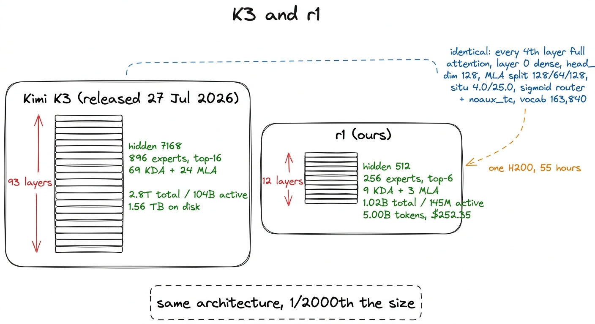
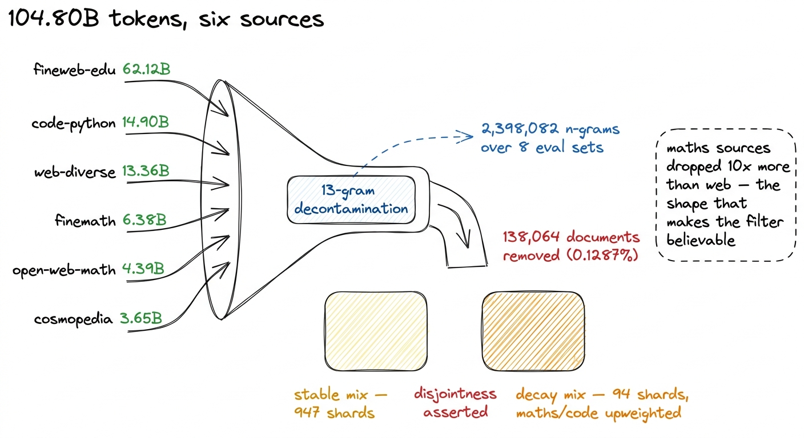
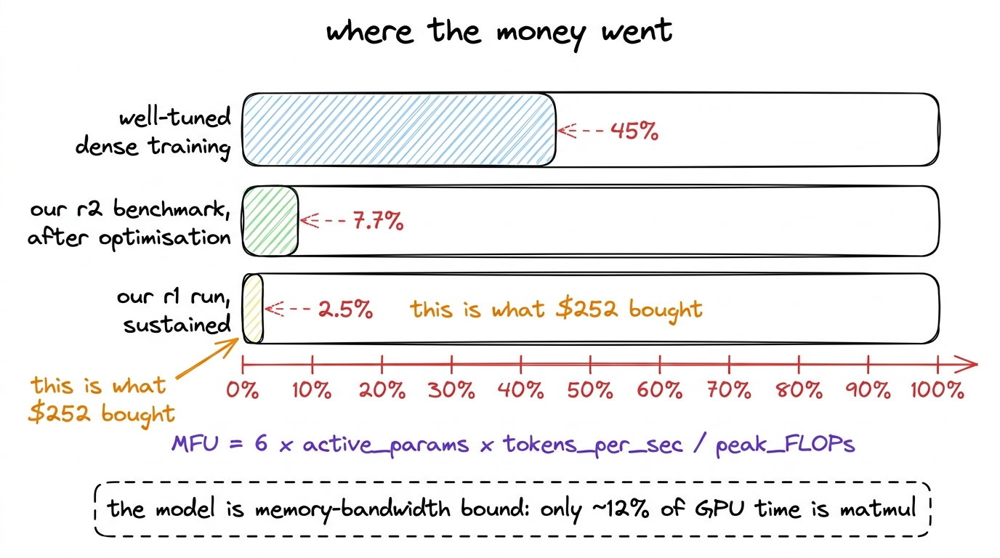
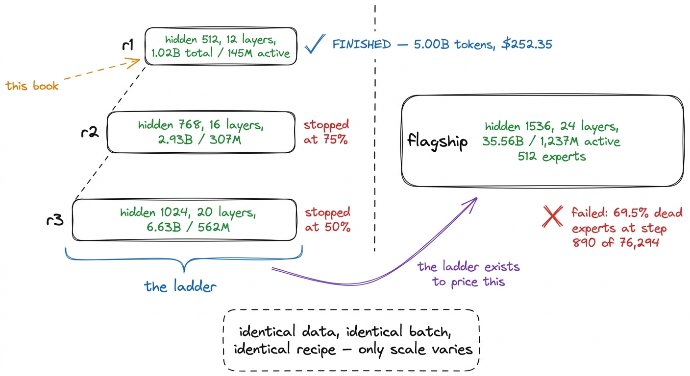
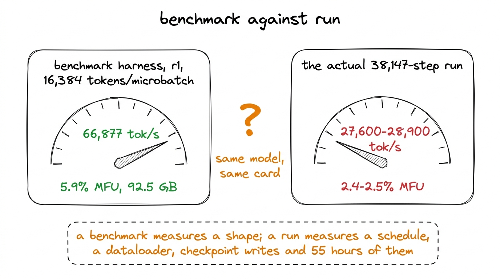
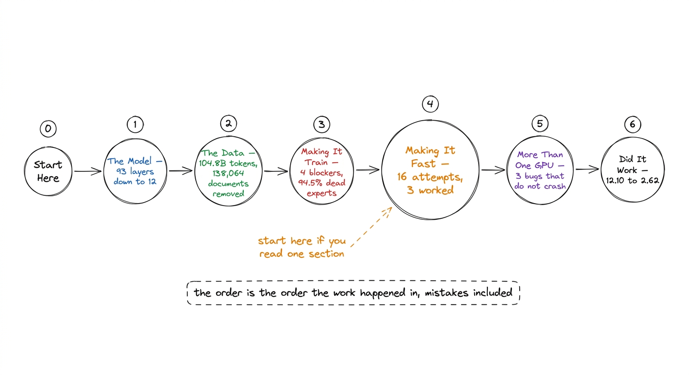

# 01\. 我们实际训练了什么

[返回目录](../../README.md) · [下一章 →](../02-what-makes-a-run-lab-grade/README.md)

第 00 部分 · 从这里开始 · 9 分钟 · 6 幅图 · \$252

> 一个总参数量为 1.02B 的 Kimi K3 复刻模型，在单张 H200 上用 5.00B 个 token 训练了 38,147 步，最终损失为 2.62。本章概览整次训练，并在开篇说明主张及其局限。

2026年7月27日，Moonshot AI发布了Kimi K3：2.8万亿参数，其中任意一个token激活的参数为104B，以96个safetensors分片形式发布，总计1.561T。九天后，我们在一台GPU上完成了其副本的预训练，花费252.35美元。

那两条句子需要立即澄清，而澄清部分正是这本书的主要内容。

我们的模型有 1.02B 个参数，其中每个 token 有 145M 个激活参数。它在总规模上大约是 K3 的 $\frac{1}{2{,}000}$。它见过 5,000,003,584 个 token，这与模型训练所用语料库的前沿数据相比只是一个舍入误差。它从未经过指令微调，也只完成过一件事：预测下一个 token。它拥有的是 K3 的架构——相同的注意力堆叠，以相同的 3:1 比例，相同的混合专家路由，带有相同的无辅助损失平衡器，相同的激活函数以及相同的两个常数，还有 K3 自己的 163,840-token 分词器，未作任何修改。当我们说“一个迷你 Kimi K3”时，这就是我们的声明，而本书就是这一主张的证据。

图 1-1　已发布的模型与我们的复刻模型。我们保留了结构，但缩小了规模。

## 一张表看懂本次训练

以下内容均来自训练运行自身的遥测数据，而非来自计划。

|  |  |
| --- | --- |
| 模型 | 总参数量 1.02B，激活参数 145M，非嵌入参数 61M |
| 硬件 | 一台 H200，每小时 4.54 美元 |
| 每步 token 数 | 131,072（4,096 个序列长度 × 4 × 8 累积） |
| 步数 | 38,147 |
| token 数 | 5,000,003,584 |
| 峰值学习率 | $6.00\times10^{-4}$ |
| 调度方案 | 预热—稳定—衰减，从第32,430步开始衰减 |
| 损失 | 第0步时为12.100，结束时为2.62 |
| 结束时不活跃的专家 | 0.0% |
| 因损失尖峰而跳过的步数 | 0 |
| 成本 | \$252.35 |

损失值值得反复阅读。一个什么都没学到的模型会为词汇表中的每一个token赋予相等的概率，而对163,840个token的均匀分布的交叉熵是 $\ln(163{,}840) \approx 12.007$我们的第0步损失是12.100。这种一致性并非训练结果；它只是验证模型初始化正确，且损失函数确实测量了我们所期望的内容。[^1] 它之后的每一个数字都是结果。

## 这些 token 背后的语料

从一个由六个来源构建、在分词之前经过去污染处理的104.80B规模语料库中抽取了5B个token。正是这种去污染处理，使得评估章节能够引用一个基准分数。

在一个13元组索引上构建了八个基准测试集的测试分割——共2,398,082个唯一的n元组——并检查了语料库中的每一篇文档。任何与评估集共享单个13元组的文档都被整体剔除。跨  **扫描了 107,291,411 篇文档，其中移除了 138,064 篇** ，率为0.1287%。

使滤波器可信的数值不是总量而是其分布。数学语料库的下降幅度大约是网络数据的十倍：finemath 为 0.7239%，open-web-math 为 0.6747%，而 fineweb-edu 仅为  0.0856%。[^2] 混合本身被分为两部分，通用网络通过稳定阶段，数学、代码和推理则在衰减阶段被加强权重，而退火在相同步长处切换，学习率开始下降。

整个数据处理过程只花费约 17 美元的 CPU 时间。这是项目中成本最低的阶段；没有它，其余结果都不值得报告。

图 1-2　语料、去污染流程，以及训练调度在其间切换的两种数据混合方案。

## 这些钱买到了什么

252.35美元大约等于一台H200的55小时计算时间。按每个token计价，这相当于每百万训练token五美分，这个数字让整个过程看起来很简单。实际上并非如此，其原因是一个我们将在本书整个章节中详细讨论的数值。

模型FLOPs利用率，或MFU，是训练运行实际使用的GPU算术能力的占比。我们的运行持续  **2.4% 到 2.5%** 经过良好调优的稠密训练达到了40%到55%。换句话说，我们租用的GPU中，大约有97%的时间并非用于我们所支付的算术运算。

图 1-3　本次训练的模型 FLOPs 利用率，与调优良好的稠密模型训练所能达到的水平。两者之间的差距，是六个章节讨论的主题。

我们没有就此接受这个数字，而是进行了十六次编号尝试，其中三次奏效、十三次失败。本书对十三次失败的记录，与三次成功同样详细。[^3]最终的性能剖析显示，只有约 12% 的 GPU 时间用于矩阵乘法，41.9% 用于计算很少、主要在搬运数据的逐元素操作。对于这种状态下的模型，更大的批量、更多显存或更快的注意力内核都无济于事；在做这项测量之前，这三种办法我们全都试过了。

在这里值得提及的三个有效方案，是因为它们决定了该部分内容的结构。将专家分发进行批处理，每步减少了3,840次顺序内核启动，并给出了  **17.5×** . 融合的 `situ` 将激活传递到单个Triton内核中  **1.38×** ，并通过释放 40 GB 而不是通过运行更快来实现。在该分发中删除一个静默回退给  **3.2×**  在旗舰模型上。每一个想法都源自于测量，而不是阅读代码，而每一个源自于阅读代码的想法都失败了。

## 本书的定位与边界

这是工作日志。它遵循实际工作发生的顺序，这意味着它包含了工作出错的部分。

有一章讲述了Moonshot发布的模型代码无法用于训练的四个未记录原因，其中有一个会非确定性地失败——r2规模档位训练正常，而r1规模档位在第0步就返回了NaN，源于同一个错误。有一章讲述了负载均衡器的问题，其中在第20步时，94.5%的专家停止接收token，而我们用来检测这一状况的指标读数为0.99（满分1.0）。有一章讲述了数据清单中的一个错误，该错误会导致模型在单一数学语料库上完成整个稳定阶段的训练，却报告出健康的六源混合数据。这些错误都被发现了。它们都是通过测量而非仔细阅读代码发现的，这种模式是本书中最可迁移的内容。

它并不是一本从零开始的 PyTorch 教程，用于讲解 K3 的各个组件。这本书已经在本库中存在，它将每一个模块——Kimi Delta Attention、Gated MLA、Attention Residuals、LatentMoE——都以小型可运行的代码形式呈现，你可以在笔记本上直接跟随执行。[^4] 本书假设了架构，并提出了一个不同的问题：要真正运行一个模型，处理真实数据，而不浪费资金，究竟需要什么条件。

它也不声称已达到K3的水平。我们在GSM8K上报告的HellaSwag得分为33.4%，而K3的得分为97.6%，这些在可比模型上的数值并不具有可比性，且评估一章在说其他内容之前就已明确指出这一点。

## r1 处于什么位置

r1 是一个三档规模阶梯中的第一档。规模阶梯的作用是先固定超参数，在小模型上测量吞吐量，再将资金投入大模型，这是实验室的做法，也是与随意选择学习率并寄希望于其效果的区别所在。

图 1-4　三个档位组成的规模阶梯，以及建立它是为了估算成本的旗舰模型。只有第一个档位完成了训练。

四个模型采用相同的数据、相同的每步 131,072 个 token，以及相同的训练方案，因此模型之间的差异只来自规模。四者中只有 r1 完成了训练。计算账户被停用时，r2 和 r3 分别完成了 token 预算的 75% 和 50%。旗舰模型拥有 35.56B 个参数，整个规模阶梯正是为了估算它的训练成本而建立的。该模型启动后发生了专家坍塌，69.5% 的专家收不到任何 token；在花费 48.33 美元后，它停滞在计划的 76,294 步中的第 890 步。

我们在开篇就说明这一点，因为如果一本书描述了规模阶梯，却悄悄略过三个档位中有两个尚未完成、作为测量目标的模型从未成功训练这一事实，那就会变成另一种性质的文档。本书中的工程工作面向全部四个模型，而它报告的已完成训练只有一次。

这有一个值得现在设定预期的后果。一个规模阶梯会产生一个拟合：在相同数据上，三个规模的三个损失被外推以预测第四个。  **我们从未得到那个拟合** ，因为三个规模档位中有两个在运行过程中中途停止，部分损失并不是一条曲线上的一个点。从规模阶梯中幸存下来的部分更窄，但仍具有价值——它固定了学习率，它测量了吞吐量，从而可以基于数据而非希望来定价预算，并且它捕获了一个初始化错误：在某个规模档位上该错误会返回 NaN，而在另一个规模档位上则正常训练。这些是规模阶梯在购买缩放定律之前所获得的东西，也正是这些原因使得即使规模阶梯没有完成，构建它仍然值得。

## 我们要论证的两个主张

 **首先：这在架构上是一个Kimi K3，而不是一个简单地加上K3名称的通用小型Transformer。**  使这一说法可测量的检验是，每个token的计算量中有多少比例会流经路由专家。在K3中，46.1%的激活参数是路由专家。我们早期设计的一个版本保持了总参数到激活参数的比值  *比值*  并且得分为7.5%，这是一个稠密模型，上面附加了一个小型混合专家模型，它无法告诉我们路由和负载均衡在实际场景中的行为。解决这个问题改变了专家数量、专家宽度以及KDA头的数量，这是“规模缩减”一章的主题。

 **第二：本书中的每一个数字都经过测量，未经过测量的数字都会被标注。**  旗舰模型的12.5% MFU是基于两个数据点的外推，且仅显示为一个值。与SmolLM2和Qwen3的同行对比是计划中的，但从未实际运行，因此完全未出现。我们在基准测试框架中测得的r1吞吐量为每秒66,877个token，实际运行中维持的吞吐量为27,600到28,900——这两个数值按顺序报告，因为基准测试与实际运行之间的差距本身就是一个发现。

图 1-5　在相同模型、相同 GPU 上，我们的基准测试与实际训练相差两倍。全书始终同时报告这两个数字。

## 后续章节如何展开

顺序是工作发生的顺序。  **模型**  部分涵盖 K3 发布的配置，以及将其缩小所需的计算。其中一个发现是：在给定宽度下，仅词表就需要 83.9M 个参数，因此“40M 个激活参数”的模型根本不可能实现。  **数据**  覆盖六个来源的104.80B个token，分词前已针对八个基准测试集进行去污染，以及使评估数值具有辩护力的报告。  **让模型训练起来**  涵盖了已发布代码中的四个障碍：训练循环、路由器坍塌，以及在训练过程中中途丢失GPU时仍能存活的检查点。  **让训练更快**  这是MFU调查。  **不止一张 GPU**  涵盖分片以及三个分布式错误，这些错误会导致最终训练运行结果静默错误。  **训练有效吗**  损失曲线是跨越整个训练运行的二十四项基准评估结果，而不是在结尾处，以及清单中的数据。

如果只读一个部分，就读《让训练更快》。如果只读一章，就读性能剖析那章：在那里，六个看似合理的假设被一次测量同时推翻；它教给我们的习惯——优化之前先测量——比本书的任何具体数字都更有价值。

图 1-6　本书的结构。

## 一个需要记住的数字

在该项目两周内所有被测量的指标中，对决策影响最大的这个数值是：  **仅约12%的GPU时间用于矩阵乘法。** 

在该性能剖析存在之前，已有六种独立的优化思路是通过阅读代码并进行推理得出的。这六种思路都旨在降低算术运算的成本或在内存中容纳更多工作。所有六种方案均失败了，且失败的原因相同，这种原因无论后续阅读多少次代码都无法揭示：算术运算从来都不是瓶颈。GPU花费的时间是用于数据的移动。

性能剖析用一次训练运行就完成了。它本应该是我们最先进行的事情。

---

[返回目录](../../README.md) · [下一章 →](../02-what-makes-a-run-lab-grade/README.md)

[^1]: 损失略高于 12.007，是因为模型初始化时的输出分布并非完全均匀：嵌入与输出投影共享权重，因此尚未应用任何梯度时，logits（未经归一化的输出分数）就已经带有少量结构。

[^2]: 那种形状是你应该期望的，因为GSM8K和MMLU的数学内容在数学网站上流传。一个对每个来源都去除均匀比例的过滤器，会表明它匹配的是噪声而非基准，而这正是我们套件中一个基准测试所表现出的行为——关于HumanEval的章节就是讲这个的。

[^3]: 大部分调查是在比本次训练高一个档位的 r2 上测量的，因为在多种批量大小下，它是能够较宽裕地放入单张 H200 的最大模型。另外两次测量在别处完成，并在相应位置标明：一项是跨三个档位的规模拟合，另一项是在旗舰模型上发现的分发回退。在包含四个模型的项目中，将测量归到错误的模型，是最容易犯的错误；我们自己的一次尝试正是因此失败的。

[^4]:  *从零构建Kimi K3* ，在同一库中。本书假设这些组件已存在，并询问当你尝试使用真实数据对它们进行两天的训练时会发生什么。
