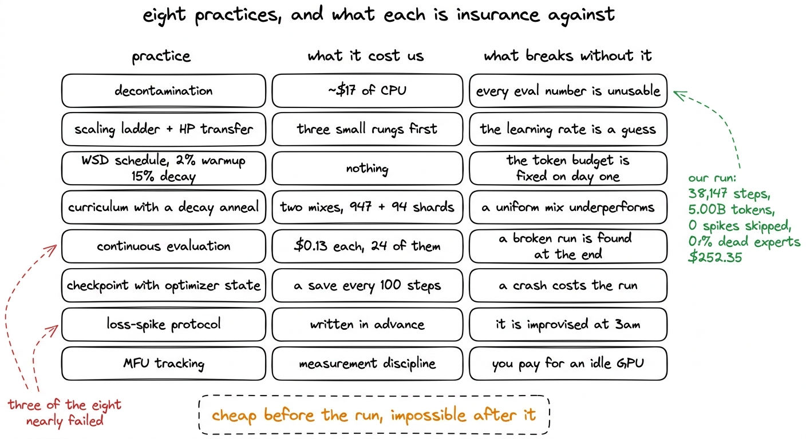
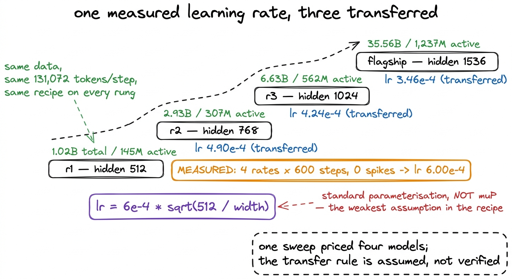
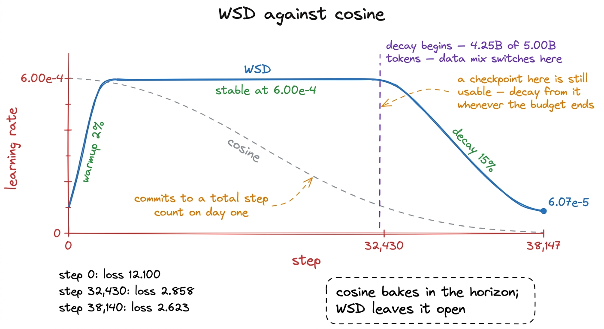
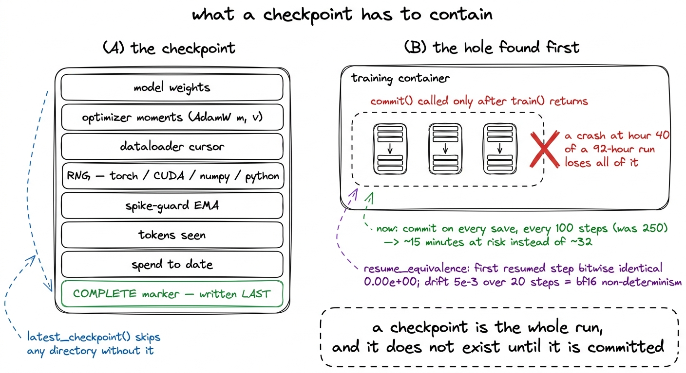
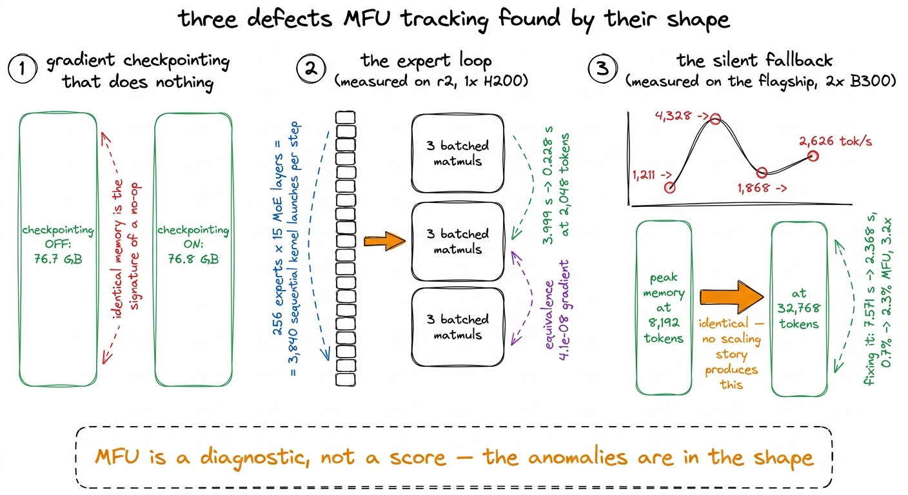

# 02\. 怎样的训练才达到实验室标准

[← 上一章](../01-what-we-actually-trained/README.md) · [返回目录](../../README.md) · [下一章 →](../03-how-to-read-this-book/README.md)

第 00 部分 · 从这里开始 · 11 分钟 · 5 幅图

> 去污染、规模阶梯、WSD 调度、衰减阶段的数据退火、持续评测、可靠检查点、损失尖峰协议与 MFU 跟踪：八项实践，以及它们分别如何改变结果。

一次预训练要么产出经得起质疑的数字，要么不能。区别不在模型、数据或 GPU 大小，而在于一份简短的实践清单：每项实践都需要预先投入时间或资金，也都决定了最终能够作出什么主张。

购买任何计算资源之前，计划就列明了八项实践：基准评测去污染、可迁移超参数的规模阶梯、替代余弦调度的预热—稳定—衰减方案、在衰减阶段退火的数据课程、沿已处理 token 数持续开展下游评测、包含优化器状态的检查点、事先写明的损失尖峰处理协议，以及 MFU 跟踪。八项都得到了实施。本章逐项记录成本，以及缺少它会出什么问题。尽管如此，其中三项仍险些失败，本章最后会指出它们。

图 2-1　购买计算资源之前就采用的八项实践，以及每项实践的成本和所防范的失败。

## 1\. 基准评测去污染

去污染是指从训练语料库中移除任何与你打算报告的基准测试集的测试集有重叠的段落。我们针对八个评估集的测试集构建了一个13元索引，并在分词之前应用了该索引，同时附有书面移除报告。该索引持有  **2,398,082 个唯一的 13-gram**  在 24 MB 中，其自检恢复了 1,414 个中的 1,414 个已植入字符串。该扫描通过了  **107291411份文档，移除了138064份** ，或  **0.1287%**  语料库中的，大约  **17美元的CPU**  相对于每运行成本为252.35美元。

使滤波器可信的是各源速率的形状，而非总和。

| 来源 | 删除比例 |
| --- | --- |
| finemath | **0.7239%** |
| open-web-math | **0.6747%** |
| code-python (StarCoder) | 0.2251% |
| fineweb-edu | 0.0856% |
| cosmopedia | 0.0296% |
| web-diverse (FineWeb) | 0.0280% |

数学语料的删除比例约为网页语料的十倍。如果过滤器匹配的是真实评测材料，而非随机触发，这正是预期的结果。如果六个差别很大的来源都有相同的删除比例，反而说明它可能匹配到了普通英文。

该实践还必须报告其自身的局限性。一条少于13个词的基准行无法生成13-gram，因此无法进行过滤，所以  **TriviaQA 的覆盖率为 49%** ，其17,944行中有9,163行过短；PIQA排名第二低，占比为92%，其中八个集合中有五个位于99%到100%之间。此外，HumanEval在每个索引n-gram上匹配了88.78次，而HellaSwag仅为0.02次，所有因该原因被移除的文档均为通用Python代码，而非泄露内容。[^1]

没有这一点，书后部分的24点评估系列将是一组没有人有理由相信的数字，包括我们自己。

## 2\. 可迁移超参数的规模阶梯

规模阶梯是一组架构比例相同、训练数据相同、宽度逐步增大的小模型。这样就能在为大规模训练投入资金之前，以较低成本测量超参数和吞吐量。我们的阶梯有三个档位：r1 的隐藏维度为 512，r2 为 768，r3 为 1024；它们上方是隐藏维度为 1536、总参数量为 35.56B 的旗舰模型。

学习率来自在r1宽度上的一个扫描实验：四个速率，每种600步，无损失尖峰，给出  **$6.00\times10^{-4}$** 每个其他规模档位由 $6\times10^{-4}\sqrt{\frac{512}{\mathrm{width}}}$：r2 为 $4.90\times10^{-4}$，r3 为 $4.24\times10^{-4}$，旗舰模型为 $3.46\times10^{-4}$。

图 2-2　规模阶梯。我们实测了一个学习率，再由它推导出另外三个。这既是常见做法，也是训练方案中依据最薄弱的一步。

这是标准参数化下的迁移，而非 muP，也是训练方案中依据最薄弱的假设。我们称它为假设，是因为没有验证：r1 之上的档位都未完成训练，因此没有完整结果可用于检验迁移后的学习率。[^2]

梯级所支付的代价是其余的一切。本书中几乎所有的MFU工作，实验1到实验15，都是在  **r2，位于我们之上的规模档位** 上进行测量：它在单张 H200 上运行，具有 307M 个激活参数，之后再将结论应用于 r1 的训练。剩下的一次尝试，即融合分发的性能断崖，是在从未完成训练的旗舰模型上测得的。规模阶梯还发现了发布的建模代码中的第四个阻碍：一个未初始化的时间步偏置，会以非确定性的方式导致失败：  **r2规模档位正常训练，而r1在第0步就返回了NaN** ，根源却是同一个缺陷。如果在旗舰模型上而非在规模阶梯中遇到这种问题，代价会高得多。在训练初期、已见 token 数相同的情况下，HellaSwag 的得分排序为 r3 28.4% &gt; r2 27.6% &gt; r1 27.0%；这正是建立规模阶梯所要确认的排序。

## 3\. 采用 WSD，而非余弦调度

余弦调度在预先设定的步数范围内，平滑地将学习率从峰值衰减到接近零。  **预热—稳定—衰减**  用一个在峰值速率处平坦的伸展替代该曲线的中间部分，并将衰减压缩到运行的最后几分之一。我们采用的  **2% 预热，一个在 $6.00\times10^{-4}$ 的稳定阶段，以及 15% 衰减**  从开始  **第 32,430 步**  ，总步数为 38,147；此时已处理 5.00B 个 token 中的 4.25B 个，最终衰减至  **$6.07\times10^{-5}$** .

图 2-3　实际采用的调度方案。稳定阶段保持平坦，因此不必在训练开始前就决定总 token 预算。

WSD 没有可测量的额外开销。它带来的好处是，不必在训练开始前决定总步数，因为稳定平台期的任意检查点都可以作为衰减阶段的有效起点。

那个属性比我们预期的更重要。  **r2 和 r3 在中途被停止了** 在计算资源账户被禁用的情况下，当计算预算达到75%和50%时，训练运行停止。在余弦衰减策略下，一个在50%预算处停止的训练运行会使模型在高学习率下处于下降过程的中途，状态冻结。在WSD策略下，稳定阶段的检查点是普通的，可以从这些检查点随时启动衰减训练。我们并未运行这些衰减训练，因此这是调度策略的特性，而非我们能够展示的结果。

## 4\. 在衰减阶段退火的数据课程

语料库被构建为两个独立的混合体，而非一个整体。稳定阶段从  **947个分片**  在通用网络数据上的衰减阶段从  **94个分片**  在数学、代码和推理方面权重提升，并明确断言而非假设其互不相交性。切换发生在学习率衰减开始的步数 32,430。实际稳定阶段混合比例跟踪其目标值精确到小数点后三位：fineweb-edu 59.5%，web-diver-ese 25.5%，code-python 10.0%，finemath 3.0%，open-web-math 2.0%。

退火的可见效果体现在留出困惑度上，它在训练运行中从 1.691B 个token时的 22.65 降至  **13.61**  最后，一个  **40% 的减少** ，该下降过程在第32,430步后达到最陡：在4.273B时为15.84，随后为14.27、13.74和13.61。不同源数据集的最终困惑度从code-python上的5.42到web-diver的37.74。

这种做法的成本是账目记录，而账目记录正是它几乎出错的地方。一个字符串分割的bug在 `build_mixes` 重建分片名称作为 `source + "-" + stem.split("-",1)[1]`，会破坏任何带连字符的源名称： `fineweb-edu-w000-s0000` 变为 `fineweb-edu-edu-w000-s0000`六份来源中有四份指向的文件不存在，加载器静默地将焦点重新调整到存活的两个文件上，所以  **整个稳定阶段将使用 100% finemath 进行训练。**  而遥测数据显示了一个健康的六源混合。

## 5\. 持续进行下游评测

一次评估，是在最后告诉你结果如何。持续评估，能告诉你训练运行是否曾真正生效。我们大约每1000步在另一台A100上运行一次完整评估。  **每评估0.13美元** ，跨过  **24点**  r1系列的性能达到约3美元，对比252.35美元的训练运行：来自去污染数据集的HellaSwag、PIQA、ARC-Challenge、WinoGrande和MMLU，以及来自尾部分片的留出困惑度，基于冻结的种子0的500个样例子集。[^3]

在那24个点上，HellaSwag从0.270到  **0.334**  而PIQA从0.608提升至0.634，WinoGrande、MMLU和ARC-Challenge则在整个过程中保持在0.51、0.29和0.26左右。

正是这些曲线，使我们能够对那些没有提升的评测指标作出具体判断。单独看训练结束时 MMLU 为 0.290 的一次测量，无法将它与第二天就出问题的训练区分开来。但从 1.691B 个 token 起，连续二十四个测量点都保持平坦，说明了另一件事：在 145M 个激活参数、5B 个训练 token 的规模下，这些能力尚未达到可显现的门槛。这是关于模型规模的判断；只有沿 token 进度持续评测，而非仅在终点评测，才能得出这一判断。

## 6\. 保存优化器状态的检查点

一个仅保存权重的检查点不是恢复点。我们的检查点保存了模型、优化器状态、数据加载器游标、随机数生成器状态、损失尖峰保护机制的指数移动平均值、已看到的标记以及到目前为止的花费，加上一个 `COMPLETE` 标记写在最后，因此一个半写入的目录会被跳过而不是加载。

图 2-4　检查点包含的内容，以及导致这些内容都无法持久保存的缺陷。

这里有两点值得记住。首先，训练日志无法暴露持久化漏洞：`ckpt_vol.commit()`只有在`train()`返回后才会被调用，因此所有检查点都只存在于即将终止的容器所看到的卷状态中；直到检查点丢失的那一刻，训练仍会报告保存成功。保存间隔也从 250 步缩短到 100 步，使一次中断可能损失的工作从约 32 分钟降到约 15 分钟。

其次，恢复正确性经过了测试，而非假定。`resume_equivalence`两次训练越过检查点，并比较逐步损失，发现了一个真实的差一错误：检查点在`opt.step()`后写入，却标记为刚完成那一步，因此恢复时重复该步，让轨迹错开一位。修复后，恢复第一步的误差为 $0.00\times10^{0}$，逐位一致；20 步内漂移保持在 $5\times10^{-3}$，来自 bf16 非确定性。原文报告 r1 按“最后三份加每 5,000 步一份”的规则保留了 15 个检查点。[^4]

## 7\. 事先写明的损失尖峰处理协议

该协议预先规定了什么算作尖峰、检测到尖峰时会发生什么——跳过该批次，或回滚到上一个良好检查点——以及该决策所依赖的状态。尖峰保护机制的指数移动平均（EMA）是检查点的一部分，以确保恢复训练运行时不会重新启动检测器。

我们的训练运行  **在所有 38,147 步中跳过了零损失尖峰** 该协议从未被启用，这正是关于保险应报告的正确情况：我们为此支付了费用，但并未使用它，也无法主张它挽救了本次训练。

它显现出来的是，当模型被分片时，协议的假设会发生变化。在旗舰模型的双卡FSDP2配置中，每个进程独立决定是否跳过一步。其中一个进程调用 `opt.step()` 而另一个不会导致权重发散，接下来的all-gather操作会将两个模型合并为一个。修复方法是在路由器看到之前对损失进行all-reduce。这个错误会导致一次完整的训练运行，以及一个静默错误的模型，整个过程中没有任何错误提示。

相关的课程是关于协议中的门控机制。一旦看门狗能够终止一次训练运行，两个阈值就曾是危险的。 `MFU_FLOOR = 0.20` 在每次健康训练运行的每一步都触发，因为这里的测得MFU为5到8%。 `EXPERT_COLLAPSE` 在单个指标快照上出现故障，该指标的健康轨迹在前三十步中经过69%到95%的不活跃专家，正如我们看到的路由器坍塌时的情况。如今，坍塌需要连续五个报告，阈值为3%。在24个故障注入测试中，有一半的测试表明门控保持稳定。  **静默**  在健康训练中，这是更难编写的一半。

## 8\. 跟踪 MFU

 **模型 FLOPs 利用率**  是 $\frac{6\,\mathrm{active\_parameters}\,\mathrm{tokens\_per\_second}}{\mathrm{peak\_FLOPs}}$，一个训练运行消耗的GPU算力比例。一个H200在bf16下大约能达到989 TFLOP/s，经过良好调优的稠密训练可达到40%到55%，而我们的运行实现了  **2.4% 到 2.5%**  每秒 27,600 到 28,900 个 token。

作为一次训练运行结束时的单一数值被追踪，那是令人失望的。持续被追踪时，它是一种诊断指标，因为MFU具有仅由某些缺陷产生的形状。

图 2-5　三个通过吞吐量或显存曲线的形状发现、而非通过阅读代码发现的缺陷。

这三项都是阅读源代码未能发现的缺陷。A `gradient_checkpointing_enable()` 调用该函数声明支持，设置标志，并且从未被解码器循环触发，在代码中看起来是正确的，并在数据中有所体现  **76.7 GB 对比 76.8 GB**  在功能关闭和开启的情况下。专家循环看起来是一个实现细节，每步需要 3,840 次顺序内核启动；对其进行批处理将步时间从  **3.999秒到0.228秒**  在 2,048 个 token 时，R2 的 MFU 从 0.1% 提升至 4.1%，提升了 17.5 倍。旗舰模型的融合分发在硬编码缓冲区限制之上，静默地退化为上述循环，并仅以一条非单调的吞吐曲线和一个不随批大小四倍增长而变化的峰值内存显现出来。

使这些内容可读的学科是可比性。MFU 是以每张卡自身的峰值为基准进行衡量的，因此它仅能在同一硬件上的不同训练运行之间进行比较。我们自己的一项研究将两组 H200 的测量结果与一组 B200 的测量结果混合在一起，并产生了 $\mathrm{active}^{-0.32}$，一个指数表明更大模型效率更低，这是一种人为现象而非研究发现。[^5]

## 哪三项险些失败

八项中，有五项按设计运行。三项未按设计运行。

 **检查点**  是最接近的。每个保存都报告了成功，但没有一个是持久的，失败会在运行四十小时后以普通崩溃的形式出现，且没有任何内容可以恢复。

 **数据课程**  是接下来要处理的部分。清单缺陷本会导致整个 5B token 训练仅使用单一数学语料，而混合比例报告却显示六个来源都达到了目标。

第三项是围绕尖峰协议和 MFU 跟踪设置的检查关卡，也是最有启发性的一项，因为危险来自保护机制本身。一个指标的健康值为 0.025，却将下限设为 0.20；另一个健康指标的轨迹会经过 94.5% 专家不活跃的阶段，却被用来触发致命坍塌告警。这两种设置会在看门狗获得执行能力的那一刻，终止项目中的每一次正常训练。

三个都没有自我宣告。它们不会崩溃，不会记录错误，也不会以任何人能察觉的方式改变损失曲线。每个都是通过为不同目的而进行的测量发现的：一次恢复测试、一个分片数量断言、一个看门狗对健康遥测的干运行。这就是所有八项实践的论据。它们的目的不是让训练运行变得更好。它们的存在是为了当训练运行出错时，能够有所察觉。

---

[← 上一章](../01-what-we-actually-trained/README.md) · [返回目录](../../README.md) · [下一章 →](../03-how-to-read-this-book/README.md)

[^1]: 原因在于归一化。去除标点符号对散文是合适的，对代码则是破坏性的： `for i, a in enumerate(numbers):` 变为 `for i a in enumerate numbers`，以及去标点的Python代码中常见的13词窗口是惯用表达。叠加了HumanEval的 `test` 列，所有164个问题的结构几乎完全相同。语料损坏占代码语料的0.225%，因此无需重新导入，匹配数量不是污染发现。

[^2]: muP 会重新参数化初始化、学习率和输出缩放，以确保最优速率在宽度上保持不变。其中几个组件——一个潜在的 MoE 瓶颈、一个无辅助损失的选择偏差、带有自身门控的 delta 规则注意力——尚未有已发表的 muP 处理方法，因此采用了平方根规则并加以标注。

[^3]: 评分是带有RIGHT填充的长度归一化的多选题。模型是因果的，因此左填充会使它在到达问题之前就条件于填充标记。 `datasets` 库版本固定为 2.21.0，因为 3.x 版本移除了脚本数据集。GSM8K 和 HumanEval 是训练后的基准测试，故意未在基础模型上运行。

[^4]: 在大规模情况下，保留是不可选的。旗舰模型的每个检查点约为 213 GB，若在原始的 250 步间隔上保留每一个检查点，总量将达到 128 PB。

[^5]: 将 r3 的 3.6% 归一化到 H200 的峰值，得到约 8.2%，高于 r2，实现了正向扩展。在匹配硬件上的修正两点拟合为 $\mathrm{active}^{0.35}$，以及由此导出的旗舰指标 12.5%，是一种外推而非测量。
