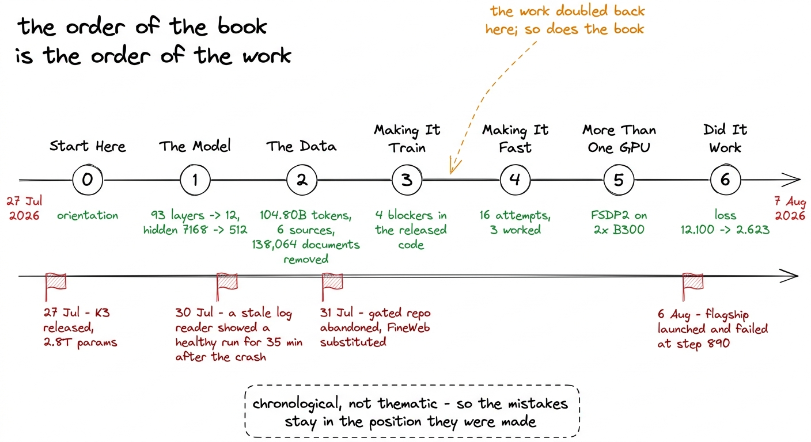
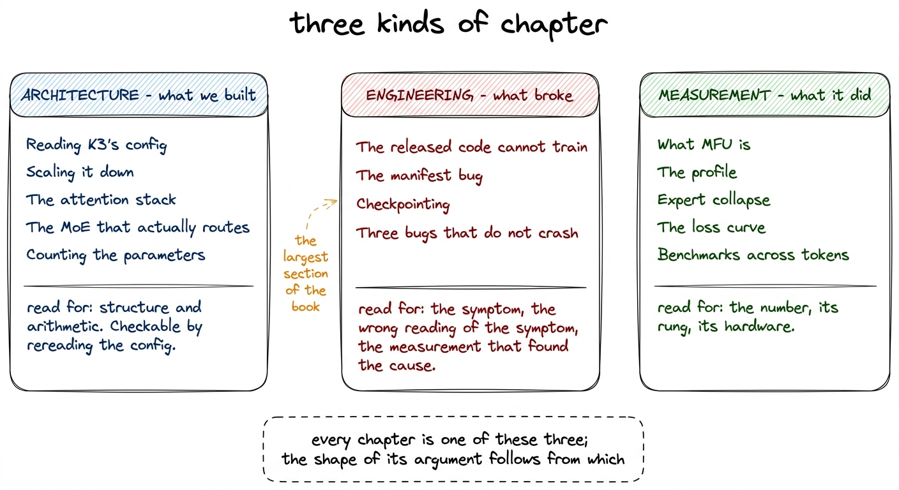
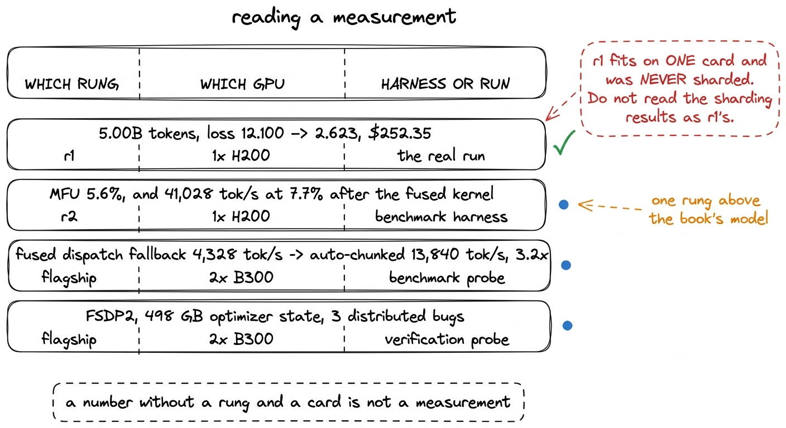
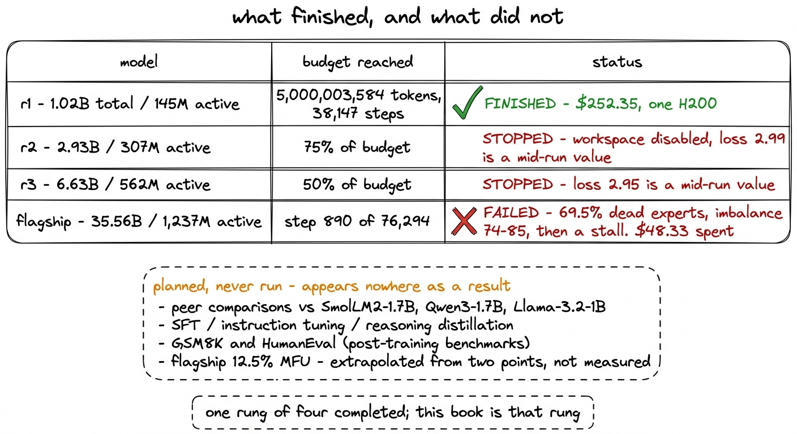
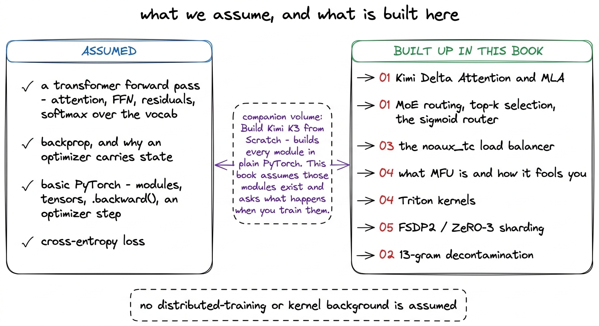
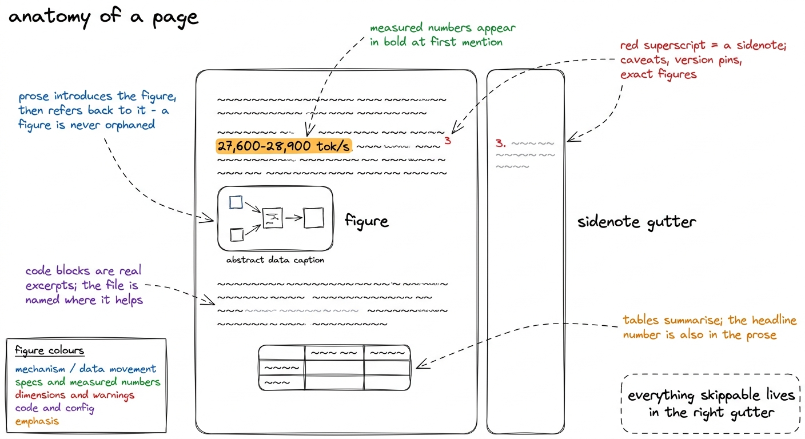

# 03\. 如何阅读本书

[← 上一章](../02-what-makes-a-run-lab-grade/README.md) · [返回目录](../../README.md) · [下一章 →](../04-reading-k3s-config/README.md)

第 00 部分 · 从这里开始 · 11 分钟 · 6 幅图

> 这是工作日志，而非教程：记录实测数字，对失败想法与成功想法同样详尽地说明，并附上相应的生成命令。

工作日志是按实际完成顺序记录的工作记录。它不是课程大纲，也不是事后整理过的教程，其中每一步都严格从前一步推导出来。本书是一份工作日志，其结构源于这一决定，因此在技术章节开始之前有必要加以说明，因为期待一本教科书的读者会发现这种顺序很奇怪。

该项目记录的运行时间从2026年7月27日Moonshot AI发布Kimi K3开始，到2026年8月7日本书数据固定为止。在那段时间里，我们构建了一个拥有1.02B个参数的K3架构复现版本，组装并去污染了一个包含104.80B个token的语料库，发现了发布模型代码无法训练的四个原因，进行了十六次编号的吞吐量提升尝试，在一台H200上以252.35美元的成本，对规模阶梯的第一档进行了38,147步的训练，并观察到同一梯度中最大的模型失败。

章节大致按该顺序排列。当作品有所回溯——而它确实多次如此——章节也随之回溯。

图 3-1　本书的七个部分，以及产生这些内容的各段工作。

## 为何按时间顺序，而非按主题组织

按主题分类的结构会将每一个路由决策放在一个章节，每一个吞吐量决策放在另一个章节，每一个分布式训练决策放在第三个章节。这样读起来更清晰。但它也破坏了我们最希望保留的信息，即  *当*  每件事都是已知的。

负载均衡器是最清晰的例子。控制它的常数， `gamma`，以每步4,096个token的速度被扫描，被选定，然后由于批次大小变为原来的32倍，以实际的每步131,072个token的速度重新扫描。一个主题性章节会报告第二次扫描，因为这是真正控制本次训练运行的扫描。工作日志按顺序记录了两次扫描，因为第二次扫描存在的原因是第一次扫描所生成的论点。按顺序阅读这两部分内容，能学到最终答案单独呈现时所无法获得的内容。

吞吐量方面的工作也是如此，其中大部分是在位于本书所讨论模型之上一个规模档位的r2上测得的。共进行了十六次尝试，其中有三次成功。按主题呈现时，那些未成功的十三项变成了应避免的一份清单；按顺序呈现时，它们则变成了从阅读代码中得出的十三个推论，后接一个解释代码为何如此运行的性能剖析。第二个版本才是有用的，它仅在章节保持实际工作顺序的情况下才存在。

## 三类章节

本书的各章承担三种角色之一，了解某章承担的是哪种角色，就能知道如何阅读它。

 **架构章节**  我们构建了什么，以及其中的数字为何是这些数字。第01节完全属于架构层面：K3发布的配置、缩小该架构的运算过程、注意力堆叠结构、混合专家模型，以及参数计数。这些章节属于结构性的内容。它们包含很少的测量数据，而更多的是运算过程，其主张可以通过重新阅读配置文件来验证，而无需重新运行任何实验。

 **工程章节**  说明什么出了问题。在发布的建模代码中，四个阻塞问题、一个清单错误会导致在单一语料库上训练稳定阶段、一个仅存在于即将终止的容器中的检查点提交、三个分布式错误会在训练运行完成后返回错误模型——这些章节中，问题早已存在，必须被发现。[^1] 它们遵循一种固定结构：症状、症状所暗示的含义、以及识别实际原因的测量值。

 **测量章节**  报告系统执行的内容。MFU调查、性能剖析、gamma扫描实验、损失曲线以及二十四项基准评估均属于此处。其中每一个数值都有明确归属，凡是属于外推而非实测的数值，在承载它的句子中都会被标注为外推值。

图 3-2　三类章节，以及每一类要求读者核对的内容。

## 如何理解本书中的测量结果

这是后续章节中最重要的一条约定。如果误读，就会对实际训练的究竟是什么形成错误认识。

该项目训练了四个模型，而不是一个模型。它们构成一个阶梯：  **r1**  拥有 1.02B 个参数和 145M 个激活参数，  **r2**  在 2.93B 和 307M 激活参数的情况下，  **r3**  在 6.63B 和 562M 激活参数的情况下，以及一个  **旗舰模型**  ，总参数量为 35.56B，激活参数为 1,237M。[^2] 它们在不同的硬件上运行，而本书中引用最多的几个数值，是测得于与本书所讨论的规模档位不同的一个档位上。

r1 是本书介绍的模型。  **r1 在一台 H200 上进行训练，且从未分片。**  每一个分布式训练结果——FSDP2、ZeRO-3、498 GB 的优化器状态、三个不会导致崩溃的错误——都来自两台 B300 上的旗舰模型，描述的是上述 r1 所需的模型规模，而非 r1 本身的实际表现。大部分吞吐量工作是在 r2（一个规模档位之上）上测量的。融合分发的悬崖，即十六次尝试中的最后一次，是在旗舰模型上测量的。

因此，本书中的每一个测量值都包含三方面的溯源信息，我们将其直接写入句子中，而不是放入脚注：属于哪个规模档位、使用了哪块GPU，以及该数值是来自基准测试工具还是来自真实的38,147步运行。

图 3-3　本书为每项测量记录的来源信息。r2 和旗舰模型上的测量贯穿全书，并在出现时明确标注。

在第三个槽位内部还有一个第四种区分，且其规模大于预期。一个基准测试套件会运行一个固定形状的流程，持续几十步，且不附加任何其他内容。一次真实的训练运行则包含一个调度计划、一个从1,063个分片中读取数据的加载器、每100步写一次检查点，以及\$252.35的H200时间（每小时\$4.54）所购买的全部累积状态。在r1上，该套件测得  **每秒 66,877 个 token，MFU 为 5.9%** ，而实际发生的训练运行持续了  **每秒 27,600 到 28,900 个 token，占比 2.4 到 2.5%** 两个图都是正确的。它们彼此并不可以替代，本书在引用其中一个图时都会明确指出。

探针与训练运行之间的差距在检查点和监控章节中也出现了，这就是它们被放置在该位置的原因。检查点每100步写入一次，而不是原来的250步，因此大约十五分钟的工作量面临风险，而不是大约三十分钟。 `COMPLETE` marker被写在最后，以确保目录的写入过程一旦中断就不会从中间恢复。当自动停止功能真正生效后，有两个监控阈值需要被修改一次：一个 `MFU_FLOOR` 在每次健康训练运行的每一步都触发0.20的值，因为此处测得的MFU为5%到8%，一个在单次读取中致命的专家坍塌门控机制，在一条轨迹中前三十步达到69%到95%的不活跃专家后又恢复。当前阈值为3%，坍塌需要连续五次报告。这类数值只有在真实运行中才有意义，书中也是这样呈现的。

每个MFU数值都伴随着一个注意事项，因此最简单的方式是仅说明一次。MLA在一个注册于的sdpa shim上运行 `flash_attention_2` 键，因为已发布的建模代码强制使用该字符串以及非对称头维度填充，仅在该分支上运行。它在数值上是等价的但更慢，因此本书中的每一个MFU图表都低估了Flash Attention所能带来的效果。[^3]

## 哪些工作没有完成

在规模阶梯上的四个模型中，有一个完成了。

r1 完成了全部 5,000,003,584 个 token 的预算。计算工作区被停用时，r2 和 r3 分别完成了 token 预算的 75% 和 50%，所以它们的损失值 2.99 和 2.95 都是训练中途的读数，本书也明确如此标注。旗舰模型在 2026 年 8 月 6 日启动，但最终失败：69.5% 的专家不活跃，负载不均衡度在 74 至 85 之间，随后训练停滞在计划的 76,294 步中的第 890 步，已花费 48.33 美元。

该项目中还计划了一些其他内容但从未运行，这些内容在书中任何结果中均未出现。针对 SmolLM2-1.7B、Qwen3-1.7B 和 Llama-3.2--1B 的同行对比设计了但未执行。未进行任何监督微调、指令微调或推理蒸馏，因此 r1 是一个仅执行过下一个标记预测的基础模型。GSM8K 和 HumanEval 是训练后的基准测试，且故意未运行。旗舰模型的 12.5% MFU 是从两点幂律外推得出的，从未被描述为一项测量。

图 3-4　规模阶梯的状态。四个档位中有三个未完成，引用其结果的章节都会明确说明。

我们将这部分内容放在导向部分而非结尾备注中，是因为第03、04和05节描述的工程是为四个模型共同构建的。如果读者在第05节首次遇到FSDP2，却未被告知该工程是为一个从未训练超过第890步的模型所构建，那么读者很可能会合理地做出相反的推断。

## 本书的知识前提与讲解范围

我们假设读者已经了解变换器在前向传播层面的基本概念——注意力机制、前馈块、残差连接、对词汇表的 softmax 操作——并且对反向传播有足够理解，能够接受优化器状态的存在。我们假设具备基本的 PyTorch 知识：模块、张量、优化器步长，以及什么是 `.backward()` 是的。

本项目的所有具体内容均在书中详细阐述。Kimi Delta Attention 和多头潜在注意力在第01节中被解释说明，之后才被使用。混合专家路由、top-k 选择以及无辅助损失的平衡器均基于第01节中的路由器方程构建，之后在第03节中当它们失效时被再次拆解分析。Triton 在第04节中被引入，当时融合激活内核成为最便宜的可选方案，而非在此之前。FSDP2 和 ZeRO-3 在第05节中基于每个进程必须承载的内容进行构建。模型 FLOPs 利用率获得独立一章，且在任何 MFU 数值被详细引用之前均已完成阐述。

图 3-5　本书预期读者具备的背景知识，以及本书自行展开的内容。配套书籍讲解了本书视为已知的模块级实现。

同一图书馆中有一本配套的书籍，  *从零构建Kimi K3* ，它使用纯 PyTorch 实现了 K3 的每一个组件作为可运行的小型代码：Kimi Delta Attention、gated MLA、attention residuals、LatentMoE。本书假设这些模块已存在，并提出一个不同的问题：在真实数据上训练它们时，不浪费资金的成本是多少。这两本书可以按任意顺序阅读。如果你想了解一个 delta-rule attention 层如何计算其输出，那么那本书会回答这个问题。如果你想了解为什么十二层中有九层是 delta-rule 层，以及这一比例对吞吐量的影响，那么这本书会回答这个问题。

## 插图、旁注、代码与数字

四个惯例贯穿每一章。

 **插图**  包含手绘示意图，并采用一致的颜色语法：蓝色表示机制和数据流动，绿色表示规范和测量值，红色表示尺寸和警告，紫色表示代码和配置，橙色表示强调。带编号的圆圈标明图中内容的阅读顺序。大多数图以一个虚线框结束，框内包含该图所支持的单一句子。正文始终在图出现前进行引入，并在之后进行引用，因此图从未需要单独解读。

 **旁注**  坐在右边的边距处，并携带那些会破坏一段文字的注意事项：一个版本锁定、一个硬件异常、一个在激活检查点下会重复计数的计数器、一个在文本中已四舍五入的精确数值。这些内容可以在初次浏览时跳过，通常出现在尖锐的边缘处。

 **代码块**  是项目的真实摘录，且在适用情况下我们命名文件—— `train/ladder.py` 对于规模档位的定义， `train/moe_train.py` 对于可训练的门控和负载均衡器， `train/init_patch.py` 针对初始化修复， `train/situ_triton.py` 关于融合激活部分。本书中没有发明任何API。当代码块显示输出值时，该值是实际测量得到的。

 **数字**  首次在正文中以粗体呈现，随后在表格中再次出现，表格形式更清晰。粗体数字与表格内容始终一致；若不一致，则表格是多个训练运行的汇总，正文中会明确指出引用的是哪一个运行。

图 3-6　全书统一使用的排版约定。首次阅读可以略过旁注，但不应略过插图。

## 哪些读者最能从中受益

本书面向这样的读者：至少训练过一次小模型，读过现代架构论文，现在想知道，从这些知识走到一次经得起真实 GPU 账单考验的训练，还缺些什么。差距不在概念，而在去污染、检查点语义、负载均衡器常数、内核启动次数、告警阈值，以及基准测试与实际训练的区别。论文通常不会写这些，因为它们并不是研究结果。

另一位读者会因不同的原因而觉得这本书很有用：任何即将为一次训练运行实际支出金钱，并希望了解这笔费用去向的人。r1 的成本为 252.35 美元的 H200 时间。[^4] MFU调查存在是因为在2.4%到2.5%的MFU时，约97.5%的租赁并未执行我们所支付的算术运算，而这十六次尝试改变该情况是此处最可迁移的内容。

数据章节也服务于这类读者。语料处理扫描了 107,291,411 份文档，删除了其中的 138,064 份，删除率为 0.1287%。更值得关注的是各来源的比例：两个数学语料的删除率分别为 0.7239% 和 0.6747%，而普通网页文本为 0.0280%。如果过滤器在所有来源上的触发比例都相同，反而应该警惕。该章也明确说明了覆盖局限：少于十三个单词的评测条目无法生成 13-gram，因此根本无法用于过滤，导致 TriviaQA 仅有 49% 的内容得到覆盖。

让读者感到失望的是，他期待一个强大的模型。r1达到  **33.4%**  在 HellaSwag 上，其表现与 25% 的随机概率水平相当，并在 MMLU 和 ARC-Challenge 上整个训练运行中都保持在随机水平。在 145M 个激活参数和 5B 个 token 的情况下，这些平坦的曲线反映了模型规模的性能边界，而非训练运行的失败，且评估章节在提及任何其他内容之前就已明确说明这一点。

## 三条阅读路线

如果你想了解项目实际发生的过程，就从前往后阅读。第00和第01节建立了模型，其余部分都是其结果。

如果关心吞吐量，可以只读第 04 部分。它能独立阅读，只需要先了解第 01 部分对规模阶梯的定义，其中的性能剖析解释了整个优化调查。

如果即将开展大规模训练，想了解失败案例而暂时略过架构，可以只读第 03 和第 05 部分。四个训练阻碍、专家坍塌、仅存在于即将终止容器中的检查点、二十四项故障注入测试，以及三个分布式缺陷，都在其中。这些案例说明，训练即使完成，结果也可能已经出错。

无论你选择哪条路径，都要携带溯源规则。哪个规模档位，哪块GPU，哪个硬件或训练运行。几乎每种误解这本书的方式，都始于忽略了那三个中的一个。

---

[← 上一章](../02-what-makes-a-run-lab-grade/README.md) · [返回目录](../../README.md) · [下一章 →](../04-reading-k3s-config/README.md)

[^1]: 其中一个四档阻塞器以非确定性方式失败，这就是为什么需要进行规模档位比较才能发现。 `KimiDeltaAttention.dt_bias` 配备有 `torch.empty` 且从未初始化，因此它保留了该内存中的任意内容。r2 正常在该内存上进行训练，而 r1 从第 0 步开始就从同一行代码返回 NaN。

[^2]: 规模阶梯固定训练方案，只改变规模，从而可以利用小档位上低成本测得的吞吐量和超参数，估算大档位的成本。缩小模型的章节解释了各档位如何定大小；结尾章节解释了建立规模阶梯的最终目的。

[^3]: 如果你打算运行其中任何一项，两个版本号必须指定： `transformers` 必须是  **4.57.6** ，因为 `>=4.56` 解析为 5.x，其中移除了 `OutputRecorder`，一个在模块作用域内导入的Kimi模型代码；和 `datasets` 被固定到  **2.21.0**  因为 3.x 移除了脚本数据集，而评估套件需要这些数据集。

[^4]: 该费用是r1的GPU账单，除此之外没有其他开销。语料库处理的成本大约为17美元的CPU费用，连续评估在另一台A100上运行，每约1000步的评估成本约为0.13美元，旗舰模型的启动失败花费了其自身48.33美元。存储是每月每吉字节0.09美元的持续开销。
