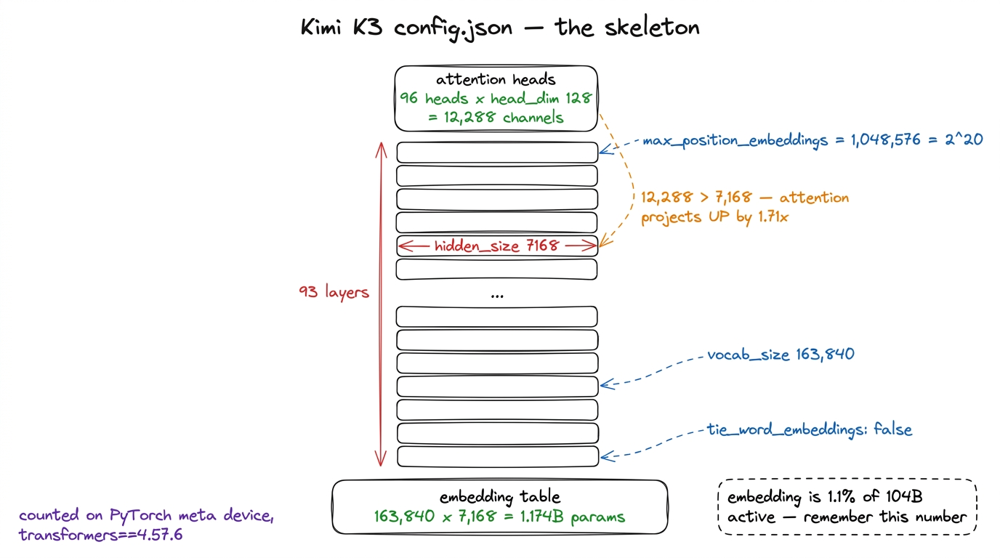
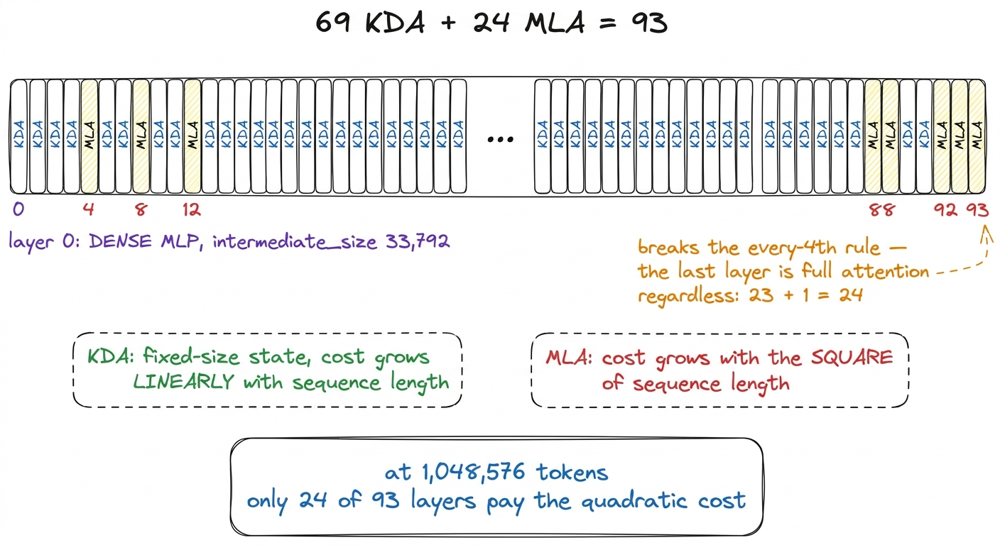
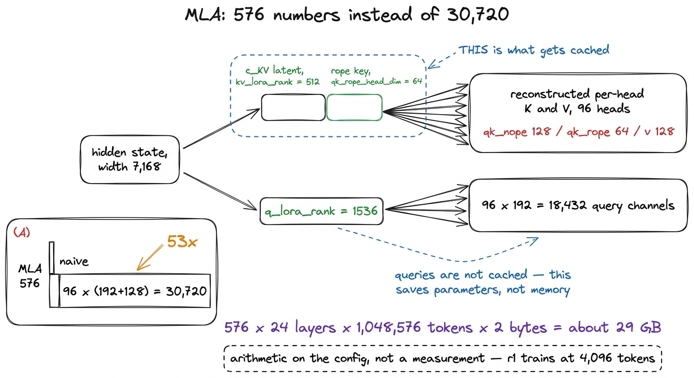
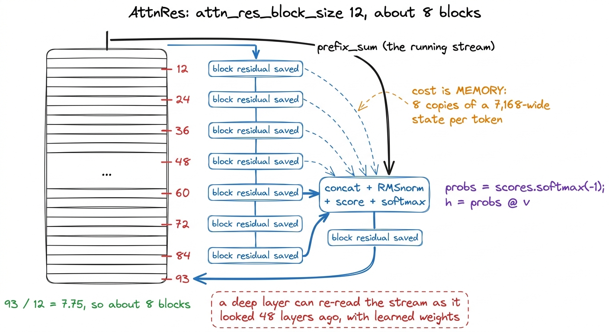
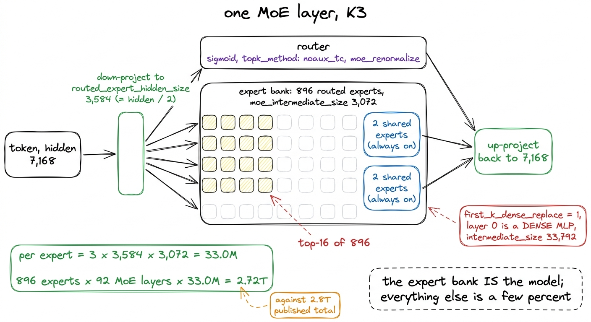

# 04\. 逐行解读 K3 的配置

[← 上一章](../03-how-to-read-this-book/README.md) · [返回目录](../../README.md) · [下一章 →](../05-scaling-it-down-without-lying/README.md)

第 01 部分 · 模型 · 11 分钟 · 5 幅图 · 2.8T

> 93 层、隐藏维度 7,168、896 个专家中激活 16 个、69 层 KDA 与 24 层 MLA，以及 situ、noaux\_tc：从发布的配置理解每项 FLOP 花在哪里。

Kimi K3 以 96 个 safetensors 分片的形式发布，总大小为 1.561T。描述这些文件内部内容的文件是几行 JSON，它是本次发布中最有用的文档。本书中关于保留什么、缩小什么以及什么内容要原样保留的每一个决策，都源于阅读该文件并计算每个字段的成本。

本章逐项解读。其目标并非对架构进行描述，而是在 companion book 通过可运行代码逐模块构建架构的基础上，建立一个关于单个 token 计算路径的思维模型，精确到当我们开始从这些数字中移除零时，能够明确知道哪些数字可以移动，哪些不可以。

我们通过实例化 Moonshot 自己发布的 `modeling_kimi_linear.py` 在 PyTorch 上 `meta` 设备上，参数具有形状但没有存储，因此一个 2.8 万亿参数的模型计数成本为零。[^1] 每个数要么出现在该配置中，要么在字段上构成等差数列。

## 模型的基本框架

六个字段决定了模型的整体形状。

| 字段 | 取值 |
| --- | --- |
| `hidden_size` | 7,168 |
| `num_hidden_layers` | 93 |
| `num_attention_heads` | 96 |
| `head_dim` | 128 |
| `vocab_size` | 163,840 |
| `max_position_embeddings` | 1,048,576 |

有三个值得暂停一下。

 **96 个头，每个头的维度为 128，对应 12,288 个注意力通道，与 7,168 个残差流相对。**  注意力的维度提升了1.71倍，而不是像教科书中的多头层那样对隐藏尺寸进行分区。这里的头维度是一个固定值，而不是一个导出值，这就是为什么我们的副本能够保持 `head_dim` 在 128 而缩小时 `hidden_size` 十四倍。

 **词汇量为 163,840 个 token，隐藏层为 7,168 时，嵌入表大小为 $163{,}840\times7{,}168\approx1.174\,\mathrm{B}$ 个参数。**  与每个 token 对应的 104B 个激活参数相比，单份嵌入表占模型激活参数的 1.13%。我们的参数统计器测得  **1.1%** ，这是一致的。保留这个数值；它将是本章最后一节以及下一章大部分内容的主题。

上下文长度为 1,048,576 个 token，即 $2^{20}$。注意力层组合中的大多数特殊设计都源于这个配置字段：当上下文达到百万个 token 时，决定模型能否运行的是键值缓存，而非算术计算量。

[](../../figures/reading-k3s-config-1.png)

图 4-1　决定 K3 形状的六个字段，以及其中一个不同于教科书式 Transformer 的比例。

## 注意力层的安排，以及为何是 93 层

文件中最具有信息量的一行是全注意力层的列表： `[4, 8, 12, ... 88, 92, 93]`24个条目。其余69层是Kimi Delta Attention，这是一种线性注意力变体，其使用固定大小的递归状态，而不是增长的缓存。

仔细数一遍层的安排，就能发现一个细节。从第 4 层到第 92 层，每四层取一层，共有 23 层；第 24 个条目则是第 93 层，也就是不在这一节奏内的最后一层。规则是“每四层一层，再额外包含最后一层”。23 个完整的四层块，再在顶部增加一个全注意力层，就得到 93 层。[^2]

计算开销是直接的。全注意力机制的成本与序列长度的平方成正比；KDA 层的成本与序列长度成正比，因为它们的状态不会增长。在 1,048,576 个 token 的上下文下，  **93 层中的 24 层携带二次项，而不是全部 93 层** 大约每四层中有一层实现长距离精确检索，其余三层以低成本进行近似检索。

3:1 的比例是我们的复刻模型保留得最精确的 K3 特征。r1 有 12 层，其中 3 层采用全注意力，位于第 4、8、12 层。规则完全相同，改变的只是层数。

[](../../figures/reading-k3s-config-2.png)

图 4-2　注意力层的安排。复刻模型完全保留了原有规则，只改变数量：12 层中有 9 层 KDA 和 3 层 MLA。

## MLA 的五个数字带来了什么

全注意力层是多头潜在注意力，其配置通过五个字段来描述它们： `qk_nope_head_dim` 128, `qk_rope_head_dim` 64, `v_head_dim` 128, `kv_lora_rank` 512 和 `q_lora_rank` 1536.

前三个分片各自承担一个头。查询和键分别携带128个通道（无位置旋转）和64个通道（有位置旋转），每个头共192个通道；值携带128个通道。查询宽度与值宽度之间的不对称性迫使在发布版本的注意力实现中使用填充分支，这也是我们的MLA在sdpa shim注册下运行的原因。 `flash_attention_2` 键：模型强制使用该字符串，且不对称头维度填充仅在该分支上运行。数值上完全相同，但速度更慢，通过这种方式测量的任何 MFU 都低估了 Flash Attention 会带来的效果。

最后两个字段使百万 token 的上下文成为可实现的目标。MLA 不为每个注意力头分别缓存键和值，而是缓存一份压缩潜在表示，其宽度为`kv_lora_rank` = 512，再加上宽度为 64 的共享旋转位置键；各头的键和值由这些缓存重建。根据这两个字段计算：

$$
\begin{gathered}\text{cached values per token per layer}\\\begin{aligned}\text{MLA:}\quad&512+64=576\\\text{naive:}\quad&\underbrace{96}_{\text{heads}}(192+128)=30{,}720\end{aligned}\end{gathered}
$$

一个因子  **53** 。对全部 24 个全注意力层，在完整的 1,048,576 token 上下文长度下采用 bf16，MLA 缓存大小为 $576\times24\times1{,}048{,}576\times2$ 字节，约为  **29 GB** 朴素的安排大约需要 1.5 TB，这超过了权重大小。这是对配置的算术运算，而非我们实际测量的结果——r1 在 4,096 个 token 的上下文长度下训练，从未接近这两个数值——但它解释了各个字段为何具有它们当前的值。

`q_lora_rank` 1536 在查询侧也执行相同操作，将残差流压缩到 1536，然后再扩展到 96 × 192 = 18,432 个查询通道。它节省的是参数而非缓存，因为查询不会被缓存。

r1 保持 128/64/128 的划分不变，因为它是一个头组件之间的比例，而不是模型宽度的函数。它不保持 512 和 1536，因为它们是宽度。

[](../../figures/reading-k3s-config-3.png)

图 4-3　多头潜在注意力。缓存保存压缩后的潜在表示，再由它重建各个注意力头。

## KDA 的四个数字

69个线性注意力层由内部的四个字段描述 `linear_attn_config`: `head_dim` 128, `short_conv_kernel_size` 4, `gate_lower_bound` −5.0 和 `use_full_rank_gate`.

将`short_conv_kernel_size`设为 4，会在递归计算之前加入宽度为 4 的逐通道因果卷积。发布的参数名清楚表明了它的位置：每个 KDA 层都包含`q_conv1d`、`k_conv1d`和`v_conv1d`张量，因此三种投影都先经过卷积，再更新状态。线性递归只能通过状态在时间维度上混合信息，而紧邻位置的局部结构就由这个短卷积处理。

`use_full_rank_gate` 意味着遗忘门是按通道而非按头实现的。每个头中的128个通道以各自学习到的速率衰减，因此一个头可以几乎无限期地保留某些通道，而将其他通道每token就刷新一次。这就是一个在头内是标量调节器的门与一个在状态上是形状滤波器的门之间的区别。

`gate_lower_bound` 在取指数之前，将门值的下限设为 −5.0，从而限制各通道丢弃自身状态的最快速度。[^3]

r1 保持 `head_dim` 128，卷积宽度，门限边界和全秩门，将头数量减少到 4。该机制本身在注意力堆栈一章中有详细说明。

## 注意力残差：93 层中的八个块

`attn_res_block_size` 是 12，12 除以 93 是 7.75，因此堆栈大约携带  **8个块** 这部分是K3中最不熟悉的部分，发布的代码对此描述得最好：

```python
def _apply_attn_res(prefix_sum, block_residual, proj, norm):
    # prefix_sum:     (num_tokens, hidden_size)
    # block_residual: (num_tokens, num_blocks, hidden_size)
    v = torch.cat((block_residual, prefix_sum.unsqueeze(1)), dim=1)
    v_float = v.float()
    variance = v_float.pow(2).mean(-1, keepdim=True)
    k = v_float * torch.rsqrt(variance + norm.variance_epsilon)
    score_weight = norm.weight.float() * proj.weight.squeeze(0).float()
    scores = (k * score_weight).sum(-1)
    probs = scores.softmax(-1).unsqueeze(1)
    hidden_states = torch.matmul(probs, v_float).squeeze(1)
```

在每个块的边界，模型取出此前各个边界保存的残差，加入当前残差流，进行归一化，再用一个学习到的向量为每项打分，并通过 softmax 权重求平均。因此，第 60 层不仅能读取当前残差流，还能按照模型选择的权重，混合读取它在第 12、24、36、48 层时的状态。

成本是内存而不是算术运算。Softmax 在大约九个候选中运行，可以忽略不计；保持 `num_blocks` 每个标记在整个前向传播过程中都保持一个宽度为7,168的隐藏状态副本，这是不成立的。r1设置 `attn_res_block_size` 到第12层的1/12，这使得深度为原来的1/12时仍保持相同的8个块。

[](../../figures/reading-k3s-config-4.png)

图 4-4　注意力残差。算术开销很低，激活显存开销却很高。

## 混合专家模型，以及参数究竟存放在哪里

`first_k_dense_replace` 是 1，因此第 0 层是一个普通的稠密 MLP 与 `intermediate_size` 33,792，是隐藏尺寸的4.71倍。它之后的每一层都是混合专家模型。

混合专家模型的字段是 `num_experts` 896, `num_experts_per_token` 16, `num_shared_experts` 2 和 `moe_intermediate_size` 3072。一个token进入MoE层时，始终由两个共享专家处理，并由896个路由专家中的16个处理。在898个可用专家中，每个token每层有18个宽度为3,072的专家MLP。

改变计算量的字段是`routed_expert_hidden_size`，其值为 3584，恰好是 7,168 的一半。专家不会直接处理全宽度的残差流：token 先降维投影到 3,584，经过专家集合，再投影回原宽度。因此，每个专家矩阵的高度减半，路由路径的参数量和 FLOPs 都随之减半。

那个字段使得总参数数量达到如此数值。一个带门控的专家MLP包含三个矩阵，因此每个专家是 3 × 3,584 × 3,072 ≈  **33.0M 个参数** 每个92个MoE层中有896个。

$$
\begin{aligned}\underbrace{896}_{\text{experts}}\times\underbrace{92}_{\text{MoE layers}}\times33.0\,\mathrm{M}\\\approx2.72\,\mathrm{T}\ \text{parameters}\end{aligned}
$$

而公布的总参数量为 2.8T。专家集合几乎占据整个模型；K3 中其余部分——93 层注意力、嵌入表、第 0 层稠密层、路由器和注意力残差——只占剩下的百分之几。这就是 26.9× 稀疏倍数在模型内部的体现，也解释了为何缩小模型的章节主要讨论专家数量和宽度，而非层数与隐藏维度。

三个字段用于指定路由器： `moe_router_activation_func` Sigmoid `topk_method` `noaux_tc`，和 `moe_renormalize`. Sigmoid 而非 softmax 意味着 896 个分数是独立计算的，没有任何机制迫使它们相互竞争； `moe_renormalize` 然后将选出的16个权重重新缩放，使它们的和为一。[^4] `noaux_tc` 是无辅助损失的负载均衡器，这是我们投入最多工程资源的部分，因为发布版训练代码完全不实现它。关于专家坍塌的章节完全就是讲这个内容。

[](../../figures/reading-k3s-config-5.png)

图 4-5　一个 MoE 层。潜在表示瓶颈的宽度是隐藏维度的一半，使每个专家矩阵的成本减半。

## situ，以及它为何会在 MFU 章节中再次出现

`hidden_act` 是 `situ`，与 `activation_situ_beta` 4.0 和 `activation_situ_linear_beta` 25.0. 发布的实现版本较短：

```python
def forward(self, x):
    d = x.shape[-1] // 2
    gate = x[..., :d].to(torch.float32)
    up   = x[..., d:].to(torch.float32)
    situ_a = self.beta * torch.tanh(gate / self.beta) * torch.sigmoid(gate)
    if self.linear_beta is not None:
        up = self.linear_beta * torch.tanh(up / self.linear_beta)
    return (situ_a * up).to(x.dtype)
```

门控MLP的两个部分都经过一个 `tanh` 通过一个常数缩放，因此门分支在±4.0附近饱和，线性分支在±25.0附近饱和。它是一个有界的激活函数，这两个beta值就是边界所在的位置。

注意两个 `.to(torch.float32)` 调用。每次进入该函数的激活都会被提升，且在网络中最宽的点处，中间结果会以 float32 形式保存。当阅读架构时，这一细节是不可见的，但在运行时却是昂贵的。我们十六次 MFU 尝试中有两次命中了它：停止 `situ` 从释放 float32 类型开始  **40 GB**  用于内存的  **+0.1 个百分点**  关于MFU，将整个函数融合到单个Triton内核中给出了  **1.38×** ，将 MFU 从  **5.6% 到 7.7%** 两者均在r2这一规模档位上、单个H200上进行测量。融合内核在相同批大小下并未更快；它完全得益于释放了内存，从而实现了50%更大的微批大小。

r1 保持 `situ` 在两个常数不变的情况下，因为激活函数是一种形状而非尺寸，且没有合理的方法来对其进行缩放。

## 配置文件末尾的算术

公布的数值是  **2.8万亿总参数和每token 104B个激活参数** ，稀疏度为 26.9×。在信任我们自己的副本中的任何参数计数之前，我们对 K3 自身的配置运行了我们的参数计数器：

|  | 我们的统计结果 | 已发布的数值 | 误差 |
| --- | --- | --- | --- |
| 总计 | 2,779.5B | 2,800B | −0.7% |
| 激活 | 105.4B | 104B | +1.3% |
| 稀疏倍数 | 26.4× | 26.9× | −1.9% |
| 嵌入参数占激活参数的比例 | 1.1% | 1.1% | 完全一致 |

在一个并非由我们设计、配置也并非由我们编写的模型上，统计结果能与公布数值相差不超过 1.3%，这项对照才让本书后续的参数统计具有可信度。一个只根据自身假设验证自己的统计器，不能构成证据。参数统计章节会解释它如何工作，以及它揭示了 r1 的哪些特点。

最重要的行是最后一行。  **在隐藏层 7,168 处，K3 的 163,840 个 token 嵌入表占模型激活参数的 1.1%。**  这是一个舍入误差。月之暗面可以承受 `tie_word_embeddings: false` 并携带两个独立的副本，而这一决策对他们来说毫无代价可言。

将完全相同、未经修改的分词器用于隐藏维度为 512 的模型时，嵌入表就占 83.9M 个参数，而激活参数总共只有 145M 个，也就是 58%。相同的配置字段、相同的词表、相同且刻意不重新训练的分词器，其开销从几乎可以忽略的量变成了模型的大头。

配置中的其他部分都不会在缩放时表现出这种特征。层数、隐藏维度、专家数都可以缩放，彼此的比例也可以保持。词表却是一项固定开销，在小规模下会占据主导地位。这正是下一章围绕的发现，也解释了为何在任何人写下训练代码之前，一个要求复刻模型仅有 40M 个激活参数的计划就已经在算术上行不通。

---

[← 上一章](../03-how-to-read-this-book/README.md) · [返回目录](../../README.md) · [下一章 →](../05-scaling-it-down-without-lying/README.md)

[^1]: `transformers` 必须固定在  **4.57.6**  要使其能够运行，必须满足以下条件。A `>=4.56` 约束项化简为 5.x 行，该行已移除 `transformers.utils.generic.OutputRecorder`，一个在模块作用域中导入的已发布Kimi模型代码。故障发生在单个参数计数之前，且回溯信息指向 `transformers` 而不是在Kimi上。

[^2]: 配置通过使用从 1 开始编号的辅助函数表达这一规则：`is_kda_layer`检查`layer_idx + 1`是否位于`kda_layers`中。如果将列表当作从 0 开始编号，整套层安排就会偏移一层，改变哪些层具有二次复杂度，并得到一个能正常训练、结构却不是 K3 的模型。我们编写复刻配置时遇到了这个问题；发现它靠的是统计最终层类型，而不是把代码读得更仔细。

[^3]: 我们保持 −5.0 不变，也从未测量移除它会发生什么，因此本章说明的是该字段的作用，而非它的实际收益。真正让我们损失一次训练的那个 KDA 字段，根本不在配置文件中： `KimiDeltaAttention.dt_bias` 配备有 `torch.empty` 和已发布的 `_init_weights` 仅涵盖 `nn.Linear` 和 `nn.Embedding`，因此时间步偏置是未初始化的内存。它以非确定性方式失败。r2 从该状态正常训练，而 r1 在第 0 步返回了 NaN。

[^4]: 路由器是配置与代码不一致的地方。发布的模型包含`e_score_correction_bias`，它是供`noaux_tc`负载均衡器写入的张量，却从未被初始化或更新。配置字段指定了一个发布代码中并不存在的算法。
