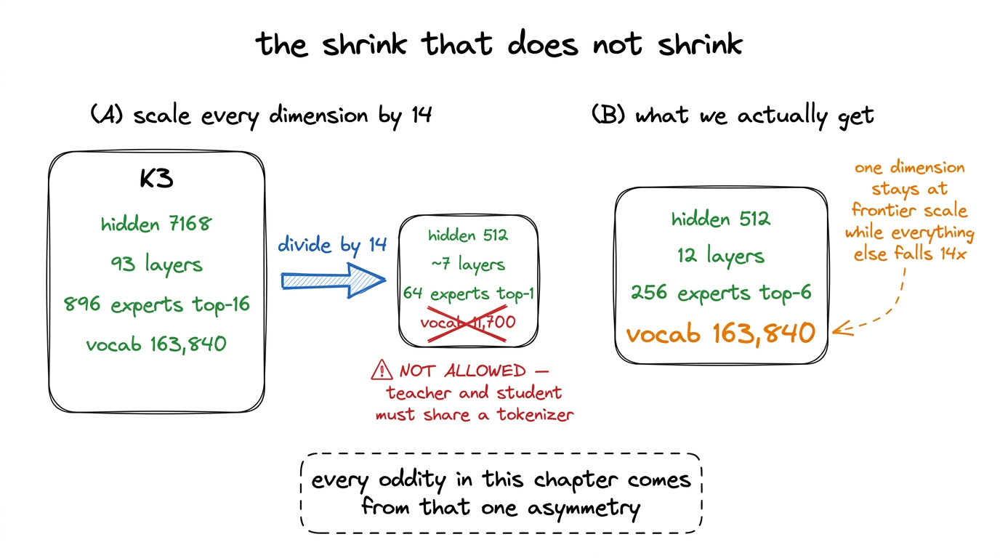
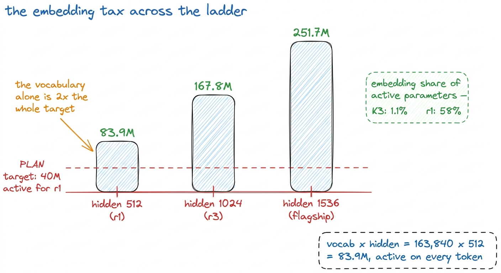
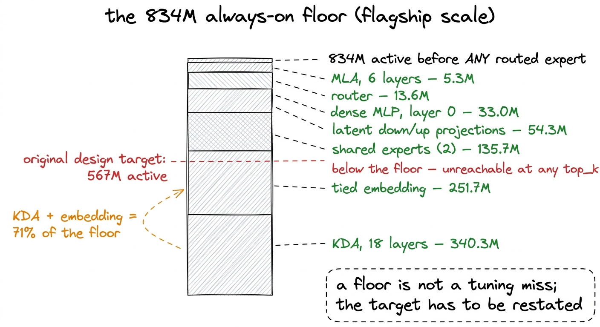
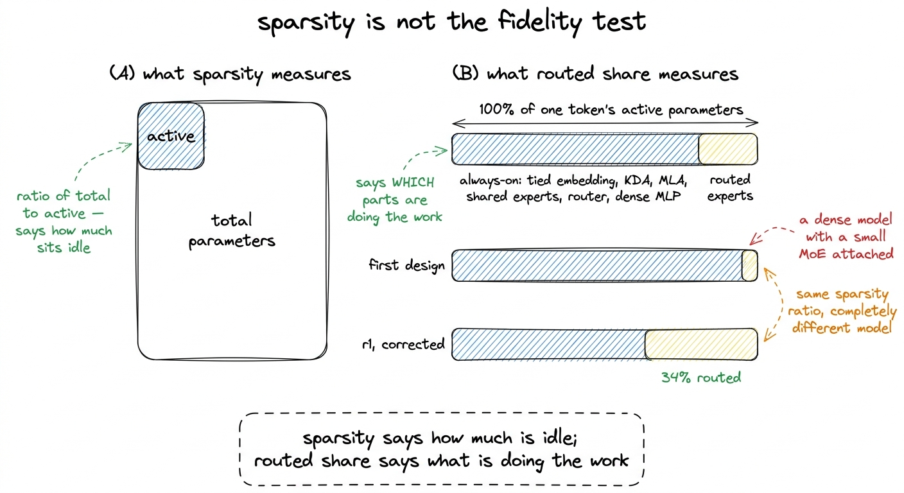
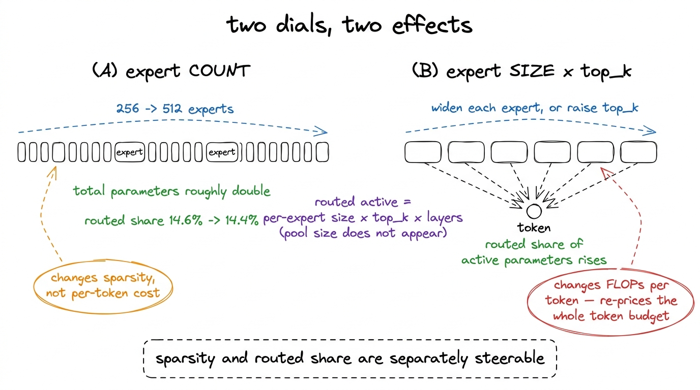
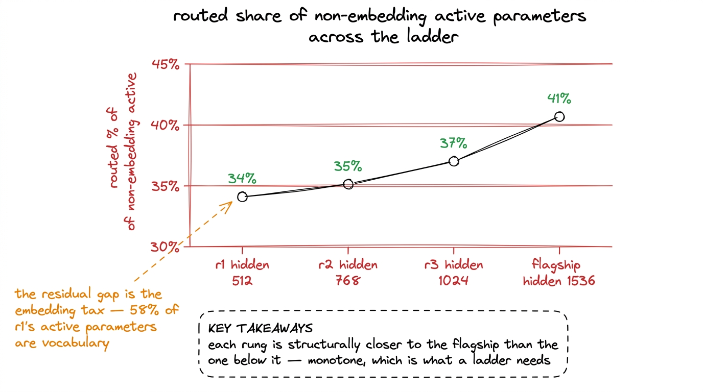

# 05\. 诚实地缩小模型规模

[← 上一章](../04-reading-k3s-config/README.md) · [返回目录](../../README.md) · [下一章 →](../06-the-attention-stack/README.md)

第 01 部分 · 模型 · 12 分钟 · 6 幅图 · 145M

> 为什么 163,840 个 token 的词表让“40M 个激活参数”的模型在算术上不可能实现？834M 的固定参数下限说明了什么？r1 的 1.02B 总参数量与 145M 激活参数量又如何确定？

Kimi K3 有 93 层，隐藏尺寸为 7,168，以及 896 个专家，其中任意一个 token 会激活 16 个专家。r1 有 12 层，隐藏尺寸为 512，以及 256 及专家，其中 6 个专家会激活。从第一组数字到第二组看起来像一个除法问题：选择一个缩小因子，将其应用于每个维度，保持比例关系，然后将结果称为小型 K3。

该过程会产生一个模型。它不会产生一个小型的K3，其背后的算术推导是本章的主题。在过程中进行了两次修正，一次在旗舰模型的规模上，一次在规模档位上，而这两次修正都是由参数计数器强制执行的，而非由论点决定。请注意，r1是完成训练的规模档位：它在一台H200上训练，从未进行分片。旗舰模型是在2026年8月6日启动的，其第一次修正发生在第76,294步的第890步，当时有69.5%的专家处于不活跃状态，因此下文关于它的所有描述都是设计测量，而非已完成训练运行的结果。

## 直接缩小模型会发生什么

K3的隐藏尺寸是7,168，r1的是512，因此缩小因子是14。将其应用于深度得到 $\frac{93}{14}\approx6.6$ 在层上应用它，并将其应用于专家池，会得到具有前1路由的64个专家。将其应用于词汇表将得到约11,700个token。

那一步是无法进行的。我们保持K3的分词器不变，包括其全部163,840个token，因为最终的推理蒸馏阶段在token级别上运行，需要教师模型和学生模型共享词汇表。一个重新训练的12,000个token的分词器会使小模型更便宜，但也会使其成为一个不同的模型，无法与它所复现的模型进行比较。

因此，架构的一个维度被固定在全尺寸，而其余每个维度都缩小了十四倍。下面的算术中所有异常之处都源于这一单一的不对称性。[^1]

[](../../figures/scaling-it-down-without-lying-1.png)

图 5-1　我们无法将所有维度按相同比例缩小，因为下游要求决定了分词器必须保持不变。

## 嵌入层的固定开销

一个权重共享的嵌入需要成本 $\mathrm{vocab}\times\mathrm{hidden}$ 参数，且对每个 token 均处于激活状态：输入查找和输出投影使用相同的矩阵，并在每次前向传递中均运行。在 r1 的宽度上那即是 $163{,}840\times512\approx83.9\,\mathrm{M}$ 参数。

r1 有  **145M 个激活参数**  总计。嵌入是  **其中83.9M个，占58%** 在K3中，根据K3自身配置由同一计数器测量，嵌入是  **1.1% 的激活参数** .[^2]

相同的成本落在规模阶梯的每一个档位上，且是以绝对数值而非比例形式体现：

| 隐藏维度 | 权重共享的嵌入 |
| --- | --- |
| 512 (r1) | 83.9M |
| 1024 (r3) | 167.8M |
| 1536（旗舰模型） | 251.7M |

计划要求构建激活参数量约为 40M、110M 和 300M 的规模阶梯。但隐藏维度为 512 时，仅嵌入表就已经有  **83.9M** ，这超过了首个目标的两倍。不存在层、头和专家的配置能在拥有163,840个token词汇表的情况下达到40M个激活参数，因为词汇表在单个层存在之前就已经是预算的两倍了。目标并未错过。它是不可行的。

[](../../figures/scaling-it-down-without-lying-2.png)

图 5-2　K3 分词器在各个档位上的成本。这项成本受词表规模而非模型容量决定，因此在较小宽度下会占主导地位。

## 按非嵌入参数确定各档规模

修复的方法不是缩小词汇表。而是停止使用被词汇表污染的单位来衡量规模档位。

因此，规模档位在  **非嵌入激活参数量** .r1的图表是 $145\,\mathrm{M}-83.9\,\mathrm{M}\approx61\,\mathrm{M}$r2 是 176M，r3 是 395M，分别对应总激活参数的 307M 和 562M。这两个数值在每个规模档位中均被报告，因此单位的选择不会隐藏任何信息。

这并非我们发明的便利措施。Kaplan 等人和 Chinchilla 都是基于非嵌入参数来拟合他们的缩放规律，他们这样做与我们一样，原因在于嵌入成本随分词器变化，而分词器是关于文本编码的决策，其余参数数量则随模型计算能力的变化而变化。[^3]

测得的非嵌入激活参数为  **61M / 176M / 395M**  在 r1、r2 和 r3 上，相较于一个要求底部为 40M 规模档位的计划而言，最小的规模档位因此超过了其声明的目标，且这三个规模档位在非嵌入参数上跨度达到 6.5 倍。我们更倾向于保持旗舰模型的结构保真度，而非追求整数目标，而这一范围足够容纳趋势的反向表现。

## 旗舰模型无法突破的下限

在r1规模下的嵌入问题，是同一发现在一个旗舰模型上首次提出后，规模档位下降一级的结果。

旗舰模型的原始设计目标是  **567M 个激活参数** 在基于 PyTorch 的发布版建模代码上进行测量 `meta` 在该设备上，本应产生该数值的配置实际结果远高于该数值。这一差距并非调参失误，而是一个下限。

每个K3层在做出任何路由决策之前，为每个token运行一组组件。在旗舰模型宽度为1,536时，将它们相加得到  **834M 个始终激活的参数** :

| 始终参与计算的组件 | 参数量 | 占下限的比例 |
| --- | --- | --- |
| KDA (18层) | 340.3M | 40.8% |
| 权重共享的嵌入 | 251.7M | 30.2% |
| 共享专家（2 个） | 135.7M | 16.3% |
| 潜在表示的降维／升维投影 | 54.3M | 6.5% |
| 稠密 MLP（第 0 层） | 33.0M | 4.0% |
| 路由器 | 13.6M | 1.6% |
| MLA (6 层) | 5.3M | 0.6% |
| **总计** | **834M** |  |

834M 是一个严格的下限。即使采用 Top-1 路由将请求分发到无限小的专家，每 token 仍需 834M 个激活参数，因为上述所有行均未被路由。因此，在批准的架构下，达到 567M 个激活参数的目标是不可实现的，正确的回应是重新陈述目标，而不是寻找能够满足该目标的配置。

有两个条目值得特别说明，因为它们是收缩因子处理得较差的部分。KDA在340.3M处是最大的单一项目，其规模较大，是因为K3在未使用全注意力的地方都放置了线性注意力层：在发布模型中，有69个KDA层对24个MLA层，每第四层使用全注意力。在24层中保持该比例，则得到18个KDA层和6个MLA层，而KDA每层的成本下降速度没有层数量下降得快。权重共享的嵌入在251.7M处是第二大项，这与梯度上升所支付的税相同，每提升一个规模档位就增加一次。这两项加起来占了71%的底层，且它们均未经过路由。

[](../../figures/scaling-it-down-without-lying-3.png)

图 5-3　旗舰模型规模下，每个 token 都会经过的全部组件。测量方法是在 meta 设备上实例化发布的建模代码。

## 真正重要的结构一致性检查

参数下限是一个算术问题。第二项修正涉及结构一致性；如果忽视它，项目就会在没有任何明显症状的情况下失去有效性。

位于地板之上的设计具有一个看似合理的辩护理由：一个小型 `top_k` 从一个大型池中选取能够保持K3的总参数到激活参数的比例  *比值* ，因此模型的稀疏度与K3相同。该说法是正确的，但它衡量的是错误的东西。

稀疏倍数是总参数量与激活参数量之比，它说明模型有多少参数处于闲置状态，却不说明究竟哪些部分在参与计算。回答后一个问题，需要看路由专家占激活参数的比例：处理一个 token 时参与计算的全部参数中，有多少来自路由专家，又有多少来自不论 token 如何都会运行的组件。

在第一种设计中，始终开启的底层占用了几乎所有每token的计算量，而路由专家则只占了很小一部分。处于这种状态的模型是一个稠密的 834M 模型，其侧边附加了一个小型的混合专家模型。路由机制存在，负载均衡器运行，负载在各部分间移动，但这些操作并未触及模型足够多的计算量，因而其行为方式与在 K3 中相同机制的行为方式不同。后来阶段比较我们训练的 `e_score_correction_bias` 与真实检查点相比，这相当于将一个路由程度很低的模型与一个路由程度很高的模型进行比较，这并不能有力地说明我们本想研究的问题。

修正后的配置是梯度报告的内容：  **34% 个非嵌入激活参数在 r1 路由，35% 在 r2 路由，37% 在 r3 路由，41% 在旗舰模型上路由。** 

[](../../figures/scaling-it-down-without-lying-4.png)

图 5-4　结构一致性检查。保留总参数量与激活参数量之比，并不能保留模型中究竟哪些部分参与计算。

## 两种调节手段，以及该选择哪一种

该修正来自于一个恒等式，仅书写一次。

每个 token 对应的路由激活参数量为$\text{per-expert size}\times\mathrm{top\_k}\times\mathrm{layers}$。专家池大小并不出现在这个表达式中。另一方面，总参数量与专家池大小成正比，因为每个专家无论是否被选中，都必须存储。

因此，这两个属性是分别可调节的。  **专家数量决定了稀疏性。专家规模和 `top_k` 设置路由共享。**  确认该测量是在梯级宽度处进行的，横跨 256、384 和 512 专家，其余部分保持不变：  **路由共享从 14.6% 移动到 14.4%** ，在池子翻倍的情况下，增幅为一个百分点的五分之一。总参数量，在相同的扫描实验中，大致翻倍。

那个身份将一个卡住的设计转化为两个独立的调节旋钮。如果模型不够稀疏，就增加专家，这会带来存储空间和优化器状态的开销，但每个token的开销几乎为零。如果路由机制未能承担足够的计算量，就让每个专家更宽或选择更多专家，这会在每个token上带来FLOPs开销，并重新定价整个token预算。

旗舰模型的最终配置是两个旋钮最终停下的位置：1,536 个隐藏层，24 层。  **512 个专家与 `top_k` 6** ，给出  **35.56B 个总参数和 1,237M 个激活参数**  以及上述引用的41%路由份额。

[](../../figures/scaling-it-down-without-lying-5.png)

图 5-5　区分两种调节手段的恒等关系，以及验证该关系的阶梯规模扫描实验。

## 忠实保留架构的代价

修正路由专家占比并非没有代价，而且代价出现在意料之外的地方。激活参数量决定每个 token 的 FLOPs，这一关系体现在$\mathrm{MFU}=\frac{6\,\mathrm{active\_parameters}\,\mathrm{tokens\_per\_second}}{\mathrm{peak\_FLOPs}}$中；因此，提高路由专家占比会提高每个 token 的成本，减少固定预算能够训练的 token 数。混合专家结构越忠实，预算可购买的 token 越少，最终模型的过量训练程度也越低。让小模型的训练量显著超过计算最优点，是提高其实际表现、而非仅追求计算效率的常见做法，所以两个目标直接冲突。我们选择接受较小的 token 预算，并明确报告权衡，而不把选定配置说成唯一选择。

相同的修正解决了硬件问题。在旗舰模型的 35.56B 个参数上，每个参数的优化器状态为 14 字节，  **498 GB** ，这是  **86% 个两卡 B300 预算**  每张卡约 288 GB，留下大约 39 GB 用于激活和梯度。分片一章接着这个数值并展示了其实际意义；在这里只需说明，架构决策和硬件决策最终是相同的。请注意，这一约束仅属于旗舰模型。r1 可以单张 H200 上运行，每小时花费 \$4.54，从未进行分片，整个 5.00B 个 token 的训练运行花费  **\$252.35** .

## r1 的实际配置

应用了两项修正后，该层级由固定使一个 K3 变为 K3 的比例关系，并仅调整尺度来定义。

| 字段 | r1 |
| --- | --- |
| 隐藏维度 | 512 |
| 层数 | 12 |
| 注意力头数 | 8 |
| KDA 头数 | 4 |
| 全注意力（MLA）层 | 3 — 层 4, 8, 12 |
| KDA 层 | 9 |
| 前部稠密层 | 层 0 |
| head\_dim | 128 |
| MLA 维度划分 | 128 / 64 / 128 |
| 专家数 | 256 个路由专家，top-6，2 个共享专家 |
| `moe_intermediate_size` | 416 |
| 潜在表示宽度 | 256（隐藏维度／2） |
| AttnRes 块数 | 8（块大小为 1） |
| 路由器 | Sigmoid + `noaux_tc` |
| 激活函数 | `situ` 4.0 / 25.0 |
| 词表大小 | 163,840 |
| 上下文长度 | 4,096 |
| 总参数量 | **1.02B** |
| 激活参数量 | **145M** |
| 非嵌入激活参数 | **61M** |

跨所有三个规模档位保持不变的规则集很简短：每第四层全注意力，第 0 层稠密， `head_dim` 128，MLA 分割 128/64/128，潜伏 MoE 宽度为隐藏尺寸的一半，8 个 AttnRes 块，无论深度如何 `situ` 在 4.0 和 25.0，一个sigmoid路由器与 `noaux_tc`，两个共享专家，256 个专家与 `top_k` 6，和 `moe_intermediate_size` 设置为隐藏层大小的一个固定比例 — 416 在 r1 的宽度为 512。只有隐藏层大小、深度和头的数量在规模档位之间变化。

```python
RUNGS = [
    {"name": "r1", "hidden": 512,  "layers": 12, "experts": 256, "top_k": 6},
    {"name": "r2", "hidden": 768,  "layers": 16, "experts": 256, "top_k": 6},
    {"name": "r3", "hidden": 1024, "layers": 20, "experts": 256, "top_k": 6},
]
```

实例化后，三个档位的实测参数量分别为：r1 总量 1.02B、激活 145M；r2 总量 2.93B、激活 307M；r3 总量 6.63B、激活 562M。只有 r1 完成了整次训练；Modal 工作区被停用时，r2 和 r3 分别在进度 75% 和 50% 处停止。学习率也遵循保持比例的原则：在 r1 的宽度下测试四个学习率，各训练 600 步，都没有损失尖峰，最终选定 $6.00\times10^{-4}$。其他档位采用$6\times10^{-4}\sqrt{\frac{512}{\mathrm{width}}}$，即 r2 的 $4.90\times10^{-4}$、r3 的 $4.24\times10^{-4}$，以及旗舰模型的 $3.46\times10^{-4}$。这是标准参数化下的迁移，而非 muP，也是训练方案中依据最薄弱的假设。[^4]

r1的非嵌入激活参数路由份额是  **34%** 规模阶梯读作 34%、35% 和 37%，对应 r1、r2 和 r3，与 41% 对应旗舰模型。该系列单调上升至旗舰模型，而这正是规模阶梯所需要的：每一级都对它所预测的模型提供了略微更接近的结构近似，趋势方向正确，而非随意漂移。

34% 和 41% 之间的残差差距再次是嵌入税。在隐藏层 512，嵌入占激活参数的 58%，因此即使在非嵌入激活参数上测量，最小规模档位所携带的固定硬件比例也远高于旗舰模型，且没有任何 MoE 配置在该宽度下能达到旗舰模型的比率。

[](../../figures/scaling-it-down-without-lying-6.png)

图 5-6　整个规模阶梯中的结构一致性趋势。变化方向比任何单个数值都更重要。

## 明确记录的两项差异

r1 与 K3 不仅在数值上更小，而且在两个地方存在刻意差异。

 **权重共享的嵌入**  K3 将 `tie_word_embeddings: false`，因此其输入和输出矩阵是分开的。在这些宽度上解耦是不可行的，因为嵌入本身已经占了 r1 激活参数的 58%，而解耦会使这一比例翻倍。我们选择将它们绑定，并报告其后果，而不是默默地匹配该字段。[^5]

 **256 个专家在层级上对阵旗舰模型的 512。**  这是故意拉动的计数杠杆，而且正是由于上述身份关系，它才具有辩护性。如果将池子翻倍，那么在每一个规模档位上总参数都会翻倍，使 r3 超过 6.63B，从而需要多个 GPU 来实现原本预算为廉价梯度的配置，而激活参数以及因此的路由动态几乎不受影响。这就是之前引用的扫描实验：在梯度宽度下，跨越 256、384 和 512 个专家。  **路由共享从 14.6% 移动到 14.4%** 专家数量决定了稀疏性，而非每个token的行为，因此尽管池子不同，梯度的路由测量结果仍能转移到旗舰模型中。

## 这些修正的共同之处

两种修正都是以相同的方式发现的：通过实例化配置并进行计数，而不是在纸上对配置进行推理。

目标567M在多次评审中幸存下来，因为567M在16.45B旁边是一个合理的数值，且设计中没有任何内容表明834M部分是不可路由的。被路由的7.5%份额幸存下来，是因为为其提出的理由——保持稀疏比率——是对一个不回答所提出问题的数量的正确陈述。这两个错误都不是粗心大意造成的。它们是参数计数器在短时间内会发现的，而仔细阅读却完全找不到的类型。

这一模式贯穿于本项目始终。路由器坍塌是通过一个衡量结果而非意图的指标被发现的。数据清单错误是通过计算每个源的token数量而非读取构建名称的文件被发现的。在这里，同样的纪律也适用于设计文档：用一个可测量的单位来定义目标，然后在投入任何资源之前先进行测量。

---

[← 上一章](../04-reading-k3s-config/README.md) · [返回目录](../../README.md) · [下一章 →](../06-the-attention-stack/README.md)

[^1]: 钉住的词汇表在栈中的延伸程度超过了参数数量。我们的 token 分片是原始的小端格式 `uint32` 无表头，且宽度是 `uint32` 而不是 `uint16` 正是由于词汇表是 163,840：一个 16 位的 token id 会静默截断所有高于 65,535 的 id，这占了 K3 词汇表的大部分。文档边界由 EOS id 163585 标记。

[^2]: 我们的参数计数器在用于任何更小规模之前，都会先与K3本身进行验证：在发布的配置上运行时，它报告了2,779.5B个总参数和105.4B个激活参数，与Moonshot发布的2.8T和104B完全一致，并且精确复现了1.1%个嵌入权重共享。参数计数一章详细介绍了计数器及其控制机制。一个能够准确计数到K3的计数器，其对小型模型的可靠性是可以信赖的。

[^3]: 这种区别在我们当前的范围内具有实际意义。在 K3 的宽度上，该选择会使参数数量变化 1.1%，可以忽略不计。在 r1 的宽度上，它会使参数数量变化 58%，并决定两个模型中哪一个看起来更大。一个包含嵌入的缩放拟合会测量前沿分词器的恒定成本，并将其称为容量。

[^4]: 唯一能证明梯度在发挥作用的证据来自评估结果，而非参数数量。在训练初期，当token数量相等时，HellaSwag对r28.4%的运行结果为3，对r2的运行结果为27.6%，对r1的运行结果为27.0%。较大模型在相同数量的token下表现更优，这是梯度必须在任何其他测量之前产生的排序，否则后续的测量将无法进行外推。

[^5]: 权重共享还解释了开篇损失的一个细节：第 0 步损失为 12.100，完全均匀分布对应$\ln(163{,}840) \approx 12.007$。小幅超出是因为初始化时 logits 已带有少量结构；输出投影与输入嵌入使用同一个矩阵。
