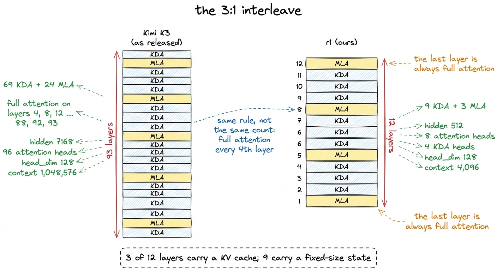
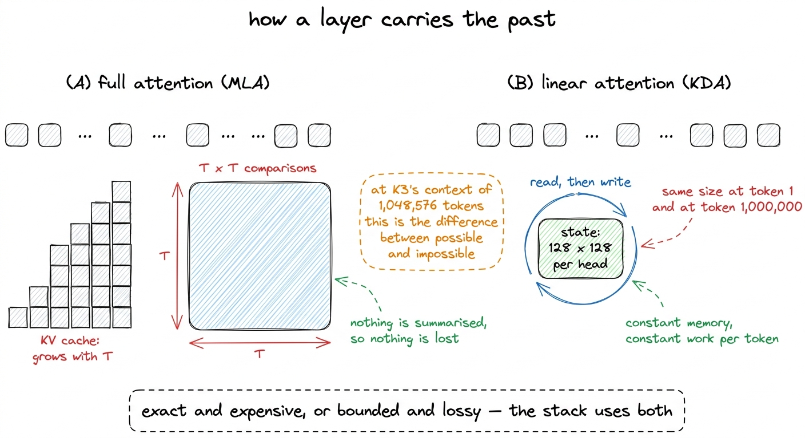
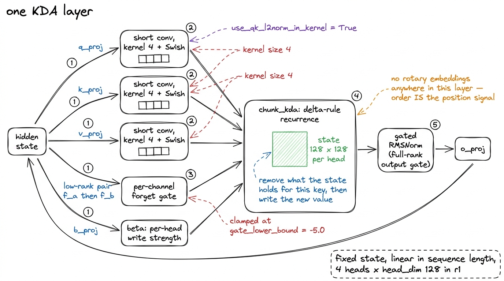
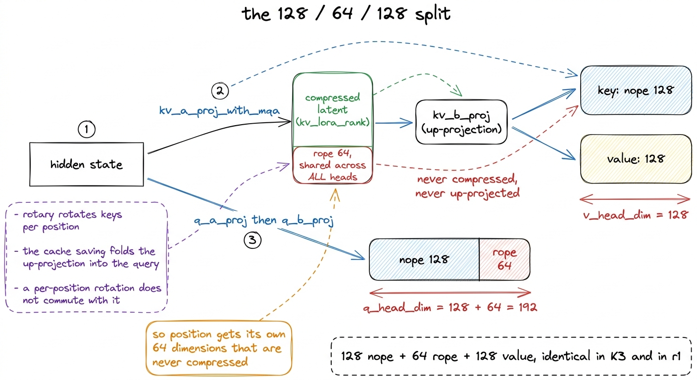
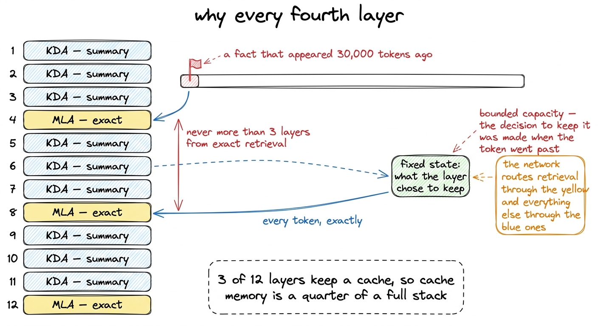
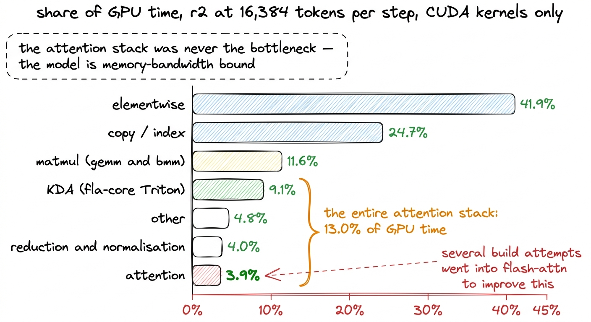

# 06\. 注意力层组合：九层 KDA 与三层 MLA

[← 上一章](../05-scaling-it-down-without-lying/README.md) · [返回目录](../../README.md) · [下一章 →](../07-the-moe-that-actually-routes/README.md)

第 01 部分 · 模型 · 11 分钟 · 6 幅图 · 3:1

> 带逐通道遗忘门的 delta 规则、按 128/64/128 划分的多头潜在注意力，以及为何每四层保留一次精确的全局检索。

r1 有十二层，其中只有三层执行通常意义上的注意力计算。第 4、8 和 12 层运行多头潜在注意力，其中每个标记可以查看所有更早的标记，并且模型会保持一个随着序列增长而增长的关键值缓存。其余九层运行 Kimi Delta 注意力，它完全不保留任何缓存，而是携带一个固定大小的状态，每个标记在传递过程中都会读取和写入该状态。

那个 3:1 比例不是我们的。K3 释放时有 93 层，其中 69 层是 KDA，24 层是全注意力，全注意力层放置在每个第四索引位置： `[4, 8, 12, ... 88, 92, 93]`我们保留了规则而非计数，因此在十二层结构中，相同的规则会使全部注意力集中在 4、8 和 12 上，并在它们周围留下九个KDA层。

本章介绍每个机制的成本及其带来的收益。两个模块的从零开始构建，以及递归和潜在投影的可运行代码，在本库的另一本书中。[^1] 这里我们关心的两个问题，是每一次训练运行需要回答的：过去部分占用多少内存，以及该模型部分消耗了多少GPU时间。

[](../../figures/the-attention-stack-1.png)

图 6-1　K3 与 r1 的层堆叠方式。我们保留了层的位置规则，并缩小了深度。

## 保存历史信息的两种方式

每一个自回归层都需要让当前token访问它之前的token，且存在两种结构上不同的实现方式。

全注意力会存储它们。每个早期的标记都会贡献一个键和一个值，这两个都会被保留，并且当前查询会与每一个键进行比较。没有任何信息被丢失，因为没有任何信息被总结。代价是，存储的键和值随着序列长度线性增长，而比较操作则随着序列长度呈二次增长。

线性注意力对它们进行了总结。该层携带一个状态矩阵，每个标记都会更新它，并从它中读取。该状态具有固定大小，不随已通过的标记数量而变化，因此内存是恒定的，每个标记的计算工作量也是恒定的。所损失的是精确性：一个固定大小的无界历史的摘要在本质上是损失的。

对于一个 4,096 个 token 的上下文，这正是 r1 训练时的情况，其差异仅是内存条目。对于 K3 的 `max_position_embeddings` 的  **1,048,576** ，它决定了模型是否存在。在一个全注意力层中，一个百万token的序列会存储百万个键和百万个值，其隐含的得分矩阵具有百万行和百万列。每十二层中有九层避免了这一点，这才使得1M上下文是可行的。

[](../../figures/the-attention-stack-2.png)

图 6-2　让 token 访问历史信息的两种方式。K3 在每四层中的前三层采用一种方式，第四层采用另一种。

## KDA：带遗忘门的递归计算

Kimi Delta Attention 是一种基于 delta 规则的线性注意力递归结构。名称描述了其更新机制：并非仅仅将新的键值乘积累加到状态中，该层首先移除当前状态与输入键所关联的内容，然后在原位置写入新的关联。仅累加的线性注意力不会覆盖任何内容，因此重复或矛盾的信息会不断堆积，导致状态饱和。通过写入差值，可以更长时间地保持状态的可用性。

在该核心部分，该模块增加了四项内容，所有内容均从 K3 的配置中原样继承至 r1。

每个状态通道都有自己的遗忘门。每个通道的衰减因子由隐藏状态经过一对低秩投影得到。如果每个注意力头只用一个标量衰减因子，就会强制所有通道以相同速度遗忘；但有的通道保存只在一个从句内有效的句法信息，有的则保存持续一整页的主题信息，这种约束显然不合适。门值由`gate_lower_bound`设定下限 -5.0，以限制各通道状态被清除的速度，并避免单个 token 抹掉整个状态。

 **一个短卷积，卷积核大小 4。**  查询、键和值各自都经过一个在四token窗口上的深度卷积，使用Swish激活函数，然后再进入递归过程。这是Mamba风格模型所采用的技巧，它为每个位置提供了一点局部混合，而纯粹的递归更新则很难快速构建这种混合。

 **在查询和键上进行L2归一化。**  两者在内核内部递归之前都会被归一化到单位长度。这限制了单个token写入状态的幅度，从而确保了在bf16中经过数千步累积后的递归在数值上保持稳定。

没有显式位置编码。KDA 层既没有旋转位置嵌入，也不需要它：位置由递归本身携带，因为 token t 处的状态是此前所有 token 按顺序作用的结果；四个 token 宽的卷积窗口也天然具有位置敏感性。

对内核的调用使其形状变得可见：

```python
o, recurrent_state = chunk_kda(
    q=q, k=k, v=v,                      # after short conv + Swish
    g=g,                                # per-channel forget gate
    beta=beta,                          # per-head write strength
    A_log=self.A_log, dt_bias=self.dt_bias,
    use_qk_l2norm_in_kernel=True,
    use_gate_in_kernel=True,
    use_beta_sigmoid_in_kernel=True,
    safe_gate=self.gate_lower_bound is not None,
    lower_bound=self.gate_lower_bound,  # -5.0
)
```

`chunk_kda` 是训练路径。它将序列分块处理，因此递归可以表示为一系列矩阵乘法，而不是逐个token的循环，这使得在GPU上对4,096个token的递归层可训练成为可能。单token路径， `fused_recurrent_kda`，仅在推理时使用且需要缓存。

其中两个参数携带了本书其他部分中的内容。 `dt_bias` 使用创建 `torch.empty` 在发布的代码中且从未初始化，和 `_init_weights` 仅涵盖 `nn.Linear` 和 `nn.Embedding`，因此它作为未初始化的内存到达内核。该失败是非确定性的：规模档位 r2 正常训练，而 r1 从第 0 步返回 NaN，源于相同的错误。[^2]

[](../../figures/the-attention-stack-3.png)

图 6-3　KDA 的数据路径。递归计算左侧的全部操作，都在准备将要写入状态的信息。

## MLA：压缩缓存，以及无法压缩的那个维度

多头潜在注意力从权衡的另一端入手：保留精确注意力，但减少必须存储的内容。它将隐藏状态降维投影成较小的潜在向量，缓存该向量而非完整的键和值；需要时，再通过升维投影重建键和值。

K3的分割是 `qk_nope_head_dim`  **128** , `qk_rope_head_dim`  **64** , `v_head_dim`  **128** ，与 `kv_lora_rank` 512 和 `q_lora_rank` 1536\. r1 使用相同的  **128 / 64 / 128**  拆分、保持不变，并仅将两个低秩宽度与隐藏尺寸进行缩放。

64维的中间项是设计变得有趣的地方，它存在是因为压缩潜变量和旋转位置嵌入存在直接冲突。

旋转嵌入在点积之前对查询和键施加一个与位置相关的旋转。使潜在注意力值得实施的节省来自于将键的上投影折叠到查询一侧，因此在解码过程中缓存的潜在表示无需展开。这种折叠是一个矩阵恒等式，它仅在潜在表示与查询之间不存在任何位置相关的成分时成立。一个按位置施加的旋转恰好位于该位置，且它与上投影不交换，因此对重构的键应用旋转会破坏该恒等式，从而也破坏了缓存节省。

解决方案是将头部拆分。  **128 维度完全不携带位置信息**  并从压缩的潜在表示中重建，这是“nope”部分的名称。  **64 维度是直接从隐藏状态计算得出的，从未被压缩** ，且是位置信息存在的唯一地方。那些 64 维度是在一次生成后被所有头共享，而不是每个头单独拥有，因此缓存的不可压缩部分保持较小。各个值拥有自己的 128 维度，同样是从潜在空间中重建而来。

[](../../figures/the-attention-stack-4.png)

图 6-4　潜在注意力对注意力头进行拆分，使可压缩的部分与携带位置信息的部分不必使用同一组数值。

该图底部的不对称性之所以重要，是因为它与建模无关。一个查询头的宽度是 192，一个值头的宽度是 128，而我们所能使用的每一个快速注意力内核都假设它们相等。在发布代码中的修复方法是，用零填充值到 192，然后将输出切回 128，这属于精确而非近似的操作。该代码还被设计为仅在一条代码路径上运行，这产生了本章末尾的两个实用说明中的第一个。

## 为何仍然保留全注意力层

如果状态视图在内存使用上更便宜且序列长度呈线性增长，那么问题在于为什么栈中保留了九十三个全注意力层中的二十四层，而不是零层。

固定大小的状态是一份摘要，无法支持对任意历史 token 的精确检索。若要复制 30,000 个 token 之前出现的字符串，或返回长文档前半部分表格中的某个值，仅由递归层组成的网络必须在那个 token 经过时，就决定将其保留。相比只做累积的线性注意力，delta 规则显著提高了成功的可能性，因为修改状态远胜于不断向其中填入内容。但它无法改变一个事实：状态容量有界，历史长度却没有这一限制。

一个全注意力层具有相反的特性。它在可检索的内容上没有容量限制，因为它保存了所有信息，但它为此在每个标记上都付出代价。

交错安排两类层，让网络能够选择路径。需要精确回忆的信息可以经过保留了完整历史的层，而大部分序列建模在每个 token 成本恒定的层中完成。每四层设置一个全注意力层，而非把它们集中在最后三层，就能保证网络的任何位置距离一次精确的全局访问都不超过三层。

成本会计是值得带走的部分。在 r1 中，十二层中有三层维持 KV 缓存，因此缓存内存是  **四分之一**  与相同形状的全注意力堆叠所需资源相比。在 K3、24 的 93 层中实现了这一点，仅超过四分之一，而在 1,048,576 个 token 的上下文长度下，这一四分之一的差异决定了一个模型是否能够发布。

[](../../figures/the-attention-stack-5.png)

图 6-5　每类层能够访问的信息，以及为何精确注意力层均匀分布，而非全部堆在末尾。

## r1 保留什么，又缩小什么

与 K3 完全相同，无论宽度如何：

|  | K3 | r1 |
| --- | --- | --- |
| 全注意力层的位置 | 每 4 层中的最后一层 | 每 4 层中的最后一层 |
| `head_dim` | 128 | 128 |
| MLA 维度划分（nope／rope／value） | 128 / 64 / 128 | 128 / 64 / 128 |
| `short_conv_kernel_size` | 4 | 4 |
| `gate_lower_bound` | -5.0 | -5.0 |
| `use_full_rank_gate` | 设置 | 设置 |

按宽度扩展：

|  | K3 | r1 |
| --- | --- | --- |
| 层数 | 93 | 12 |
| KDA／MLA 层数 | 69 / 24 | 9 / 3 |
| `hidden_size` | 7,168 | 512 |
| 注意力头数 | 96 | 8 |
| KDA 头数 | — | 4 |
| 上下文长度 | 1,048,576 | 4,096 |

头部数量是注意力堆栈中唯一随规模变化的部分，它们变化是因为头部宽度保持在 128，而隐藏尺寸缩小了十四倍。在 r1 的隐藏尺寸为 512 时，四个 KDA 头、每个宽 128，恰好等于隐藏维度，而八个注意力头、每个宽 128，则正好是它的两倍。保持 `head_dim` 固定而非固定头部  *数量*  是它保留了delta规则和潜变量分割所设计的每头算术运算。[^3]

## 两条实践说明

 **MLA 层没有在闪存注意力上运行。**  发布的建模代码强制要求字符串 `flash_attention_2` 作为其注意力实现，以及上述192对128的填充仅在该分支上运行。我们的MLA层因此运行一个  **sdpa 兼容层，其注册名称为 `flash_attention_2` 键** 从数值上看是完全相同的，因为填充部分是零，输出会被切片回原位置。它运行得更慢。本书中所有涉及 MLA 的 MFU 数值都是在该 shim 上测得的，这意味着每一个数值都如此。  **低估**  如果使用了Flash-Attention会怎样。在r1中，暴露量由交错机制限制，因为所有3个12层都采用了MLA。[^4]

 **性能剖析将闪存注意力作为杠杆弃用了。**  MFU调查运行了十六次编号实验，几乎全部在r2上进行，该层级位于我们层级之上的307M-活性档位，使用了一台H200。第6次尝试的假设是KDA或注意力内核是成本所在。该假设通过测量被否定，修正后的性能剖析在r2上以每步16,384个标记的速度进行，且仅统计CUDA内核，结果显示两行数据为：

| 部分 | 占 GPU 时间的比例 |
| --- | --- |
| KDA (fla-core Triton) | **9.1%** |
| 注意力 | **3.9%** |

与元素级操作在 41.9% 和复制及索引在 24.7% 相对。在该配置之前，大量构建工作已经投入到了安装 flash-attn 中，而所有这些工作的最大回报只是 3.9% 的一部分。[^5]

[](../../figures/the-attention-stack-6.png)

图 6-6　修正后的性能剖析结果。本章讨论的两项位于表格靠近底部的位置。

## 本章为后续章节提供了什么

有两个东西被继承。

第一种方法是解读任意混合注意力堆叠的方式。询问每种层类型对过去信息做了什么，然后统计每种类型层的数量，整个模型的记忆行为便随之显现。包含九个固定状态层和三个增长缓存层的模型，其长上下文记忆主要由三个层主导，这是一项设计决策，而非实现过程中的偶然现象。

第二个是书中反复提及的警示。注意力是变换器架构中工程师投入最多精力的部分，也是当一次训练运行变慢时人们首先想到的部分。在该架构、该规模下，整个注意力栈占用了 r2 性能剖析中 13.0% 的 GPU 时间，且最快可用的内核未安装到四分之一的层上。这两个事实并未对运行造成任何可测量的影响，因为那部分时间实际上被用于了其他地方。找出具体位置需要一次性能剖析，而这次剖析正是本书接下来的部分。

---

[← 上一章](../05-scaling-it-down-without-lying/README.md) · [返回目录](../../README.md) · [下一章 →](../07-the-moe-that-actually-routes/README.md)

[^1]:  *从零构建Kimi K3* ，它构建了可在笔记本上运行的小型模块 Kimi Delta Attention、Gated MLA、Attention Residuals 和 LatentMoE。这里我们假设这些模块已存在，并询问它们的训练成本。

[^2]: 已修复 `train/init_patch.py` 采用类似Mamba风格的 `dt_bias` 初始化和一个 `assert_initialised` 在步 0 之前运行的有限检查。已发布代码中关于四个阻碍的章节涵盖了所有内容。

[^3]: 这一选择也使得KDA在旗舰规模下的持续参数预算中成为最大的单一项目：占到834M地板的340.3M。关于规模缩减的章节会详细阐述这一预算。

[^4]: MFU 值仅能在相同的后端、相同的硬件、相同的批处理形状下与其他 MFU 值进行比较。关于 MFU 是什么的章节正是详细阐述了这一点，而尝试 13 中的拟合误差，其中将 H200 的结果与 B200 的结果一起拟合，就是个警示案例。

[^5]: 该性能剖析表的第一个版本中，KDA对应4.6%，注意力机制对应5.1%，同时还包含一个无法解释的30.2%“其他”项。它将PyTorch操作符行与这些操作符所启动的CUDA内核行相加，导致重复计数。修正后的数值如上所示。两个版本关于flash-attn的描述是相同的。
