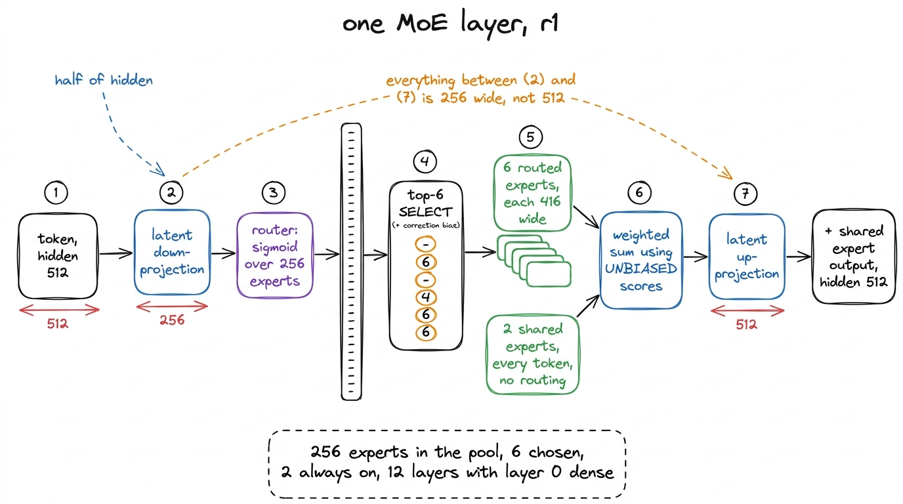
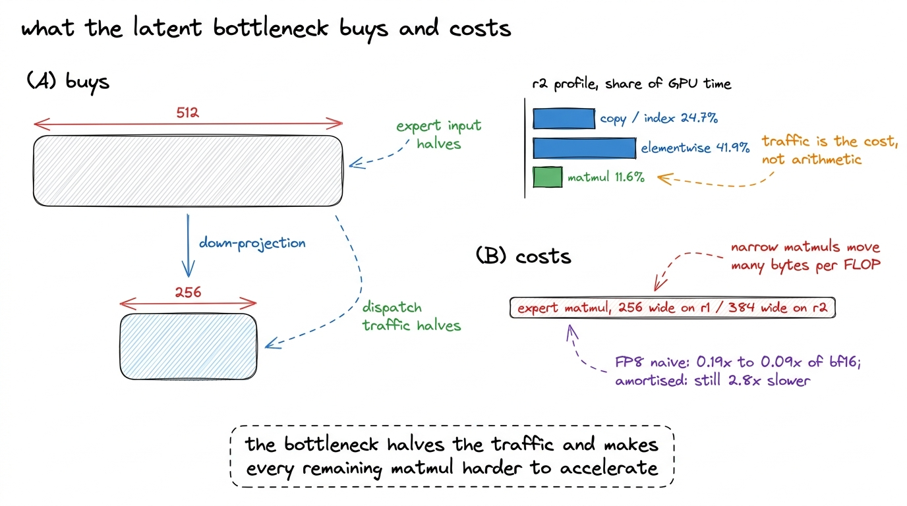
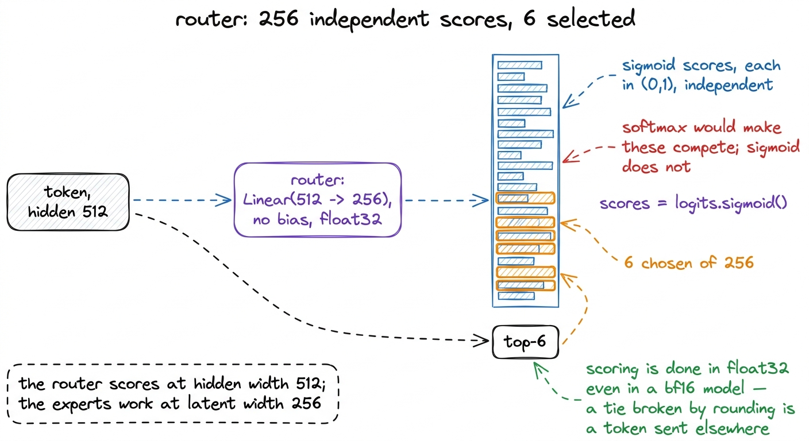
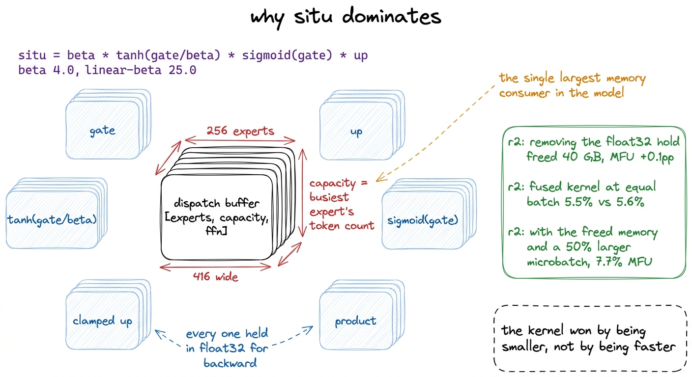
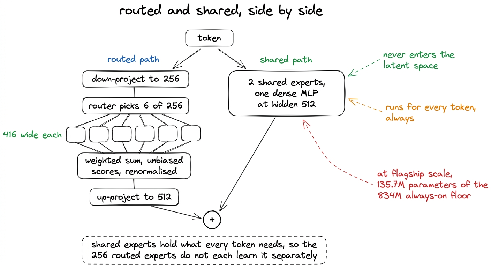
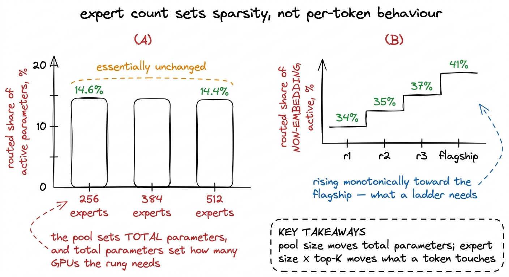

# 07\. 真正执行路由的混合专家模型

[← 上一章](../06-the-attention-stack/README.md) · [返回目录](../../README.md) · [下一章 →](../08-counting-the-parameters/README.md)

第 01 部分 · 模型 · 11 分钟 · 6 幅图 · top-6

> 256 个路由专家，每次激活 6 个，另有 2 个共享专家；潜在表示瓶颈为隐藏维度的一半；sigmoid 路由器使用 K3 从 DeepSeek-V3 继承的无辅助损失均衡器。

r1 包含 1.02B 个参数，并为每个 token 使用其中 145M 个参数。几乎所有的参数减少都发生在单个块中，每层重复一次，本章将跟踪一个 token 按其经过各部分的顺序通过该过程。

配置由四个数字和两个结构选择组成。  **256 个专家，每 token 选择 6 个，2 个被无条件地应用于每个 token，每个专家宽度为 416 单位。**  结构选择是：所有这些都在 256 个单位的潜在空间中发生，而不是模型的 512 个单位隐藏空间；选择由一个带有来自 DeepSeek-V3 的无辅助损失校正偏置 K3 的 Sigmoid 路由器决定。每一个这样的设置都是 K3 自己的，通过在梯度上保持固定的比率进行缩放。

[](../../figures/the-moe-that-actually-routes-1.png)

图 7-1　单个 token 经过 r1 中一个混合专家层的路径。编号既表示运算顺序，也表示本章的讲解顺序。

## 先经过潜在表示瓶颈

在路由器看到任何内容之前，标记会被投影下去。K3调用该字段 `routed_expert_hidden_size`，它设定了整个专家子系统运行的宽度。在 K3 中，该值为 3,584，对应隐藏尺寸为 7,168。梯级保持相同的比率，因此 r1 通过路由  **256**  与其隐藏大小 512 相反。

```python
"routed_expert_hidden_size": h // 2,
```

那一条线改变了下游所有内容的成本。每个专家的输入投影宽度从 512 变为 256，因此每个专家持有的参数量大约仅为原本的一半，对于相同的 `moe_intermediate_size`需要排序、收集、打包到一个分发缓冲区并重新收集的标记向量大小也减半，这使得分发机制移动的字节数减半。在该模型架构中，这种第二效应更为显著：r2 上的性能剖析显示存在复制和索引操作。  **24.7%**  相对于矩阵乘法的11.6%，GPU时间的开销并非算术运算的舍入误差，而是大约是算术运算的两倍。

代价是专家的矩阵乘法变得狭窄。一个宽度为 256 个单位的矩阵乘法，每单位算术运算移动大量字节，而这正是性能剖析指出模型已经陷入的 regime。[^1] 我们为那个选择后来付出了利息。当在 r2 上尝试 FP8 时，那里专家的矩阵乘法是 384 宽，因为 r2 的隐藏尺寸是 768，而潜变量宽度是它的二分之一，且它们的执行时间在几十微秒内。对激活值的量化需要在矩阵乘法开始前对输入进行三次遍历，而三次遍历无法比一个在几十微秒内完成的矩阵乘法更便宜。朴素的 FP8 测量了  **0.19x 到 0.09x**  对于 bf16，其经过合理摊销的版本仍然慢了 2.8 倍。FP8 章节介绍了该测量，以及它为何会发展成这样，都写在上面的配置行中。

[](../../figures/the-moe-that-actually-routes-2.png)

图 7-2　潜在表示瓶颈减少了分发时需要移动的数据，也让剩余矩阵乘法过小，无法受益于假定矩阵很大的加速方式。这两种效应都在比本次训练高一个档位的 r2 上测量。

## 路由器为每个专家打分

路由器是一个从模型隐藏尺寸到专家数量的、无偏的线性层，以 float32 运行，后接一个 Sigmoid。它读取完整宽度的 token，而不是潜在宽度的表示，因此它是对 token 进行评分，而不是对专家将看到的压缩表示进行评分。

使用 Sigmoid 而非 Softmax 是 K3 的选择，我们保留了这一设计。Softmax 路由器产生的分数会相互竞争，因为提升一个专家的分数会通过构造方式降低其他所有专家的分数。而 Sigmoid 路由器会产生 256 个独立的分数。 $(0,1)$，且选择是随后应用的一个独立操作。

```python
logits = F.linear(
  hidden_states.type(
    torch.float32
  ),
  self.weight.type(
    torch.float32
  ),
  None,
)
scores = (
  logits.sigmoid()
)  # [tokens, 256]
scores_for_choice = (
  scores
  + (
    self.e_score_correction_bias
  ).unsqueeze(0)
)
_, topk_idx = torch.topk(
  scores_for_choice,
  k=self.top_k,
  dim=-1,
  sorted=False,
)
topk_weight = scores.gather(
  1, topk_idx
)  # the UNBIASED scores
```

那五行中的三项决定了层的行为。

分数以 float32 的形式计算，无论模型的训练数据类型如何。路由是一个通过比较数值完成的离散决策，这些数值可能非常接近，而通过 bf16 四舍五入打破平局时，该标记会被发送到不同的专家。

选择读取 `scores_for_choice`，即分数加上一个专家级别的标量。该标量是 `noaux_tc` 偏差校正，而且它是整个负载均衡机制。它通过规则在每次优化器步骤后更新，而不是通过梯度；它被排除在优化器之外，并且在选择哪些专家时起引导作用，而从未改变所选专家的贡献程度。它拥有独立一章，因为在第一次真实训练运行94.5%进行到第二十步时，专家们接收到零个token，而监控该现象的指标读出了0.99个1.0，而修复该问题的常数并非来自论文中的那个常数。

权重来自 `scores` 而不是从 `scores_for_choice`，也就是说来自原始、无偏的评分。这一特性使得负载均衡器是免费的。负载仅通过选择来引导，而目标函数保持不变。

[](../../figures/the-moe-that-actually-routes-3.png)

图 7-3　路由决策。按照设计，各分数彼此独立；专家选择是随后单独施加于这些分数的步骤。

## 分发，以及它形成的张量形状

每个token对应六个专家索引是一种分散访问模式，而在每一层上执行256个独立的小矩阵乘法是错误的GPU实现方式。这一结论的测量结果位于MFU部分：在r2上，其256个专家分布在15个混合专家层中，每步产生了3,840个顺序内核启动，该计数与批大小完全无关，且在2,048个token上的步时间下降了  **3.999 秒到 0.228 秒**  当循环被替换为三个批处理矩阵乘法时。

这里关键的是替换所创建的形状。令牌按专家进行排序，并打包到一个形状为的稠密缓冲区中 `[experts, capacity, width]`，其中容量是 busiest 专家的 token 数量。填充是精确而非有损的：未使用的槽位保存零值，其输出永远不会被收集，因此没有 token 被丢弃，这与容量因子方案会丢弃溢出的情况不同。r1 有 12 层，其中第 0 层是稠密层，因此 11 层在每次前向传播中构建这个缓冲区。[^2]

缓冲区也是模型内存所在的地方，原因是其中应用的激活。

## situ，以及它为何主导显存占用

K3的激活函数以名称的形式注册 `situ`它是一种类似 SwiGLU 的门控前馈激活函数，包含两个常量和一个软钳制：

```python
def forward(self, x):
    d = x.shape[-1] // 2
    gate = x[..., :d].to(torch.float32)
    up = x[..., d:].to(torch.float32)
    situ_a = self.beta * torch.tanh(gate / self.beta) * torch.sigmoid(gate)
    if self.linear_beta is not None:
        up = self.linear_beta * torch.tanh(up / self.linear_beta)
    return (situ_a * up).to(x.dtype)
```

从左到右读。 $\mathrm{beta}\,\tanh\!\left(\frac{\mathrm{gate}}{\mathrm{beta}}\right)$ 是小值时的恒等式，在达到一定值时饱和 `±beta`，因此它是一个带有旋钮的平滑夹紧装置。乘以 $\operatorname{sigmoid}(\mathrm{gate})$ 呈现出门控激活所使用的斯威什型曲线。The `up` 路径单独在 `±linear_beta`我们的常量是  **beta 4.0 和 linear-beta 25.0** ，这些是 K3 发布的值，保持不变。我们并未对它们进行扫描实验，也未测量替代方案；梯度的假设是 r1 与 K3 在规模上不同而在本质上相同，而一个激活常数正是悄然将一个复制品变为另一种事物的典型例子。

花钱的那条线是 `.to(torch.float32)`. 发布的实现会将两个部分都上浮，并生成一系列中间值——两个输入、tanh、sigmoid、被截断的 `up`，这些产物——每一个都用于反向传播。在分发缓冲区中，这些中间结果具有形状 `[experts, capacity, ffn]`，在 float32 中，它们是模型中最大的内存消费者。

由于这种形状，存在两个后续章节。移除 float32 保持完全是 MFU 调查的尝试 5，并释放了  **40 GB**  在移动 MFU 的过程中，r2 上增加了 0.1 个百分点，当时看起来像是失败了。融合 `situ` 将一个 Triton 内核合并的尝试 8，在相同批大小下也没有更快：5.5% MFU 对比已发布路径的 5.6%。它最终获胜，因为其 40 GB 释放出的资源允许了一个 50% 更大的微批大小，而更大的微批大小从 5.6% 到 r2  **7.7% MFU**  每秒 41,294 个 token。内核之所以获胜，是因为更小而非更快，而一个小内核值得 1.38 倍的原因是，它消除了设定批大小的那个张量。[^3]

[](../../figures/the-moe-that-actually-routes-4.png)

图 7-4　激活函数的 float32 中间值，在经过填充的专家缓冲区中被复制。显存限制了微批量大小，而微批量是 r2 实测中最有效的调节手段。

## 重新组合，并投影回隐藏维度

六个专家输出通过加权和进行组合，权重为无偏的Sigmoid得分，并被归一化以使其总和为一。

```python
y = (
  (
    y.view(
      n_tok, k, -1
    ).type(
      topk_weight.dtype
    )
    * topk_weight.unsqueeze(
      -1
    )
  )
  .sum(dim=1)
  .type(hidden_states.dtype)
)

if self.use_latent_moe:
  if self.latent_moe_use_norm:
    y = self.routed_expert_norm(
      y
    )
  y = self.routed_expert_up_proj(
    y
  )

y = y.view(*orig_shape)
if (
  self.config.num_shared_experts
  is not None
):
  y = y + self.shared_experts(
    identity
  )
return y
```

与软最大函数路由器相比，使用逻辑斯蒂函数路由器时重归一化更为重要。逻辑斯蒂函数得分并不总和为特定值，因此在没有重归一化的情况下，该块输出的总幅度将依赖于路由器对这个标记的置信程度，而这种置信度在训练过程中会变化。将输出除以六个选定得分的总和，就消除了这种依赖关系。[^4]

随后，潜在表示的升维投影将结果恢复到 512 维，再加上共享专家的输出。注意调用`self.shared_experts(identity)`：其中`identity`是模块在完整隐藏宽度下的输入。共享专家完全不进入潜在空间；它们是在模型隐藏维度上运行的常规稠密 MLP，对每个 token 都执行，与路由路径并行。

## 每个 token 都会经过的两个专家

两个共享专家无条件运行，它们的宽度是路由专家宽度乘以共享数量，因此它们是单个路由专家宽度两倍的单个MLP。

他们的论点在于，路由专家应当被要求学习什么内容。语言具有每个标记都需要的结构，如果这项工作交由路由池来完成，那么所有 256 个专家都必须独立地学习这些内容，这会使得相同的参数重复 256 次，从而让每个专家在它擅长的独特任务上留下的容量减少。而共享专家只需学习一次。

存在一种在训练期间比收敛时更重要的效应。共享路径始终处于激活状态，因此梯度始终会流经该路径。当路由器在训练初期发生坍塌（在我们所有训练运行中均出现这种情况），共享专家会持续接收到每个token的完整梯度信号，因此该模块从未产生无用输出，而负载均衡器则将路由池拉回。健康的轨迹在前三十步左右会达到69%到95%个不活跃专家之间，然后恢复；我们的完整训练运行读取  **不活跃专家比例为 0.0%**  ，第 0 步的负载不均衡度为 2.36；在第 38,140 步结束时，  **不活跃专家比例为 0.0%**  以及负载不均衡 4.0。我们没有运行过没有共享专家的消融实验，因此这一推理是针对设计的论证，而非对其的测量。

在旗舰规模下，共享专家是 135.7M 个参数的 834M 一直运行层，是模型中仅次于 KDA 和权重共享嵌入的第三大一直运行成本。它们并非一个小的附加部分。

[](../../figures/the-moe-that-actually-routes-5.png)

图 7-5　路由路径与共享路径并行运行，随后相加。只有路由路径经过潜在表示瓶颈。

## 这项差异：256 个专家，而非 512 个

r1、r2 和 r3 都使用 256 个专家。旗舰梯度的构建使用了 512。这是一个有意的偏离，值得说明的是，它并不会影响梯度所测量的内容。

路由激活参数等于每个专家的大小乘以top-k乘以层数。该乘积不包含专家数量。总参数量然而与专家池呈线性关系。因此，将专家池减半会将总参数量减半，从而将优化器状态和内存减半，而一个token实际接触的参数数量几乎保持不变。

我们是通过测量而非断言得出的。在保持其他因素不变的情况下，当专家池在 256、384 和 512 专家之间变化时，路由分配的激活参数比例发生了变化。  **14.6% 到 14.4%** 那就是全部效果。专家数量决定稀疏性；专家大小和top-k决定路由共享。

实际效果是，专家池减半后，每个档位都能在单卡上运行。r1 和 r2 使用单张 H200；r3 则需要 B200，因为基准工具中它在 H200 上显存不足。如果为了测量单 GPU 吞吐量，每个档位反而都需要多张 GPU，这个规模阶梯就失去了作用。

偏差改变的是稀疏性，即总参数与激活参数的比例，我们报告这一数值而非隐藏它。路由分配的非嵌入激活参数比例沿梯度上升——  **34% 在 r1，35% 在 r2，37% 在 r3，41% 在旗舰模型**  ——这正是规模阶梯所需的形状，但它在最底层的运行值上并未达到旗舰模型的水平。这一差距是嵌入税，而非专家数量：在隐藏层 512，163,840 个token的嵌入占激活参数的 58%，且没有任何专家架构能够改变这一比例。

[](../../figures/the-moe-that-actually-routes-6.png)

图 7-6　这项测量支持我们在规模阶梯中使用 256 个专家，而旗舰模型使用 512 个专家。

## 这个模块的完整概貌

对于每一个 token，对于 r1 的每一个混合专家层（共十一层）：将 512 投影到 256，使用浮点数 32 中的 sigmoid 对所有 256 个专家进行打分，加上校正偏置，并选取前 6 个，将 token 封装成一个填充的 `[256, capacity, 416]` 缓冲区，执行三个批处理矩阵乘法 `situ` 在它们之间，在 float32 中进行聚合，乘以六个无偏归一化分数，将 256 重新投影到 512，并加上两个共享专家的输出，这两个专家从未离开全宽度。

原本是K3的部分且保持为K3的部分是sigmoid路由器， `noaux_tc`，半隐藏的潜在宽度，两个共享专家，top-6，以及两者 `situ` 常量。属于我们的部分是池的大小，而上面的测量说明了为何允许这一点。让我们花费最多工程精力的部分，并非那些看起来昂贵的部分：分发循环和激活的 float32 中间量，占本书 MFU 部分的比重，超过了它们所包围的专家矩阵乘法。

---

[← 上一章](../06-the-attention-stack/README.md) · [返回目录](../../README.md) · [下一章 →](../08-counting-the-parameters/README.md)

[^1]: 该模块还携带一个可选的潜变量输出上的RMSNorm。 `latent_moe_use_norm`，在我们的配置中启用，并在重组之后、上投影之前应用。它从未在我们所采集的任何性能剖析中单独成行。

[^2]: `first_k_dense_replace: 1` 使第 0 层成为一个传统的稠密 MLP `intermediate_size` 而不是一个混合专家模块。K3 也实现了同样的功能。因此，被路由的层看到的表示已经经过了一次非路由变换。

[^3]: 两张图都是在 r2 上测量的，该规模档位位于 r1 之上，使用单个 H200。r1 在基准测试框架中的 92.5 GB 上可以轻松地部署在一张卡上，因此使这些尝试值得运行的内存压力，对于整个规模阶梯而言是真实的，而不是对于本书所报告的该规模档位而言。

[^4]: `routed_scaling_factor` 是 1.0 在我们的配置中，因此在重归一化之后乘以它的操作是无效的。它存在于 K3 的门中，作为模型需要将路由路径相对于共享路径进行缩放时的调节手段。我们的 `num_expert_group` 也是 1，这使得释放门的组受限路由分支——在前k个专家之前限制每个token仅限于一组专家子集——在梯度上的每一个规模档位都是不可达代码。
