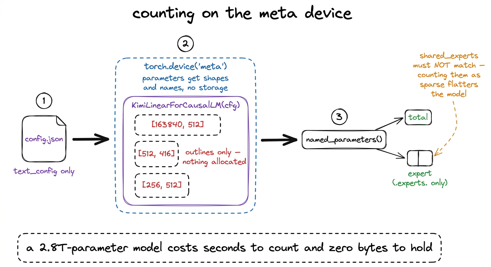
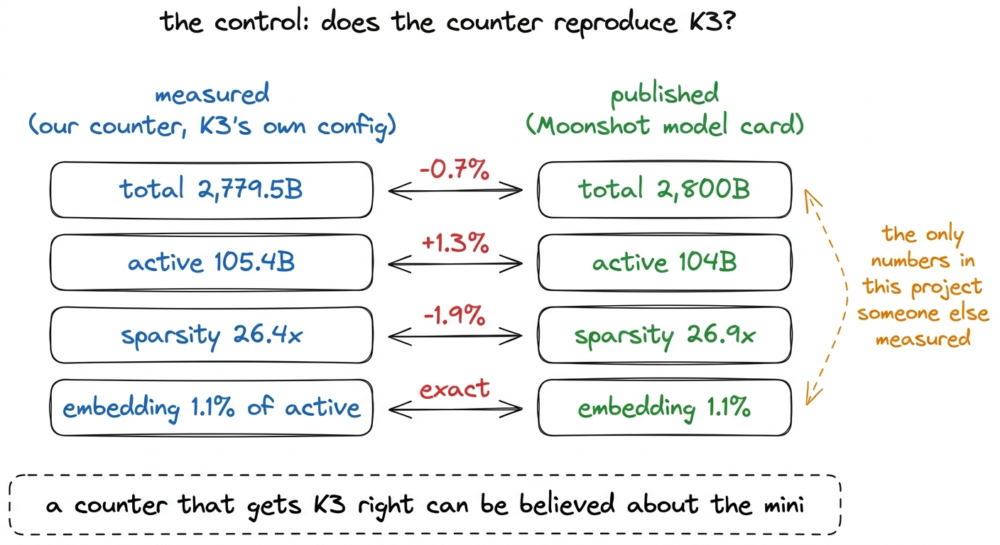
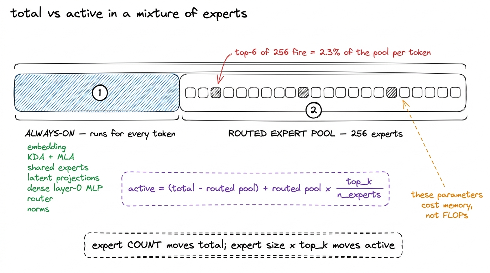
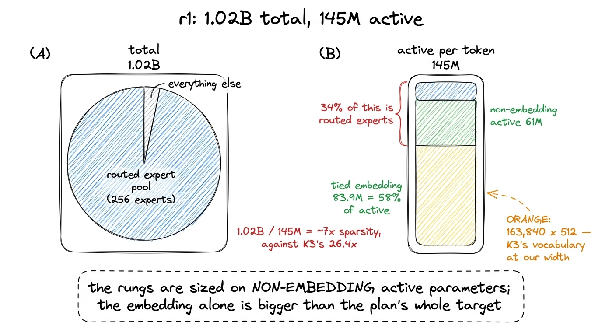
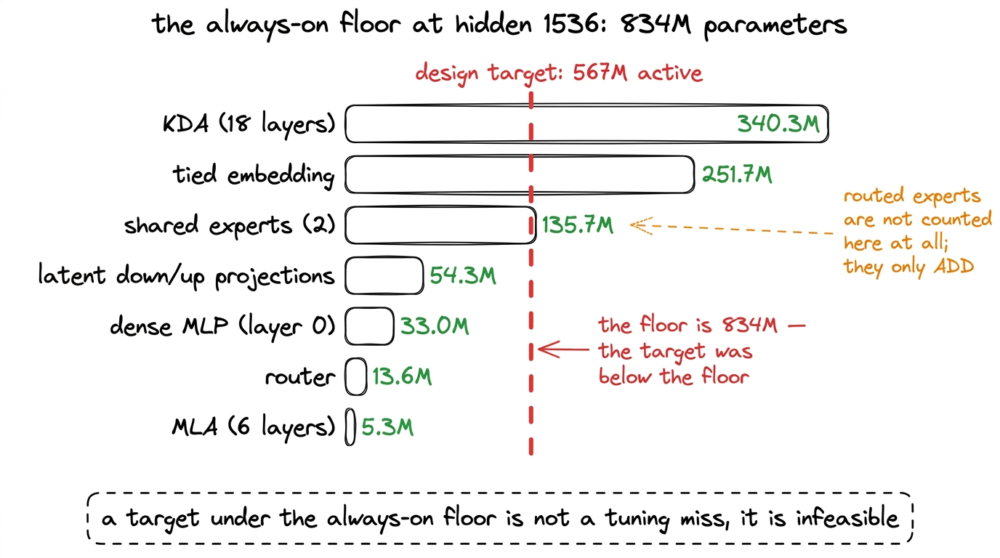
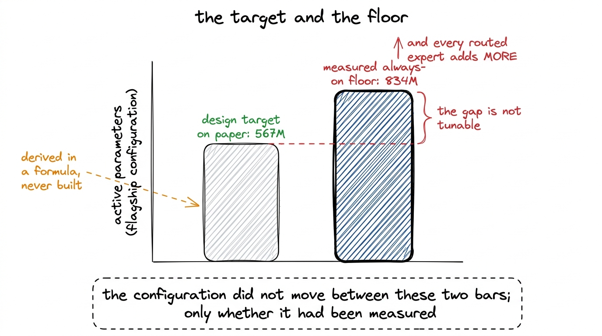

# 08\. 统计参数，并校验统计方法

[← 上一章](../07-the-moe-that-actually-routes/README.md) · [返回目录](../../README.md) · [下一章 →](../09-assembling-the-corpus/README.md)

第 01 部分 · 模型 · 9 分钟 · 6 幅图 · 1.02B

> 只有先复现 K3 公布的 2.8T 总参数量和 104B 激活参数量，参数统计器才值得信任；随后用它判断 r1 的容量实际分布在哪里。

每个类似这样的项目都会产生若干个引人注目的数据点，而参数数量通常是最先被提及的。它也是最不可能被任何人核实的数据点。损失曲线容易引发争议，基准测试分数可以由陌生人重新运行，吞吐量数值也可以由持有相同硬件的任何人复现。而参数数量则以规格表中的一条条目形式出现，人们默认撰写该条目的人员已经正确地进行了计算。

我们的计划中也有这样一个数字。规模阶梯里最大的旗舰模型，原定激活参数为 567M；它来自纸面公式各项相加。当我们真正构建配置并实测时，尚未计入任何路由专家，仅每个 token 都会用到的参数就已达到 834M。设计目标低于设计自身的参数下限。无论怎样设置专家大小、专家数量或`top_k`，都不可能达到目标，因为这些调节项只会增加参数。

当时项目中没有任何错误。算术运算从未与它所描述的模块树直接面对过。本章介绍的是与之直接面对的工具，以及使该工具输出值得阅读的控制机制。

## 不加载模型，统计 2.8 万亿个参数

方法是构建模型然后不使用它。PyTorch的 `meta` 设备为参数分配形状、数据类型和名称，但它们背后没有存储。一个张量在 `meta` 知道它是 `[163840, 512]`；它不包含任何内容。在构建一个 2.8T 参数的模型上 `meta` 因此仅消耗几秒钟的Python时间且完全不占用内存。[^1]

我们实例化的是并非重新实现。它是 Moonshot 自己发布 `modeling_kimi_linear.py`，提取了权重体积，由 `KimiLinearConfig`那个选择之所以重要，原因与控制因素相同：由我们自己对架构的解读构建的计数器，会验证我们的解读，而不是模型本身。对释放模块树的计数会测试模型。

```python
with torch.device("meta"):
    model = KimiLinearForCausalLM(cfg)

total = expert = 0
for name, p in model.named_parameters():
    total += p.numel()
    if ".experts." in name:        # routed experts only; shared_experts must not match
        expert += p.numel()

active = total - expert + expert * top_k / n_experts
```

倒数第三行的注释至关重要。发布的代码将路由专家池命名为`mlp.experts.*`，将始终参与计算的专家命名为`mlp.shared_experts.*`；如果只检查是否包含子串`experts`，两者都会匹配。把两个共享专家误算成稀疏专家，会低估 r1 的激活参数量、抬高稀疏倍数，使模型看起来比实际更有利。

[](../../figures/counting-the-parameters-1.png)

图 8-1　参数统计器。在 meta 设备上实例化发布的建模代码，因此张量形状存在，但不分配实际存储。

计数器接收一个配置路径，并为每个模型打印一行：总参数数、激活参数数、稀疏度、激活参数的嵌入共享比例，以及始终开启部分的分解。它在CPU上运行大约一分钟，成本低到足以让我们在每次修改梯度配置后都重新运行它，而不仅仅在怀疑有问题时才运行。[^2]

## 对照检查

计数器的第一个任务不是计算我们的模型，而是计算 K3。

Moonshot 为发布的模型给出了两个数值：总参数量 2.8T，每个 token 激活 104B。它们是本项目中仅有的、可用于校验统计工具的独立测量结果。在 K3 自己的`config.json`配置上运行统计器，得到：

|  | 实测值 | 已发布的数值 | 误差 |
| --- | --- | --- | --- |
| 总计 | **2,779.5B** | 2,800B | -0.7% |
| 激活 | **105.4B** | 104B | +1.3% |
| 稀疏倍数 | **26.4x** | 26.9x | -1.9% |
| 嵌入参数占激活参数的比例 | **1.1%** | 1.1% | 完全一致 |

每一行在 1.3% 范围内一致，残差与已发表数据四舍五入到两位有效数字一致，而非计数器存在错误。[^3]

[](../../figures/counting-the-parameters-2.png)

图 8-2　对照检查。首先在已发布模型上运行统计器，与并非由我们产生的数值进行比较。

这份协议是本章其余内容的许可。一个仅针对其构建所依赖的假设进行验证的反例，并不能作为任何证据；它会复现输入到其中的任何公式。一个能够将一个从未见过权重的、拥有 2.8T 个参数的模型，在误差范围内复现到 1.3% 的反例，是在测量模块树。

## 在稀疏模型中，“激活”意味着什么

对于稠密模型，总参数和激活参数的数量是相同的。对于混合专家模型，它们并不相同，这种差距正是该架构存在的根本原因。

每个进入混合专家模型层的token都会被路由到 `top_k` 的 `n_experts` 在路由池中。其他专家持有存储在内存中的参数，这些参数对该token的前向传递没有任何贡献。因此，激活数量是路由池之外的所有内容，完整地加上其中的分数。 $\frac{\mathrm{top\_k}}{\mathrm{n\_experts}}$ 里面的内容是什么。在 r1，  **6 个 256**  专家被激活，因此每 token 有 2.3% 个路由池是活跃的。K3 本身负责路由  **896 个专家中的 top-16** ，有两个共享专家始终在线，其形状在不同尺度下相同。

被完全计算的部分是我们所称之为的  **始终开启的地板** ：嵌入层、KDA和MLA投影、共享专家、潜变量下层和上层投影、稠密层-0 MLP、路由器以及每一个归一化层。该列表中的任何一项都不能被跳过。它在严格意义上是一个下限，因为即使每个token路由一个无限小的专家，也无法低于这个下限。

[](../../figures/counting-the-parameters-3.png)

图 8-3　两种数量。总参数量统计存储了什么；激活参数量统计单个 token 会用到什么。

那行最后的分离值得说明，因为计数器正是确立了这一点。路由激活参数是每个专家大小乘以 `top_k` 层的数量不依赖于池中专家的数量，而总参数量与池的大小呈线性关系。在专家规模固定的情况下测量 `top_k` 跨  **256、384 和 512 专家** ，路由分配的激活参数比例从  **14.6% 到 14.4%** 专家数量几乎免费地带来了稀疏性；它不会改变一个token的行为。这一结果使得规模档位能够在256个专家上与旗舰模型512进行对比，而无需声称两者在每个token上的行为不同，且混合专家模型一章直接使用了这一结果。

## 参数统计揭示了 r1 的哪些特点

在 r1's configuration from `train/ladder.py`，计数器返回  **1.02B 个总数，145M 个激活，61M 个非嵌入激活** 总参数与激活参数的比例略高于 7，相较于 K3 测量的 26.4。

7x 和 26.4x 之间的差距并非设计失败；它是规模与固定词汇表相遇的结果。K3 的嵌入是其激活参数的 1.1%。在隐藏层 512，K3 的 163,840 个 token 词汇表消耗了 163,840 × 512 =  **83.9M 个参数** ，这是  **58% 个 r1 的激活计数** .[^4] 每个token的计算中超过一半用于查找嵌入矩阵的一行并将其投影回去，这部分都不是我们正在测试的架构。

这就是为什么规模档位的尺寸是基于非嵌入激活参数而不是激活参数来确定的，以及为什么该计划最初要求一个“40M 个激活”档位是无法回答的：仅嵌入部分就达到了其两倍。Kaplan 等人和 Chinchilla 都将嵌入排除在它们的参数计数之外，原因相同。关于缩小规模的章节详细说明了在该约束明确之后，r1 的形状是如何被选定的。

[](../../figures/counting-the-parameters-4.png)

图 8-4　r1 的参数分布。词表由分词器固定，因此在隐藏维度为 512 时占据主导地位。

同一个计数器，贯穿每一个规模档位，产生了书中其余部分引用的梯级表。请注意，四个模型保持相同的比率，仅在规模上有所不同。

| 规模档位 | 隐藏维度／层数 | 总计 | 激活 | 非嵌入激活参数 | 路由专家占非嵌入激活参数的比例 |
| --- | --- | --- | --- | --- | --- |
| **r1**  （我们的模型） | 512 / 12 | **1.02B** | **145M** | **61M** | **34%** |
| r2 | 768 / 16 | 2.93B | 307M | 176M | 35% |
| r3 | 1024 / 20 | 6.63B | 562M | 395M | 37% |
| 旗舰模型 | 1536 / 24 | 35.56B | 1,237M | — | 41% |

路由共享从 34% 增加到 41%，随着模型宽度的增加，这是嵌入开销的缩减。在 r1 的宽度下，固定词汇表淹没了所有内容；到旗舰模型时，它只是一个次要项，而每个标记的计算中更大比例是执行架构旨在完成的稀疏工作。只有 r1 完成了完整的训练运行，因此表格的其余部分是梯度的形状，而非一组结果。

## 834M 的下限

指向隐藏 1536、24 层的旗舰配置，计数器产生了将项目预期重置的数值。始终开启的地板来到了  **834M 个参数** ，分解为 KDA 340.3M、权重共享的嵌入 251.7M、共享专家 135.7M、潜在投影 54.3M、稠密 MLP 33.0M、路由器 13.6M 和 MLA 5.3M。

那个模型的设计目标是  **567M 个激活参数** 地板本身是 834M，距离它约 47%。其中两项最大的贡献使得原因清晰可见。KDA 跨越了 18 层的 24 层，其在 340.3M 处是单一最大的项，而隐藏层 1536 处的权重共享嵌入则单独占 251.7M。这两项均不可省略，且它们不会因接触混合专家模型而减少。

[](../../figures/counting-the-parameters-5.png)

图 8-5　在旗舰模型配置上测得的始终参与计算的参数下限。所有路由专家都在此基础上额外增加。

一个低于地板的目标，是一种不同于仅仅难以击中的目标的错误。没有任何一次扫描实验能够发现它，没有任何学习率能够拯救它，也没有任何性能剖析能够揭示它，因为按照指定的模型根本无法存在。最终推出的旗舰模型携带  **1,237M 个激活参数** ，并且它被重塑为那个数值——专家数量、专家宽度和KDA头数量都发生了变化——只有在测量了地板之后才进行。这个重新设计属于“缩小规模”一章的内容。这里提到它，是因为同一个一分钟指令在未被请求的情况下，同时产生了该约束以及总和。

[](../../figures/counting-the-parameters-6.png)

图 8-6　一条命令改变了什么。目标是在纸面上设定的，下限则是从模块树中测出来的。

## 可以迁移的方法

由此产生了两种习惯，而这两种习惯并不专属于混合专家模型。

先建立对照，再开展测量。统计器的价值不在其算术运算——那不过是遍历`named_parameters()`并做一次除法——而在于先用它测量一个已有他人公布答案的模型。这无需额外工程，因为 K3 的配置已在持久卷上，统计器也已支持读取配置；却能将一个只与自身吻合的脚本转化为证据。只要存在已公布的参考，复现它就是获得可信度成本最低的方式。

 **一个无人能独立验证的数量，是错误们静止不动的所在。**  项目中的任何问题都不会因为参数数量错误而被明显暴露。模型会正常训练，损失会下降，而每一个下游指标都会被悄然错误地缩放。模型FLOPs利用率定义为 $\frac{6\,\mathrm{active\_parameters}\,\mathrm{tokens\_per\_second}}{\mathrm{peak\_FLOPs}}$，因此激活计数中的错误会以一对一的方式传递到本书中的每一个MFU数值。持续  **MFU 为 2.4-2.5%，吞吐量为 27,600-28,900 tok/s**  我们报告的 r1 的训练运行结果基于 145M 作为正确的分子，正如在基准测试框架中测得的 r1 的 5.9% 一样。Chinchilla 优化的令牌预算也应基于错误的模型来计算。关于 MFU 的一章依赖于 145M 这个数值；正是这一章让我们相信它。

此后每次修改规模阶梯配置，我们都会针对`train/ladder.py`重新运行统计器，只需一分钟。它防范的是那种不会主动报错的失败。

---

[← 上一章](../07-the-moe-that-actually-routes/README.md) · [返回目录](../../README.md) · [下一章 →](../09-assembling-the-corpus/README.md)

[^1]: 该  **1.561 TB**  在已发布的 K3 权重中，分布于  **96 safetensors 分片** ，不会被计数器触及。只有 `config.json` 被读取，仅其 `text_config` 块。如果权重从未被下载，计数器也会完全相同。

[^2]: `transformers` 被固定到  **4.57.6**  这里和其他地方在项目中一样。 `>=4.56` 解析到 5.x 行，该行删除了 `transformers.utils.generic.OutputRecorder`，一个在模块作用域中导入已发布的Kimi模型代码。计数器在该导入发生时失败，尚未对任何参数进行计数。

[^3]: 2.8T 和 104B 是 Moonshot 模型卡中的数字。总共 2,779.5B 轮到 2.8T 没有困难，然而 105.4B 轮到 105B 而非 104B，因此激活行存在真实的 1.4B 不一致。我们没有追查它，而是在这里陈述而非平滑处理。

[^4]: 嵌入与 r1 中的输出投影权重共享，因此那些 83.9M 个参数仅计数一次却被使用两次。K3 设置 `tie_word_embeddings: false`在这些宽度上解绑会为一个其全部激活预算为 145M 的模型再增加 83.9M。这是梯度中两个故意偏离 K3 的地方之一，另一个是各档位上与旗舰模型 512 相对的 256 专家。
