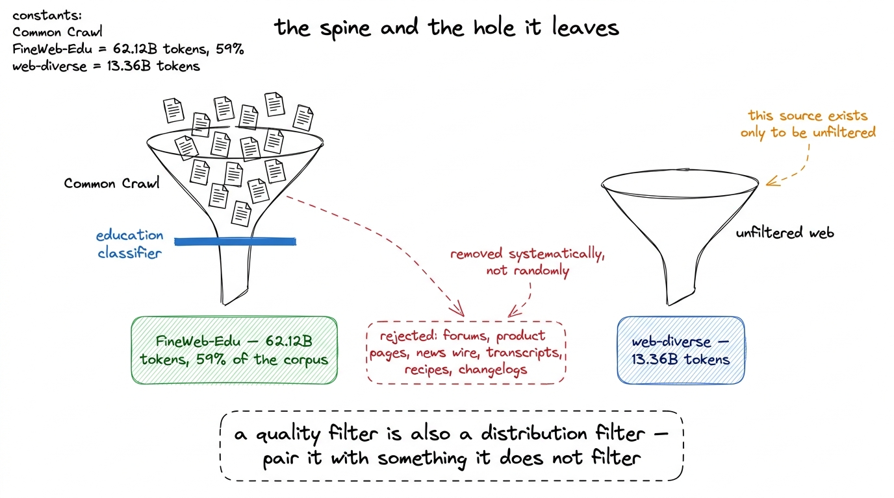
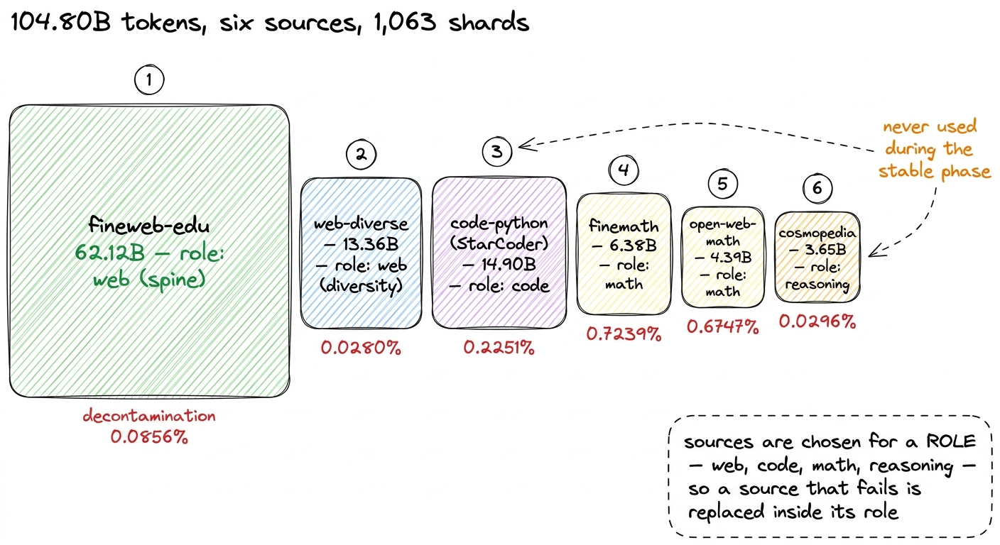
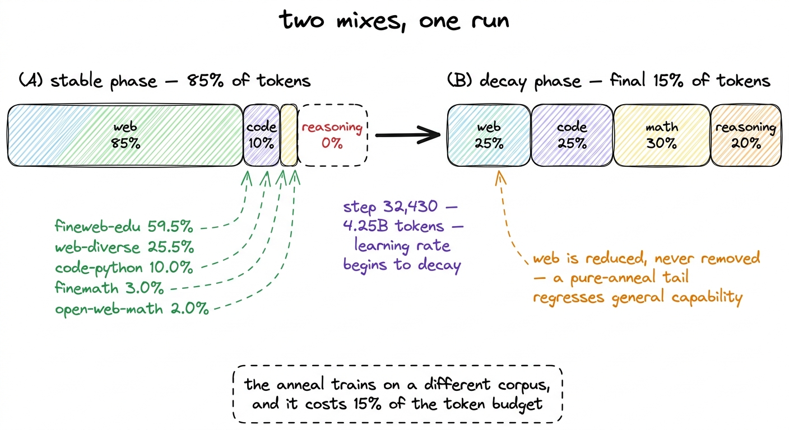
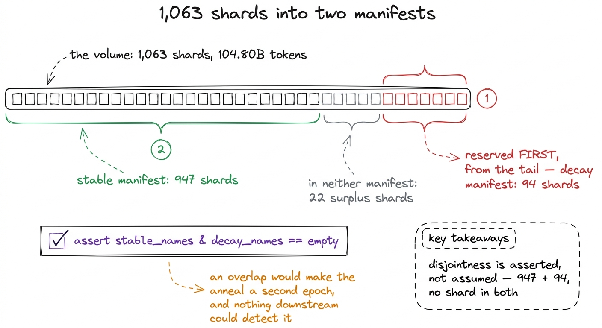
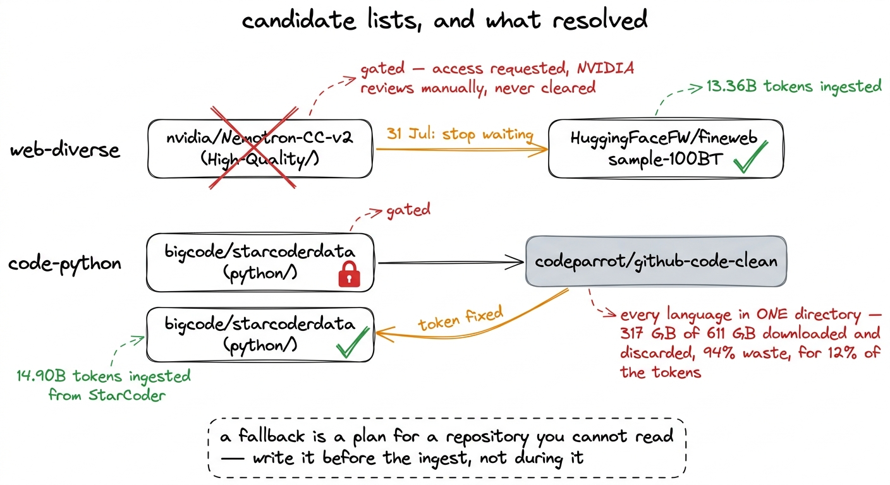
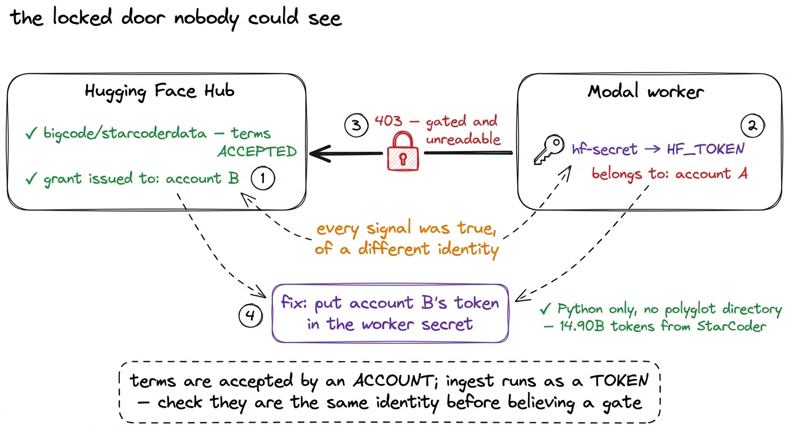

# 09\. 构建训练语料

[← 上一章](../08-counting-the-parameters/README.md) · [返回目录](../../README.md) · [下一章 →](../10-decontamination/README.md)

第 02 部分 · 数据 · 10 分钟 · 6 幅图 · 104.8B

> 以 FineWeb-Edu 为骨干，配合另外五个来源；两个需要访问授权的仓库，对混合方案的影响甚至超过了设计决策。

一个预训练语料库通常被描述为一个设计决策。你选择来源，你选择权重，你写下一种组合，最终得到的模型就是你选择的组合。我们的最终结果是  **104.80B 个 token 分布在六个来源的 1,063 个分片中** ，以及该句中的设计决策是真实的。然而，使语料库最偏离其预期形态的两项内容根本不是决策。它们是一个始终未通过审核的受限制仓库，以及一个属于错误账户的访问令牌。本章内容涵盖这两部分。

## 以 FineWeb-Edu 为骨干，以及它留下的缺口

语料库的核心是  **FineWeb-Edu** ，62.12B 个 token 经过去污染处理，占我们摄入内容的 59%。这是通过一个训练好的分类器筛选出教育性较高的网页文本，保留得分较高的页面。对于一个小型模型在有限 token 预算下，这是正确的默认设置：一个拥有 145M 个激活参数的模型在 5B 个 token 上，并不具备从平均爬取页面中提取信息的能力，而一个移除平均页面的筛选器会提升其保留每个 token 的价值。

过滤器本身也是问题。一个被训练来识别教育性写作的分类器会删除论坛帖子、产品页面、新闻稿、转录文本、食谱、变更日志以及大多数普通互联网内容，因为这些内容都不是教育性的，而它们恰恰是人们实际写作的方式。一个仅在幸存内容上训练的模型，只能看到它将被要求建模的分布的一个狭窄切片，而这种狭窄性是系统性的，而非随机的。

所以语料库包含一个第二来源的网络数据，其作用是不被该分类器过滤。在 `sources.py` 它被称为 `web-diverse`，其备注写道“对抗 FineWeb-Edu 的教育过滤器”，并贡献了 13.36B 个 token。真正承担这一角色的是本章后半部分的内容，而它并非最初计划的那样。

[](../../figures/assembling-the-corpus-1.png)

图 9-1　FineWeb-Edu 是语料的骨干。旁边还需要第二个网页来源，因为让 FineWeb-Edu 质量优秀的分类器，也让它的分布变窄。

## 六个数据来源

还有四个来源围绕着那两个存在。每个都被选中以承担某个角色，而非仅仅作为独立实体，这一点在后来需要其中一个被替换时变得尤为重要。

| 来源 | 类别 | 扫描文档数 | 已删除 | token 数 |
| --- | --- | --- | --- | --- |
| fineweb-edu | 网页 | 62,245,000 | 53,266 | **62.12B** |
| web-diverse (FineWeb) | 网页 | 20,034,526 | 5,604 | **13.36B** |
| code-python (StarCoder) | 代码 | 12,866,649 | 28,968 | **14.90B** |
| finemath | 数学 | 4,605,913 | 33,342 | **6.38B** |
| open-web-math | 数学 | 2,271,277 | 15,325 | **4.39B** |
| cosmopedia | 推理 | 5,268,046 | 1,559 | **3.65B** |

去除列是去污染的输出，该过程在分词之前对原始文本运行，并删除与八个基准测试集中的任意一个共享13元的任何文档。总共  **107,291,411 份文档被扫描并删除了 138,064，删除率为 0.1287%** 下一章将讨论这个过滤器，以及为什么数学语料库的下降量大约是网络语料库的十倍，这一结果使其可信。在这里，它仅重要是因为上面的标记数量是去除后的数据，而本章中的每一个混合权重都是基于这些数据计算得出的。

有两个来源各需一行。  **Cosmopedia**  是合成的教科书式散文，且它是稳定阶段期间从未出现的唯一来源。  **finemath**  和  **open-web-math**  它们是分别持有而非合并到一个数学数据源中，因为它们被过滤的方式不同，因此在一个出现故障时会在数学角色内部进行再平衡，而不是改变模型看到的数学内容量。

[](../../figures/assembling-the-corpus-2.png)

图 9-2　六个数据来源，以及去污染后实测的 token 数。图中的大小按比例绘制。

## 先分配类别权重，再分配来源权重

混合机制以两级形式而非一级形式编写。第一级为角色分配权重；第二级决定哪些来源填充该角色。从 `data/mixes.py`:

```python
# Stage 3: ~2% warmup, long stable phase, final ~15% decay.
DECAY_FRACTION = 0.15

STABLE_ROLES = {"web": 0.85, "code": 0.10, "math": 0.05, "reasoning": 0.00}
DECAY_ROLES  = {"web": 0.25, "code": 0.25, "math": 0.30, "reasoning": 0.20}

SOURCE_WEIGHTS = {
    "web":       {"fineweb-edu": 0.70, "web-diverse": 0.30},
    "code":      {"code-python": 1.0},
    "math":      {"finemath": 0.6, "open-web-math": 0.4},
    "reasoning": {"cosmopedia": 1.0},
}
```

这种分层使语料构建能够承受来源不可用的情况。一个来源无法读取时，只在同类别的其余来源中重新分配它的权重，类别权重保持不变。因此，稳定阶段中网页数据始终占 85%，无论来自一个还是两个来源。如果只使用单层混合，每次仓库无法访问都会悄悄改变模型看到的网页比例，将训练方案的变化伪装成基础设施问题。[^1]

将两个层级的权重相乘，就得到稳定阶段的权重：fineweb-edu 为 $0.70\times0.85=0.595$，web-diverse 为 $0.30\times0.85=0.255$；code-python 占据代码类别的全部 0.10；数学类别的 0.05 则拆分为 0.03 和 0.02。

## 退火，以及衰减阶段为何使用不同语料

训练调度采用预热—稳定—衰减，而非余弦函数。一个WSD调度在长的稳定阶段保持学习率不变，并在短的尾部阶段衰减学习率，而在本次训练运行中该尾部  **从第 32,430 步开始，共 4.25B 个 token** .

训练尾段采用不同的数据混合方案。对比上面的两组类别权重：网页从 85% 降到 25%，代码从 10% 升到 25%，数学从 5% 升到 30%，推理则从完全没有升到 20%。衰减阶段的混合方案并非对稳定阶段稍作重加权，而是以数学和代码为主、保留一些网页数据的语料。

重加权的原因是：稳定阶段负责学习语言，通用网页文本承担这一作用；衰减阶段则让权重落到最终状态，此时的数据会格外影响最终模型擅长什么。在学习率快速下降的同时，提高数学、代码和结构化推理数据的权重，只需使用 token 预算的 15%，而无需重新设计整个方案。

在衰减混合中，Web 并不会被降至零，代码中的注释解释了原因：纯退火尾部会导致整体能力退化。保留四分之一的 Web 文本尾部，正是防止模型将其语言建模能力牺牲给算术能力的关键。

[](../../figures/assembling-the-corpus-3.png)

图 9-3　稳定阶段与衰减阶段的数据混合方案。衰减阶段实际上在另一套语料上训练。

## 947 个分片与 94 个分片，二者完全不重叠

一个百分比混合必须在数据加载器可以读取之前变成一个文件列表。语料库以分片形式存储，和 `build_manifests` 将 token 计划转换为两个分片名称列表：  **947 个稳定分片和 94 个衰减分片** .

这些列表的构建顺序是刻意设计的。首先保留衰减阶段，从每个数据源的分片列表尾部开始；稳定阶段则从剩余部分构建：

```python
# Reserve the decay phase first: it is the smaller, more valuable claim.
for src, shards in inventory.items():
    want = p["phases"]["decay"]["source_tokens"].get(src, 0.0)
    take, got = [], 0.0
    for sh in reversed(shards):      # from the tail, so stable keeps the head
        if got >= want:
            break
        take.append(sh)
        got += sh["tokens"]
    reserved[src] = take
```

随后将两个清单相互比对，并通过断言强制检查结果，而不只是发出警告：

```python
overlap = stable_names & decay_names
if overlap:
    raise AssertionError(
        f"{len(overlap)} shards appear in both phases — the anneal would "
        "re-show tokens from the stable phase")
```

如果某个分片同时出现在两个列表中，那么退火过程就会是对模型已经见过的标记进行第二个周期的训练，而不是对新的数学和代码。归因于衰减混合的基准性能提升部分将是一种记忆效应，而项目中的任何测量都无法区分这两者。这种错误必须在设计阶段就加以防止，因为事后无法检测到。

请注意，947 和 94 相加等于 1,041，而不是体积上的 1,063 个分片。其余的二十二个在清单中均未出现。摄入的规模是基于比梯度最终使用的更大的标记预算设定的，因此语料库超出了预期，多余的容量被保留在原地，而不是被删除。[^2]

[](../../figures/assembling-the-corpus-4.png)

图 9-4　两个数据混合清单。先从尾部预留衰减阶段的分片，再构建稳定阶段；重叠检查会直接报错，而非仅发出警告。

## 本次训练实际使用了什么

一个计划和一个实际的混合是不同的对象，而后者才是值得报告的。在 r1 的稳定阶段，采样的比例如下，目标值用括号标出：  **fineweb-edu 59.5% (59.5), web-diverse 25.5% (25.5), code-python 10.0% (10.0), finemath 3.0%  (3.0), open-web-math 2.0% (2.0)** 实现的混合比例保留三位小数以跟踪目标。

这是关于数据加载器的结果，而非关于语料库的内容，此处报告它是因为它为本章中的所有其他陈述提供了许可。写入清单中的权重描述了一种意图；从模型所消耗的token中测量出的混合比例描述了本次训练运行。两者之间的差距是采样器错误存在的地方，而关于清单错误的相邻章节则描述了一个该差距完全存在的案例：六个来源中有四个指向的文件名不存在，加载器将这些文件名重新归一化到仅存的两个上，因此稳定阶段会以100% finemath进行训练，却报告出一个健康的六来源混合比例。三位小数的吻合是校正版本有效性的验证。

## 影响数据混合方案的两个代码仓库

上面的一切都是设计。以下内容推动了语料库的发展。

资料来源 `sources.py` 以偏好顺序的候选列表形式呈现，而非固定标识符，和 `probe.py` 在任何支出之前，都会逐一将每个列表与 Hub 进行比对。数据集仓库会重新命名、重新分片，从加载脚本转换为 parquet 格式，并通过访问请求进行权限控制，而在数据导入过程中凌晨三点，这些失败现象看起来完全相同。[^3]

那两个候选列表很重要。

 **`nvidia/Nemotron-CC-v2` 是预期的多样性来源。**  它是精选的Common Crawl文本，及其 `High-Quality` 子集正是FineWeb-Edu教育分类器移除的自然网络多样性。[^4] 它是受门控的。已请求访问，NVIDIA会手动审核这些请求，且从未通过。在  **31 7 月的决定是停止等待**  并使用回退： `HuggingFaceFW/fineweb`, sample-100BT，即未过滤的FineWeb。它比Nemotron-CC更能胜任这一角色，且在不阻塞他人评审队列的情况下完成了对Stage 1后继阶段的覆盖。如果访问权限最终落地， `web-diverse` 可以重新加载，并且清单可以重新构建；项目中的其他内容都不依赖于此选择。

 **`bigcode/starcoderdata` 被门控得过多了** ，其回退性能比质量降级还要差。未门控的替代方案， `codeparrot/github-code-clean`，将每种编程语言都保留在一个中 `data/` 目录中以语言作为行字段，因此提取 Python 意味着下载全部内容并几乎全部丢弃：  **317 GB 个 611 GB 总共下载的 token，其中 12% 个 token 被下载，占 94% 的下载被丢弃。**  那将大致使整个数据摄入的成本和持续时间翻倍，而该语料库的质量也低于受控语料库。

[](../../figures/assembling-the-corpus-5.png)

图 9-5　两个需要申请访问权限的仓库。我们采用了其中一种回退方案，避免了另一种。

## 两者共同隐藏的陷阱

两个仓库都被报告为不可读的原因，最终并非完全与门控有关。

需要授权的 Hub 仓库，其条款由某个账户接受，权限也授予该账户。但执行数据摄取的 worker 使用的是从 Modal Secret 中读取的访问令牌，而非浏览器中的登录账户。二者必须对应同一身份，我们却没有做到：Secret 中的令牌属于一个账户，条款是在另一个账户下接受的。因此，无论浏览器检查授权时显示什么，worker 都无法访问这两个仓库。

每个可观察信号都支持不同的解释：Hub 仓库页面显示已获访问权限，探测任务却报告仓库受限且不可读。两者都是真的，但对应不同身份，而且两者的报告都没有提及身份。

指向工人正确的账户解决了StarCoder的问题。在密钥中包含正确的token后， `bigcode/starcoderdata` 正常读取，仅支持 Python，没有多语言目录进行过滤，所以 `code-python`'s  **14.90B 个 token**  源自 StarCoder，且 94%-discard 路径从未被采用。 `nvidia/Nemotron-CC-v2` 保持关闭，因为其真正的问题是审核队列，而那里的回退方案最终被彻底采用。

[](../../figures/assembling-the-corpus-6.png)

图 9-6　为何两个仓库都被报告为无法访问：获准访问的账户与访问令牌所属的账户不同。

## 这次数据处理的成本

完整摄入——解析每一个来源，构建 13-gram 索引，对 107M 份文档进行去污染，对 104.80B 个 token 进行分词——花费了  **关于 \$17 的 CPU** 没有涉及任何部分的GPU。与\$252.35的训练运行成本相比，数据准备只是一个舍入误差。

重复成本是存储，at  **每吉字节每月\$0.09** token 以如下方式存储 `uint32`，每个为四个字节，因为词汇表是 163,840 和 `uint16` 会静默截断每个超过 65,535 的 token。四个字节乘以 104.80B 个 token，正是导致存储量而非计算量成为该语料库主要开销的原因。

这种不对称是本章的实践发现。构建语料最昂贵的不是计算，而是那些无法低成本撤销的决策。混合方案错误，就要重新摄取数据；稳定和衰减阶段共享分片，会让评测结果失去可辩护性；仓库无法访问，则要承担替代方案的代价。我们遇到的两个仓库中，一个迫使我们接受质量下降，另一个原本会让下载量翻倍，但通过纠正令牌所属账户避免了这一代价。

---

[← 上一章](../08-counting-the-parameters/README.md) · [返回目录](../../README.md) · [下一章 →](../10-decontamination/README.md)

[^1]: `plan()`会记录重分配行为，而非悄悄执行。若某个类别没有任何可用来源，或可用类别中的某个来源无法访问，就会向`warnings`列表追加一条记录；该列表随计划一起打印，并写入`mix_plan.json`。如果无人看见重分配，就无法区分它与原本按这个比例设计的混合方案。

[^2]: 超调量大于二十一个分片的建议。r1 消耗了 5.00B 个 token，对应一个规模为 104.80B 的语料库，因此该训练运行大约每摄入二十一个 token 中就有一个被处理。这是一笔边际成本而非浪费：在训练过程中中途发现某个数据源已耗尽，而加载器已静默地开始第二个周期，其成本远高于存储开销。

[^3]: `probe.py` 还检查了 parquet 路径前缀，这是一个独立的陷阱。一个名为 `sample-100BT` 住在……之下 `sample/100BT/`，且前缀匹配为空的情况不会发出强烈错误。它会传递到仓库中的另一个子集，对于 FineWeb 来说，这意味着摄入完整数据集，而不是混合所要求的样本。探针统计匹配的 parquet 文件，并跳过一个前缀匹配为零的候选。

[^4]: 该仓库包含六个子集，其中只有一个符合其角色。 `High-Quality-Synthetic` 是重新表述的文本和 `Diverse-QA` 是合成的问答对；无论是哪种情况，都会在Cosmopedia旁边添加第二个合成数据源，而不是自然网络多样性所要求的。候选人名称 `High-Quality/` 明确地，而不是采用仓库的默认设置。
