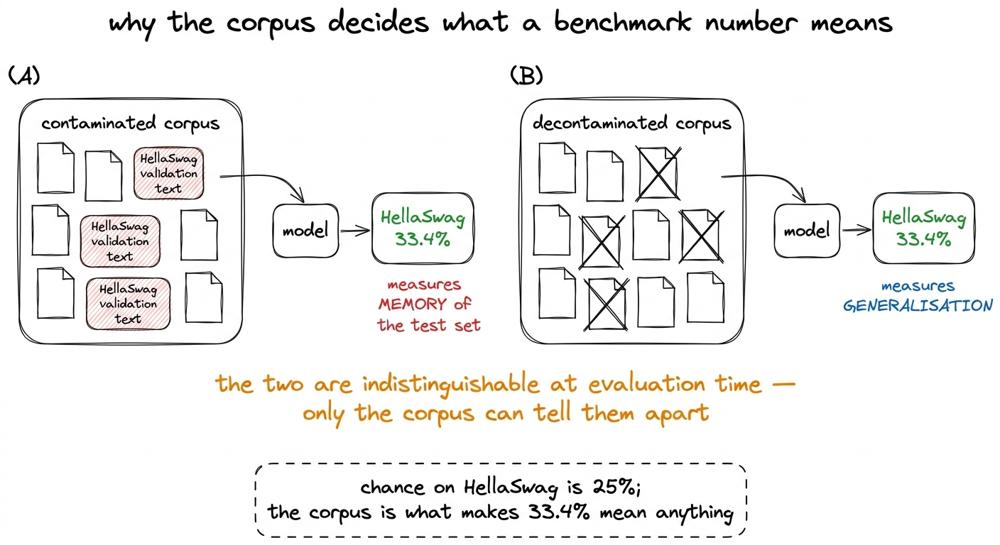
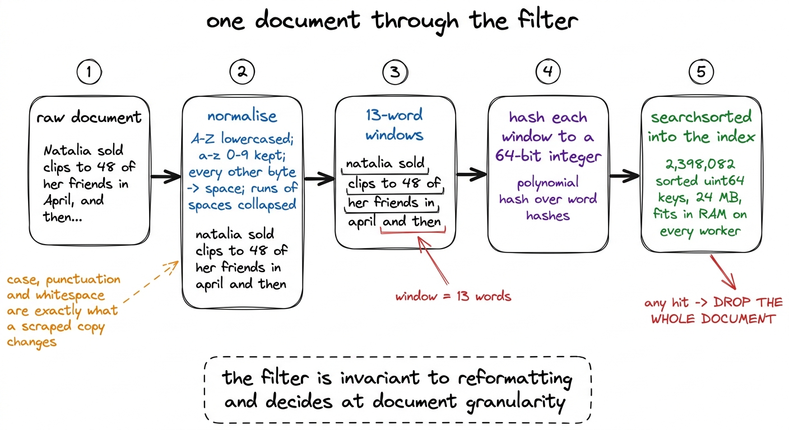
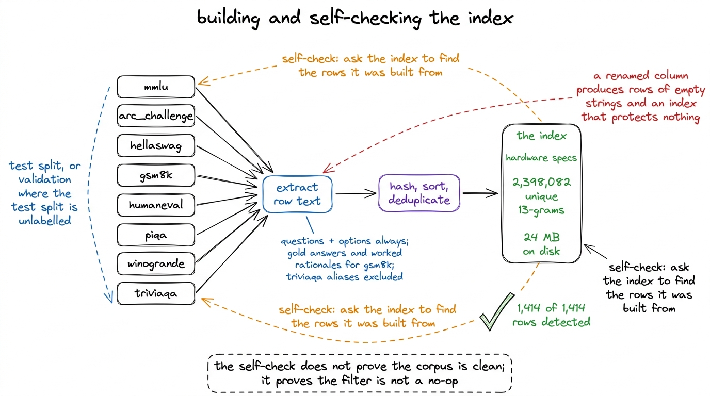
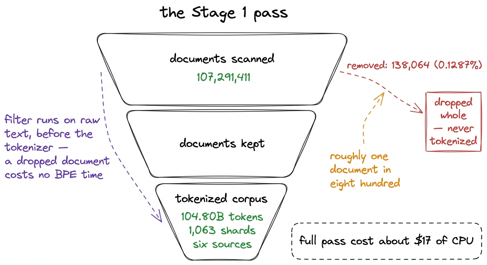
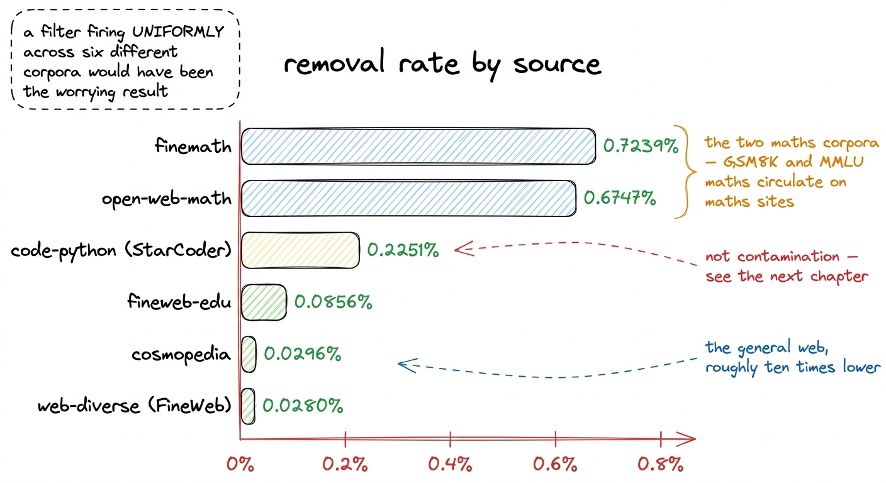
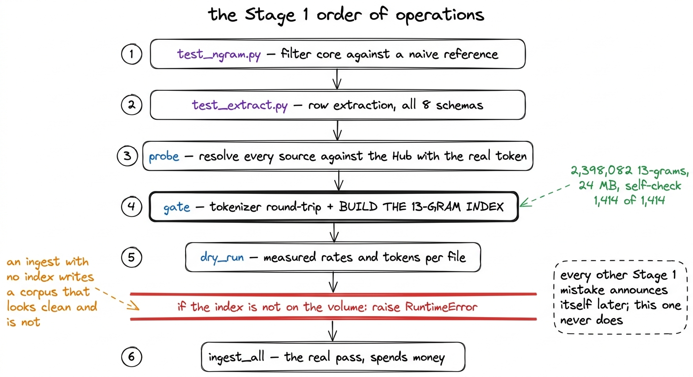

# 10\. 去污染：让评测数字有据可依的报告

[← 上一章](../09-assembling-the-corpus/README.md) · [返回目录](../../README.md) · [下一章 →](../11-when-a-filter-fires-on-nothing/README.md)

第 02 部分 · 数据 · 9 分钟 · 6 幅图 · 13-gram

> 从八个评测集建立 2,398,082 个唯一 13-gram 的索引，扫描 107,291,411 份文档，删除 138,064 份；数学语料的删除比例约为网页的十倍，为何这反而让过滤结果可信。

我们的模型训练完成于  **33.4%**  在 HellaSwag 上，相对于偶然水平的 25%。这个数值只有在 HellaSwag 验证集未出现在模型读取的 104.80B 个 token 中时，才构成某种测量。如果这些问答及其结尾的任何有意义比例都存在于爬取数据中，那么这个数值实际上衡量的是模型之前已经见过的文本的回忆程度，而这种回忆程度在事后任何精心设计的评估方法都无法检测到。评估框架无法区分一个模型学会了完成句子，还是仅仅记住了这些特定的句子。只有语料库能够做到这一点。

因此，在写入单个token之前，语料库就已经被过滤了。  **107,291,411 份文档被扫描，138,064 份被移除，移除率为 0.1287%。**  本章介绍产生这两个数值的机制，以及报告中一个结果，让我们相信过滤器是按我们要求执行的，而不是随机触发。

[](../../figures/decontamination-1.png)

图 10-1　相同分数，来自两套语料。训练后的任何操作都无法区分这两种情形，因此必须在训练前完成区分。

## 决定过滤器行为的四项选择

在任何代码之前，必须做出四个选择，每个选择都有一个可辩护的替代方案，我们因明确原因而拒绝了这些替代方案。

 **单位是文档，匹配的文档会被整体丢弃。**  另一种选择是切除匹配的片段并保留页面其余部分。这很诱人，因为它保留了token，但有一个简单的原因是错误的：一个包含GSM8K问题十三个连续单词的网页，极不可能只包含该问题的这十三个单词。它是一个关于GSM8K的网页，或者是一个基准数据集的爬取副本，或者是一个逐步讲解其多个问题的教程。截断操作移除了污染的证据，却保留了污染。完整地丢弃文档会让我们失去一个页面，并彻底移除问题本身。

 **该过滤器在分词之前作用于原始文本。**  n-grams 这里是基于词而非 BPE 片段定义的，因此在分词之后运行过滤器意味着要么将每份文档重新解码为文本，要么比较子词 ID 序列。后者比听起来更糟糕：同一个句子由于周围空格和大写形式的不同而会产生不同的分词结果，因此在 BPE 层级上进行过滤会敏感于被爬取的基准数据集所经历的恰好那些格式化操作。在分词之前运行也意味着被丢弃的文档无需进行分词，这在 CPU 限制的场景下尤为重要，因为整个流程的预算大约为  **17美元的CPU** .

 **n-grams 是在归一化的词上定义的。**  归一化是一个字节映射表： `A-Z` lowercased, `a-z` 和 `0-9` 保留，其余每个字节，包括所有非ASCII字符，均被替换为空格，连续的空格被合并为一个。[^1] 一个经过内容管理系统、PDF提取器和博客主题处理的基准数据副本，在大小写、标点符号和空白字符方面与原始数据存在差异，几乎在其他方面都无差别。去除这三项的差异，才是使过滤器能够匹配副本而非仅匹配原始数据的原因。

 **窗口是十三个词。**  足够长，以至于普通的英语不会偶然地产生一个窗口，又足够短，以至于一个重新格式化的提问仍然包含多个匹配的窗口。这也是过滤器设置覆盖限制而非完全覆盖的原因：一个少于十三个词的基准行根本不会产生任何n-gram，因此无法进行过滤。下一章将报告每个八组的覆盖度数值。

[](../../figures/decontamination-2.png)

图 10-2　单份文档经过的路径。通过对排序后的哈希数组进行二分查找来判断是否匹配，因此过滤只需扫描文本一次，除缓冲区外无需为每份文档额外分配内存。

## 索引

评测套件包含八项基准：MMLU、ARC-Challenge、HellaSwag、GSM8K、HumanEval、PIQA、WinoGrande 和 TriviaQA。每项基准都对实际报告分数所使用的划分建立索引。如果真正的测试集没有标签，业界实际在验证集上评分，就必须从训练语料中去除与该验证集匹配的内容。[^2]

“基准文本”是什么由判断决定，它决定了过滤器的严格程度。问题和上下文始终被包含在内，因为这是被污染页面所包含的部分。答案选项也始终被包含，因为HellaSwag和PIQA本质上只是它们的选项，如果页面不引用这些结尾，那么该页面本应幸存。对于GSM8K，会包含正确答案和详细推理，因为详细解法是泄露点。TriviaQA的答案别名被排除。[^3]

提取并哈希后，八个集合产生  **2,398,082 个唯一的 13-gram** ，以排序形式存储 `uint64` 包含每个哈希值基准ID的数组。在磁盘上是  **24 MB** ，足够小，可以加载到每个摄入工作线程中，并在整个遍历过程中保留在内存中。这就是为什么成员资格是一个 `searchsorted` 与其使用布洛姆过滤器：在这个规模下，完全没有理由接受任何误报预算。

## 确认索引非空的检查

我们最担忧的失败模式，并非一个漏检受污染文档的过滤器。而是一个静默地索引为空的过滤器。

评测仓库可能会重命名列。如果`hellaswag`将`endings`改名，提取器仍会运行，仍为每个样本生成一行，但每行都是空字符串。索引照常构建，报告照常打印，数据摄取照常通过。所有下游产物看起来都与过滤器正常工作时一样，语料却没有得到保护。

有两个检查来应对这个问题。第一个是列检查，它将注册表期望的列与实际加载的分割数据集拥有的列进行比较，并在发现任何差异时触发告警。第二个检查能够捕捉到更微妙的情况：在索引构建完成后，会要求索引去检测它原本构建所依据的那些行。

```python
# The index must detect the very rows it was built from. This has caught a
# column rename before, where extraction produced rows of empty strings.
checked = failed = 0
for name, texts in per_benchmark.items():
    for t in texts[:200]:
        if text_ngram_hashes(t).size == 0:
            continue
        checked += 1
        hit, which = idx.check(t)
        if not hit or name not in which:
            failed += 1
```

行太短无法生成 13-gram 的情况会被跳过而不是视为失败，因为一条没有 n-gram 的行无法被 n-gram 索引检测到，将这种情况视为失败只会训练我们忽略该检查。其余所有情况必须返回与其自身基准相关的命中。  **1,414 行已检查，1,414 个检测到，未遗漏。** 

这项结果并不能证明语料本身怎样；它证明提取、哈希、排序、去重和查找能够组合成一条确实识别评测文本的流程，而这是语料统计有意义的前提。即使自检看似轻易就能通过，也值得编写：哪天它失败，就可能挽救整套评测，避免无效结果被当真。

[](../../figures/decontamination-3.png)

图 10-3　索引构建流程。右侧循环用于防范一种失败：即使失败，所有产物看起来仍然正确。

## 扫描过程

在体积的索引上，完整的摄入过程跨越了六个来源。每份文档都被标准化、哈希处理、查找，并且要么被丢弃，要么交由分词器处理。

|  |  |
| --- | --- |
| 扫描文档数 | **107,291,411** |
| 删除文档数 | **138,064** |
| 删除比例 | **0.1287%** |
| 过滤后的语料库 | 104.80B 个 token 在 1,063 个分片中 |
| 全遍历的成本 | ~\$17 个 CPU |

大约每八百个文档中有一个的比例，是一种容易引发两种相反反对意见的数字。一种是认为这个比例太小而无足轻重，另一种是认为这个比例太小而不可能真实存在。无论哪种观点，一旦与过滤器所关注的内容接触，都会不成立。基准测试数据集每个仅有几千行；八个这样的数据集加起来，相对于一亿个文档而言，数量仍然非常少，因此如果一个过滤器仅仅因为基准数据集的重叠就删除了数个百分点的网络爬取内容，那它报告的应是一个损坏的哈希函数，而不是一个被污染的数据集。

使该速率可信的并非其数值大小，而是它在不同数据源上的分布形态。

[](../../figures/decontamination-4.png)

图 10-4　第 1 阶段的完整数据处理流程。过滤器位于分词器之前，而非与它并列。

## 按数据来源统计的表格，以及它支持的论点

| 来源 | 扫描文档数 | 已删除 | 比例 |
| --- | --- | --- | --- |
| fineweb-edu | 62,245,000 | 53,266 | 0.0856% |
| web-diverse (FineWeb) | 20,034,526 | 5,604 | 0.0280% |
| code-python (StarCoder) | 12,866,649 | 28,968 | 0.2251% |
| finemath | 4,605,913 | 33,342 | **0.7239%** |
| open-web-math | 2,271,277 | 15,325 | **0.6747%** |
| cosmopedia | 5,268,046 | 1,559 | 0.0296% |

两个数学语料库是值得阅读的成果。  **finemath 删除了 0.7239% 份文档，open-web-math 删除了 0.6747%，相比之下，fineweb-edu 删除了 0.0856%。**  那大约是网络脊椎速率的八点五倍，是纯 FineWeb 速率的二十多倍。

这正是评测套件所预示的分布。八个已索引的基准中，有两个涉及数学：整个 GSM8K，以及 MMLU 的数学科目。[^4]小学数学应用题和数学选择题广泛流传于数学网站，被论坛引用、被解题博客转载、被整理成练习题，再次进入网页抓取数据。专门收集数学内容的语料，理应更集中地包含数学评测题；用于发现这些题目的过滤器，也理应在那里触发得最频繁。

反向陈述才是具有分量的那个。  **如果去除率在所有六个来源上都是恒定的，那么该过滤器就会可疑。**  均匀的速率意味着滤波器是响应六个语料库共有的普通英语，而不是响应八个基准测试的具体文本。污染并不是均匀分布的，因为基准测试本身并不是均匀分布的；一个得出均匀污染测量结果的指标，实际上是在测量其自身的哈希碰撞。我们事先并未确定哪些源的速率可以被视为有说服力，这削弱了这一证据的强度。我们可以确定的是，评估套件在通过测试前所暗示的排序——数学语料库最高，通用网页最低——正是实际返回的排序。

[](../../figures/decontamination-5.png)

图 10-5　各来源的删除比例。比例之间的差异才是证据；如果条形图完全平坦，就意味着过滤器匹配到了普通英文。

第三高的是 code-python，为 0.2251%，且不属于污染。这是标准化对标点密集文本所产生的结果，下一章将对此进行讨论，该章讲述一个严格触发的过滤器却未发现任何内容。

## 为何数据摄取程序拒绝运行

有一个处理工作线程中的语句，其重要性远超其长度所暗示的。

```python
if not Path(INDEX_PATH).exists():
    raise RuntimeError("no decontamination index — run build_index first")
idx = NgramIndex.load(INDEX_PATH)
```

摄入将不会启动，除非在卷上存在索引。这不是警告，不是默认使用空索引，也不是一个允许继续的标志。

这种推理是关于哪些故障是可以恢复的。在阶段 1 中，几乎每一个错误都会立即显现出来：一个错误的 parquet 前缀会引入错误的数据集，导致 token 计数变得不可能；一个损坏的分片名称会使加载器抛出异常；一个分词器的回归测试会失败于往返验证。这些错误都会耗费时间，并且会被发现。而一个没有索引的导入则完全不同。它生成的分片文件恰好符合正确的格式，数量也完全正确，具有合理的 token 直方图，并且去污染报告显示移除的文档数量为零，如果没有人去问为什么这个数字是零，那么这在外观上就与一个干净的语料库无法区分。它下游的每一个产物都看起来是正确的。模型可以正常训练。基准测试结果会生成出来，但它们并不是真正的测量值。

 **它是唯一一个在阶段 1 出现的故障模式，无法在事后被检测到。**  它唯一能被捕捉到的地方是在传球开始之前，而这一点正是检查所在的位置。

[](../../figures/decontamination-6.png)

图 10-6　整个流水线，以及其中一个必须直接停止、而非仅发出警告的检查关卡。

## 报告的用途

阶段 1 的交付物不仅是一个分词后的语料库，而是包含一份可被读者质疑的去污染报告的语料库。

报告包含各基准的匹配次数、各来源的删除比例，以及被删除文档的样本，使“审查过报告”成为实际行动，而非勾选一个框。样本最能体现这项投入的价值：正是阅读过滤器实际删除的内容，我们才发现六个来源中的一个因与污染无关的原因而触发；只看删除比例，完全无法发现这一点。

那就是下一章。  **HumanEval 在每个索引的 n-gram 上匹配了 88.78 次，而 HellaSwag 匹配了 0.02 次** ，我们读到的每一个被移除的文档都是普通的 Python。

---

[← 上一章](../09-assembling-the-corpus/README.md) · [返回目录](../../README.md) · [下一章 →](../11-when-a-filter-fires-on-nothing/README.md)

[^1]: 因为每个大于或等于 128 的字节都变为一个空格，CJK 文本完全不贡献 n-gram。这是一个真实的覆盖空白，而在这里是可接受的，因为评估套件中的八个基准都是英文或 Python。

[^2]: 这适用于 HellaSwag、PIQA 和 WinoGrande。对这些数据集的未标记测试集进行索引会生成一份看似完整的报告，但实际并未提供任何保护，因为大家引用的数值均来自验证集。

[^3]: 别名是单个实体，比如城市名称。一个由十三个词组成的窗口要么完全无法形成，要么匹配的只是与基准无关的普通文本，因此对它们进行索引既得不到保护，又会消耗真实文档。

[^4]: GSM8K 并不是 r1 评估所使用的基准测试之一；它是一个训练后的基准测试，并且是故意没有运行的。不过它仍然被索引，因为语料库在整个规模档位中是共享的，而一个语料库一旦被去污染，就适用于任何人未来可能在从该语料库训练的任何模型上运行的评估。
