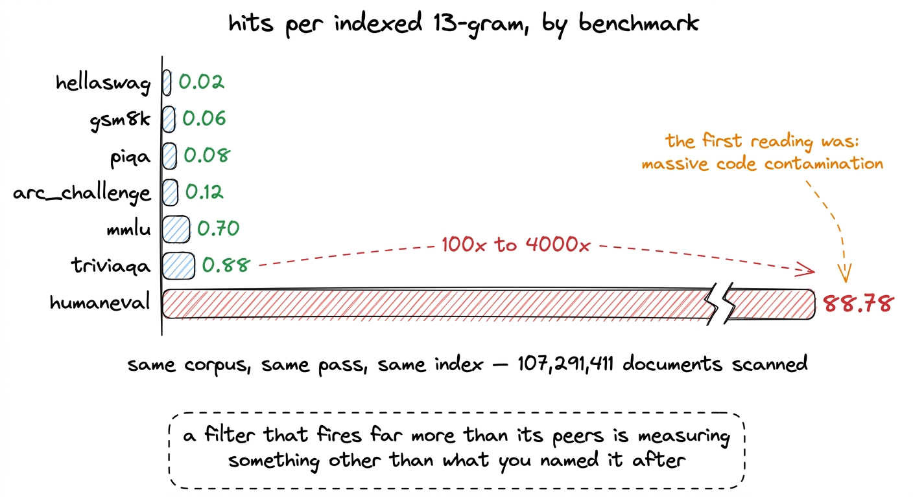
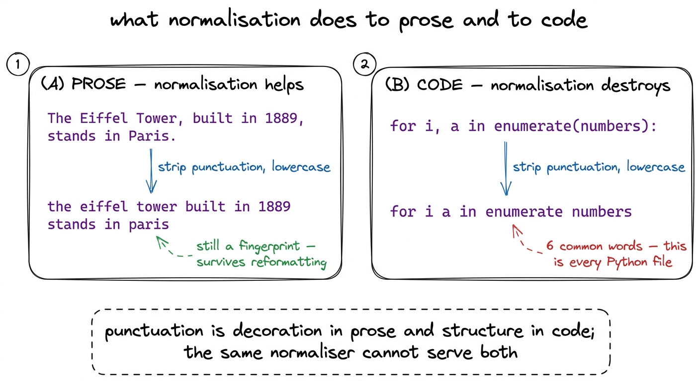
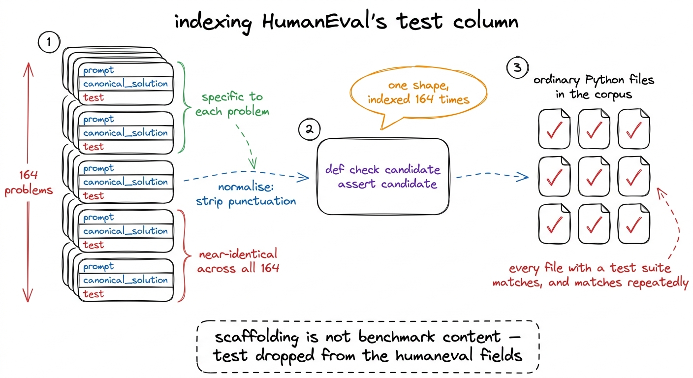
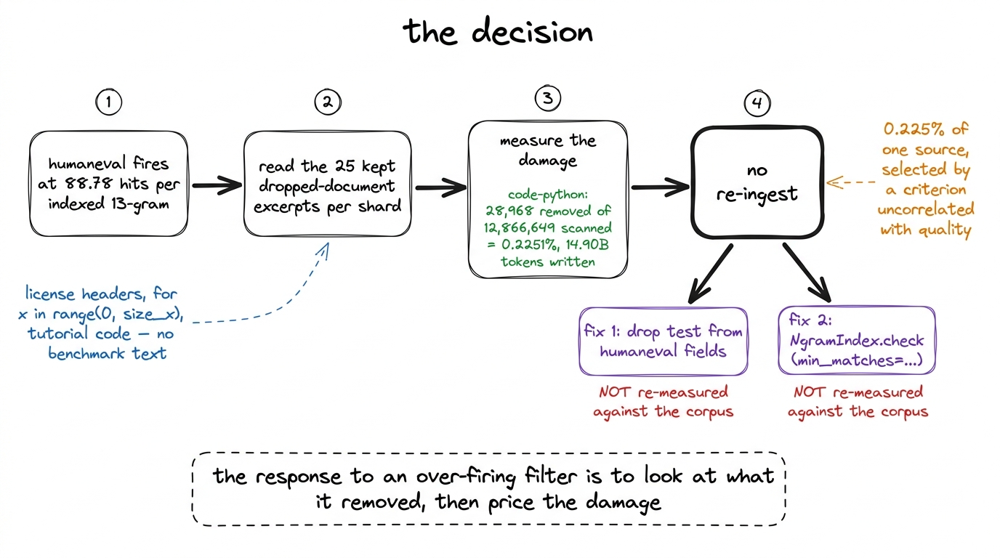
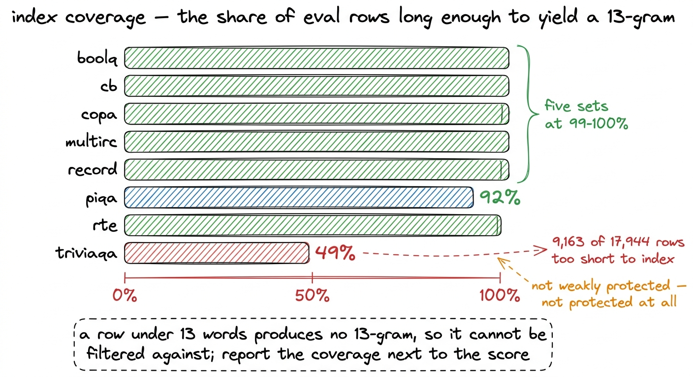

# 11\. 当过滤器匹配到的只是噪声

[← 上一章](../10-decontamination/README.md) · [返回目录](../../README.md) · [下一章 →](../12-the-tokenizer/README.md)

第 02 部分 · 数据 · 11 分钟 · 5 幅图 · 88.78

> 每个已索引 n-gram 在 HumanEval 上匹配 88.78 次，在 HellaSwag 上只有 0.02 次，而被删除的文档都是普通 Python 代码。这测到了什么，为何并非泄漏，以及方法的覆盖局限。

去污染阶段生成了一份报告，该报告产生了一行不符合要求的数据。在整个语料库中，共扫描了107,291,411份文档，其中138,064份因包含一个13词窗口而被移除，该窗口也出现在八个基准测试集中的一个里。各来源的移除率呈现出前一章所描述的可信形态：数学语料库的移除量大约是网络语料库的十倍，且没有任何来源的移除是均匀的。

每项基准的列就是问题所在。原始匹配数量在不同基准之间不可比，因为一个索引覆盖范围更大的基准有更多机会匹配。因此，将匹配数量除以每个数据集对索引贡献的唯一 13 -gram 数量，从而得到的是比率而非总量。[^1]

| 评测基准 | 每个已索引 13-gram 的匹配次数 |
| --- | --- |
| HellaSwag | 0.02 |
| gsm8k | 0.06 |
| PIQA | 0.08 |
| ARC-Challenge | 0.12 |
| MMLU | 0.70 |
| TriviaQA | 0.88 |
| **HumanEval** | **88.78** |

六个在匹配任何内容的七个数据集中位于0.02和0.88之间。HumanEval位于  **88.78** ，其速率大约在同一系列中每个其他集合的百至四千倍之间，是在同一遍运行中针对同一语料库测得的。

[](../../figures/when-a-filter-fires-on-nothing-1.png)

图 11-1　八个评测集上，每个已索引 n-gram 的匹配率。WinoGrande 没有出现，因为它完全没有匹配，这一点将在本章末尾讨论。

## 最初的解读，以及它为何看似合理

第一次阅读是，Python语料库严重污染了HumanEval。需要完整陈述这一阅读结果，因为它既合理又错误，而这两个事实之间的差距正是本章要探讨的内容。

HumanEval 是 164 个手写编程问题，每个问题都配有文档字符串提示和标准解法。它是现存最被复制的评估数据集之一。其问题出现在博客文章中，出现在教程仓库里，出现在每个代码模型的 README 文件中，也出现在引用它的一半论文的训练数据审计中。从公共仓库中抓取 HumanEval 解法的 Python 数据集，并不令人惊讶。这几乎接近默认预期。

该比率也指向了该故事的正确方向。污染应集中在基准测试所涉及的主题集中区域，而实际情况确实如此：两个数学语料库在0.7239%和0.6747%处相对于一般网络文本的0.0280%出现了下降。一个针对代码语料库的代码基准测试也呈现出相同模式，即单一来源的覆盖。

不符合的是数量级。一个比下一个最高集合高出两个数量级的速率，并不是同一现象的更强版本。如此严重的污染意味着Python语料库中大部分内容是由基准文本构成的，而对该来源的剔除率是0.2251%。这两个说法不可能同时为真。要么几乎每一个匹配文档都被重复计算了多次，要么这些匹配并不符合“匹配”一词的含义。

## 解读实际输出

摄入工作程序会保留每个分片中最先被丢弃的 25 个文档，附带匹配的基准、匹配的 13 元组数量以及一个 400 个字符的摘录。该样本恰好适用于这种情况，且它在读取它所需的时间内就解决了问题。

```python
if len(st["dropped_examples"]) < 25:
    st["dropped_examples"].append({
        "benchmarks": [idx.names[int(i)] for i in ids],
        "ngram_hits": int(hits.size),
        "excerpt": text[:400],
    })
```

归因于 HumanEval 的文档是许可证头和循环样板代码，形式为 `for x in range(0, size_x)`，以及教程代码。它们是普通的 Python 文件。其中不包含任何 HumanEval 问题、HumanEval 文档字符串或 HumanEval 解决方案。它们包含的 Python 代码看起来与其他 Python 代码并无二致。

那个观察结果也排除了哈希碰撞的可能性，这曾是另一个候选解释。碰撞会产生一个与基准数据没有明显关联的文档。这些文档却有明显的关联：它们与索引文本共享真实的、可读的、通用的代码。过滤器完全按照规格工作。问题出在规格上。

## 原因一：规范化器是为自然语言文本设计的

上一章描述了每个文档和每个基准测试行在任何哈希操作发生之前都经过的字节映射表： `A-Z` lowercased, `a-z` 和 `0-9` 每个其他字节被替换为空格。

```python
_XLAT = np.full(256, 32, dtype=np.uint8)          # everything -> space
for _c in range(ord("a"), ord("z") + 1):
    _XLAT[_c] = _c
for _c in range(ord("A"), ord("Z") + 1):
    _XLAT[_c] = _c + 32                            # A-Z lowercased
for _c in range(ord("0"), ord("9") + 1):
    _XLAT[_c] = _c
```

对于文本而言，正确的选择是，正是这一点使得过滤器匹配副本而非仅匹配原始内容。一个经过内容管理系统、PDF提取器和博客主题处理的基准问题，与原始内容相比，在大小写、标点符号和空白字符方面存在差异，而移除这三项正是让匹配得以存活的原因。

对于代码来说，它会去除大部分信号。Python 中的标点符号不是装饰。逗号、冒号、括号和方括号承载着结构，而剩余的标识符则来自一个小型共享词汇表。 `for`, `in`, `range`, `def`, `self`, `return`, `len`, `i`, `x`, `n`. 考虑一条语句：

```
for i, a in enumerate(numbers):      ->    for i a in enumerate numbers
```

原本结构明确的一行代码，处理后只剩六个词。把几行这样的结果连起来，得到的 13 词窗口不再是某个特定文件的指纹，而更像 Python 常见写法的指纹。

[](../../figures/when-a-filter-fires-on-nothing-2.png)

图 11-2　同一个规范化步骤，分别用于自然语言句子和一行 Python 代码。它保留了句子，却破坏了代码行的结构。

## 原因二：我们把测试框架也纳入了索引

第二个原因是基准测试注册表中的选择，而不是哈希操作。

决定基准行中的哪些列进入索引，是一种关于被污染的文档实际会包含什么内容的判断。对于 HellaSwag 和 PIQA，答案选项就是基准数据，因此必须被索引。对于 GSM8K，解题过程是泄露内容。对于 TriviaQA，答案别名是像城市名称这样的单一实体，因此仅对问题进行索引。对于 HumanEval，原始注册条目索引了提示、标准解法和 `test` 列。

该 `test` 列不是其他列所指的基准内容。它是用来检查候选解决方案的框架，而在所有 164 个问题中，它几乎都是相同的几行骨架代码：一个 `check` 函数，一个候选参数，一系列断言。对其进行索引会将该结构在索引 164 次中重复，并且随后的归一化操作会移除那些区分其各个实例的标点符号。

结果是一组索引条目，经过归一化后，成为通用断言模板。任何语料库中包含类似结构测试套件的 Python 文件都会匹配这些条目，并反复匹配它们，因为该模式在单个文件中反复出现。

[](../../figures/when-a-filter-fires-on-nothing-3.png)

图 11-3　第二个原因。在评测集中几乎保持不变的一列内容，去掉标点后变成了会匹配普通代码的索引项。

## 两个原因相互放大

单独一个原因就足以提升 HumanEval 的分数。两者共同作用时会相乘，而这种相乘效应才产生类似 88.78 的数值，而不是两到三个数量级的值。

规范化降低了索引中每个代码 n-gram 的特异性，`test`列又用评测中最通用的代码反复填充索引。匹配率计算的是命中的 n-gram 数，而非文档数，所以一个含有几个测试函数的普通 Python 文件就能贡献许多命中；HumanEval 只有 164 道题，分母却很小。[^2]这些因素都在推高同一个比率。

注册表条目现在在字段旁边记录推理内容，以便未来的读者无需重新构建它：

```python
Benchmark(
    "humaneval",
    [Candidate("openai/openai_humaneval", None, "test"),
     Candidate("openai_humaneval", None, "test")],
    # `test` DROPPED after measurement. It is near-identical scaffolding
    # across all 164 problems (`def check(candidate): assert candidate(...)`),
    # so once normalisation strips punctuation its 13-grams match ordinary
    # Python everywhere.
    fields=["prompt", "canonical_solution"],
    note="test scaffolding excluded — it generated boilerplate false positives",
)
```

## 造成的代价，以及我们的处理方式

决定响应的问题不是过滤器表现有多差。而是失去了多少语料。

从12,866,649份扫描文档中移除了28,968份Python源代码，速率为  **0.2251%** ，共写出了14.90B个token。如果每一个这样的删除都是由HumanEval引起的误报，那么造成的损害仅占代码库总量的百分之零点零二。不存在任何合理的机制，能够说明失去0.225%个来源——这些来源是根据与质量无关的标准选定的——会改变模型的学习结果。重新引入这些来源将耗费真实的计算资源和实际时间，却无法在最终端测得任何可衡量的收益。[^3]

因此没有重新导入。为任何未来的运行，在代码中进行了两个更改。第一个是上面的字段列表，与 `test` 被丢弃了。第二个是一个阈值在 `NgramIndex.check`，以便一个语料库可以在丢弃一个文档之前要求匹配多个n-gram而不是一个：

```python
def check(self, text: str, n: int = NGRAM_N,
          min_matches: int = 1) -> tuple[bool, dict[str, int]]:
    """(contaminated, {benchmark: n_matching_ngrams}).

    `min_matches` guards against incidental collisions. One shared 13-gram is
    decisive for prose but not for code: normalisation strips punctuation, so
    de-punctuated Python idiom collides across unrelated files. Raising this
    for code corpora trades a little recall for a lot of precision.
    """
```

默认值保持为1，因此文本源的行为如前，该变更按语料库选择性启用。  **这两个修复都没有再针对语料库进行测量。**  104.80B个token语料库，r1从中提取了5,000,003,584个token用于训练，是训练运行期间管道所处状态生成的，与 `test` 列索引和一个匹配的n-gram就足以删除一个文档。本章内容是诊断和代码变更，而非第二次测量，二者不应被视作同一事物。

[](../../figures/when-a-filter-fires-on-nothing-4.png)

图 11-4　从异常数字走到最终决策的过程。真正重要的测量并非匹配率，而是损失了多少比例的语料。

## 与代码无关的覆盖局限

同一份报告还包含第二个范围限制，它应与本书中每一个基准数值并列，而不是置于书末的脚注中。

一个13元过滤器只能移除它能够索引的文本。一条长度小于13个词的基准行不会产生任何13元，因此它永远不会进入索引，且语料库中的任何文档都无法与之匹配。该行没有弱保护。它没有保护。

提取器正是出于这个原因分别统计这些行，而报告会按基准发出每项的统计数量：

```python
coverage[name] = {
    "rows": rows,
    "rows_indexed": rows - short,
    "rows_too_short": short,
    "coverage": (rows - short) / rows if rows else 0.0,
    "ngrams": s.get("ngrams", 0),
}
```

 **TriviaQA 是 49% 覆盖的。**  在其 17,944 行中，9,163 行太短，无法产生一个 13-gram，这直接源于集合的形状：一个 TriviaQA 问题通常只有一行，且仅对问题进行索引，因为答案别名是单个实体。PIQA 的下一项是  **92%** 八组中的五组位于 99 到 100%。

[](../../figures/when-a-filter-fires-on-nothing-5.png)

图 11-5　各评测基准的覆盖率。TriviaQA 中未覆盖的那一半，是方法本身的局限，而非本次处理失败。

这不是能够通过调参修复的缺陷，而是 13-gram 方法本身的特性。减小 n 能覆盖更多条目，但也会匹配普通英文，相当于用一项明确说明的局限，换来大量未被说明的误报——恰好就是本章刚刚诊断的那类问题。可行的做法是在准确率旁边同时公布覆盖率，让读者看清哪些结论获得了完整支持，哪些只获得了部分支持。

## WinoGrande 的零匹配

一组记录完全没有匹配，报告也对此进行了警告，因为一个在107M份文档中均无命中记录的基准测试，通常意味着提取器出现故障，而非语料库本身干净。该机制将其视为警告而非失败：

```python
if decon["benchmarks_with_zero_hits"]:
    warns.append(f"no n-gram hits for {decon['benchmarks_with_zero_hits']} — "
                 "check those extractors before trusting their scores")
```

警告在 WinoGrande 上触发，零值可能是真实的。WinoGrande 的句子很短，且两个选项仅差一个词，因此索引文本既小又高度具体。索引自检提供了一些保证，即提取工作正常，因为每个与构建它所用的索引进行测试的基准行都被检测到，1,414 of 1,414。[^4] 检查无法告诉我们更长的 WinoGrande 行是否能够匹配某个内容，因为最初长行就非常少。

我们将其报告为一个被提出、审查并保留的警告，而不是作为一个结果。

## 这一经验可以推广到哪里

本集的三点内容适用于任何过滤器，适用于任何流程。

 **一个运行远超其同侪的组件，其测量的并非你所命名的内容。**  过滤器上的名称是“HumanEval污染”。它测量的是“类似于去标点的Python”。这两个量在基准行上一致，在其他地方则不同，且这种差异只有在将该速率与同一训练运行中其他子集的速率进行比较时才会显现。将HumanEval的匹配数量与其自身预期进行比较毫无意义，因为没有人对其有预期。将其与七个其他在相同条件下测量的集合进行比较，仅需一列算术运算。

 **查看在决定数字含义之前被移除的内容。**  文档丢弃样本的维护成本为零，并解决了任何关于哈希函数的进一步推理都无法解决的问题。任何丢弃数据的过滤器都应保留其丢弃内容的可读样本，并附上说明，因为该样本是区分一个有效过滤器与一个错误地工作过滤器的唯一证据。

高命中率本身不能证明过滤有效。很容易把 88.78 理解成成功，并写下“在 Python 语料中发现了大量污染”。那句话本来可能出现在本书中，但它会是错的；由于对应基准从未实际运行，后续也不会有结果反驳它。真正重要的不是这个醒目的数字，而是受影响来源中删除文档数与扫描文档数之比：0.225%。它说明正确做法是修复代码、注明修复尚未验证，然后继续工作。

---

[← 上一章](../10-decontamination/README.md) · [返回目录](../../README.md) · [下一章 →](../12-the-tokenizer/README.md)

[^1]: 索引持有  **2,398,082**  在所有八个数据集中的唯一 13-gram 数量为 24 MB 个，存储在磁盘上。MMLU 贡献的远多于 HumanEval，因此对这两者的未归一化比较，更多反映的是划分大小，而非污染程度。

[^2]: 工人累积 `hits_by_benchmark` 通过增加匹配窗口的数量，而不是为每个被丢弃的文档增加一个。这是诊断中正确的选择，因为它能够区分一个仅共享一个窗口的文档与一个共享五十个窗口的文档，也正是因此，一个超过 1.0 的比率在数学上是可能的。

[^3]: 向另一方向出错的成本在这里也被限制了。HumanEval 和 GSM8K 是训练后的基准测试，故意没有在 r1 上运行，r1 是一个仅进行下一个标记预测的基模型。为了 HumanEval 的利益而移除过多的 Python 代码，不可能提升 HumanEval 的分数，因为从未产生过 HumanEval 的分数。

[^4]: 自检存在是因为重命名列是去污染变为无操作的静默方式。提取器仍然运行，仍然生成行，并静默地对空字符串进行索引。在构建索引之后，再要求它查找自身源行，几秒钟内就能发现这个问题。
