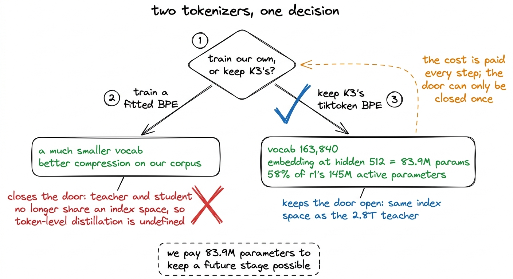
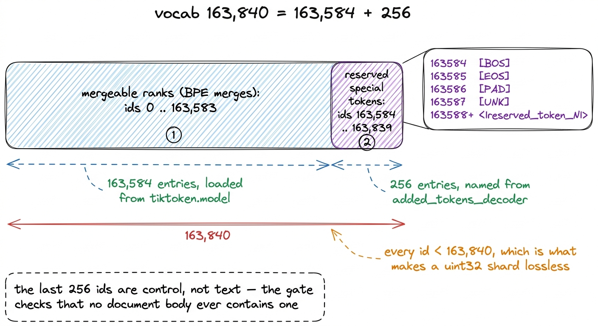
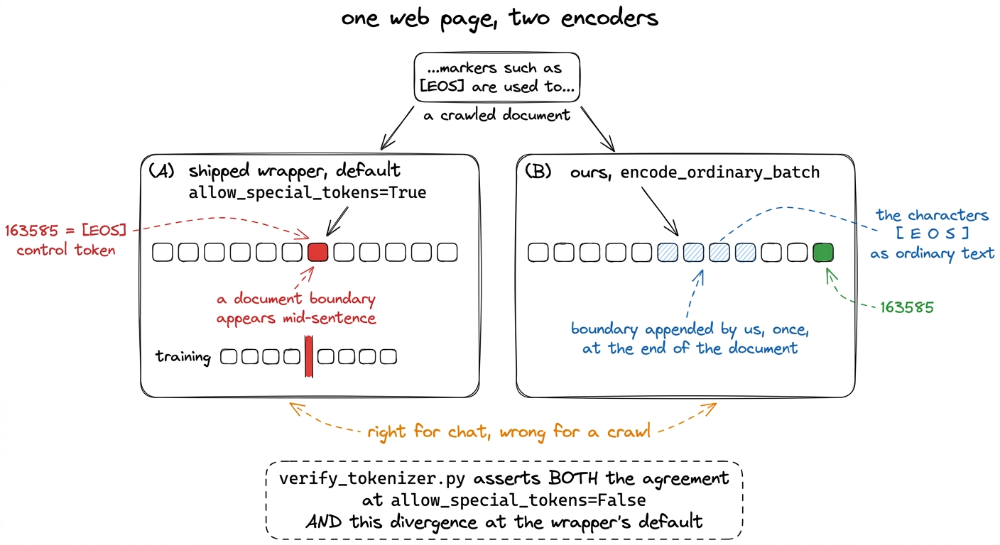
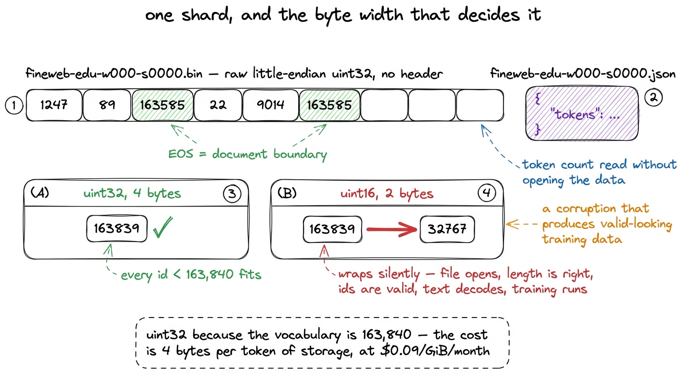
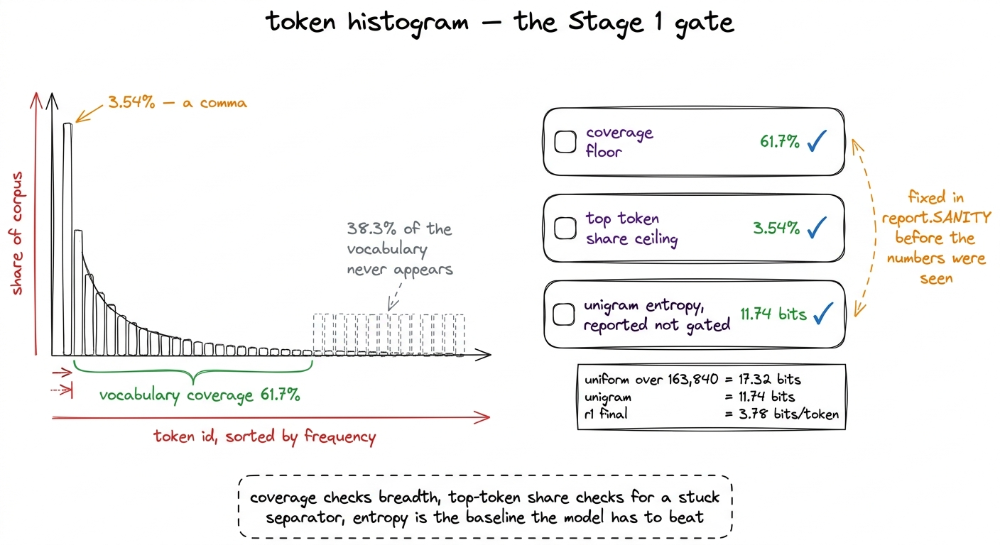

# 12\. 我们没有重新训练的分词器

[← 上一章](../11-when-a-filter-fires-on-nothing/README.md) · [返回目录](../../README.md) · [下一章 →](../13-the-mix-and-the-manifest-bug/README.md)

第 02 部分 · 数据 · 10 分钟 · 5 幅图 · 163,840

> 保留 K3 原有的 tiktoken BPE，逐字节验证编码再解码的往返一致性；识别会在网页中间插入文档边界的字面 \[EOS\] 陷阱，并解释为何分片使用 uint32。

在这一规模的预训练项目中，大多数项目都会自行构建分词器。这样做成本低廉，仅需半天时间，且针对语料库定制的词汇表能生成更小的嵌入表，并在真正重要的文本上实现更好的压缩。对于一个 1.02B 参数的模型，一个更小的词汇表本应是显而易及的选择。

我们使用了 K3's，完全不变，其中的所有 163,840 项。本章讲述的是决策所保持的那扇门，它在参数上所付出的成本，以及位于你相信的分词器与实际上错误的语料库之间的两个检查点。

## 原因在于一个尚未发生的阶段

基于大模型教师到小模型学生的推理蒸馏操作在token分布上进行。教师在每个位置上对其词汇表产生一个概率分布，学生被训练以匹配该分布，且教师和学生的词汇表必须是同一对象，否则该损失无法定义。如果我们使用更小的词汇表，则教师的索引47,203将无法与学生表中的任何项对应，剩下的选择是基于文本而非分布进行蒸馏，这将丢弃大部分教师信号。

本项目没有进行蒸馏。r1 是只做下一 token 预测的基础模型，我们在所有相关讨论中都明确说明这一点。尽管如此，仍提前作出了保留词表的决定，因为词表不能留到以后再换：更换它会让所有检查点及整个 104.80B token 的已分词语料失效。

[](../../figures/the-tokenizer-1.png)

图 12-1　这项决策，以及每条分支的成本。一条分支可以逆转，另一条则不能。

## 完整账单

一个权重共享的嵌入需要成本 $\mathrm{vocab}\times\mathrm{hidden}$ 在输入查找和输出投影中，每个多余的 token 上的参数和训练运行，于 r1 的隐藏尺寸为 512 时，即 $163{,}840\times512\approx83.9\,\mathrm{M}$ 参数与总激活计数相比  **145M** 词汇表是  **58% 个东西 r1 每个 token 计算** .

缩小模型的章节详细说明了这对规模阶梯设计的影响。这里值得重申的是：相同统计器用于 K3 发布的配置时，嵌入参数只占 K3 激活参数的 1.1%。同一个分词器，在它原本服务的模型上开销几乎可忽略，在我们的模型上却占了大头。

那并不是对这一决定的反对；它是这一决定的代价，也正是因此，这个规模阶梯的每一档位都是基于非嵌入激活参数来定义的（ **61M**  对于 r1) 而不是在标题数字上。

## 重建编码器，而非调用封装接口

阶段 1 的分词量级约为一百亿个token。Moonshot发布了一款 `PreTrainedTokenizer` 子类 `tokenization_kimi.TikTokenTokenizer`，每文档支付 Python 开销，而 `tiktoken.Encoding` 在其下方它会释放GIL，并在Rust线程之间进行批处理。所以 `data/k3_tokenizer.py` 重建相同的 `Encoding` 来自相同的文件：

```python
mergeable_ranks = load_tiktoken_bpe(str(d / "tiktoken.model"))
num_base = len(mergeable_ranks)

cfg = json.loads((d / "tokenizer_config.json").read_text())
named = {int(k): v["content"] for k, v in cfg.get("added_tokens_decoder", {}).items()}

special_tokens = {
    named.get(i, f"<|reserved_token_{i}|>"): i
    for i in range(num_base, num_base + NUM_RESERVED_SPECIAL_TOKENS)
}

enc = tiktoken.Encoding(name="tiktoken.model", pat_str=PAT_STR,
                        mergeable_ranks=mergeable_ranks,
                        special_tokens=special_tokens)
if enc.n_vocab != VOCAB_SIZE:
    raise ValueError(f"expected vocab {VOCAB_SIZE}, got {enc.n_vocab}")
```

词汇表由 163,584 个基础合并项加上 256 个保留的特殊 ID 组成，其中 163,840 的来源即在此。 `[BOS]` 是 163584 和 `[EOS]` 是  **163585** ，预留块的前两个。

重建而非封装意味着预分词正则表达式必须原样复制，包括其中一些看似不起作用的部分。[^1]

任何从部件重建的东西都必须与它所替代的原物进行比对，而这正是本章其余内容所讨论的。

[](../../figures/the-tokenizer-2.png)

图 12-2　词表布局。位于顶部的保留区域中包含文档分隔符。

## 准入检查

PLAN.md 对分词器提出了一条要求：解码往返匹配。 `data/verify_tokenizer.py` 以一个按每个故障对训练运行造成损害程度排序的简要检查列表的形式实现该功能。

第一个是往返相等性， $\operatorname{decode}(\operatorname{encode}(x))=x$，逐字逐字，贯穿  **10 个样本**  涵盖文本差异的方面：英文散文、中文、代码、LaTeX、空白字符、标记文本，以及一段不间断的运行  **60,000 非空白字符** .

那个最后的样本是一个压力探针而不是一段文本。tiktoken的Rust扩展引发了一个 `PanicException` 在非常长的输入以及连续的非空白字符序列中，网页爬取和代码语料库都恰好包含这种结构：一个压缩的包，一个基础64blob，一个长哈希。打包的封装器通过在将其传递给Rust扩展之前将文档分割成编码安全的片段，来防范这种情况。 `k3_tokenizer.py` 携带相同的保护机制，短文档情况返回未分割的文本，以便常规路径不分配任何资源。

没有保护机制时，一个病态文档就会导致一个数据摄入工作进程崩溃，而一个在中途死亡的工作进程会留下一个不完整的分片。该检查位于网关而非注释中，是因为故障发生在实际爬取的数据摄入阶段，而发现这个问题需要耗费数小时的CPU时间。

其余的检查更为安静。每个 id 必须低于 163,840，以便一个 `uint32` 分片是无损的，嵌入表的大小与我们预算的大小一致。 `[EOS]` 每份文档中必须恰好出现一次，且不得出现在文档主体内。跨内容样本的每token字节数必须落在经过良好训练的BPE模型的合理范围内；60,000字符的运行被排除，因为允许合成探针移动内容统计量会使该检查失去意义。[^2]

最后的检查是与已发货的包装器一致，这是本章值得重点阐述的内容。

## 字面字符串 `[EOS]` 的陷阱

我们的重建编码器必须生成与Moonshot封装器相同的id，否则我们就是在训练一个与模型设计初衷不匹配的分词方案。该检查是直接在样本之间进行对比，且通过了：  **所有 10 个完全相同** ，称为 `hf.encode(t, allow_special_tokens=False)`那次调用中的参数是有趣的部分。

`TikTokenTokenizer.encode` 默认为 `allow_special_tokens=True`在该默认设置下，一个包含五个字符的文档 `[EOS]` 它不会对这些字符进行分词。它会分词为 token 163585，这是我们的分片格式用来标记一个文档结束和下一个文档开始的控制分词。

对聊天模型而言，这种行为是正确的：聊天模板中的标记本就应成为控制 token。但对预训练网页抓取而言，这会破坏数据。只需一个讨论分词器标记的网页，就可能让摄取程序把文档分隔符写入训练序列中间。模型于是学到：文档有时在句子中途结束，随后又继续同一主题，而所有下游数字仍然看似合理。

[](../../figures/the-tokenizer-3.png)

图 12-3　同一份文档经过两种编码器的结果。差异是刻意设计的，因此检查应确认这种差异存在，而非仅仅容忍它。

`encode_ordinary_batch` 从不发出任何特殊标记，因此我们的编码器不会产生这种失败。我们追加 `[EOS]` 我们自己，一次，每篇文档之后。

门应该断言的内容需要仔细思考。一个仅检查一致性测试，一旦我们采用了爬虫所需的行为，就会立即失败，因为两个编码器在包装器的默认设置下本应存在差异。一个仅检查我们自身行为的测试，无法察觉我们是否偏离了K3的分词方式。所以 `verify_tokenizer.py` 断言两者：

```python
# like-for-like: the wrapper called the way we call ours
mismatched = []
for n, t, ids in zip(names, texts, encoded):
    if hf.encode(t, allow_special_tokens=False) != ids[:-1]:
        mismatched.append(n)

# and the divergence we chose, asserted rather than assumed
wrapper_default = hf.encode("[EOS]")
ours = encode_documents(["[EOS]"], num_threads=1)[0][:-1]
if sp["eos"] not in wrapper_default:
    fails.append("wrapper default no longer promotes literal '[EOS]' — "
                 "re-check whether our divergence is still needed")
if sp["eos"] in ours:
    fails.append("our encoder promoted literal '[EOS]' to a control token")
```

后一半测试应当在上游行为改变时失败。如果未来的封装器不再把普通标记文本提升为控制 token，我们刻意保留的差异就不再必要，额外代码反而会成为负担。检查应指出这一变化，而非继续静默通过。[^3]

## 分片格式，以及至关重要的存储字节宽度

分词输出抵达 `/data/tokens/<source>/<source>-w<worker>-s<seq>.bin` 作为原始小端格式 `uint32` 无标题。文档边界由EOS、token标记。  **163585** ，以及一个 `.json` sidecar携带token数量。

每一个选择都存在其原因，这些原因与数据加载器在训练运行深入阶段从检查点恢复时需要执行的操作有关。

没有文件头，文件偏移就直接对应 token 流的位置，无需额外的文件头偏移计算。数据加载器游标属于检查点状态，恢复时只需 seek 定位。

 **一个侧车而不是一个头部**  意味着token数量可以在不打开数据文件的情况下读取，这正是混合规划器廉价的原因： `mixes.py` 每个源从文件中测得的令牌数量进行划分  **1,063 个分片**  仅通过阅读这些小型 JSON 文件。

 **EOS 作为边界**  将文档结构嵌入到文本数组中，因此一个分片是一个单一的扁平对象，没有第二个文件可以与其不同步。

 **`uint32` 而不是 `uint16`**  有齿之选。 `uint16` 持有值最多到 65,535，我们的词汇表是 163,840，因此所有高于 65,535 的 id 在写入时会静默环绕，生成一个能够正确打开、长度正确、仅包含有效 id、解码为文本且训练无错误的文件。没有任何异常、断言或下游的形状不匹配。损坏存在于数据中，且其外观完全像数据。

[](../../figures/the-tokenizer-4.png)

图 12-4　分片格式。存储宽度并非性能选择；选错宽度，可能导致明确报错的数据损坏，也可能导致完全不报错的数据损坏。

那个宽度的成本是持续存在的。在包含 104.80B 个 token 的语料库中，每个 token 需要四个字节，存储成本而非计算成本，是不断出现的项目。  **每吉字节每月\$0.09** 完整的摄入阶段成本约为  **17美元的CPU** ；存储费用一直被收取。

## 先确定阈值，再查看直方图

阶段 1 的最后部分是一个对已完成分片样本的token直方图，报告三个数值：

| 统计项 | 实测值 | 被门控在内 `report.SANITY` |
| --- | --- | --- |
| 词表覆盖率 | **61.7%** | 地板 |
| 一元 token 分布熵 | **11.74 位** | 已报告，未门控 |
| 最高频 token 的占比 | **3.54%** | 一个天花板 |

最频繁的 token 是一个逗号。

所有上下限都在查看任何测量结果之前就写入`report.SANITY`；只有这样，阈值才有检验意义。如果看到 61.7% 后才选择覆盖率下限，就只是描述结果，而非检验结果。

每个数字检查一个特定的故障。  **覆盖范围**  询问语料库是否如分词器所假设的那样广泛。将一个以英语为主的语料库应用于一个前沿多语言词汇表，将不会完全使用该词汇表的所有内容，61.7% 对这种不匹配描述得相当准确。如果其结果非常低，嵌入开销将几乎得不到回报。

 **顶级token占比**  是检查分隔符是否卡住。如果数据摄入在每行之后而不是每文档之后写入EOS，或者如果某个模板页面在源文件中被重复，则某个id将占据语料库中不合理的分数。在3.54%处对逗号的分布，其形状与英文文本一致。

 **单个词元的熵**  在 11.74 位上是对分布的总结而非通过/失败的门控，值得与损失曲线对照阅读。在一个 163,840 个 token 上的均匀分布携带 $\log_{2}(163{,}840)\approx17.32$ 位。语料库，基于无上下文的单个词频统计，包含 11.74。本次训练运行在交叉熵为  **2.623**  nats，每 token 约 3.78 位。11.74 与 3.78 之间的差距是 5.00B 个训练 token 所带来的，这表明语言模型的工作是由上下文完成的，而非由频率决定的。

[](../../figures/the-tokenizer-5.png)

图 12-5　直方图检查。先写明阈值，测量才是一项测试，而非事后的描述。

一个局限性属于文本描述，而不仅仅存在于代码中。直方图是基于一组分片的样本计算得出的，而不是整个语料库，因此 61.7% 是一个采样数据。对所有 104.80B 个token的覆盖情况是一个值得衡量的指标，而我们并未进行测量。[^4]

## 本章真正讨论的问题

分词器的决策本身仅占用计划中的一个条目，并未产生超出83.9M参数账单的数值。它周围的两个检查部分是值得移至其他地方的部分。

第一个是，对库的默认行为的有意偏离必须明确声明，而不仅仅是实现。我们的编码器与已发布的封装器在一点上存在差异，这个差异对我们的使用是正确的，而对封装器的使用是错误的，而且这两半陈述现在都得到了测试。如果上游的默认行为发生变化，那么这个门将失败。

第二个是形状的 `uint16` 失败。预训练流程中的大多数错误都会以形状不匹配、NaN 或崩溃的形式暴露出来。其中危险的错误会产生输出，其结构检查全部通过，但数值却是错误的。在本项目中我们遇到了三个这样的错误：这个错误，即manifest错误，它会在100% finemath上训练稳定阶段；以及路由器负载均衡器基于每个rank的负载而非全局专家负载进行计算的错误。第三个错误属于2x B300旗舰模型，而非我们的训练运行；r1在单个H200上训练，从未进行分片，因此不可能触发该错误。这三个错误都不会引发错误。每个错误都通过提前编写的一段检查代码得以避免，该代码由某人提出，询问失败的静默版本会呈现什么样子。

---

[← 上一章](../11-when-a-filter-fires-on-nothing/README.md) · [返回目录](../../README.md) · [下一章 →](../13-the-mix-and-the-manifest-bug/README.md)

[^1]: `PAT_STR`包含以 Java 语法表达的字符类交集：用`&&`将字母和组合标记类别，与排除`\p{Han}`后的类别相交。tiktoken 的正则引擎并未将`&&`实现为交集运算，因此这个字符类并不具有作者原本想表达的含义。尽管如此，仍必须原样传入：发布的分词器就是依据这个字面模式训练和提供的。“修正”模式会得到不同的分词结果，也会得到不同的模型。

[^2]: 排除列表只有一个条目，存在于源端作为 `FERTILITY_EXCLUDE = {"long_run"}`它是一个能够泛化的微小事实：一个测试语料库通常同时包含具有代表性的样本和对抗性样本，任何在两者合并集上计算出的统计量都无法准确描述二者。

[^3]: 同一方法还有一个陷阱，记录在调用旁的注释中。`TikTokenTokenizer.encode`只要收到额外的关键字参数，就会转而调用`super().encode`，但父类实现完全不认识`allow_special_tokens`。这个参数于是被静默忽略，普通标记文本又会变成控制 token。因此，进行同条件对比时只能传入`allow_special_tokens=False`，不能再传任何其他关键字参数。函数签名并没有表达出这一调用约束。

[^4]: 采样器以步长遍历排序后的分片列表，并从每个分片中读取有限数量的标记，从而将样本分散到多个来源，而不是集中在排序优先的来源中。以这种方式衡量的覆盖率只能低估，因为一个出现在未采样分片中且在其他地方均不存在的标记会被视为未使用。报告的 61.7% 是一个下界，这是门控机制应遵循的方向。
