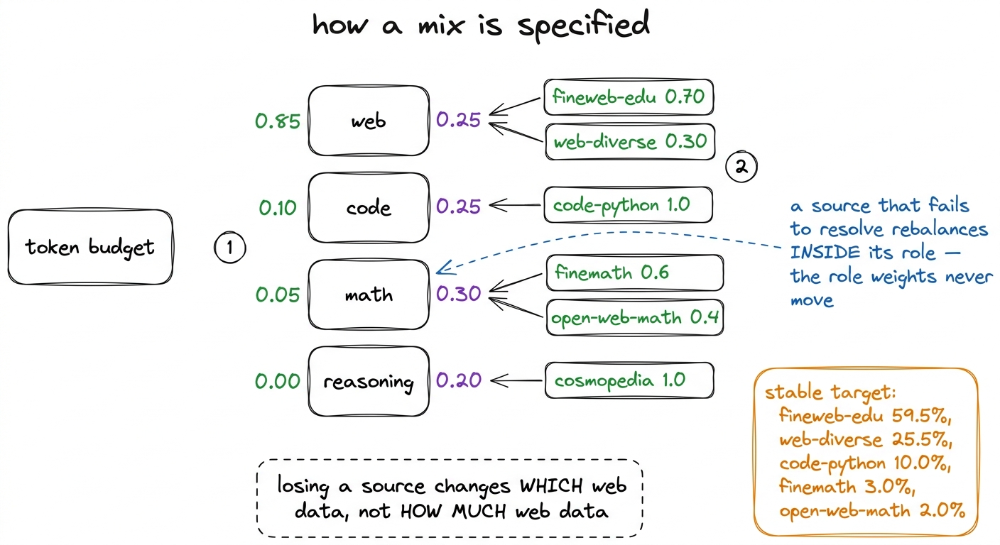
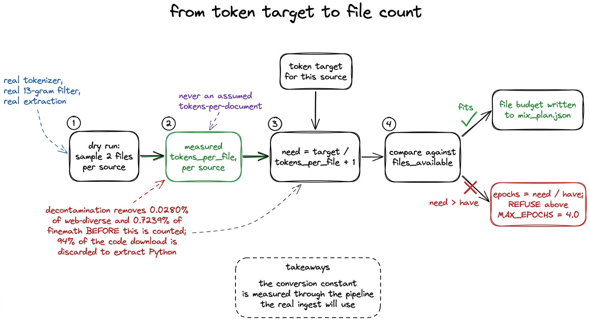
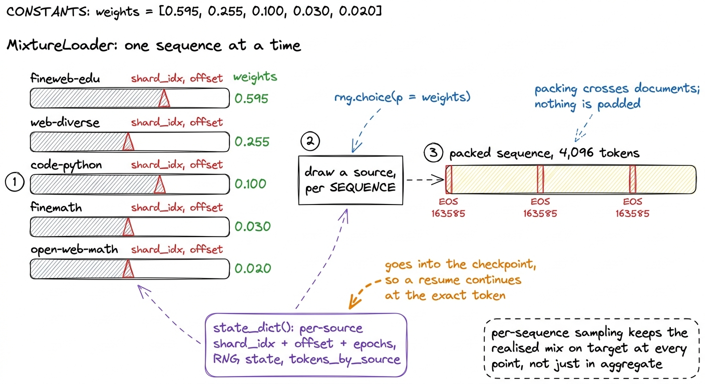
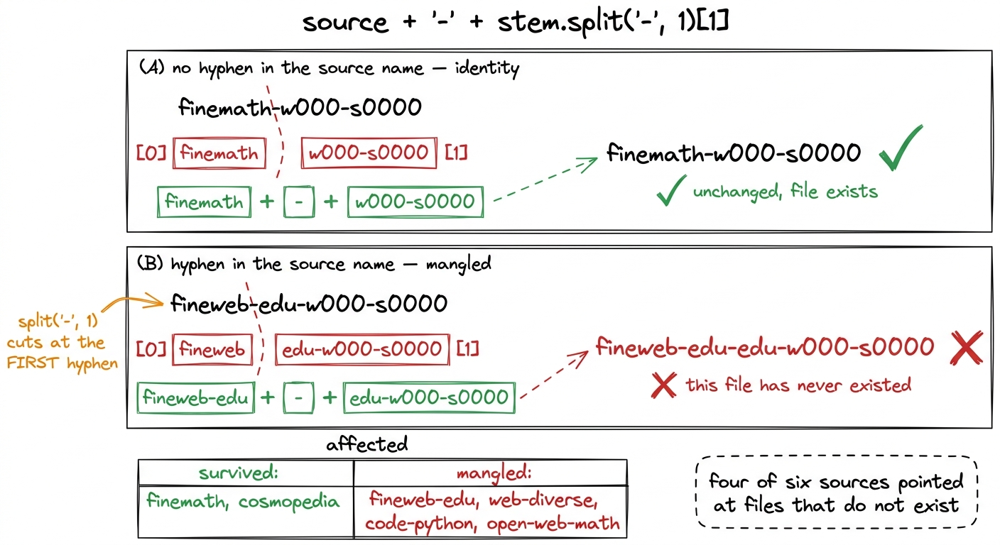
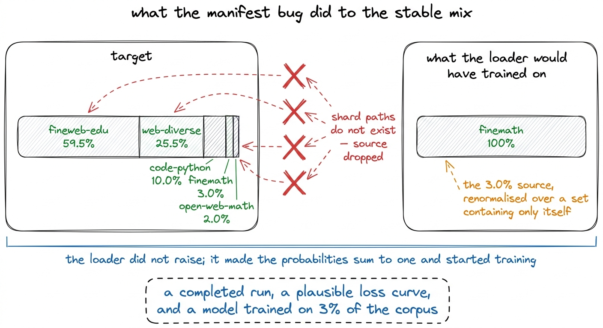
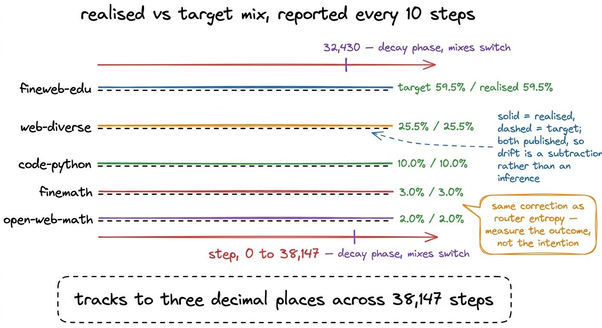

# 13\. 数据混合，以及险些让训练只使用单一来源的缺陷

[← 上一章](../12-the-tokenizer/README.md) · [返回目录](../../README.md) · [下一章 →](../14-the-released-code-cannot-train/README.md)

第 02 部分 · 数据 · 11 分钟 · 6 幅图

> 根据每文件实测 token 数构建稳定与衰减阶段的混合方案；一个字符串切分缺陷让六个来源中的四个指向不存在的文件，加载器却静默地对剩下两个来源重新归一化。

一个语料库在没有明确决定模型看到其中多少内容以及何时看到之前，并不是训练集。我们的语料库由 104.80B 个 token 分布在六个来源的 1,063 个分片中，本次训练运行消耗了 5.00B 个分片。其中 5.00B 是怎样的混合，以及比例如何？

存在两种混合而非一种，因为训练计划分为两个阶段。WSD在长时间的稳定阶段保持学习率不变，然后在最终的15%阶段衰减学习率，数据切换也发生在相同边界：稳定阶段使用通用网络数据，随后在衰减阶段使用数学、代码和合成推理数据。r1的训练运行中稳定混合的比例为  **59.5% fineweb-edu, 25.5% web-diverse, 10.0% code-python, 3.0% finemath 和 2.0% open-web-math** .

那五个数字是本章的两个主题：它们是如何得出的，以及在模型在一个数据源上训练期间，系统中的每一个仪表盘都会持续报告它们，而它们实际上只是虚构的。

## 按类别指定混合比例，而非直接按来源指定

编写混合的自然方式是建立一个从源名到权重的字典。我们没有这样做，因为当某个源消失时会发生的情况。我们想要的六个仓库中有两个被限制访问，其中一个从未通过审核。直接在源上指定，丢失一个源意味着要么手动编辑每一个权重，要么让幸存的源以归一化产生的比例吸收差距，这会悄无声息地改变模型所看到的网络数据量。

因此，混合在两个层面指定：权重 over  **类别** ，以及填充每个角色的源数据的权重。

```python
# Stage 3: ~2% warmup, long stable phase, final ~15% decay.
DECAY_FRACTION = 0.15

STABLE_ROLES = {"web": 0.85, "code": 0.10, "math": 0.05, "reasoning": 0.00}
DECAY_ROLES  = {"web": 0.25, "code": 0.25, "math": 0.30, "reasoning": 0.20}

SOURCE_WEIGHTS = {
    "web":       {"fineweb-edu": 0.70, "web-diverse": 0.30},
    "code":      {"code-python": 1.0},
    "math":      {"finemath": 0.6, "open-web-math": 0.4},
    "reasoning": {"cosmopedia": 1.0},
}

# Above this we are re-showing the same tokens rather than adding information.
MAX_EPOCHS = 4.0
```

一个来源缺失时，现在只在同类别内重新平衡权重，不改变类别权重。如果`web-diverse`无法访问，`fineweb-edu`就会承接它在网页类别中占有的 30%；稳定阶段中，网页数据总比例仍然是 85%。发生这种情况时规划器会记录警告，而非悄悄处理，本章后面还会讨论这一点。

上述稳定的混合比例直接来自这些常量：对于 fineweb-edu，$0.85\times0.70=0.595$；对于 web-diverse，$0.85\times0.30=0.255$；对于 code-python，为 0.10；数学角色的 0.05 分割 0.6 / 0.4 为 0.030 和 0.020。Cosmopedia 承载推理角色，在稳定阶段该角色权重为零，因此只出现在一个混合中，而不出现在另一个混合中。

[](../../figures/the-mix-and-the-manifest-bug-1.png)

图 13-1　混合方案先为类别分配权重，再为各类别中的来源分配权重。稳定阶段的百分比是两列权重的乘积。

## 文件预算来自测量，而非估计

一个token的混合必须变成文件的混合，因为文件是摄入工作节点下载和分词的内容。转换需要每文件的token数量，而获取它有两种方式。

便捷的方法是假设一个每文档的token数量，乘以parquet文件中的行数，然后继续。这个数值在三个方面都是错误的。分词器各不相同，且在K3的163,840条目BPE下，一个文档所消耗的token数量与其他情况不同。去污染在计数前移除了部分文档，其比例从web-diverse上的0.0280%到finemath上的0.7239%不等。而且这个数值在 `code-python` 数量级上，因为未门控的回退仓库将每种语言都保留在一个目录中和  **94% 个下载的内容被丢弃**  提取 Python。

测量方式是一次干运行。在真正的数据注入之前，一次采样遍历会通过完整流程读取每个源的两个文件，使用真实的分词器、真实的13元过滤器和真实的提取操作，并记录最终输出的内容。[^1] 预算文件随后对这些测量值进行算术运算：

```python
def file_budget(p, tokens_per_file, files_available):
    """`tokens_per_file` comes from the dry run — measured,
    post-decontamination, with this tokenizer. Assuming it is the trap."""
    for src, want in p["source_tokens"].items():
        tpf = tokens_per_file.get(src)
        if not tpf:
            notes.append(f"{src}: no measurement, cannot size the file budget")
            continue
        need = int(want / tpf) + 1
        have = files_available.get(src, 0)
        if have and need > have:
            epochs = need / have
            ...
```

这个函数刻意具有两个性质。没有测量数据的来源只产生一条说明，不分配文件预算，也不作看似合理的猜测。如果预算要求的文件数超过实际数量，代码就计算隐含的训练轮数，并在超过`MAX_EPOCHS = 4.0`时拒绝请求，因为小模型反复训练同一个子集，会记住它，而非从中学习。

[](../../figures/the-mix-and-the-manifest-bug-2.png)

图 13-2　文件预算。其中每项数量，都在与实际数据摄取相同的条件下测得。

## 先预留衰减阶段的分片

清单是基于存储在卷上的分片构建的，衰减阶段是在稳定阶段之前分配，而不是之后，因为退火的诉求更小且价值更高。如果衰减阶段再次展示模型已经见过的标记，那么训练的最终15%将是对熟悉数据的第二个周期，而不是新的数学和代码，由此产生的基准移动将无法归因于任何一项。因此，衰减分片是从每个数据源分片列表的尾部选取，稳定阶段获得剩余部分，且不相交性是被明确保证而非被假设的：

```python
stable_names = {n for s in phases["stable"]["sources"].values() for n in s["shards"]}
decay_names  = {n for s in phases["decay"]["sources"].values()  for n in s["shards"]}
overlap = stable_names & decay_names
if overlap:
    raise AssertionError(
        f"{len(overlap)} shards appear in both phases — the anneal would "
        "re-show tokens from the stable phase")
```

清单是  **947 个稳定分片和 94 个衰减分片** ，断言通过。

## 数据加载器如何使用它们

数据加载器读取两个清单，并在 4,096 个token上生成打包序列。其三个属性对整个训练运行其余部分至关重要。

 **采样是按序列进行的，而不是按分片进行的。**  对于每一个序列，加载器会从混合权重中抽取一个源，并从该源的游标处读取接下来的 4,097 个标记。在移动到下一个分片之前，如果一次性读取一个分片直到耗尽，将导致模型经历数小时的纯代码后接数小时的纯网页内容，这种课程是没有人选择的。按序列采样使得在训练过程中的每个时刻，实际实现的混合都接近目标值，而不仅仅是在整体上接近。

 **打包跨越文档边界。**  文档由 EOS token、163585 分隔，序列在 4,096 处被截断，无论这些边界落在何处。不进行填充操作，EOS 告诉模型文档的结束位置。

 **状态是显式的。**  每个源流携带一个分片索引、该分片内的偏移量以及一个周期计数器；加载器携带其随机数生成器的状态和每个源的令牌总数。所有这些内容都会被保存到检查点中，因此恢复训练可以从停止的精确令牌继续，而不是重新开始一个周期或静默地重复显示令牌。[^2]

[](../../figures/the-mix-and-the-manifest-bug-3.png)

图 13-3　数据加载器。每条序列独立采样来源，序列可以跨文档边界打包，而游标属于训练状态的一部分。

## 缺陷

清单构建器遍历 `.json` 在卷上，每个分片对应一个侧车，记录每个分片的名称、token数量和路径。早期版本没有直接使用侧车的文件名。它重新构建了名称：

```python
name = source + "-" + stem.split("-", 1)[1]
```

原意是规范化命名：取出来源名，再取第一个连字符之后的内容，重新拼接。若来源名自身没有连字符，这相当于恒等操作。`finemath-w000-s0000`被拆成`finemath`和`w000-s0000`，重新拼回后没有变化。

在名称包含连字符的源上它不成立。 `fineweb-edu-w000-s0000` 在……处分割  *第一个*  连字符，转化为 `fineweb` 和 `edu-w000-s0000`，并用完整源名重新组装给出  **`fineweb-edu-edu-w000-s0000`** ，一个从未存在过的文件。

我们六个源名称中有四个包含连字符。两个不包含。

[](../../figures/the-mix-and-the-manifest-bug-4.png)

图 13-4　对于名称中没有连字符的来源，重建操作等同于原样返回，因此在大家最先测试的那两个来源上，它看起来是正确的。

现在考虑当清单命名一个不存在的文件时，数据加载器应该做什么。

## 一次没有引发崩溃的失败

加载器的原始行为是跳过它找不到的内容。对于每个源，它构建了分片路径列表，并过滤出存在的分片，删除任何剩余为空的源，然后对剩余部分重新归一化权重，使得概率总和仍为一，并开始训练。

那对于一个加载器来说，如果目标是持续运行，这是个合理的行为。应用于此处，当六个源中有四个解析到不存在的路径时，稳定混合的五个源会减少到一个： `cosmopedia` 在稳定阶段，其值为加权零， `finemath` 是唯一另一个未加连字符的名称。其 3.0% 权重，在仅包含自身的集合上重新归一化后，变为 100%。

 **整个稳定阶段都将使用 finemath 进行训练。** 

[](../../figures/the-mix-and-the-manifest-bug-5.png)

图 13-5　原计划的稳定阶段混合方案，以及训练实际上会使用的方案。流水线中没有任何部分报告这种差异。

这类问题是我们本项目中最需关注的，值得精确说明其原因。

一次崩溃是一个好的结果。它耗时一小时，并告诉你应该在何处查找。报告中的一个错误数字是一个中等结果，因为它至少出现在报告中，有人可能会注意到它。这个缺陷既不产生这样的结果。它产生一次训练运行，运行正常启动，训练了38,147步，检查点正确，通过监控系统中的每一个检查点，最终损失曲线呈现出预期的形状，并返回一个模型，该模型错误的原因在所有被收集的指标中均未体现。

它可能看起来会是这样  *更好*  比实际运行还要高。我们按源留出的最终困惑度是：在 finemath 上为 10.24，在 fineweb-edu 上为 22.35，在 web-diver-ese 上为 37.74。一个在单一狭窄数学语料库上训练的模型报告的训练损失低于一个在六个数据源上训练的模型，因此人类最密切关注的数值会朝着看起来成功的方向移动。我们并未运行该实验，因此这是基于每个源的困惑度进行的推断，而非测量。这足以说明问题：损失曲线并不能作为数据的控制指标。

## 输入缺失时必须明确报错

修复包含三个部分，其中只有第一部分涉及该错误。

我们删除了重建名称的逻辑。旁侧元数据文件的文件名就是分片名，因此清单构建器现在直接使用`sidecar.stem`，并在代码中说明原因，避免以后有人再次擅自规范化名称。

加载器的默认行为随后被反转。在构建过程中会收集缺失的分片，如果存在任何缺失分片，构造函数将抛出：

```python
# Silently dropping a source and renormalising the rest changes the data
# distribution without changing anything visible. That is how a
# "59.5% fineweb-edu" stable phase became 100% finemath, undetected, in the
# first build of these manifests. Fail loudly by default.
if missing and not allow_missing:
    detail = ", ".join(f"{n}: {a}/{b} shards absent"
                       for n, (a, b) in missing.items())
    raise FileNotFoundError(
        f"manifest references shards that do not exist ({detail}). "
        "Rebuild the manifests, or pass allow_missing=True to proceed "
        "with a deliberately reduced mix.")
```

逃生出口依然保留，因为存在合理理由需要在子集上进行训练，例如对一个已下载的分片进行烟雾测试。然而，它现在必须在调用位置显式请求，以便在代码审查中可见，而不是成为无人关注时默认自动出现的情况。[^3]

第三部分是遥测。加载器暴露了其生成的混合以及被要求的混合，训练循环也同时报告这两项内容：

```python
"realised_mix": loader.realised_mix(),
# both, so the monitor can gate on drift rather than on a
# human noticing that a share looks wrong
"target_mix":   loader.target_mix(),
```

`realised_mix()`根据逐来源的 token 计数器计算；计数器随序列输出而递增，因此它测量的是实际结果，而非意图。将目标值并列公布，就能通过相减发现偏移，无需猜测。这与路由器熵曾放过专家坍塌时的修正相同：测量结果，将结果与要求并列报告，不依赖人记住正确数值。[^4]

## 证明它正常工作的证据

r1的稳定阶段，达成目标，来自本次训练的遥测数据：

| 来源 | 目标值 | 实际值 |
| --- | --- | --- |
| fineweb-edu | 59.5% | **59.5%** |
| web-diverse | 25.5% | **25.5%** |
| code-python | 10.0% | **10.0%** |
| finemath | 3.0% | **3.0%** |
| open-web-math | 2.0% | **2.0%** |

实现的混合比例在稳定阶段到第 32,430 步时保持与目标值在小数点后三位一致，并在所有 38,147 步中报告。这种一致性验证的是加载器确实从其声称的源中读取数据，而非关于数据本身的结论。

[](../../figures/the-mix-and-the-manifest-bug-6.png)

图 13-6　已完成训练中的数据混合遥测。将目标值与实际值并列报告，无需有人记住原定数字，就能发现偏移。

## 可以迁移的方法

优雅退化是服务系统中的一个良好默认行为。一个推荐服务在丢失一个特征存储时返回稍差的推荐，这是正确的行为，因为另一种选择是返回空结果。

一个实验不是一个服务系统。当退化的是实验环境时，一个回退会将一次明显的失败转化为一次静默的失败，而一个 \$252.35 运行中的静默失败最终会被计入代价。那个跳过缺失分片并重新归一化的加载器，将服务系统的本能施加到了一个测量仪器上，几乎使其运行失去了意义。

由此得到两条规则：输入缺失时应报错；如要继续，必须在调用处通过具名参数明确请求。训练配置要求执行的行为，也必须被测量并与配置并列公布，让一致性可以被观察，而非只凭相信。成本很低：一条`if`语句，以及遥测字典中的两行。

模型分片章节中的三个分布式缺陷也是如此：训练能够结束，结果却悄悄出错。相比之下，这个数据缺陷在事后最难发现，因为一个完全用数学语料训练的模型，仍能给出下降的损失、完整的检查点和二十四次看似可信的评测。

---

[← 上一章](../12-the-tokenizer/README.md) · [返回目录](../../README.md) · [下一章 →](../14-the-released-code-cannot-train/README.md)

[^1]: 干运行也会产生每个基准测试的命中次数，这些数据后来被用于HumanEval调查。它的职责在这里更窄：在所有去除token的操作完成后，一个源文件实际上贡献了多少个token。

[^2]: 关于检查点的章节介绍了如何进行验证： `resume_equivalence` 训练运行两次并比较每步损失，发现检查点的步数标签存在偏移一的情况，修复后首次恢复训练的步是0.00e+00完全一致。

[^3]: `allow_missing=True` 还将在加载器中存储缺失分片的计数，因此即使有意以减少的混合比例继续运行，该训练运行仍会记录其遗漏的内容。

[^4]: 报告频率在大多数训练运行中为每10步一次，前100步每步报告一次，从第100步到第1,000步每第五步报告一次，因为问题通常出现在这些阶段。在每步131,072个token时，每10步的间隔会在遥测点之间产生1.3M个token。
