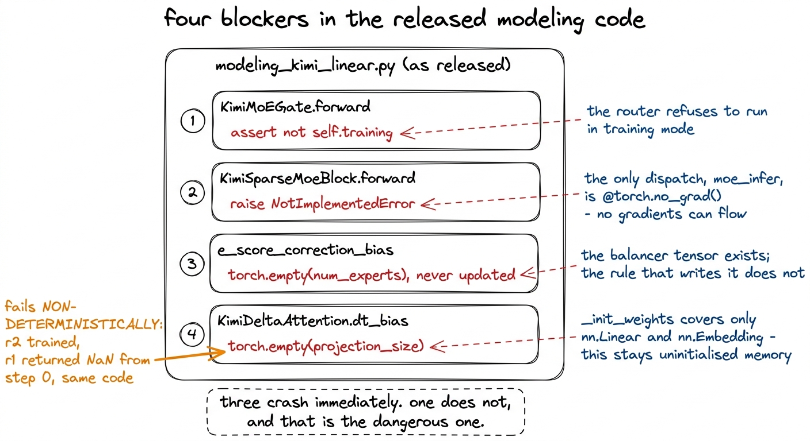
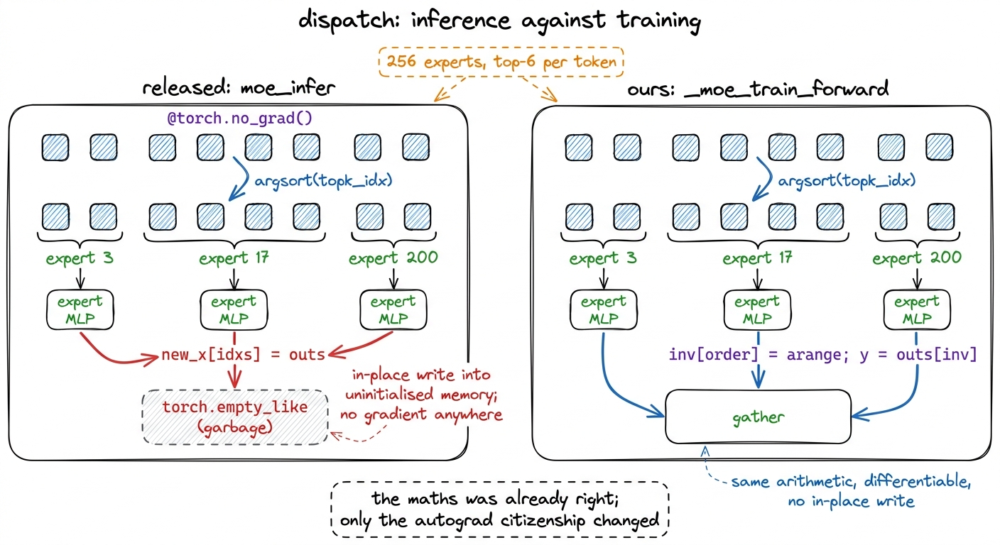
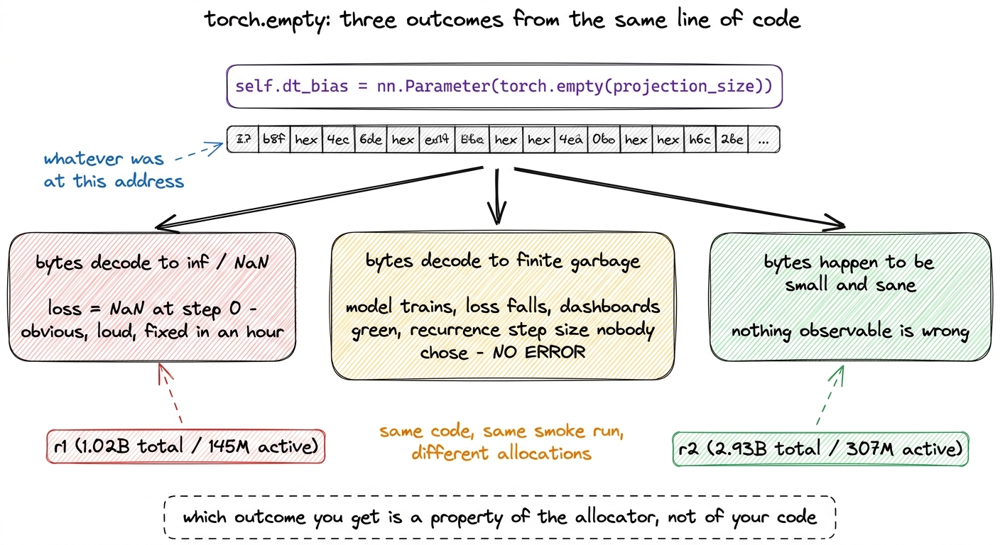
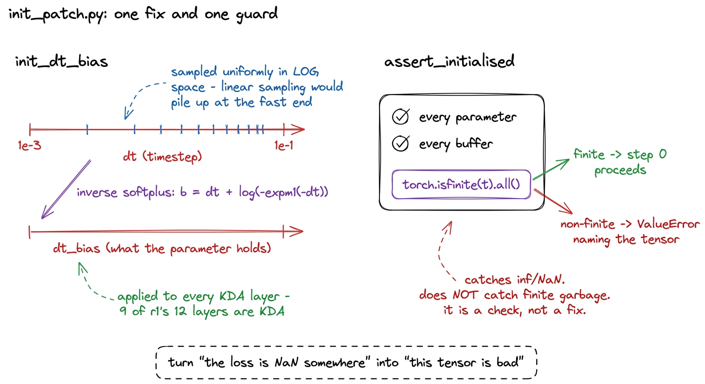
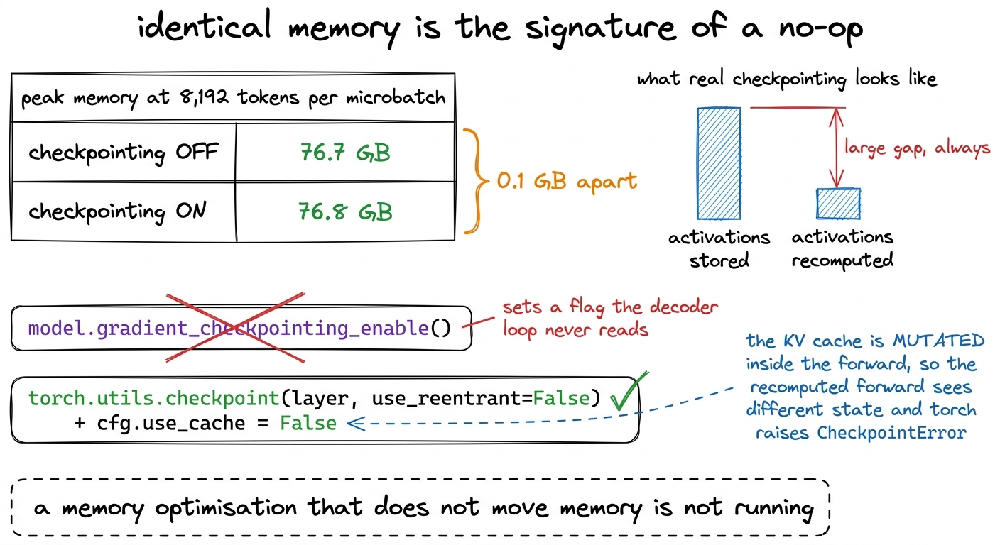

# 14\. 发布的代码无法直接训练

[← 上一章](../13-the-mix-and-the-manifest-bug/README.md) · [返回目录](../../README.md) · [下一章 →](../15-the-training-loop/README.md)

第 03 部分 · 让模型训练起来 · 11 分钟 · 5 幅图 · 4 个缺陷

> 禁止训练模式的断言、MoE 前向传播中的 NotImplementedError、从未初始化的均衡器偏置，以及保留未初始化内存的时间步偏置：同一缺陷让一个档位返回 NaN，另一个却能正常训练。

Moonshot 发布 Kimi K3 时提供了可以正常工作的建模代码。它能加载检查点、执行前向传播并生成文本，各个部分都正确完成了其设计目标。但它无法用于训练；造成这一点的原因有四个，彼此独立，而且在仓库的任何地方都没有文档记录。

我们通过运行一个GPU烟雾测试，在训练循环存在之前的一下午内，找到了所有四个部分：从零开始构建梯度规模档位的每一级，对一个短序列执行两次优化器步骤，并断言损失是有限的，初始值接近 $\ln(163{,}840) \approx 12.007$ 并且会下降。安排这一点工作量很小，这也是本章讲述四个错误而不是讲述第九小时训练运行失败的原因。

[](../../figures/the-released-code-cannot-train-1.png)

图 14-1　四个阻碍，都是在训练循环尚未建立之前，通过只运行两步的冒烟测试发现的。

四个问题有共同的根源，而在细节之前值得命名。发布的推理代码仅在一种模式下被调用，由单一调用者执行，且每个张量均从检查点加载。在其他模式下才重要的任何内容，从未以任何人能察觉的方式出错。

## 阻碍一：路由器断言当前不能处于训练模式

`KimiMoEGate.forward`先计算 logits 并应用 sigmoid，随后在 top-k 选择之前执行：

```python
# select top-k experts
assert not self.training
```

那就是整个阻塞点。调用 `model.train()` 以及执行前向传递会引发 `AssertionError` 没有消息。它是四个中最友好的一个，因为它在第一次前向传播的第一时间就失败了，错误堆栈指向了确切的行。

代码没有说明为何存在这个断言，我们也没有询问。合理推测是，路由门的训练路径从未编写，所以作者直接阻止训练，而非留下静默错误的路径。替代实现`TrainableMoEGate`位于`train/moe_train.py`，逐行复制参考实现的专家选择计算，保持推理行为不变，并加入训练路径所需的负载统计、熵和均衡器状态。

## 阻碍二：没有可微分的分发路径

第二个阻塞因素位于稀疏块中，该稀疏块管理专家：

```python
if not self.training:
    y = self.moe_infer(hidden_states, topk_idx, topk_weight)
else:
    raise NotImplementedError("Training mode is not supported in KimiSparseMoeBlock")
```

`moe_infer` 是文件中唯一的分发，且它被装饰了 `@torch.no_grad()`. 移除的 `NotImplementedError` 并且无论如何调用它都没有帮助：它内部没有任何携带梯度的部分，因此专家会生成输出但不会接收到任何损失。

分发是将一批token进行操作，每个token被路由到六个256专家，并将它们重新排列，使得每个专家可以处理属于自己的token作为单一的连续矩阵。该参考实现通过排序扁平化的专家索引，按该顺序收集token，对每个专家运行其对应切片，然后通过原地索引赋值将结果写回。 `torch.empty_like` 缓冲区。

重写保持相同的算术运算，并改变两件事。没有任何运行在 `no_grad`，通过逆排列和 gather 操作将结果写回，而不是原地写入未初始化的内存：

```python
n_tok, k = topk_idx.shape
flat = topk_idx.reshape(-1)
order = flat.argsort()
sorted_tokens = hidden_states[order // k]        # differentiable gather
counts = torch.bincount(flat, minlength=len(self.experts))

chunks = []
start = 0
for i, c in enumerate(counts.tolist()):
    if c == 0:
        continue
    chunks.append(self.experts[i](sorted_tokens[start:start + c]))
    start += c
outs = torch.cat(chunks, dim=0)

inv = torch.empty_like(order)
inv[order] = torch.arange(order.numel(), device=order.device)
y = outs[inv]                                     # undo the sort, by gather
```

将索引赋值到一个全新的空张量中，是一个糟糕的自动微分成员：缓冲区初始状态为垃圾数据，写操作是原地操作，且梯度需要反向传播通过一个输出部分不来自任何输入的操作。而gather操作则没有这些特性，且速度完全相同。

[](../../figures/the-released-code-cannot-train-2.png)

图 14-2　发布的分发实现与可微分替代实现。排序和逐专家切片方式完全相同。

那个Python专家循环是我们最初采用的版本，也是该项目中最大的吞吐量问题。将其替换为批处理分发，提升了17.5倍，将MFU从0.1%提升至4.1%——该数据是在r2上测得的，r2是我们之上的一档规模，因为MFU的优化工作正是在这一档完成的。它在书中自有专章。  *让训练更快* 目前循环是正确的，这正是烟测试所需要的。

## 阻碍三：负载均衡器并不存在

K3的配置名称将其负载均衡方法放在一个字段中， `topk_method: noaux_tc`，且释放的门声明了该方法写入的张量：

```python
self.e_score_correction_bias = nn.Parameter(
    torch.empty(self.num_experts),
)
self.reset_parameters()
```

`reset_parameters` 初始化 `self.weight` 并停止。偏置项保持不变。 `torch.empty`，文件中没有任何内容会向其添加内容。

用于推理时已完成。 `from_pretrained` 用加载的张量覆盖每一个参数，因此偏置项以完整形式存在，保留了Moonshot自身训练产生的所有值。[^1] 在从零开始进行预训练时，张量在第 0 步时持有未初始化的内存，并且之后永远不会改变，这意味着路由部分由该页面在整个训练运行期间的原始内容决定。

因此，必须编写负载均衡器。规则是一行代码，由 DeepSeek-V3 传承至 K3：

$$
\mathrm{bias}_{i}\leftarrow\mathrm{bias}_{i}+\mathrm{gamma}\,\operatorname{sign}(\mathrm{mean\_load}-\mathrm{load}_{i})
$$

我们的实现中声明了偏置项 `torch.zeros`，集合 `requires_grad_(False)`，并将其从 AdamW 的参数组中移出。它通过规则更新，而非通过梯度更新，如果让优化器看到它，就会对一个其更新方式已完全指定的量施加权重衰减和动量。这两个规则将因此在偏差应位于何处的问题上产生矛盾。

选择 `gamma` 是一个测量值而非默认值，且是专家坍塌一章的主题内容，其中从 DeepSeek-V3 继承的值对于我们的批大小而言存在十倍误差。这里的要点更窄：没有这段代码， `noaux_tc` 是配置文件中的一个字符串。

## 阻碍四：偏置取决于内存中原先残留的内容

第四个问题值得多花些时间，因为它是唯一不会主动暴露自身的问题。

`KimiDeltaAttention` 手工构建两个原始参数。其中一个是在原地初始化的：

```python
self.A_log = torch.nn.Parameter(
  torch.log(
    torch.empty(
      self.num_heads,
      dtype=torch.float32,
    ).uniform_(1, 16)
  )
)

...

self.dt_bias = nn.Parameter(
  torch.empty(
    projection_size,
    dtype=torch.float32,
  )
)
```

`A_log` 调用 `.uniform_(1, 16)` 在其空张量上，并且没问题。 `dt_bias`，在同一构造函数的十一行之后，不会。并且 `KimiPreTrainedModel._init_weights`，通常用于捕获它的机制，处理 `nn.Linear` 和 `nn.Embedding` 和别的什么都不行。一个裸的 `nn.Parameter` 既不是。

`dt_bias` 在 r1 中九个 KDA 层之一的门控 delta 规则内核中，时间步偏置被传递。这不是一个装饰性术语。它位于一个 softplus 函数内部，设定递归的有效步长，因此其大小控制线性注意力状态的衰减速率。

现在考虑什么 `torch.empty` 实际上会返回。它会分配内存但不会写入其中，因此张量包含该地址之前已存在的字节，这些字节被重新解释为 float32。这些字节的内容取决于内存分配器、进程早期的操作、CUDA 缓存分配器的块复用，以及你无法控制的任何因素。这种情况有三种可能，我们在同一个烟雾测试中看到了其中两种：

- 字节解码为 `inf` 或 `NaN`，或到足够大的值导致内核溢出。损失是 `NaN` 在第 0 步时，训练运行显然已中断。
- 字节解码得到有限但错误的值。模型训练进行，损失下降，每个仪表盘都显示绿色，而递归过程的步长是没有人选择的。没有错误，也没有警报。
- 字节恰好很小且大致合理。没有可观察的错误。

 **规模档位 r2 正常训练而 r1 返回 `NaN` 从第 0 步开始，使用相同的代码，在相同的 smoke 运行中。**  两个模型仅在宽度和深度上有所不同，因此它们以不同的顺序分配不同大小的张量，以及它们 `dt_bias` 分配落在了不同的垃圾上。如果规模阶梯只是r2，这个错误本会在训练运行中发布。

[](../../figures/the-released-code-cannot-train-3.png)

图 14-3　未初始化的内存不会必然失败，而是在“抽样”。中间那种结果最容易进入生产环境。

中间的结果才是导致这个缺陷值得单独成节而非仅仅出现在变更日志中的一点原因。崩溃是一个缺陷报告。一个静默的质量退化，意味着模型的表现比本应更差，而其背后的原因永远无法被发现，因为根本没有可搜索的内容。我们本会花这笔钱，得到一个略微更差的损失曲线，并将其归因于规模的扩大。

## 修复，以及不能替代修复的检查

`train/init_patch.py` 初始化 `dt_bias` Mamba 和 GatedDeltaNet 初始化其时间步参数的方式：在对数空间内均匀采样一个时间步 $\left[10^{-3},10^{-1}\right]$，然后对 softplus 进行反演，以便 $\operatorname{softplus}(\mathrm{dt\_bias})$ 覆盖该范围。

```python
dt = torch.exp(
    torch.rand(p.shape, device=p.device, dtype=torch.float32)
    * (torch.log(torch.tensor(dt_max)) - torch.log(torch.tensor(dt_min)))
    + torch.log(torch.tensor(dt_min))
).clamp(min=floor)
# inverse softplus: b = dt + log(-expm1(-dt))
p.copy_((dt + torch.log(-torch.expm1(-dt))).to(p.dtype))
```

选择在对数空间而非线性空间采样，是因为该量跨越两个数量级；线性采样会让绝大部分概率质量落在衰减较快的一端。之所以使用 softplus 的反函数，是因为内核会对这个参数应用`softplus`，而我们要控制的是变换后的分布，而非变换前的分布。

文件的后半部分并不是一个修复。它是一个在第 0 步之前运行的检查：

```python
def assert_initialised(model) -> dict:
    bad = []
    for name, t in list(model.named_parameters()) + list(model.named_buffers()):
        if t.is_floating_point() and not torch.isfinite(t).all():
            bad.append(name)
    if bad:
        raise ValueError(f"non-finite values in a freshly initialised model: {bad[:10]}")
```

每个参数和缓冲区在第一次前向传递之前必须是有限的。它需要遍历一遍参数，将“损失是” `NaN` “somewhere”变成“this named tensor is bad”，这是一个不同类型的调试问题。

它也是不完整的，文件中的文档字符串也明确说明了这一点。未初始化的内存通常只是有限的垃圾，而不是 `inf`，因此这个检查会捕获明显的结果而忽略安静的结果。它存在是因为下一个未初始化的张量也不会自行宣告，而当遗漏的成本是一次训练运行结束且错误时，一个能够捕获三分之一情况的简单检查是值得存在的。[^2]

[](../../figures/the-released-code-cannot-train-4.png)

图 14-4　初始化与运行前检查。这项检查刻意保留了一些覆盖局限，并在文档中明确说明。

## 同一类问题中的另外两个陷阱

接下来的两个都不在建模代码的算术中，且都属于同一类：在发布环境下有效，而在我们的环境中则静默无效。

 **`transformers` 必须固定在 4.57.6。**  Kimi 模型的代码导入 `OutputRecorder` 在模块作用域。版本 5.x 的 `transformers` 移除了它，并且一个要求的 `transformers>=4.56` 解析为 5.x，因此在任何模型构建之前导入就会失败。模块作用域的导入错误至少是一种快速失败，但它是一种在全新容器镜像中数周后才会出现的失败，而原始环境却一直正常工作，因此值得固定版本而非指定版本范围。

 **`gradient_checkpointing_enable()` 在此建模代码中是一个静默的无操作。**  该模型声明 `supports_gradient_checkpointing = True`. `KimiModel.__init__` 集合 `self.gradient_checkpointing = False`然后解码循环会调用 `decoder_layer(...)` 直接地，且没有 `_gradient_checkpointing_func` 文件中的任何位置。标志被写入但从未被读取。 `KimiDecoderLayer` 是普通的 `nn.Module` 而不是变换器的 `GradientCheckpointingLayer`，这是钉住版本中唯一的通用机制，因此其他任何内容也不会拾取它。

调用它会打印“`use_cache=True`与梯度检查点不兼容”。这恰好是一条让人放心、看起来像功能正在正常工作的日志。

线索就存在于我们自己的基准数据中，且被搁置了数天。在每微批次8,192个token时，峰值内存读取  **76.7 GB 时关闭检查点和 76.8 GB 时开启检查点** 激活检查点机制在运行时以内存为代价进行重计算；它无法保持内存不变。  **相同的内存是无操作的标志。**  最初从该网格得出的结论，即检查点每token更慢但获得了更大的微批次，因此胜出，是将仅在批次大小上不同的两个训练运行进行了比较。

[](../../figures/the-released-code-cannot-train-5.png)

图 14-5　识别出无效操作的那项测量。它早已在我们自己的结果表中躺了好几天。

真实的检查点保存需要在封装层之外一个不显而易见的东西： `cfg.use_cache = False`KV 缓存是在前向传播过程中被修改的，因此重新计算的前向传播看到的状态与原始状态不同，且 `torch.utils.checkpoint` 引发 `CheckpointError`. 设置 `use_cache=False` 是那个空操作调用实际上一直在执行的事情。[^3]

## 冒烟测试带来了什么

所有四个阻塞项均被发现由 `smoke_all`：构建每个规模档位，两步操作，断言损失为有限值，初始接近 12.007 并逐渐下降。需要几分钟的GPU时间，且是在训练循环之前编写的。

前三者会在第一次运行的第一秒内通过崩溃被发现，第四者不会。在 r2 上它不会崩溃，而在 r1 上它仅有时会崩溃，因此一个仅在某一天对一个规模档位进行烟测试的项目，有可能将未初始化的时间步偏差带入多日运行中。烟测试带来的并非对明显错误的发现，而是同一下午在三个模型上运行相同的代码，这使得非确定性行为显现出非确定性，而非成为一个谜团。[^4]

该规则的一般形式如下。用于推理的代码已在一种模式下运行，每次都将张量从磁盘加载。在使用它进行训练之前，需检查另一种模式所依赖的假设：哪些参数是构建而非加载的，哪些分支是被门控的。 `self.training`，哪些装饰器抑制梯度，哪些标志是写入但不被读取。这四个阻塞器中的每一个，以及它们之后的两个陷阱，都列在该清单上。

下一章围绕这个打补丁的模型构建训练循环：WSD调度，每步131,072个token，以及在训练运行前而非运行中写下的尖峰协议。

---

[← 上一章](../13-the-mix-and-the-manifest-bug/README.md) · [返回目录](../../README.md) · [下一章 →](../15-the-training-loop/README.md)

[^1]: 这是四个阻塞因素中的三个机制。一个始终被加载权重覆盖的参数可以保持未初始化，且不会产生可观察的影响，以及一个模块的 `_init_weights` 只能覆盖作者想到的层类型，因为在检查点加载路径中它并不运行任何关键部分。

[^2]: 更严格的检查是，将每个参数的统计量与初始化方案的预期结果比较；这样也能发现数值有限但内容错误的内存垃圾。我们没有实现这一检查。`assert_initialised`自`init_dt_bias`实现后就没有再发现问题；对防护检查而言，这是正确结果，也解释了为什么难以证明继续扩展它值得投入。

[^3]: 一个相关的补丁属于同一家族，其内容在MFU章节中有所描述：MLA在注册于sdpa实现下的运行。 `flash_attention_2` 键，因为模型强制使用该字符串，且不对称头维度填充仅在该分支上运行。它在数值上是相同的但更慢，这意味着本书中每一个MFU图表都低估了Flash Attention所能带来的效果。

[^4]: 构建路径后来也因同样原因被加强。 `train/build.py` 现在是任何模型构建的唯一方式，且当一个补丁匹配零个模块时会引发错误，而不是继续执行。一个静默匹配到空的补丁会产生一个内存使用量超过应有的训练运行，并放弃融合内核的 1.38x，且不报错，这与本章中所有其他情况的失败形态相同。
