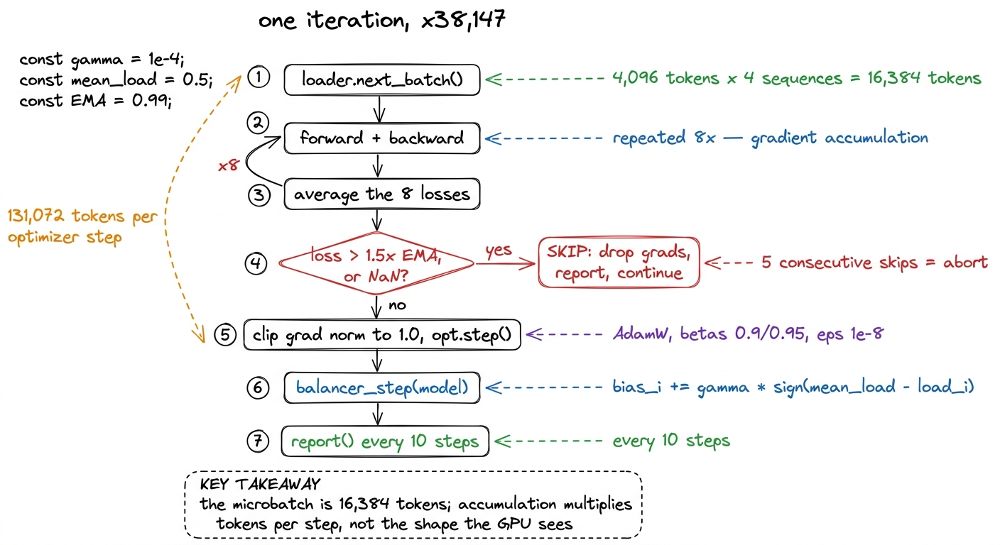
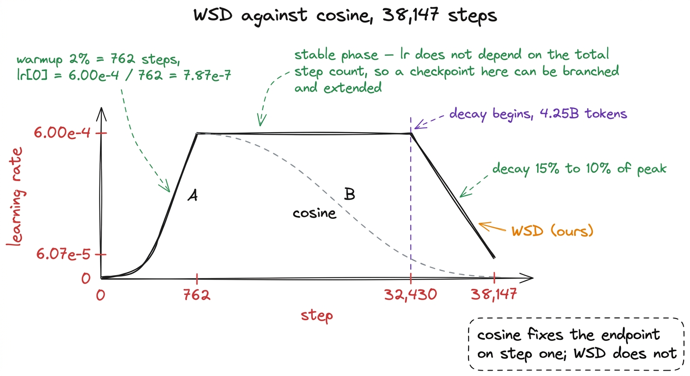
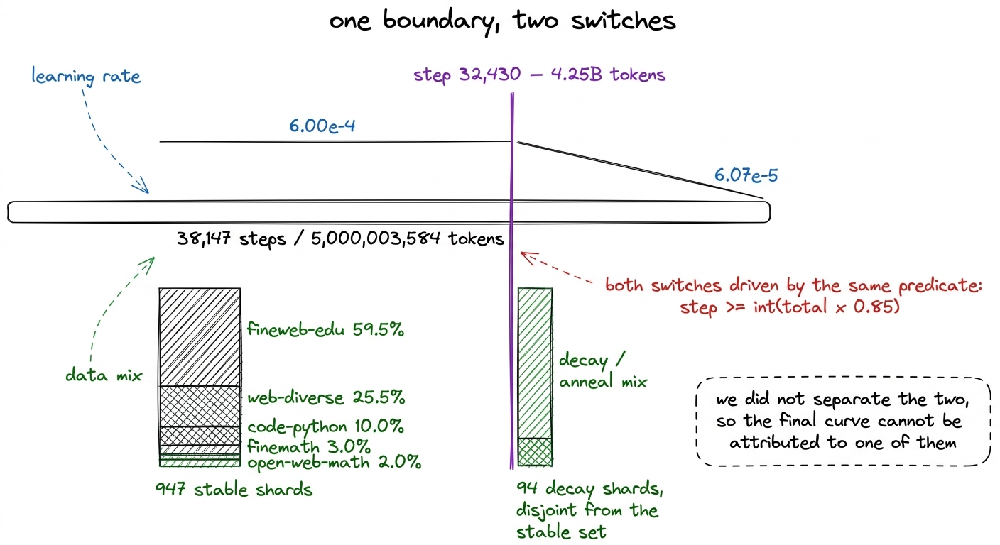
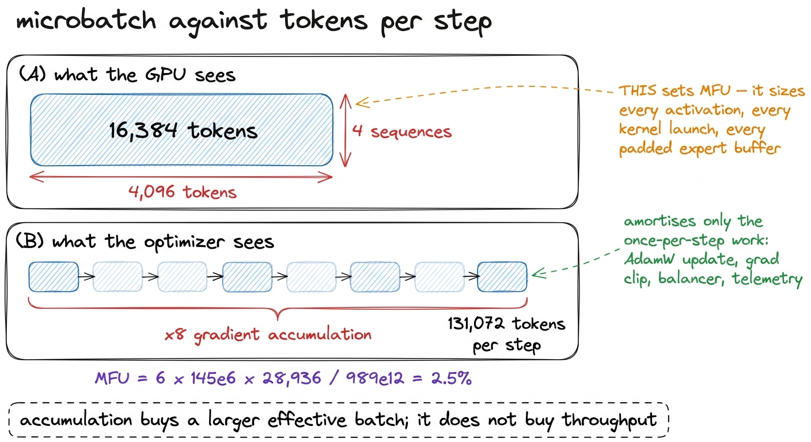
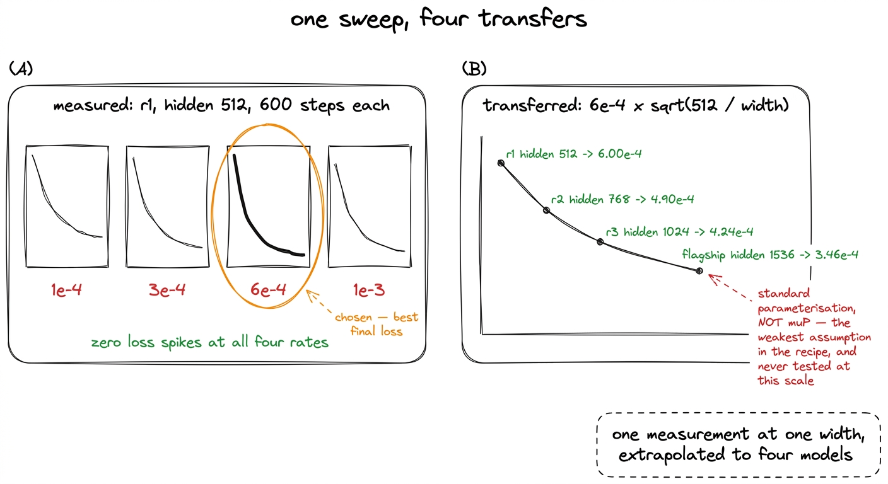
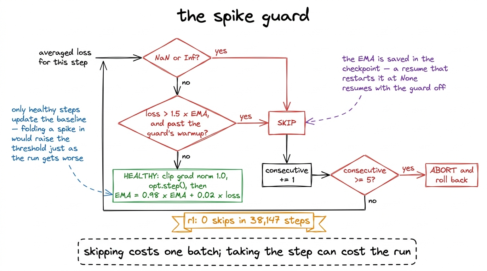
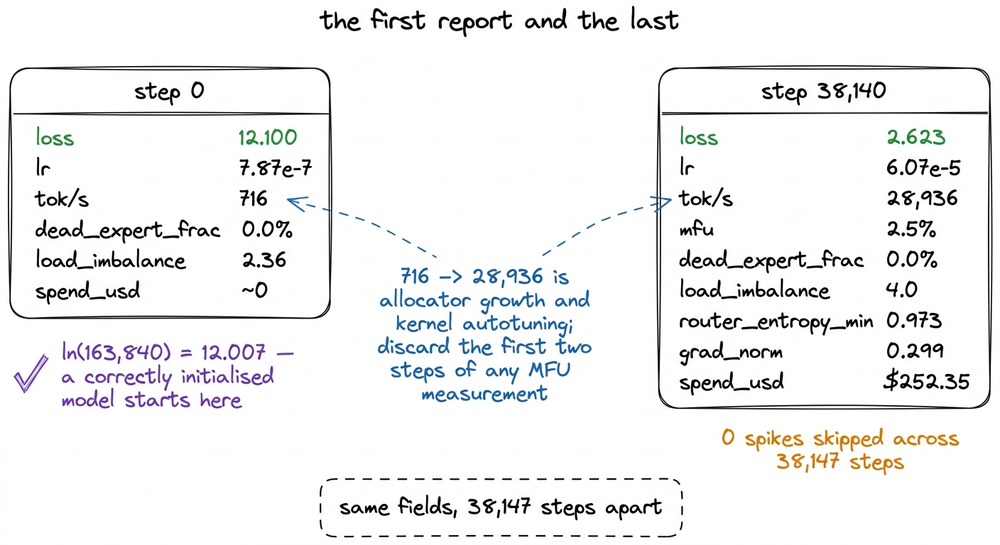

# 15\. 训练循环

[← 上一章](../14-the-released-code-cannot-train/README.md) · [返回目录](../../README.md) · [下一章 →](../16-expert-collapse/README.md)

第 03 部分 · 让模型训练起来 · 14 分钟 · 7 幅图 · WSD

> 用预热—稳定—衰减替代余弦调度；$4{,}096\times4\times8$ 得到每步 131,072 个 token；从一次实测扫描迁移学习率，并在训练之前就写明尖峰协议，而非等到凌晨 3 点。

一个预训练运行是循环体执行了非常多次。我们的运行在单个 H200 上大约 55 小时内执行了 38,147 次，每次迭代都执行了同样的六件事：读取一批数据、计算损失、决定是否信任该损失、执行优化器步骤、微调路由器的平衡偏置，并偶尔向进程外部的某人报告发生了什么。

那些有趣的设计决策都出现在其中的第四和第六部分。本章讲述的是学习率的调度策略、喂入循环的批处理运算、决定一个步骤是否可信的协议，以及使训练运行从外部可观察的遥测契约。前一章介绍了必须在任何运行之前解决的四个瓶颈问题。后一章则涵盖了位于第五步内部的路由器负载均衡器的更新机制。

[](../../figures/the-training-loop-1.png)

图 15-1　循环主体。每个优化器更新步中，第 1 至 3 步执行八次，第 5 步执行一次。

## 预热、稳定、衰减

学习率调度几乎每个教程都会采用余弦衰减：从较低值开始，进行预热，然后沿着余弦曲线下降，直到训练结束时达到某个底部值。它效果良好，并且有一个容易被忽视的特性。  **余弦在第一步就承诺了一个总步数。**  步数的余弦值  *n*  取决于总量，因此如果你在第 20,000 步决定该训练运行需要再增加两个十亿个 token，你就不能简单地继续下去。你所遵循的调度方案是为另一个终点设计的，而将其延长意味着你之前应用的学习率对于当前正在进行的训练运行来说是错误的。

我们使用了  **WSD**  — 预热—稳定—衰减 — 代替。学习率在前 2% 步线性上升，随后在中间阶段保持在峰值，最后在后 15% 步线性衰减至 10% 的峰值底部。

```python
def wsd_lr(step, total, peak, warmup_frac=0.02, decay_frac=0.15, min_frac=0.1):
    """Warmup -> stable -> linear decay to `min_frac` x peak."""
    warm = max(1, int(total * warmup_frac))
    decay_start = int(total * (1.0 - decay_frac))
    if step < warm:
        return peak * (step + 1) / warm
    if step < decay_start:
        return peak
    frac = (step - decay_start) / max(1, total - decay_start)
    return peak * (1.0 - (1.0 - min_frac) * min(1.0, frac))
```

对于我们的训练运行， $\mathrm{total}=38{,}147$，因此预热运行了 $\left\lfloor38{,}147\times0.02\right\rfloor=762$ 步数，以及第一步的学习率是 $\frac{6.00\times10^{-4}}{762}\approx7.87\times10^{-7}$该训练运行的第 step-0 遥测记录了  **$7.87\times10^{-7}$** ，这是一个小小的检查，以确保循环应用的调度与上面写出的调度一致，而不是另一个名称相同但不同的调度。

选择 WSD 的原因在于稳定阶段期间取的一个检查点会发生什么。该检查点的学习率处于峰值，而峰值并不依赖于总步数，因此该检查点可以被分支并继续在你后续选择的任何终点上进行训练。若某次训练运行值得进一步扩展，则可以进行扩展；若某次训练运行不值得，则可以从其达到的任意位置提前衰减，而衰减后的模型是可用的模型，而非中断的模型。

该属性在这里很重要，因为  **该项目的约束是预算，而不是时间表。**  整个规模档位体系的存在，是为了定价一个旗舰模型的训练运行，而该训练运行的token预算仍在修订中，token预算被修订了两次。一个必须在第一步正确声明的计划，会使每一次修订都变成一次重启。

[](../../figures/the-training-loop-2.png)

图 15-2　同样 38,147 步上的两种调度。中间保持平坦，才使检查点能够继续延长训练。

衰减不仅仅是一个冷却阶段。在大多数 WSD 运行中，损失在衰减阶段下降最快，而在我们的实验中也是如此：r1 评估系列显示留出困惑度从 15.84 在 4.273B 个 token 时下降到  **13.61**  在 5.000B，这是整个训练运行中最陡的阶段，且完全位于衰减边界之后。基准测试一章对该曲线进行了恰当的拆解。

## 数据退火与学习率衰减共享切换点

衰减阶段也是数据混合发生变化的阶段。我们的语料库是构建为两个不相交的清单，  **947 个稳定分片和 94 个衰减分片** ，且衰减清单偏向数学、代码和需要推理的文本。这两个开关由同一个谓词驱动：

```python
def in_decay_phase(step, total, decay_frac=0.15):
    return step >= int(total * (1.0 - decay_frac))
```

```python
want_decay = in_decay_phase(step, total_steps)
if want_decay and phase != "decay" and "decay" in loaders:
    phase = "decay"
    loader = loaders["decay"]
    print(f"[step {step}] entering DECAY phase — switching to the anneal mix")
```

r1 越过了那个边界在  **第 32,430 步** , 已经看到  **4.25B 个 token** .[^1] 从那一步开始，它在递减的学习率下训练于衰减混合，这两个变化在本次运行中是故意不可分离的。我们没有运行过将退火和衰减设置在不同边界上的消融实验，因此无法将最终损失曲线的形状归因于其中一个而非另一个，评估章节也明确说明了这一点，并在那里报告了相关数值。

[](../../figures/the-training-loop-3.png)

图 15-3　按设计，学习率衰减与数据退火在同一步开始。

## 批量大小，以及那个不等于批量大小的数字

四个数字相乘得到一个优化器步长：

|  |  |
| --- | --- |
| 序列长度 | 4,096 |
| 每个微批次的序列数 | 4 |
| **微批次** | **16,384 个 token** |
| 梯度累积 | 8 |
| **每个优化器更新步的 token 数** | **131,072** |

乘以 38,147 步得到  **5,000,003,584**  token，这是本次训练运行标题中token数量的来源。它不是一个整数，因为步数的选取是为了达到五亿，而不是反过来： $\operatorname{round}\!\left(\frac{5\times10^{9}}{131{,}072}\right)=38{,}147$，以及 38,147 步的 131,072 个 token 超出五亿个 token 为 3,584 个 token。

现在，本书接下来一节所依赖的区分。  **梯度累积提高了每优化器步的token数量。它不会提高微批次，而微批次决定了MFU。** 

GPU从未一次性看到131,072个token。它看到16,384个token，对它们执行前向和反向传递，保留梯度，然后重复这个过程七次，才由优化器运行。每一次内核启动、每一个填充的专家缓冲区、每一个激活张量的大小都由16,384决定。梯度累积仅摊销在每个优化器步骤中只发生一次的工作——AdamW更新、梯度裁剪、负载均衡器更新、遥测——而这些工作只是总工作量的一小部分。

这不是一个论点，而是一个测量值，它是在  **r2，位于我们之上的规模档位** . 当融合时 `situ` 内核已释放 40 GB，由此带来的MFU增益完全来自于将微批次从 16,384 提升至 24,576 个token：在相等批次下，内核的得分  **5.5% 对 5.6%** ，而在更大的微批次中其得分  **7.7%**  每秒 41,294 个 token。该内核获胜的原因是允许更大的微批次，而不是速度更快。在任何设置下，梯度累积都无法产生这种增益。[^2]

对于 r1，算术运算过程如下。该训练运行持续  **28,936 个token每秒**  在结尾处，且 MFU 是 $\frac{6\,\mathrm{active\_params}\,\mathrm{tokens\_per\_second}}{\mathrm{peak\_FLOPs}}$，因此 $\frac{6\times145\times10^{6}\times28{,}936}{989\times10^{12}}\approx2.5\%$那是循环报告的数值，是在实际运行中测量的，而不是在基准测试框架中。同一模型在框架中以16,384个token的微批次大小运行时，达到了66,877个token每秒和5.9%MFU。这两个数值都是真实的；两者之间的差距是开篇章节中单独讨论的主题。

[](../../figures/the-training-loop-4.png)

图 15-4　微批量与优化器批量是两个不同的数量，只有其中一个出现在 MFU 计算中。

## 一个学习率，一次实测

峰值学习率来自一次扫描实验，在短运行中以 r1 的宽度进行训练运行：  **四个速率，每个600步，使用相同的数据和相同的种子。** 

```python
lrs = [1e-4, 3e-4, 6e-4, 1e-3]
handles = [run.spawn(which, steps, seq_len, batch, 1, lr, "H200", 0, "",
                     True, None) for lr in lrs]
```

短运行足以回答这个问题，因为学习率问题会早早显现：过低会导致损失在几百步内停留在高位，过高则会导致损失剧烈波动或变为NaN。该扫描实验记录了  **在所有四个速率上均未出现损失尖峰** ，且最佳最终损失出现在  **$6.00\times10^{-4}$** .

每个偶数档位的学习率是通过宽度传递的那个测量值：

```python
# r1 hidden  512 -> 6.00e-4      r3 hidden 1024 -> 4.24e-4
# r2 hidden  768 -> 4.90e-4      flagship 1536 -> 3.46e-4
RUNG_LR = {"r1": 6.00e-4, "r2": 4.90e-4, "r3": 4.24e-4}
```

规则是 $6\times10^{-4}\sqrt{\frac{512}{\mathrm{width}}}$。这是  **标准参数化迁移，不是 muP** ，它是该配方中最弱的假设。在标准参数化下，最优学习率预计大致与宽度的倒平方根成反比，这是一个有实证支持的经验法则，而非定理。muP是更严谨的替代方案：它重新参数化了初始化和每层的学习率，使得最优率在构造上与宽度无关，这将允许精确而非近似的迁移学习。我们未实现它。

明确指出这一点比看起来重要得多，因为旗舰模型的3.46e-4将应用于一个拥有35.56B个参数、在两个B300上运行的训练任务，每小时费用为\$7.10，该费用源自在一个宽度仅为三分之一、参数量仅为百分之一的模型上进行的一次600步扫描实验。旗舰模型因无关原因失败——69.5%个不活跃专家以及在第890步的76,294步停滞——因此这一假设从未在它最需要被验证的规模上得到测试。

[](../../figures/the-training-loop-5.png)

图 15-5　学习率只实测一次，再按经验规则迁移。这条规则被明确写出，而没有被隐藏。

## 权重衰减，以及明确记录的差异

AdamW 以运行方式 `betas=(0.9, 0.95)`, `eps=1e-8` 以及权重衰减 0.1，通过两个参数组实现：

```python
def param_groups(model, skip_ids, weight_decay):
    """Two groups: decay the matrices, do not decay anything 1-D."""
    decay, no_decay = [], []
    for p in model.parameters():
        if not p.requires_grad or id(p) in skip_ids:
            continue
        (decay if p.dim() >= 2 else no_decay).append(p)
    return [{"params": decay, "weight_decay": weight_decay},
            {"params": no_decay, "weight_decay": 0.0}]
```

一切一维的——RMSNorm的增益、偏置，KDA的步长偏置——均不施加权重衰减。对归一化增益进行衰减会将其拉向零，而这一尺度正是该层存在的目的。每一个大规模开放训练运行都会如此，因此这属于默认设置，而非调优选择。

需要明确记录的是：得到 $6.00\times10^{-4}$ 的 r1 学习率扫描使用了单个参数组，并对全部参数施加权重衰减。一维参数的权重衰减与最优学习率之间是二阶交互；拆分参数组后，我们没有重新扫描。这意味着常数测量时的条件与使用时不同，而这种差异最容易被留在无人阅读的代码注释中。

`skip_ids`集合包含路由器的`e_score_correction_bias`张量，这些张量完全排除在优化器之外。均衡器已经完整规定了它们的更新规则；交给 AdamW，会使动量和权重衰减与这条非梯度规则相互冲突。专家坍塌章节会解释该规则。

## 训练开始前就写明的尖峰处理协议

损失尖峰是大规模预训练运行中的正常现象，若处理不当则会致命。该策略在第一次真实运行之前就已写入循环，而非在运行过程中临时制定：

- 损失为 NaN 或无穷大的步长被跳过。
- 一个损失超过的步  **1.5x**  跳过最近损失的运行指数移动平均值。
- 跳过意味着梯度被丢弃，优化器不进行更新。一个数据批次被丢失。
-  **连续五个跳过会中止训练运行**  并请求回滚，而不是继续在发散中推进。

实现中的两个细节不如策略明显。

```python
if self.ema is not None and step > self.warmup_steps and loss > self.ema * self.ratio:
    ...
    return True, f"loss {loss:.3f} > {self.ratio}x EMA {self.ema:.3f}"
# only healthy steps update the baseline, or one spike drags the EMA up
# and the next spike looks normal
self.ema = loss if self.ema is None else 0.98 * self.ema + 0.02 * loss
```

首先，  **指数移动平均（EMA）仅在未跳过的步数上更新。**  如果一个尖峰被折叠到基线中，基线将上升趋向于该尖峰，而正在发展的发散的第二个尖峰将位于第一个尖峰突破的阈值之下。检测器将变得越来越宽容，而训练运行的健康状况却在不断恶化。

其次，保护机制的 EMA 属于训练状态，必须保存进检查点。如果恢复时将它重置为`None`，整个保护机制预热窗口内都会禁用尖峰检测，然后根据当时的损失重新建立基线。训练刚因崩溃而暴露问题，恢复时却恰好关闭了安全系统。[^3]

 **r1 跳过了所有 38,147 的零步。**  没有 NaN，没有损失超过 1.5 倍的 EMA，没有中断。这是一句关于本次训练运行多么平淡的陈述，而非关于该协议有多好，而且该协议尚未经过它的测试。我们已知需要这套机制的地方是分布式训练，其中每个进程必须达成相同的跳过决策，否则优化器会不同步。r1 从未遇到这种情况：它仅运行在一个 H200 上，且从未被分片，因此其保护机制仅在单个进程中运行。在保护机制看到之前，损失的全局归约是为那些位于 r1 之上的模型编写的，而真正诊断出它所防止的异步现象，是在旗舰模型的两个 B300 上实现的。分片一章详细说明了该缺陷以及另外两个缺陷。

[](../../figures/the-training-loop-6.png)

图 15-6　实际实现的处理协议。它在 r1 上从未触发。

## 遥测约定

每十个步，rank 0 组装一个字典并交给监控器。[^4] 这些字段是固定的，选择它们是一个设计决策，而非事后考虑：

```python
m = {
    "stage": stage, "step": step, "phase": phase,
    "total_steps": total_steps,
    "tokens_seen": tokens_seen,
    "target_tokens": total_steps * step_tokens,
    "loss": loss, "lr": lr, "grad_norm": float(gnorm),
    "mfu": mfu_of(active_params, tok_s, peak_flops),
    "tok_per_s": tok_s,
    "router_entropy_min": router.get("router_entropy_min"),
    "dead_expert_frac": router.get("dead_expert_frac"),
    "load_imbalance": router.get("load_imbalance_max"),
    "spikes_skipped": guard.total_skipped,
    "spend_usd": spend_usd_start + elapsed_h * usd_per_hour,
    "status": "running",
    "eta": f"{(total_steps - step) * dt / 3600:.1f}h",
    ...
}
```

其中有三个字段值得指出。

`dead_expert_frac` 是的，因为路由器熵不足。这是下一章的全部主题：在第一次真实训练运行的第 20 步，熵读取了 0.99 个值，共 1.0 个值，而 94.5% 个专家没有接收到任何标记。这两个指标在此处均被报告，而门控机制基于第二个指标。

`tokens_seen` 反对 `target_tokens` 在仪表板上是报告而非推导出来的，因为两者可能不一致。 `target_tokens` 是 $\mathrm{total\_steps}\times\mathrm{step\_tokens}$，和 `tokens_seen` 累积加载器实际交付的内容，乘以分片运行的世界规模。两者之间的不一致是一个真正的错误，而不是一个显示上的小问题。

`spend_usd` 由训练循环本身根据其自身经过的时间和每小时速率进行追踪，并通过检查点跨运行传递。正是这一点使得预算门成为可能：一个知道自身已花费多少的进程可以被指示在达到某个数值时停止。一个早期版本在恢复时将它重置为零，这意味着即使一次重启，一个超预算门也永远不会触发，而这正是这种门存在的初衷所要保护的长期运行。

以下是本次训练运行的第一份和最后一份报告，并列展示。

| 字段 | 步 0 | 步 38,140 |
| --- | --- | --- |
| 损失 | **12.100** | **2.623** |
| lr | $7.87\times10^{-7}$ | $6.07\times10^{-5}$ |
| token/s | 716 | 28,936 |
| mfu | — | 2.5% |
| dead\_expert\_frac | 0.0% | **0.0%** |
| load\_imbalance | 2.36 | 4.0 |
| router\_entropy\_min | — | 0.973 |
| grad\_norm | — | 0.299 |
| spend\_usd | ~0 | **\$252.35** |

第 0 步的损失值得检查，而不值得庆祝。一个尚未学到任何东西的模型，会将概率质量近似均匀地分配到词表上；163,840 个 token 的均匀分布，其交叉熵为$\ln(163{,}840) \approx 12.007$。实测为 12.100。如果结果是 6，就意味着损失可能沿错误的轴计算；若是 30，就意味着初始化有问题。这是整个项目成本最低的合理性检查，只需一个训练步。

步长-0 的吞吐量  **716 个token每秒**  针对持续的28,936，分配器在增长且内核在自动调优。因此，该项目中MFU测量纪律始终会舍弃前两步。

[](../../figures/the-training-loop-7.png)

图 15-7　本次训练的第一份与最后一份遥测报告。期间每个字段的结构都相同。

## 训练循环的作用

本章几乎没有新方法。WSD（预热—稳定—衰减）是标准实践；梯度累积只是一种两行代码的常用模式；跳过损失尖峰的做法已有多个公开训练项目介绍；大型公开训练方案普遍不对一维参数施加权重衰减。

区别在于，是在训练运行之前而不是运行期间将它们写下来，并报告足够的状态，使得失败可以从进程外部可见。损失尖峰保护机制从未触发。预算门从未触发。不活跃专家门从未触发。在一次顺利完成的运行中，所有这些机制看起来都是开销，而要判断它们是否值得构建，唯一的方法是与旗舰模型进行比较，该旗舰模型配备了相同的机制，存在 69.5% 个不活跃专家，并且在 74 和 85 之间存在负载不平衡，它在 76,294 的第 890 步停止，耗资 \$48.33。它在其步数的 1.2% 处停止，且停止是因为门触发了。

训练循环的任务不只是让训练跑起来，而是要在钱花完之前，让我们看清训练究竟正常还是已经出错。

---

[← 上一章](../14-the-released-code-cannot-train/README.md) · [返回目录](../../README.md) · [下一章 →](../16-expert-collapse/README.md)

[^1]: 谓词在……翻转 $\left\lfloor38{,}147\times0.85\right\rfloor=32{,}424$该训练运行的历史记录了在 32,430 处的过渡，因为每完成 1,000 步之后的每十步都会上报遥测数据，因此首个观测到的报告是 `phase == "decay"` 是32,430那个。切换发生在日志中数字之前的六步，这一点在有人试图调和两者之前值得知道。

[^2]: 这就是 MFU 章节集中讨论显存的原因。微批量受显存限制，显存主要由激活值占用，因此有用的优化是减少激活值的大小。梯度累积与这些问题相互独立，却往往是人们首先提出的建议。

[^3]: 检查点包含模型权重、优化器动量、数据加载器游标、所有四个随机数生成器状态、已看到的标记、截至目前的花费以及损失尖峰保护机制的指数移动平均值。检查点一章认为，一个仅包含这些内容以外任何内容的检查点并非本次训练的检查点，并展示了证明这一点的恢复等价性测试。

[^4]: 日志记录在早期密集、后期稀疏：每一步低于步骤 100，每第五步低于步骤 1,000，然后每 `log_every` 步数。在每步 131,072 个 token 的情况下，一个持续十步的平坦区间会在报告之间产生 1.31M 个 token，这在运行持续 28,936 个 token/秒时大约相当于四十秒的空白仪表盘——在运行中途可以容忍，但在前一百步时过于粗糙，因为正是在这一阶段才会出现问题。该请求是 `.spawn()` 而不是 `.remote()`，因此一个缓慢的监控器无法限制训练，整个过程被封装在一个裸的 `except` 那会打印并继续。遥测会观察该训练运行；它绝不能有能力对其进行阻断。
