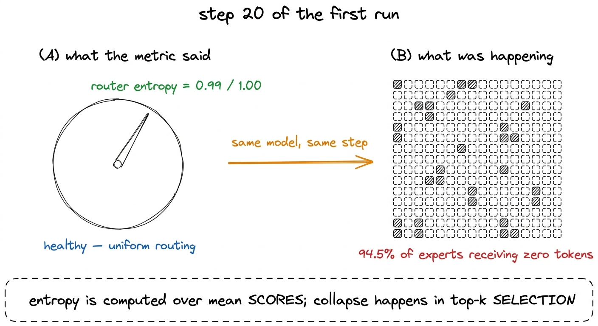
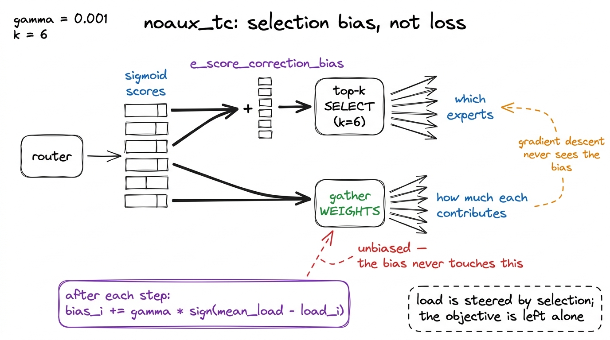
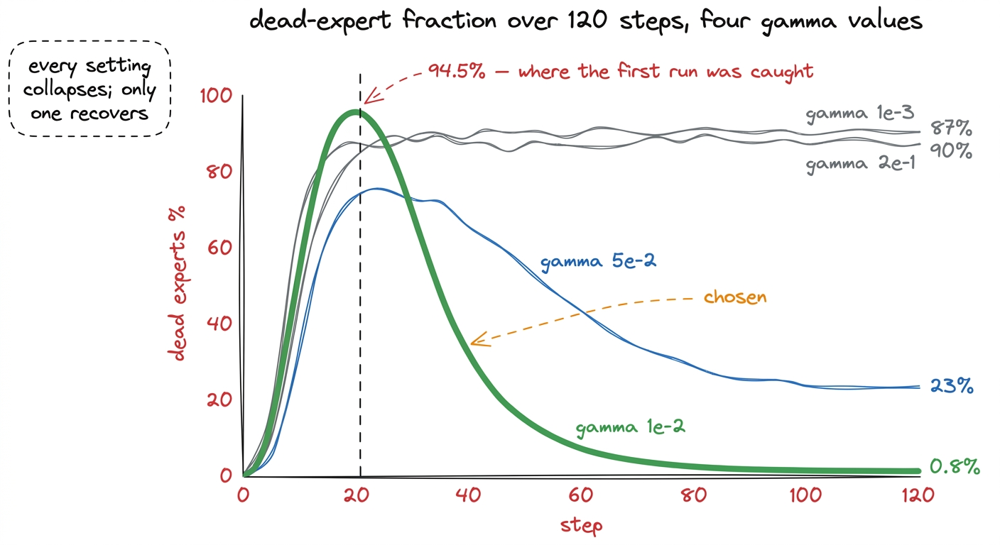
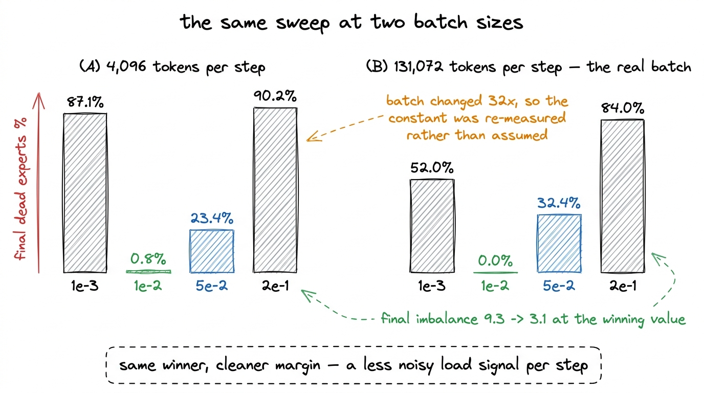
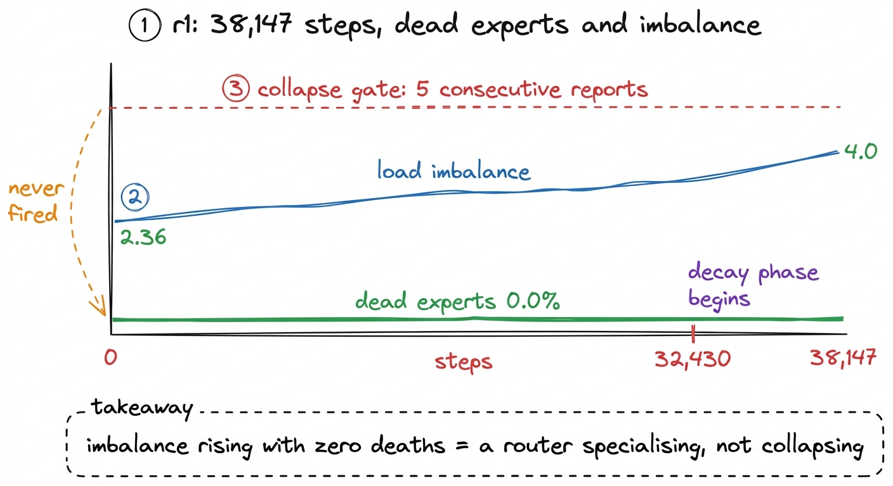

# 16\. 专家坍塌，以及未能发现它的指标

[← 上一章](../15-the-training-loop/README.md) · [返回目录](../../README.md) · [下一章 →](../17-checkpointing/README.md)

第 03 部分 · 让模型训练起来 · 9 分钟 · 5 幅图 · 94.5%

> 训练二十步后，94.5% 的专家收不到 token，路由器熵却仍是 0.99（上限为 1.0）。为何熵指标放过了坍塌，以及四个参数值的扫描如何解决问题。

一个混合专家层包含许多小型前馈网络，并将每个标记发送到其中少数几个网络中。我们的方案包含 256 并将每个标记发送到 6。这种架构使得一个拥有 1.02B 个参数的模型，每标记仅需 145M 个参数的计算量，且它带来了一种在稠密模型中不存在的故障模式：路由器可以决定它更喜欢少数几个专家，并停止使用其余专家。

二十步进入第一次真正的训练运行，  **94.5% 位专家正在接收零个 token。** 

是什么让这一点值得单独成章的，并不是它确实发生了。每一个混合专家模型在训练初期都会出现这种情况，文献中也如此记载。是什么让这一点值得单独成章的，是我们事先选定的、用于精确检测这种状况的指标，在它发生时读出了 0.99 除以 1.0，并且会允许训练运行持续完成。

[](../../figures/expert-collapse-1.png)

图 16-1　同一次训练、同一时刻的监控指标与模型实际状态。

## 为何熵指标会漏掉问题

路由器为每个标记对每个专家产生一个分数，我们选择的健康度量是这些分数的熵。当分布分散时熵较高，当分布集中时熵较低，因此熵较低意味着路由器选择了偏爱的专家。这一推理是合理的，实现也是正确的。

问题在于测量的是哪个分布。熵是在过  **平均值**  批次中各个专家的路由分数，即使路由完全坍塌，其均值也仍然接近均匀分布。选择策略是top-k，而top-k并不关心分数之间的差距大小。如果对于批次中的每一个token，专家7的分数是0.51，专家118的分数是0.49，那么这些分数的均值几乎完全相同，它们之间的熵几乎达到最大值，而专家118从未被选中一次。

这就是整个机制。一个微小而一致的得分差异每次都会获胜，而平均操作会掩盖这一点，因为平均正是消除每个token细节选择所依赖的运算。

在监控层面的修复方法是停止测量分数，转而测量结果。  **不活跃专家占比**  — 本步中未接收到任何 token 的专家占比 — 是在路由之后计算的，与路由器如何做出决策无关，并且无法通过在平均意义上看起来均匀的分布来满足。

```python
# what we were measuring
entropy = -(mean_scores * mean_scores.log()).sum()      # 0.9999 during collapse

# what we should have been measuring
dead_frac = (expert_load == 0).float().mean()            # 0.945 during collapse
imbalance = expert_load.max() / expert_load.mean()       # how lopsided the survivors are
```

这两个较低的数值被纳入训练循环的遥测数据中，并且在本书的其余部分，每十个步长都会报告一次。[^1]

## K3 继承的负载均衡器

K3的配置名称将其平衡方法放在一个字段中： `topk_method: noaux_tc`。该 `noaux` 有趣的部分。它表示“无辅助损失”，并描述了K3从DeepSeek-V3继承的一种方法，该方法在不向损失函数添加任何项的情况下，平衡专家负载。

传统方法会添加一个辅助损失，用于惩罚路由不均衡，然后通过一个系数将其与语言建模损失加权结合。这个系数本质上是一种矛盾：太小会导致路由器坍塌，太大则会使路由器无论是否有助于预测都强制将token均匀分配。模型被要求同时优化两个相互矛盾的目标。

无辅助损失的方法通过将干预完全移出损失中，消除了这种张力。每个专家携带一个标量偏置，该偏置被加到其得分上。  **仅用于选择目的** :

```python
scores = router(x).sigmoid()                 # [tokens, n_experts]
topk = (scores + e_score_correction_bias).topk(k, dim=-1).indices
weights = scores.gather(-1, topk)            # note: the ORIGINAL scores, unbiased
```

偏置决定  *哪个*  专家被选中。应用于所选专家输出的权重从原始、无偏的分数中读取。因此，偏置可以自由地调整负载分配，而不会改变任何专家贡献的大小，且梯度下降过程从未感知到它。

每一步之后，每个偏置都会移动一个微小的增量，以平衡负载：

$$
\mathrm{bias}_{i}\leftarrow\mathrm{bias}_{i}+\mathrm{gamma}\,\operatorname{sign}(\mathrm{mean\_load}-\mathrm{load}_{i})
$$

一个接收到少于平均数量token的专家变得稍容易被选中。一个接收到更多token的专家变得稍难被选中。更新仅使用差值的符号，而非其大小，因此一个严重过载的专家和一个轻微过载的专家在每一步中都会被同等程度地推回。

[](../../figures/expert-collapse-2.png)

图 16-2　无辅助损失的负载均衡器。偏置改变的是哪些专家被选中，绝不改变已选中专家的贡献。

在那段代码中还有一个设计决策被隐藏起来，当模型在GPU上进行分片训练时，这个决策导致了项目后期的崩溃：偏置项必须从优化器中留出。它不是一个可学习的参数。AdamW 会为一个其完整更新规则已经确定的量应用权重衰减和动量，而这两种规则将会相互冲突。在我们的实现中，它被排除在参数组之外，当我们后来转向分片训练时，它也必须从分片中排除，以便每个进程在构造上都以相同的方式计算路由。[^2]

发布代码中的一个细节值得在此处说明，因为它解释了为何必须编写任何相关内容。 `e_score_correction_bias` 以张量的形式存在于 Moonshot 发布的建模代码中，并且它是  **从未初始化且从未更新** 字段已声明，配置名称 `noaux_tc` 作为路由方法，且发布版本中的任何代码都不会改变该值。本章描述的负载均衡器并非对已发布内容的重新实现；它是已发布配置所指的内容，而已发布代码中并不包含这部分内容。这是四个独立原因中的一项，导致已发布代码无法训练，前一章覆盖了其余三个原因。

## 通过测量选择 gamma

DeepSeek-V3 使用 $\mathrm{gamma}=0.001$显而易见的做法是使用相同的数值，而这种做法显然是错误的，原因可以很好地推广到该参数之外。

偏置更新每步应用一次，其相对于得分分布的大小决定了负载移动的速度。但  *加载*  它对每个步骤的token数量的响应是通过测量得出的。DeepSeek在每个步骤中平衡了数百万个token。我们的首次测量在4,096上实现了平衡。当它所响应的信号比原来噪声大三个数量级时，同一个常数意味着不同的东西。

所以我们进行了测量。在真实架构上，四个值，每个值120步：

| gamma | 最差不活跃专家比例 | 最终不活跃专家比例 | 最终负载不均衡度 | 最终损失 |
| --- | --- | --- | --- | --- |
| $1\times10^{-3}$（DeepSeek-V3 采用的值） | 97.3% | 87.1% | 42.8 | 7.815 |
| **$1\times10^{-2}$（选择）** | 81.6% | **0.8%** | **9.3** | 7.824 |
| $5\times10^{-2}$ | 75.8% | 23.4% | 21.6 | 7.940 |
| $2\times10^{-1}$ | 90.2% | 90.2% | 41.2 | 8.002 |

表中值得提取的有三件事。

 **每个设置都早早就坍塌了。**  “最差不活跃”列从 75.8% 到 97.3%，最佳表现的值并不是峰值最低的那个。前几十步出现专家坍塌，并非平衡器不佳的症状；这是未经训练的路由器的行为。门必须提出的问题不是专家是否死亡，而是专家是否回来了。

 **响应不是单调的。**  从 $1\times10^{-3}$ 到 $1\times10^{-2}$ 解决了问题，而进一步到 $2\times10^{-1}$ 使其变得和在 $1\times10^{-3}$ 时一样糟糕。原因在更新规则中是显而易见的：它使用 `sign`，因此一个 0.2 步会无论实际负载差距如何，都将偏置移动 0.2。一旦步长超过其试图缩小的得分差距，相同的专家将在每次迭代中反复在过载和欠载之间切换，偏置随之振荡而非收敛。

最终损失没有明显改变。gamma 跨越两百倍的范围，最终损失在 7.815 至 8.002 之间；选定设置与负载均衡最差的设置相差不到 0.01。这意味着均衡没有以语言建模质量为代价，恰好符合无辅助损失设计的预期。测量验证了这一性质，而非仅在论证中声称它成立。

[](../../figures/expert-collapse-3.png)

图 16-3　四组扫描实验。关键不是峰值，而是恢复过程。

## 批量大小改变后重新测量

上面的扫描实验以每步4,096个token运行。实际的训练运行以每步131,072个token训练，是前者的32倍。

刚刚写下了DeepSeek的常数对我们来说是错误的，因为他们的批次大小与我们的不同，要在一个相同量上发生32倍的变化时，携带我们自己的常数就很难得到合理解释。因此，扫描实验在真实的批次大小下重新进行了：

| gamma | 最差不活跃专家比例 | 最终不活跃专家比例 | 最终负载不均衡度 | 最终损失 |
| --- | --- | --- | --- | --- |
| $1\times10^{-3}$ | 95.3% | 52.0% | 42.8 | 7.082 |
| **$1\times10^{-2}$** | 68.8% | **0.0%** | **3.1** | 7.122 |
| $5\times10^{-2}$ | 78.5% | 32.4% | 33.5 | 7.162 |
| $2\times10^{-1}$ | 93.0% | 84.0% | 33.5 | 7.487 |

相同值获胜，且获胜更干净：最终不活跃比例 0.0% 对 0.8%，最终不平衡 3.1 对 9.3。较大批次为负载均衡器提供了更平稳的负载信号，因此相同的步长效果更佳。

[](../../figures/expert-collapse-4.png)

图 16-4　在训练实际采用的批量大小下重复 gamma 扫描。最优选择没有改变，领先幅度还增大了。

专家坍塌后再恢复的形状在实际批次中也得到了确认，这一确认直接进入了监控设计。一个仅凭单次观测就判定专家坍塌的门控机制，在该项目的前三十步中，会在每一个正常训练运行中触发。[^3]

## 在最终完成的训练中，它表现如何

r1 用 38,147 步进行训练 $\mathrm{gamma}=10^{-2}$ 并且不活跃专家门已启用。该运行自身历史中的相关遥测数据：

- 第 0 步：不活跃专家比例  **0.0%** , 负载不均衡 2.36, 路由器熵 0.9999
- 步 38,140（最后一次完整报告）：不活跃专家  **0.0%** , 负载不均衡 4.0, 路由器熵 0.973

在它们之间，38,000 步中，不活跃专家的比例从未触发过门控。早期专家坍塌仍然发生——它在每一次训练运行中都会发生——并且负载均衡器在第 10 步报告间隔的首次报告步之前将其拉回。

在训练运行中，从 2.36 到 4.0 的不平衡度变化值得注意，因为这是一种真实效应而非噪声。训练初期，路由器尚无偏好，因此负载几乎均匀，这是最不有趣的原因。随着训练的进行，路由器会形成真正的偏好：有些专家专长于代码，有些专长于散文，而一个批次中若包含更多代码token，则会更多地加载代码专家。不平衡度为 4.0 且无死专家，说明路由器已学到知识并仍在使用其全部容量。不平衡度为 2.36 且在第 0 步时，说明路由器什么也没学到。

[](../../figures/expert-collapse-5.png)

图 16-5　已完成训练中专家的健康状况。负载不均衡度上升但没有不活跃专家，是健康的表现。

## 可以迁移的方法

这里有三点值得带入任何混合专家模型，且它们均不特定于 K3。

应测量结果，而非意图。路由器熵反映路由器试图做什么，不活跃专家比例反映实际发生了什么。二者可能不一致，而批内平均正会造成这种不一致；此时应以结果为准。这与通过日志流判断进程存活是同类错误：测量的是平时与目标相关、关键时刻却可能失效的代理量。

 **一篇论文中的常数是在别人条件下测得的数值。**  $\mathrm{gamma}=0.001$ 适用于 DeepSeek-V3。对我们而言，错误幅度是十倍，这一差异完全由批量大小解释，这一点在两篇论文中都明确说明，且容易被忽略。当你采用一个常数时，务必列出你的条件与源文献的不同之处，并重新测量那些涉及这些差异的项目。

 **一个门必须同时对健康数据和损坏数据进行测试。**  编写一个能够捕捉专家坍塌的检测器是直接的。更困难的要求是，一个在每次健康运行的前三十步中都能保持静默的检测器，以检测专家坍塌与恢复过程。本项目中二十四个故障注入测试中有半数断言的是静默而非检测，正是出于这个原因。在正常运行期间发出警报的门会训练其使用者忽视它，这会使你比完全没有这个门的情况更糟糕。

---

[← 上一章](../15-the-training-loop/README.md) · [返回目录](../../README.md) · [下一章 →](../17-checkpointing/README.md)

[^1]: `expert_load` 是每个专家的token计数器，在门内向前传播过程中累积。在激活检查点机制下，它每步递增两次，一次在前向传播中，一次在重计算中，因此计数器翻倍。每个使用它们的消费者都是规模不变的—— $\operatorname{sign}(\mathrm{mean}-\mathrm{load})$, $\frac{\max(\mathrm{load})}{\operatorname{mean}(\mathrm{load})}$, $\operatorname{mean}\!\left(\mathbf{1}_{\mathrm{load}=0}\right)$ ——因此，翻倍不会产生任何影响，但它是一种如果忘记它就会导致混淆的图形现象。

[^2]: 在旗舰模型中，这并非可选的。将偏置留在分片参数集中会产生 `aten::add_.Tensor got mixed torch.Tensor and DTensor`，这至少是一个严重的失败。相同问题的更安静版本在分布式错误一章中有所涵盖：如果每个 rank 从其本地专家负载而非全局负载来计算负载均衡器的更新，偏置将发散，导致同一个 token 根据哪个 GPU 持有它而被路由到不同的专家。

[^3]: 这几乎造成了实际损害。当看门狗获得了实际停止一个训练运行的能力时， `EXPERT_COLLAPSE` 仍是一个单次快照检查，若其前几十步中经过 69-95% 时出现不活跃专家，原本健康的轨迹本应自动被取消。如今该门禁要求连续五个报告均超过阈值。
