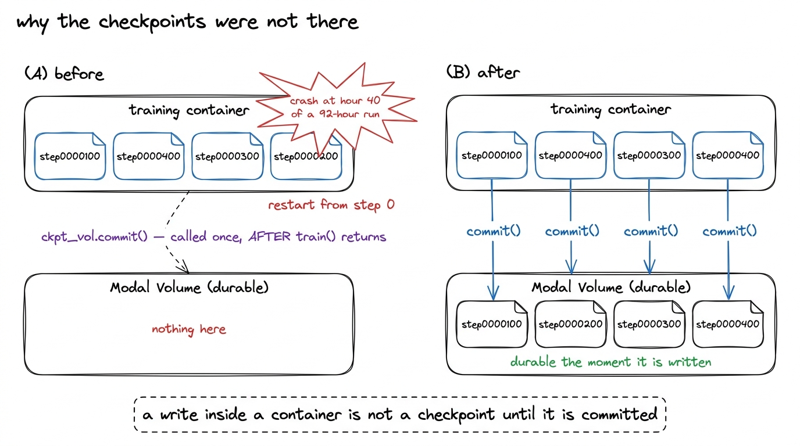
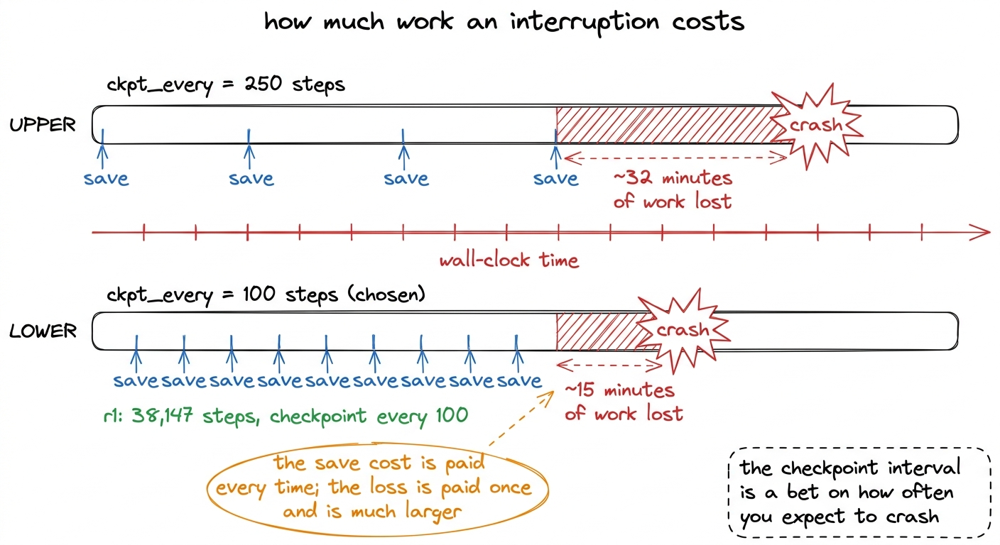
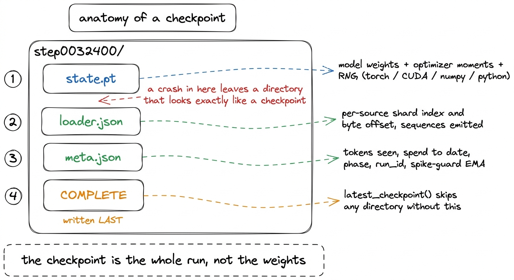
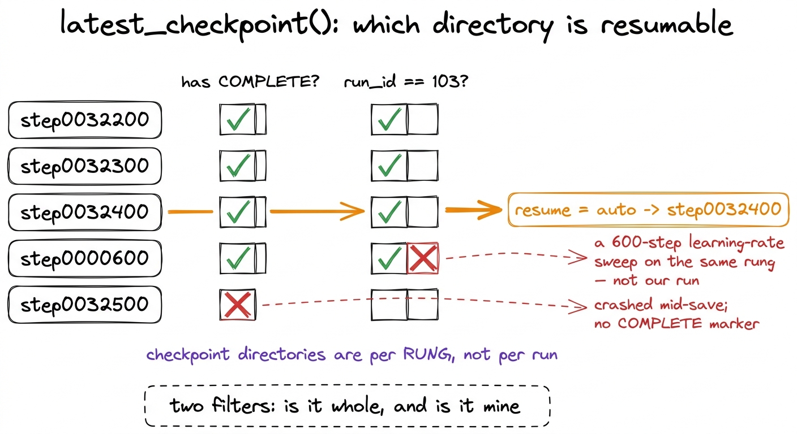
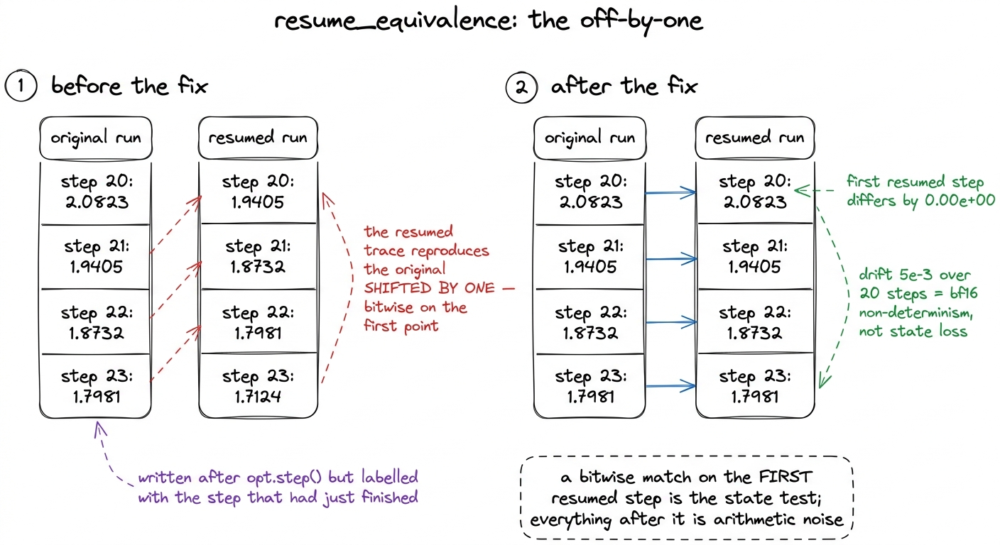
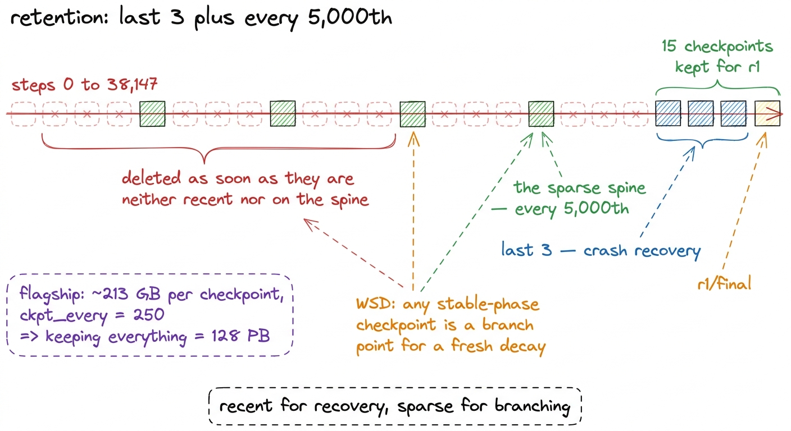
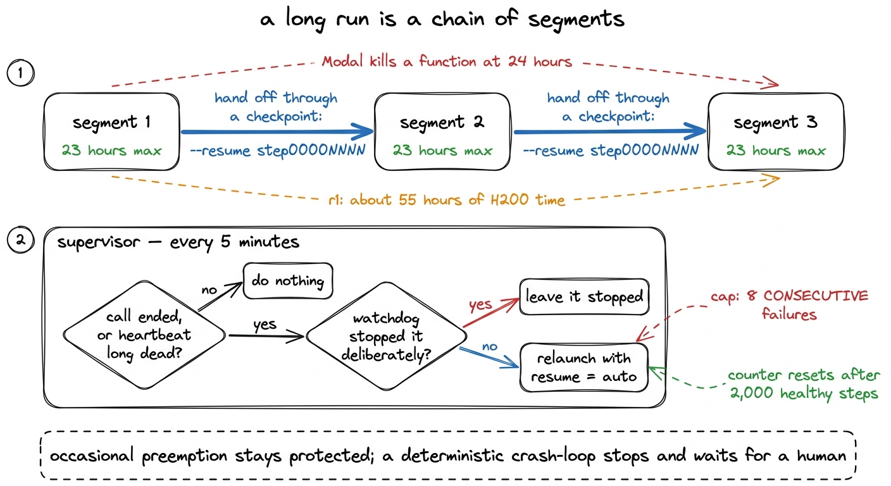

# 17\. 失去 GPU 后仍能恢复的检查点

[← 上一章](../16-expert-collapse/README.md) · [返回目录](../../README.md) · [下一章 →](../18-watching-a-run-you-cannot-see/README.md)

第 03 部分 · 让模型训练起来 · 12 分钟 · 7 幅图

> 检查点包含整个训练状态，而非只有权重：优化器矩估计、数据游标、随机数状态和尖峰保护 EMA。通过两次恢复、逐位比较损失来证明恢复正确。

r1 在单张 H200 上用约 55 小时、38,147 步完成训练；以每小时 4.54 美元计费，这正是 252.35 美元所买到的计算时间。在租用硬件上运行这么久，训练必须能够承受与模型无关的问题：容器被抢占、节点故障、邻近任务导致的内存不足终止，以及平台在 24 小时后强制结束函数。设计时要回答的问题并不是长时间训练会不会中断，而是一次中断会付出多大代价。

当我们查看时，答案是：一切。

## 漏洞

检查点被写入一个 Modal Volume，这是一个在容器之间共享的持久文件系统。一个 Volume 保存容器写入的内容  **提交时** 。直到 `commit()` 被称为写入仅存在于该容器对挂载的视图中，当容器退出时，该视图也随之消失。

`ckpt_vol.commit()` 被调用了一次，之后 `train()` 返回了。

该单一设置使得每个检查点都依赖于训练运行正常结束，这是检查点无需存在的唯一情况。在一次持续92小时的运行中，第40小时发生崩溃，将导致全部数据丢失并从第0步重新开始。代码层面的审查显示没有问题：保存操作已执行，文件确实存在，容器内的目录列表也正确。证据存在于卷中而非代码中，而该卷在本应写入其中的运行中并未保存任何内容。

[](../../figures/checkpointing-1.png)

图 17-1　提交操作的位置，导致每个检查点能否持久保存都依赖于训练是否正常结束。

修复只是将一行代码移动了位置，而本章的其余内容都是关于在移动之前必须成立的其他条件。

## 每次保存都提交，并提高保存频率

第一个变化是图中的那个： `commit_fn` 在每次保存后立即调用，因此当检查点被写入时而非作业结束时，检查点是持久的。

第二个变化是间隔。检查点每隔 250 步保存一次；现在每隔  **100** 区间是进程死亡时丢失的窗口大小，因此在 250 步时，大约每 32 分钟的训练都可能面临风险，而在 100 步时，大约每 15 分钟。代价是保存运行会频繁 2.5 倍，且每次保存都会阻塞循环，持续时间等于将权重和优化器状态写入网络文件系统所需的时间。[^1]

[](../../figures/checkpointing-2.png)

图 17-2　检查点保存间隔，决定了一次中断会损失多长时间窗口内的工作。

## 检查点必须包含整个训练状态

保存模型权重是每个人都会做的，但仅此而已并不能延续一次训练运行。从“权重是安全的”到“训练运行可以继续”之间的差距，正是这里大多数损害的根源：

| 什么 | 为何它属于训练状态 |
| --- | --- |
| 模型权重 | 明显部分 |
| 优化器矩估计 | AdamW的首个和第二个时刻；没有它们，重新执行的步骤就相当于一个正在预热的优化器 |
| 数据加载器游标 | 每个源的分片索引和字节偏移，因此该训练运行不会重新读取其已见过的标记 |
| 随机数生成器 — torch, CUDA, numpy, python | 丢弃掩码和加载器的源数据必须保持相同的序列 |
| 尖峰保护机制的指数移动平均值（EMA） | 基线，即尖峰检测器进行比较的参照标准 |
| 已处理的 token 数 | 本次训练的定价基于预算 |
| 截至目前的花费 | 预算上限 |

保存操作按顺序写入三个文件，然后是一个标记：

```python
torch.save(
  {
    "model": model.state_dict(),
    "optimizer": opt.state_dict(),
    "step": step,
    "rng": {
      "torch": torch.get_rng_state(),
      "cuda": (
        torch.cuda.get_rng_state_all()
        if torch.cuda.is_available()
        else None
      ),
      "numpy": np.random.get_state(),
      "python": random.getstate(),
    },
  },
  path / "state.pt",
)
(
  path / "loader.json"
).write_text(
  json.dumps(
    loader.state_dict(),
    default=str,
  )
)
(path / "meta.json").write_text(
  json.dumps(
    {**meta, "step": step},
    indent=2,
  )
)
(path / COMPLETE).write_text(
  "ok"
)
```

[](../../figures/checkpointing-3.png)

图 17-3　一次保存会按什么顺序写入哪些内容。只有其他内容全部落盘后，才写入完成标记。

最初有两个是缺失的，且任一缺失都不会产生错误。

 **损失尖峰保护机制 EMA。**  训练循环包含一个保护机制，它会将每一步的损失与一个指数移动平均值进行比较，当损失超出该平均值设定比例时，会跳过优化器的更新步骤。[^2] 那个EMA是训练状态。一个恢复操作将在 `None` 禁用护盾在预热窗口内的尖峰检测，然后从损失在那一刻的实际值重新推导一个基线。训练运行在崩溃后最需要安全机制的那个确切时刻恢复，此时安全系统被关闭，没有任何组件报告这一事件的发生。护盾的状态保留在 `meta.json` 并用其余部分重新加载：

```python
def state_dict(self) -> dict:
    return {"ema": self.ema, "consecutive": self.consecutive,
            "total_skipped": self.total_skipped, "events": self.events[-50:]}
```

已处理的 token 数和累计花费也必须保存。恢复时将它们从零开始，会让重启后的训练只报告模型实际见过 token 的一部分，破坏成本核算依据；累计花费也会清零，使预算上限在发生过重启的长训练中失效。保护机制竟被它原本要应对的事件关闭，这正是这类缺陷的共同特征。

## COMPLETE 标记

一次保存操作不是原子性的。在写入过程中发生崩溃，会留下一个目录，其中包含部分文件，文件名和大小看似合理，但没有任何迹象表明其是不完整的。从半写入的权重中恢复运行，会使一个丢失的小时变成一个丢失的训练运行，悄无声息，因为糟糕加载后的损失曲线看起来像一个尖峰，而不是一个损坏的加载。

因此，标记文件是最后写入的，所有其他字节都已写入磁盘之后，加载器会拒绝任何缺少它的内容：

```python
if not (path / COMPLETE).exists():
    raise RuntimeError(
        f"{path} has no {COMPLETE} marker — it is a torn checkpoint from an "
        "interrupted save. Resume from the previous one instead of training "
        "on half-written weights.")
```

`latest_checkpoint()` 在扫描时应用相同的过滤器，因此损坏的目录对自动恢复不可见，而不是在加载时被拒绝。

它旁边还有一个过滤器，因为检查点目录是按每  **规模档位** ，不是每次训练运行。历史上在 r1 上进行的每一个实验都会将其文件留在相同的位置：训练循环章节中的学习率扫描实验运行了 600 步，每种速率运行四次，其检查点与真实训练运行的检查点并列存在。由于两者使用了不同的批处理大小，目录名称和记录的步序都无法正确区分二者，因此两种明显的启发式方法都会选择扫描实验。一次重新启动将会从一个无关的实验中恢复真实预训练运行，其唯一可见的症状将是损失曲线中一个跳跃，这会被解读为一个尖峰。[^3]

检查点因此记录了写入它们的训练运行，且自动恢复仅考虑其自身。r1 的运行 ID 是 103。

[](../../figures/checkpointing-4.png)

图 17-4　自动恢复会拒绝不完整的检查点，也会拒绝同一档位上属于其他实验的检查点。

每个启动器都会经过 `resume="auto"`，解析到该训练运行所属的最新完整检查点。正是这一点使得重启是惰性的：重新启动相同的命令会继续该训练运行，而不是在步骤 0 处静默地启动第二个独立运行。r1 可以容纳在一个 H200 上，且从未被分片，因此对于我们的运行，单个进程解析路径并使用它。在较大的模型上，需要跨两个 B300 使用 FSDP2，rank 0 解析路径并广播它，因为独立解析的各个进程可能会落在不同的检查点上。

## 证明恢复后仍是同一次训练

以上所有内容都是设计。它并未回答恢复的训练运行是否延续了相同的运行，还是仅仅产生一个相似的运行，而这一区别在损失曲线中是不可见的：一个丢失了优化器、数据游标或随机数生成器的运行，其损失曲线看起来就像在训练中加入了更多的噪声。

`resume_equivalence`可以直接回答恢复是否正确。它先进行一段短训练，记录每步损失，再从选定中断点的检查点重建运行，重复后续相同步骤。如果恢复正确，第二条轨迹应重现第一条轨迹从该点开始的损失。这个测试很强：权重、优化器矩估计、数据游标、随机数状态、学习率调度位置、尖峰保护 EMA 或上一章中按规则更新的路由偏置，只要有一项未恢复，就会失败。

它发现了一个真正的错误，而这个错误并不在它原本设计要检查的内容之中。

检查点在`opt.step()`之后写入，所以保存的是该步完成后的状态，却用刚执行完那一步的编号作标签，两者相差一步。恢复时因此重复执行了已经应用的步骤，恢复轨迹与原轨迹错开一位，在首个对应比较点上逐位一致。权重和数据游标都正确，错误的是步计数器；于是每次重启都会让学习率调度和 token 预算静默地再偏移一步。

```python
# A checkpoint is named by COMPLETED STEPS, not by the index of the step
# that just ran.
completed = step + 1
```

[](../../figures/checkpointing-5.png)

图 17-5　等价性测试发现的差一错误，以及修复后的两条轨迹。

修复后，首次恢复的步与原版本不同由  **$0.00\times10^{0}$**  — 逐位相同 — 且差异增长到约  **$5\times10^{-3}$**  在接下来的二十个步骤中。

这两个误差应分别检查，混在一起让第一版测试无法使用。恢复后的第一步检验的是状态：数值尚未来得及分化，因此只要权重、矩估计、游标、随机数和调度都恢复，损失就应逐位一致；缺失状态造成的差异会远高于噪声。后续差异则是漂移，属于预期，因为不同分配历史的两个进程中，bf16 矩阵乘法归约并不保证逐位可复现。早期测试对整个窗口都要求严格容差，反而错误拒绝了一次精确恢复；对长训练之前的检查关卡而言，这种误判方向不合适。

## 保留策略

无法保留每一个检查点，作者用旗舰模型而非 r1 的规模解释原因：旗舰模型每个检查点的权重与优化器状态约为 213 GB；按照当时每 250 步保存一次、覆盖整个计划训练的设置，原文称全部保留将达到 128 PB。

规则是  **最后 3，加上每隔 5,000 个** . 最后三个用于崩溃恢复，这需要时效性而无需其他内容。稀疏主干的存在有不同原因：训练运行采用预热—稳定—衰减调度，而非余弦调度，且稳定阶段的任意一点都可作为新衰减的合法分支点。所有位于主干之外且既非近期又非主干的内容，一旦满足条件即被立即删除。

对于 r1，  **15 检查点得以存活**  在 `kimi-mini-ckpt` 体积，以...结尾 `r1/final`每 100 步保存一次，在 38,147 步内，已写入了略超过 380 个保存点，因此保留操作会删除运行产生的大部分内容，仅保留一小部分——这些内容要么足够近期以便恢复，要么间隔足够远以便分支。删除操作在保存时发生，而非在后续的扫描实验中发生，因为一个必须在末尾运行的扫描实验，与一个必须在末尾运行的提交操作具有相同的缺陷。

[](../../figures/checkpointing-6.png)

图 17-6　保留规则，以及迫使我们采用该规则的存储规模。

## 23 小时的运行时限，以及监督程序

Modal 在 24 小时终止一个函数。r1 需要大约 55 小时的 H200 时间，因此该运行不可能是单个函数调用，无论其检查点设置得多么完善；如果没有时间限制，它将在 24 小时内被终止，无论其处于哪个步骤。因此，该循环具有一个实际时间限制。  **23 小时** 当达到该循环时，循环会保存、提交，并返回一个包含恢复路径的结果。启动器会使用该路径生成下一个段，并重新注册它，因此一个长运行是一个在检查点处连接的段链，而不是一个进程。r1's 55 小时是三个段；上述崩溃算术中的 92-小时运行是四个。

恢复机制的另一半，是处理因计划外原因结束的运行片段。监督器每五分钟运行一次，仅在以下条件同时满足时重启：注册调用已结束或心跳失效足够久；看门狗没有主动停止该训练；训练也没有报告完成。如果撤销主动停止的决定，就会无休止地复活一个正在坍塌的训练。

关键参数是重启上限：最多允许连续 8 次失败，完成 2,000 个健康步骤后计数器清零。如果统计累计失败而非连续失败，就会让一段长期健康训练因为以前受过保护，反而失去保护。一周发生八次抢占、每次之后都有几千步正常训练，说明恢复机制有效；连续八次中断且没有任何进展，则属于重启无法修复的确定性故障，应停止并等待人工处理。

监督器必须谨慎判断什么叫心跳已死，第一版没有做到。`heartbeat_at`在训练循环提交第一份报告前一直为零，因此新训练的心跳年龄会被算成从 Unix 时间起点至今的时长，约二千九百万分钟。一个才启动三分钟、仍在拉取镜像、尚未进入训练循环的任务，就被判定为早已死亡。监督器重启它，却未取消原任务，导致两个进程同时写入同一检查点目录，比完全没有检查点更糟：交错保存的各个文件看似完好，`COMPLETE`标记也被写入，之后的恢复会选中最后落盘的那份。修复是将从未写入过的心跳视为尚未开始，并在启动宽限期之后才应用存活判断。[^4]

[](../../figures/checkpointing-7.png)

图 17-7　将一次训练切成多个时间段的时限，以及在意外结束后重新启动训练的监督程序。

## 可以沿用的做法

这里有三件事并不特定于该模型或该平台。

 **持久性有其边界，了解它处于何处是值得的。**  一个写入容器内的文件，一个写入缓冲区的页面，一个写入事务中的行：每一种看起来已经写入，但在发生其他事情之前都不是持久的。提交错误是一个关于这个边界位置的错误，它之所以通过了审查，是因为代码在假设边界位于别处的情况下是正确的。

 **保存安全系统所处的状态。**  权重和优化器动量是每个人都会记住的状态。尖峰检测器的基准值、累计支出和令牌计数器决定了训练运行在重启后保护机制是否仍然有效，而这三项都默认了一个在最需要时悄然禁用了某种功能的值。

 **写标记最后，先检查它。**  检测一个损坏的写入操作，简化为在所有昂贵操作之后放置一个廉价的观测值。它需要一个文件，而没有它，一个半写入的目录在凌晨三点自动重启时无法与检查点区分开。

测试比机制更重要，因为机制容易编写，但通过阅读很难验证。 `resume_equivalence` 在单个GPU上运行需要几分钟，会在每次长时间启动前执行，并检测到一个缺陷，该缺陷会在每次重启时使学习率调度偏移一步。它通过比较本应相等的两个数值来发现该缺陷。

>  **数据说明：检查点总存储量无法复算为 128 PB** 　原文正文及图 17-6 均写约 213 GB／检查点、每 250 步保存一次，并声称全部保留为 128 PB。按同书旗舰模型计划的 76,294 步计算，常规定期保存约 305 次，$305\times213\,\mathrm{GB}=64{,}965\,\mathrm{GB}$，约 65 TB；即使额外计入起点或终点，也仍是这一量级。因此，128 PB 无法从文中这些条件推出。此处保留原有数值，这一差异需要作者确认。

>  **数据说明：15 个检查点与给出的保留规则之间缺少说明** 　原文及图 17-6 报告 r1 保留 15 个检查点，规则为最后 3 个加每 5,000 步一个。若仅按 38,147 步及这条规则计算，5,000 至 35,000 步有 7 个周期检查点，再加最后 3 个为 10 个；若还保留第 0 步，则为 11 个。15 个可能包含额外保留项或遗留文件，但原文未说明，不能仅凭这条规则复算出来。

---

[← 上一章](../16-expert-collapse/README.md) · [返回目录](../../README.md) · [下一章 →](../18-watching-a-run-you-cannot-see/README.md)

[^1]: 这影响的是监控，而非训练：保存期间心跳会安静下来，r1 最后一次保存持续太久，曾触发按正常训练步频设置的停滞告警。现在，循环会在开始写入前报告`status: "checkpointing"`，让看门狗和监督器采用更长、专用于保存阶段的宽限期。

[^2]: 该保护机制还会跳过 NaN 或 Inf，并在连续跳过多次后中止。它在训练循环一章中有完整描述；此处仅其状态重要。

[^3]: 同样的失败还有一种形式：r1的目录也包含一个 `final` 从一个 40 步的烟测试来看，且早期版本的排序将任何名为目录的 `final` 作为无限近期的。一次数百步训练运行的重启将会采用烟雾测试并从那里愉快地继续下去。

[^4]: 监控章节所陈述的普遍规则是：从日志流中永远无法推断出程序的活跃状态，只能从循环显式写入的时间戳来判断。该规则存在是因为在30年7月，一个过时的日志读取器在引擎已经崩溃后35分钟内仍显示"0/12个分片"。
