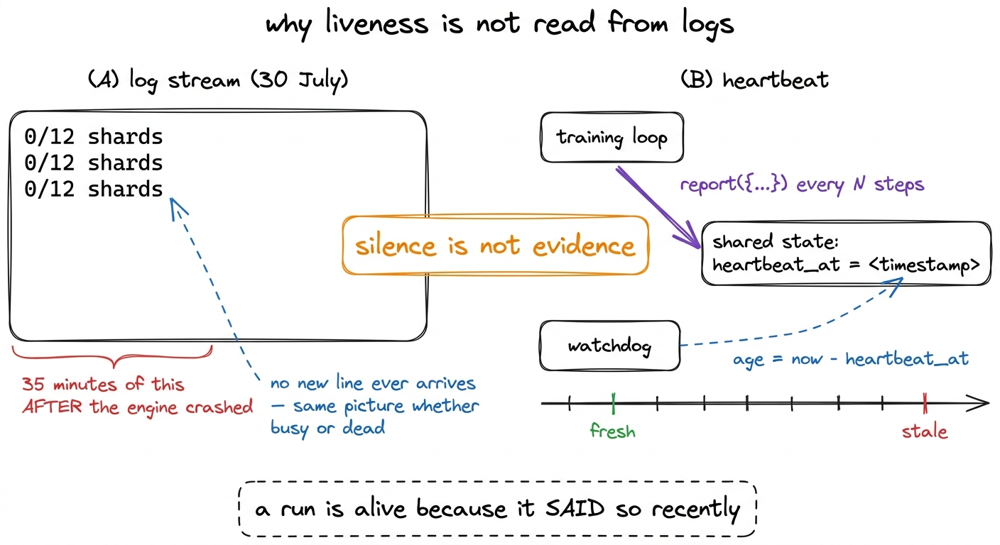
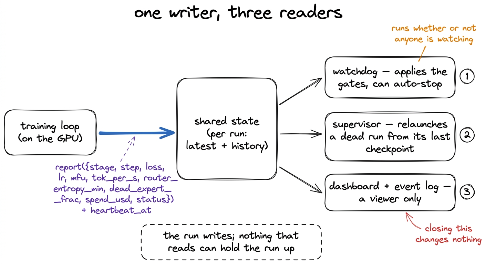
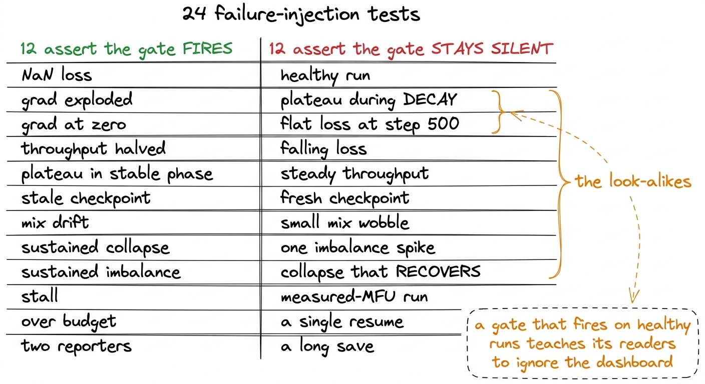
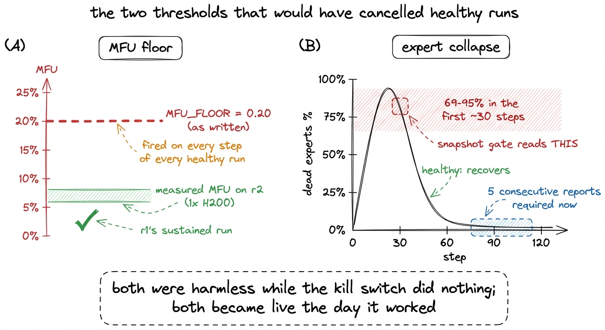
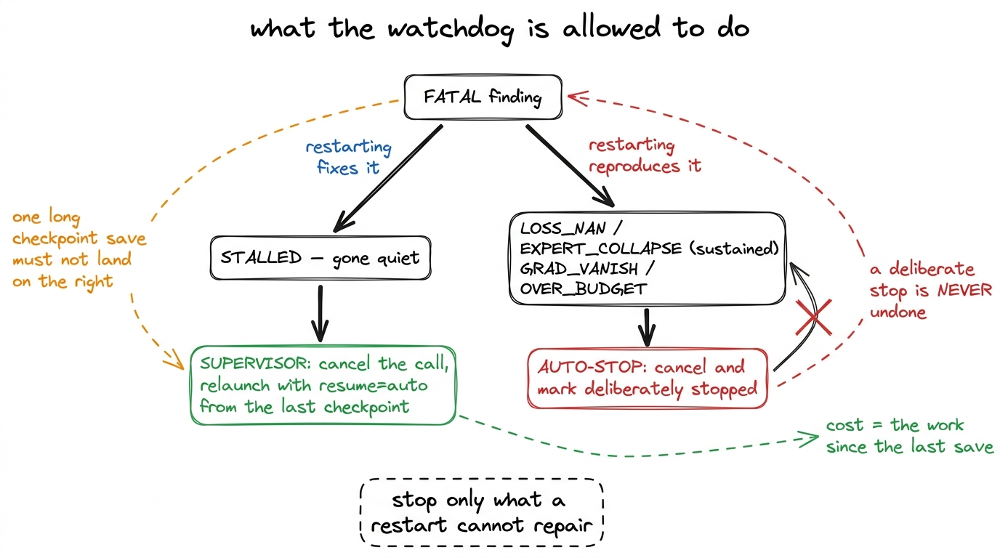
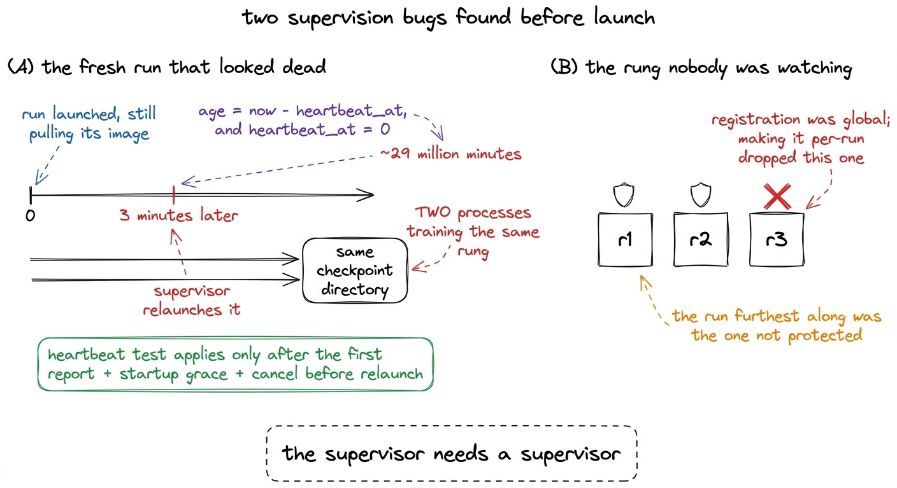

# 18\. 监控看不见的训练过程

[← 上一章](../17-checkpointing/README.md) · [返回目录](../../README.md) · [下一章 →](../19-what-mfu-is/README.md)

第 03 部分 · 让模型训练起来 · 11 分钟 · 6 幅图

> 用心跳时间戳判断存活，而非依赖日志流；二十四项故障注入测试，以及两个会在终止开关生效后误杀健康训练的告警阈值。

租用硬件上的训练默认无法直接看见：GPU 在他人的数据中心，进程位于我们无法登录 shell 的容器里，返回的只有日志流。这种安排会在某一刻失效；7 月 30 日就发生了这样的事：日志读取器连续三十五分钟显示`0/12 shards`，而它读取的运行引擎早已崩溃。

那个读者本身没有出问题。流已经停止了，而一个停止的流，与一个生产者没有新内容可说的流是无法区分的。没有输出，并不能说明任何问题。

那次事件中得出的规则，成为了监控系统其他部分设计决策的基础。  **活性永远不能从日志流中推断出来。**  训练循环会将一个明确的心跳时间戳写入共享状态，而看门狗会将该时间戳与系统时钟进行比较。一个训练运行是存活的，因为它最近表示过这一点，而不是因为它尚未表示过其他情况。

[](../../figures/watching-a-run-you-cannot-see-1.png)

图 18-1　7 月 30 日的事故及其带来的规则。心跳是带时间戳的明确状态声明；日志安静本身并不说明任何事情。

## 训练循环报告什么，由谁读取

训练循环调用一个 `report` 每 N 步执行一次，使用一组固定字段：stage、step、tokens seen、target tokens、loss、learning rate、MFU、tokens per second、minimum router entropy、dead-expert fraction、spend so far、status 和 ETA。该调用开销小且为“发送后即忘”类型。它将在负载中 stamp 当前时间作为 `heartbeat_at`，将一个修剪后的副本追加到该训练运行的历史记录中，并返回。

所有下游组件都从该状态读取，而不是从训练运行读取。看门狗会根据自己的时间表唤醒，无论是否有人员在观察，它会将每个已注册的训练运行与其自身历史记录进行比对，将评估结果写回，并能直接终止某个训练运行。仪表板仅作为查看工具。监督器（在检查点一章中描述）是一个独立的时间表，用于重新启动已终止的训练运行。

[](../../figures/watching-a-run-you-cannot-see-2.png)

图 18-2　系统结构。遥测只写一次，由三个独立消费者读取，训练进程无需等待其中任何一个。

每个训练运行的运行状态而非全局状态更为重要。一个早期版本将每个运行都写入单一 `latest` 和一个单一 `history`，当每次仅训练一个模型时是正确的，一旦同时训练两个模型就会产生破坏性影响。三个规模档位同时进行训练，因此桶的键由运行标识符确定，每个趋势门的计算都是基于单个模型自身的数据点。[^1]

## 检查关卡

一个门是最新遥测快照和历史窗口的纯函数。纯性使得下一节成为可能：每个门都可以在笔记本电脑上使用合成遥测驱动，无需 Modal 且无需 GPU。[^2]

| 门 | 级别 | 能够发现的问题 |
| --- | --- | --- |
| `LOSS_NAN` | 致命的 | 损失在窗口内的任何位置变为 NaN 或 Inf |
| `LOSS_SPIKE` | 警告 | 损失相对于其自身滞后中位数出现了跃升 |
| `EXPERT_COLLAPSE` | 致命的 | 不活跃专家占比在连续报告中较高 |
| `DEAD_EXPERTS` | 警告 | 不活跃专家占比高一次 |
| `NO_ROUTER_TELEMETRY` | 警告 | 不活跃专家指标不再被报告 |
| `LOAD_IMBALANCE` | 警告 | 中位数专家负载不平衡升高，不仅仅是尖峰现象 |
| `STALLED` | 致命的 | 心跳年龄超过阈值 |
| `GRAD_EXPLODE` / `GRAD_VANISH` | 警告 / 致命 | 预裁剪梯度范数过大，或为零 |
| `THROUGHPUT_DROP` | 警告 | 最近的吞吐量低于该训练运行自身建立的中位数 |
| `LOSS_PLATEAU` | 警告 | 损失在稳定阶段停止改善 |
| `CHECKPOINT_STALE` | 警告 | 保存已悄然停止 |
| `MIX_DRIFT` | 警告 | 实际数据混合与清单目标发生了偏离 |
| `DUPLICATE_REPORTERS` | 警告 | 步数反复倒序递减 |
| `OVER_BUDGET` | 致命的 | 超出上限花费 |
| `SUPERVISOR_STALE` | 警告 | 监督系统本身已停止运行 |

该列表的后半部分是为多日训练运行添加的，其中每项都描述了同一类故障：一种运行在看似正常的情况下却浪费数天的机制。一次崩溃会自行显现。一个吞吐量悄然减半的运行，持续生成下降的损失曲线，并安静地将自身成本翻倍。

## 一半测试验证系统应当保持安静

这些门有二十四项故障注入测试。其中十二项注入故障并断言匹配的门会触发。另外十二项注入正常情况并断言没有任何门会触发。

第二组采用了该方法，因为有趣的情况是外观相似的案例。损失趋于平直是稳定阶段的平台期，也是衰减阶段预期的形状，因此平台门被限定在稳定阶段，并在衰减阶段保持静默。损失在前几百步内也存在剧烈波动，因此该门具有最小步数，并在刻意平坦的轨迹上于第 500 步保持静默。若死专家占比 90% 持续存在，则视为专家坍塌；若其恢复，则视为普通早期训练，因此两条轨迹均包含在测试套件中，且仅有一个可能触发。

```python
("plateau NOT flagged during decay",
 lambda: "LOSS_PLATEAU" not in codes(base(phase="decay"), hist(loss=FLAT))),
("collapse-then-recover is NOT auto-stopped",
 lambda: "EXPERT_COLLAPSE" not in codes(
     base(dead_expert_frac=0.9),
     hist(dead=lambda i: 0.9 if i < 70 else 0.01))),
("a previous run's history does not trigger gates",
 lambda: "THROUGHPUT_DROP" not in codes(
     base(tok_per_s=6000),
     hist(tps=lambda i: 28936.0, run_id=PREV) + hist(n=4, tps=lambda i: 6000.0))),
```

那第三个是在实际触发门之后写成的。一个规模档位被重新启动，其最初的步骤与前一次训练运行建立的吞吐量中位数进行了比较，而看门狗报告了在正常运行的训练运行中出现了较大的退化。在计算任何趋势之前，历史数据现在都会被过滤到当前训练运行。

让一半测试验证保持安静，不是为了形式整齐。正常运行时反复触发的告警会让人习惯性忽略仪表盘，留下监督的表象却没有实质。负载不均衡检查就是例子：单快照版本曾整夜反复告警，但这些训练的不活跃专家比例一直健康，因此现在改为比较近期窗口的中位数。均衡器正在纠正尖峰，本来就是正常工作；持续失效才会反映到中位数上。

[](../../figures/watching-a-run-you-cannot-see-3.png)

图 18-3　测试套件。发现问题只是比较容易的那一半。

## 终止开关生效后变得危险的两个阈值

在一段时间内，自动停止路径并未真正停止任何操作。它设置了标志，推送了一个事件并返回，而该标志却没有任何东西读取，因此凌晨三点出现的致命条件导致了仪表盘显示红色且GPU持续计费。修复这一点只需要几行代码。修复所改变的是误报的成本：每一个过去产生无害红色框的阈值，现在都关联到了一个有效的取消操作。当天有两个这样的阈值是危险的。

 **`MFU_FLOOR = 0.20`.**  该常数来源于经过良好调优的稠密训练所能达到的水平，即40到55%，而20%看起来是一个慷慨的下限。在r2（位于我们之上的一档规模，也是MFU工作主要完成的模型）上测得的MFU为5到8%，因此在每个健康的训练运行的每一步，门都被触发。正是出于这个原因，它曾被忽视，而这正是它得以存活足够长时间并最终被武装的原因。该下限被重置为3%，而r1自身的持续  **2.4% 到 2.5%**  后来表明，即使 3% 仍高于效率最低的健康模型在梯级上的位置，因此它仍需再次移动。必须为最小的健康模型放置地板，而不是最大的模型，因为较小的模型每 FLOP 所携带的开销比例更大。

 **`EXPERT_COLLAPSE`，基于单个快照进行评估。**  正如我们在路由器坍塌时所看到的，一个健康运行的不活跃专家占比会经过  **69 到 95%**  在每个负载均衡器强度下，其前三十步或左右的测量中，都会出现这种现象，然后恢复。一个快照门会将该轨迹的峰值读取为一次致命坍塌，因此在其后配备一个有效取消机制的情况下，这对系统会在最初的分钟内反复取消健康的运行，而监督器被正确地禁止撤销一次有意的停止。该门现在要求  **五份连续的报告**  在达到致命水平之前高于阈值；一次高读数是警告，表明负载均衡器仍可能恢复。

[](../../figures/watching-a-run-you-cannot-see-4.png)

图 18-4　两次阈值校准。无人采取行动的阈值只是注释；与取消操作连接的阈值则是一项决策。

## 停止与重启是两种不同的判断

`STALLED` 仍被检测到且仍被标记为致命。它不再触发自动停止。

推理是关于每个响应后续含义的。 `STALLED` 说训练运行已变得静默，这是一种存活问题，监督器已经正确处理：它会取消调用并从最后一个检查点重新启动，最多只会丢失最后一次保存之后的工作。而自动停止则标记该运行  **故意停止** ，且一次故意的停止永远不会被撤销，因为撤销一次将会在循环中不断复活一个崩溃的训练运行。因此，一次短暂的挂起，或一个运行时间过长的单次检查点保存，都会使一个健康的训练运行在GPU上被占用，直到有人注意到。[^3]

自动停止现在只用于重启无法解决的问题：NaN 损失、持续的路由器坍塌、梯度消失或预算超限。对这些情况进行重启，只会重现同样的问题。

[](../../figures/watching-a-run-you-cannot-see-5.png)

图 18-5　两种响应方式的分界。二者并不对称：重启可以逆转，刻意停止则不能。

## 无人能够读懂的告警

看门狗发现的所有问题都被推入一个无人消费的队列。告警从系统首次部署起就不断积累，却没有任何人或页面读取它们；与此同时，检测机制本身始终工作正常。

发现结果现在也记录在一个有界事件日志中，该日志同时在仪表板和终端状态视图中显示，因此早上三点提出的发现到九点时依然可见。其旁边还发现了两个较小的问题。由于仪表板内联脚本中存在重复声明，这构成一个语法错误，而无法解析的脚本不会生成任何图表和卡片，导致页面一直停留在“加载”状态，因此在一段时间内仪表板完全没有任何显示。[^4] 它一直在回放看门狗存储的判定结果，而不是评估当前的遥测数据，因此只要过时的判定结果存在，它就能持续显示来自之前运行的致命状态。

## 监督监督程序

在启动规模阶梯的训练之前，我们进行了一次运行前检查，结果在本该保护训练的系统中发现了两个问题。

第一个： `heartbeat_at` 为尚未上报的训练运行，其值为零。监督器计算的心跳年龄为 $\mathrm{now}-\mathrm{heartbeat\_at}$，对于一次新的训练运行大约是  **29M 分钟** ，因此每个新启动的训练运行看起来都像是从 1970 以来一直静默的。r2 被重新启动  **在启动后三分钟** ，而在拉取容器镜像期间，该时期的监督程序并未在启动替代进程前取消原进程。两个进程随后同时在同一个规模档位上训练同一个检查点目录，直到任一进程未达到步骤 100 并写入数据之前就被发现。该修复包含三个部分：心跳测试仅在运行曾报告过之后才生效，启动宽容期覆盖镜像拉取和模型构建，且监督程序在重新启动前会取消原进程。

第二个：r3 从未被监督。崩溃恢复的注册是全局的，而使其按训练运行独立的设置是静默地被移除的。进度最远的运行是没有任何保护的那个，这类错误通常呈现的形态是：运行时间最长的那一个最有可能遵循旧的约定进行注册，而一旦丢失，其代价也最高。

[](../../figures/watching-a-run-you-cannot-see-6.png)

图 18-6　运行前检查发现的两个故障。两者都出在恢复系统中，而非训练代码中。

两个修复都是具体的。由于它们而增加的内容是通用的：看门狗现在会在每次迭代中检查监督系统本身的若干基本不变量。每一次报告运行都必须注册用于崩溃恢复，否则一旦崩溃就无法恢复。每个活跃运行最新恢复的检查点必须属于该运行本身，否则重启会加载错误的模型。并且监督器必须最近运行过，这一点看门狗可以观察到，而监督器本身无法得知。两个调度程序相互验证；如果两者都停止，只有人能够察觉，而这正是我们所接受的残余风险。[^5]

## 在最终完成的训练中，它表现如何

r1 用所有这些配置训练了 38,147 步，且没有一个门被触发了致命发现。在最后一次完整报告时，遥测数据显示损失  **2.623** , 学习率 $6.07\times10^{-5}$, 吞吐量  **28,936 tok/s** , MFU 2.5%, 不活跃专家  **0.0%** , 负载不均衡 4.0, 最小路由器熵 0.973, 梯度范数 0.299, 和花费  **252.35 美元** 在整个训练运行中跳过了零损失尖峰。

这是一个安静的记录，而安静正是其结果。该系统在 r1 上的价值，并不在于它捕捉到了什么；而在于当仪表盘为绿色时，绿色意味着某种意义，因为这些闸门已经同时经过了健康形态与破损形态的测试。这里提到的三点，可以迁移到我们所不拥有的硬件上长期运行的任何场景中。

 **活跃性需要一个带时间戳的肯定陈述。**  任何其他东西，无论是日志行、开放连接，还是未退出的进程，都是一种代理，它在你需要它不再起作用之前，始终与目标事物相关联。这与通过读取路由器熵来检测专家坍塌的错误本质上相同，只是穿着不同的外衣。

 **一个没有人采取行动的阈值就是一个评论。**  这两个危险的常量早已明显错误一段时间，且二者都被容忍，因为它们唯一的后果只是出现一个红色框。当“取消”开始生效时，它们便变成了决策，而一个阈值一旦成为决策，就应从测量中重新推导，而不是继承。

 **将恢复系统作为一个整体系统进行测试。**  门在任何监督错误出现之前都得到了良好覆盖，而这些错误都并不在门上。它们出现在注册阶段，在时间零点的算术边缘情况中，以及在一个从未在真实进程中触发的取消调用中。

---

[← 上一章](../17-checkpointing/README.md) · [返回目录](../../README.md) · [下一章 →](../19-what-mfu-is/README.md)

[^1]: 历史缓冲区不仅保留最旧的点，也保留最新的点，而不仅仅是简单的尾部。一个每十步记录一次的日志运行会产生数千个点，如果丢弃最旧的点，就会丢失专家坍塌发生并恢复的窗口，而这正是负载均衡器曾经起作用的唯一证据。

[^2]: 窗口同样重要，而快照也必不可少。看门狗按照固定周期唤醒，而 NaN 损失或损失尖峰是短暂的——它们可能在两次轮询之间出现并被覆盖。该检查机制的首个版本仅检查当前快照，并直接将 NaN 传递过去。

[^3]: 旗舰模型每检查点写入约 213 GB，且保存操作会阻塞循环，因此其心跳信号会持续很长时间真正静默。一个最后一次报告状态为 `checkpointing` 比那些直接静默的运行获得了更长的宽限期；在写入过程中终止它会破坏一个健康的训练运行，并留下一个损坏的检查点。

[^4]: 该页面现在安装了一个顶层错误处理器，它会将内容替换为“DASHBOARD BROKEN”，并且其脚本在部署前会进行语法检查。一个空白页面和一个健康页面在初看时看起来非常相似；而一个标明已损坏的页面则完全不同。

[^5]: 自动停止路径有自己的端到端测试：它会启动一个替身函数，注入一个致命遥测快照，运行真正的看门狗，然后断言调用实际上已经终止。该测试立即发现修复本身中的一个错误：取消操作被传入了该客户端不接受的参数，因此一直以静默方式失败。一个从未在真实进程中被触发的终止开关，其状态是未知的。
