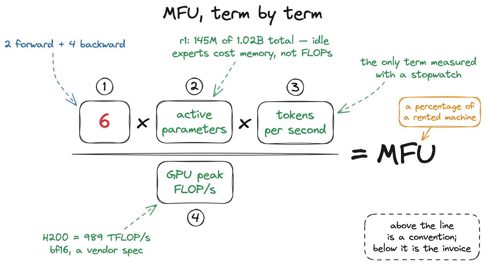
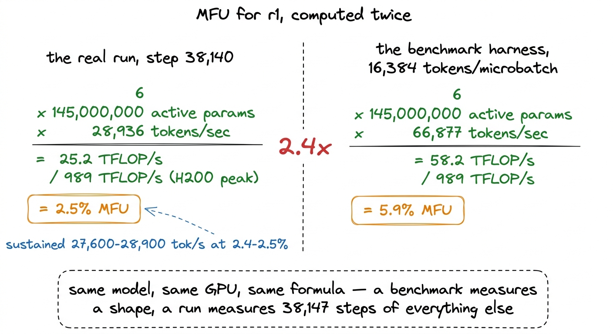
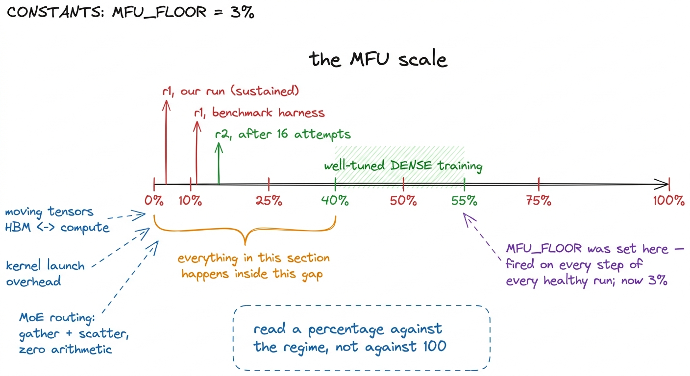
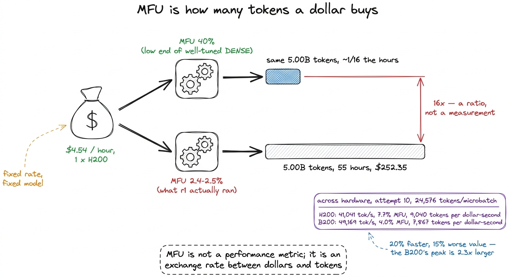
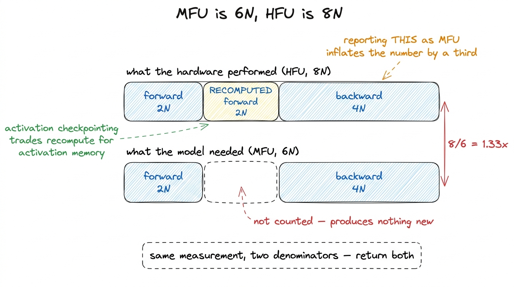
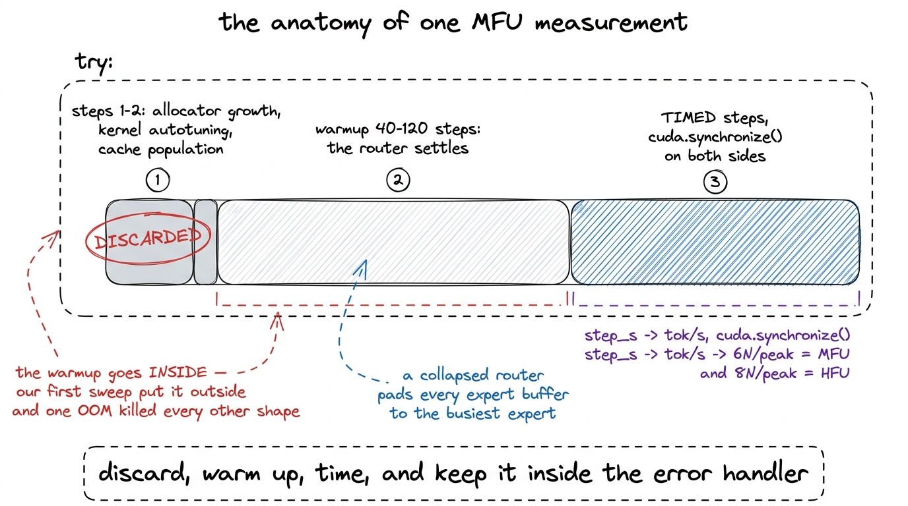
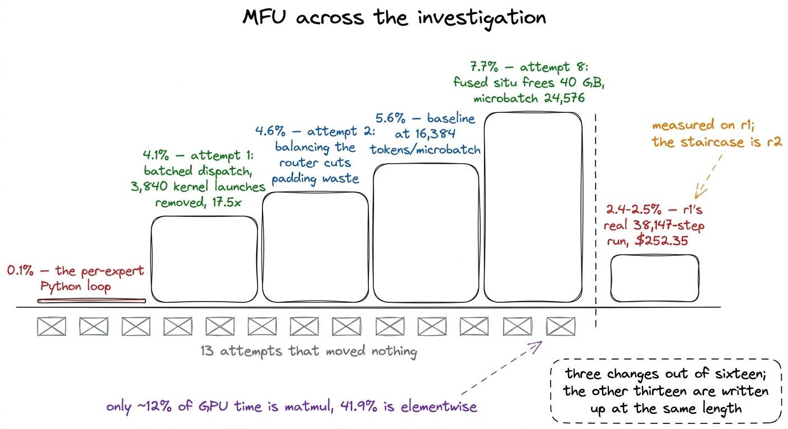

# 19\. 什么是 MFU，以及它为何决定计算资源的兑换率

[← 上一章](../18-watching-a-run-you-cannot-see/README.md) · [返回目录](../../README.md) · [下一章 →](../20-the-expert-loop/README.md)

第 04 部分 · 让训练更快 · 10 分钟 · 7 幅图 · 6N

> 从基本原理推导模型 FLOPs 利用率，识别四种误导测量的方式，并把百分比换算成训练预算。

GPU 按小时租用，却被用于执行算术操作。这两个计量单位不同，它们之间的换算关系，决定固定预算能训练五十亿还是五百亿个 token。这种关系由模型 FLOPs 利用率体现，本书这一部分用六个章节讨论如何提高它。

本章对其进行了定义，结合我们自己的训练运行数据举了一个例子，并阐述了测量值会误导你的四种方式。这四种方式都耗费了我们的时间。

## 定义

 **模型 FLOPs 利用率** ，通常写作 MFU，回答一个问题：在 GPU 具备的所有算术运算能力中，训练实际使用了多少？

$$
\mathrm{MFU}=\frac{\text{useful FLOPs per second}}{\text{GPU peak FLOPs per second}}
$$

分母来自供应商。一个 H200 的表现大致  **989T**  次 bf16 浮点运算／秒；本部分的每项测量都以这个数字作为分母。[^1]

分子的计算依赖一种约定。可以精确统计 Transformer 执行的乘法次数，但工作繁琐，而且每次架构变化都要重新计算。常见近似是：每个参数、每个 token 需要六次浮点运算，前向两次、反向四次。前向中每个参数参与一次乘法和一次加法；反向还要分别计算输入梯度与权重梯度，总工作量约为前向的两倍。

因此分子坍塌为三个我们已经知道的东西的乘积：

$$
\begin{aligned}\text{useful FLOPs per second}&=6\times\mathrm{active\_parameters}\\&\quad\times\mathrm{tokens\_per\_second}\end{aligned}
$$

对于混合专家模型来说，单词  *激活*  在该表达式中确实是在做实际工作。我们的 r1 持有 1.02B 个参数，其中 145M 个参数参与任意给定的 token，因此分子使用了 145M。那些在某个 token 期间处于闲置状态的参数会占用内存，但在 FLOPs 上成本为零，这是架构设计用来获取的权衡。

[](../../figures/what-mfu-is-1.png)

图 19-1　逐项解释公式。只有每秒 token 数是实测的，其余各项在训练开始前就已知。

## 用本次训练的数字完整计算一遍

在第 38,140 步的完成 r1 训练运行中——结束前最后一次完整的遥测报告——训练循环正在运行  **28,936 个token每秒**  在一台 H200 上。

将三个数字放入分子中：

$$
\begin{aligned}6\times145{,}000{,}000\times28{,}936&\approx2.52\times10^{13}\,\mathrm{FLOP/s}\\&=25.2\,\mathrm{TFLOP/s}\end{aligned}
$$

除以 H200 的峰值：

$$
\frac{25.2}{989}\approx0.0255\approx2.5\%
$$

哪一个运行报告了 2.5%。在整个 55 小时内，r1 保持了  **27,600 到 28,900 个 token 每秒，达到 2.4 到 2.5% MFU** 大约 97.5% 的算术能力我们租用的算术能力用于其他用途。

在基准测试套件上的相同计算中，对于同一模型和同一显卡，会得到不同的结果。在每微批次16,384个token时，测得r1  **66,877 个token每秒** :

$$
\begin{aligned}6\times145{,}000{,}000\times66{,}877&\approx5.82\times10^{13}\,\mathrm{FLOP/s}\\&=58.2\,\mathrm{TFLOP/s}\\\frac{58.2}{989}&\approx5.9\%\end{aligned}
$$

两张图都正确地测量了不同的内容。基准测试测量的是一个形状：一个批次，重复执行，期间没有任何其他操作。训练运行测量的是一个调度方案：数据加载器从网络卷中读取分片，每 100 步保存一个检查点，一个评估工作进程，以及连续的 38,147 步的所有操作。我们分别报告它们各自的真实内容，从不将其中更令人满意的一面作为两者共同的结果。

[](../../figures/what-mfu-is-2.png)

图 19-2　将同一套计算分别用于基准测试和实际训练，两者都使用 r1。

## 为何没有人达到 100%

一个在 100% MFU 下的 GPU 会将每一个时钟周期都用于乘累加单元，其运算操作数已经存在于寄存器中。实际训练则会花费时间在一些必要的、而非算术运算的工作上：在高带宽内存和计算单元之间移动张量、启动内核、归一化、类型转换、添加残差，以及在分布式训练运行中等待其他显卡。

参考点设定了任何测量都应以此为基准进行读取的尺度。

| 运行方式 | MFU |
| --- | --- |
| 调优良好的稠密模型训练 | 40-55% |
| 混合专家模型/MoE | 更低，因为路由在不进行计算的情况下移动数据 |
| 完成全部优化调查后的 r2 | **7.7%** |
| 我们的 r1 训练，持续运行时 | **2.4-2.5%** |

一个混合专家模型从结构上的劣势开始，而非实现失败。将一个token路由到一个专家，意味着从一个连续的批次中提取该token的隐藏状态，将其放入每个专家的缓冲区中，运行该专家，并将结果分散回去。提取和分散操作均不执行任何有用的浮点运算，且所有操作都消耗内存带宽。模型越稀疏，移动与算术操作的比例就越大，r1将每个token路由到6个256专家中。

了解规模也保护了我们后来发现的一个监控错误。当看门狗获得了自动停止一次训练运行的能力时，其下限是 `MFU_FLOOR = 0.20`，图中一个健康的稠密规模档位可能接近。它在项目中每一次健康的训练运行的每一步都启动了。地板现在是3%。[^2]

[](../../figures/what-mfu-is-3.png)

图 19-3　本部分各个数字所在的位置。右侧区间是稠密训练能够达到的水平，左侧标记则是我们的结果。

## MFU 是金钱与 token 之间的兑换率

上面的一切都是定义。这部分让一个百分比值相当于六章内容。

预训练预算以美元计，但它所购买的是token，而MFU是将两者相互转换的速率。当模型和硬件固定时，MFU加倍会将固定token预算的成本减半，或者在固定成本下将token预算加倍。

我们的训练运行给出了该陈述最清晰的版本。r1 在 5.00B 个token上进行预训练，使用一台租用的 H200  **每小时\$4.54** ，总计  **\$252.35** ，大约  **55 小时**  从 2.4 到 2.5% MFU 的墙钟时间。在 40% MFU，密集训练达到的低端水平，相同的 token 数量所需的时间大约仅为该时间的十六分之一，成本也大约仅为该费用的十六分之一。这是基于比率而非测量的算术运算，且假设了一个并不存在的模型版本。它描述了这一差距的价值。

旗舰模型，计划规模为两B300  **每小时7.10 美元**  每个，都会在更大的账单上支付相同的费率。从我们自己的测量结果中得出的两个外推结果对它会获得的分数存在分歧：在实施优化后，以 r1 和 r2 为基准的尺寸匹配给出 $\mathrm{active}^{0.35}$ 和项目  **12.5%** ，而早期尝试 3 的拟合结果为 $\mathrm{active}^{0.39}$ 和项目  **2.3%** 两者都是从少数几个数据点外推而来，而非实际测量结果，我们将其表述为外推。两者之间的差距才是关键。利用率提升五倍，意味着购买了五倍的token，而token数量是决定一个给定规模模型最终掌握知识的两个关键量之一。

汇率也贯穿硬件，不仅贯穿代码。尝试 10 租用了 B200 用于相同的 24,576-token 微批次，实现了 r2  **41,041 个token/秒 在 7.7%**  MFU 在 H200 上。返回的 B200  **49,169 个token/秒 在 4.0%**  MFU：20% 倍的吞吐量，相较于峰值 2.3 倍更大的情况。按美元-秒计价，H200 实现了  **9,040**  token 和 B200  **7,867** ，因此较慢的显卡更成本高效 15%。因此，MFU 分析并非被附加到研究项目上的性能工程；它是该项目的预算线。

[](../../figures/what-mfu-is-4.png)

图 19-4　相同资金、相同模型在两种利用率下的结果，以及两张显卡上相同微批量的结果。这解释了为何一个百分比值得在本书中独占一部分。

## 避免自我误导的测量方法

在优化任何内容之前，测量必须是可靠的。四个错误耗费了我们真实的时间，而每一个错误都会产生一个看似合理的数值。

 **丢弃前两步。**  任何测量的初始步骤都包含一次性的开销，这些开销将永远不会再被支付：缓存分配器增长到其工作大小，内核针对刚刚接收到的形状进行自动调优，缓存被填充。在报告中对这些开销取平均值，得到的步骤时间将无法被后续的步骤所匹配。我们的基准测试会舍去前两个计时步骤，并对剩下的步骤取平均值。

 **预热足够长的时间，以使路由器稳定。**  这一点专门针对混合专家模型，是有人在适配稠密基准时最可能犯的错误。一个新初始化的路由器会发生专家坍塌，正如专家坍塌一章所描述的那样，它会将几乎每个token路由到少数几个专家上。融合分发会将每个专家的缓冲区填充到最繁忙专家的大小，因此一个发生坍塌的路由器会产生巨大的填充量，且每步的运行时间与稳态无关。该基准因此需要预热。  **40 到 120 步**  在开始计时器之前，它会返回在计时时刻测得的负载不平衡情况以及MFU值，因此在路由器尚未稳定时的测量结果会显示在输出中，而不是隐藏在其内部。

 **保持 MFU 和 HFU 分开。**  通过激活检查点，前向传递在反向传递期间被重新计算，因此无需存储中间激活值。芯片因此大约执行  **8N**  每token的浮点运算次数而非6N。那额外的2N是硬件实际完成的工作，而这类工作是没有用的，因为它们产生的是模型本已拥有的内容。  **硬件 FLOPs 利用率** , HFU，是8N的数值；MFU是6N的数值。将HFU报告为MFU会使数值增加三分之一。我们的基准测试在同一测量中，使用同一字典返回两者。

[](../../figures/what-mfu-is-5.png)

图 19-5　两种利用率数值的差异，恰好来自重计算。

预热必须放入错误处理范围内。这是一个很不起眼、代价却很高的错误。基准扫描遍历不同形状，总会遇到批量放不进显存的情况；正确做法是记录该形状失败，然后继续。我们第一次扫描把预热循环放在`try`块之外，一个过大批量触发的显存不足异常便终止了整次扫描，其他测量一并丢失。一小时 GPU 时间最终只换来一条错误消息。

固定版本将所有内容，包括预热，都保留在守卫之内：

```python
imbalance = None
times = []
try:
  for _ in range(
    warmup
  ):  # 40-120 steps
    loss = model(
      input_ids=ids,
      labels=ids,
    ).loss
    loss.backward()
    opt.step()
    opt.zero_grad(
      set_to_none=True
    )
    imbalance = balancer_step(
      model
    ).get(
      "load_imbalance_max"
    )

  for i in range(steps):
    torch.cuda.synchronize()
    t0 = time.time()
    loss = model(
      input_ids=ids,
      labels=ids,
    ).loss
    loss.backward()
    opt.step()
    opt.zero_grad(
      set_to_none=True
    )
    balancer_step(model)
    torch.cuda.synchronize()
    times.append(
      time.time() - t0
    )
except Exception as e:
  return {
    "which": which,
    "batch": batch,
    "seq_len": seq_len,
    "error": f"{type(e).__name__}: {str(e)[:400]}",
  }
```

那里有两个细节很重要。The `torch.cuda.synchronize()` 时间区域两侧都存在调用，是因为CUDA工作是异步的：没有它们， `time.time()` 衡量的是 Python 队列工作所花费的时间，而不是 GPU 执行它所花费的时间。和 `balancer_step` 在时间区域内部运行，因为它也在训练中运行，而一个忽略每步成本的基准测试所测量的模型实际上没有人去训练。

百分比的计算则需要四行代码：

```python
step_s = sum(times[2:]) / max(len(times) - 2, 1)   # drop the first two
tok_s  = (batch * seq_len) / step_s
mfu    = 6 * active * tok_s / peak
hfu    = (8 if checkpointing else 6) * active * tok_s / peak
```

[](../../figures/what-mfu-is-6.png)

图 19-6　从头到尾的一次测量。包围整个过程的 try 块不可省略。

第五个纪律是记账而不是测量：基准和训练循环必须构建相同的模型。[^3]

## 这些测量来自哪里

本节中的每一个数值均来自以下两个工具包中的一个。第一个工具包遍历一组形状，并为每一步打印一个包含每个步骤的token数、步骤时间、每秒token数、MFU、HFU、峰值内存和负载不平衡的行。第二个工具包是内核性能剖析，它终结了本次调查，并拥有独立的一章。两者默认值均为 `r2`，位于本书所用规模档位之上的那个档位，因为该档位是本节大部分工作的测量基准。[^4]

## 本部分接下来讨论什么

两个数字框定了接下来的一切。

第一个是  **7.7%** ，这是 r2 在一个 H200 上通过十六次编号尝试的调查中达到的结果，其中三次成功。尝试 1 到 15 均在 r2 上进行测量；尝试 16 属于旗舰模型，在两个 B300 上进行，是另一段故事。通往 7.7% 的路径并非渐进的。尝试 1 发现专家分发在每步运行 3,840 个顺序内核启动，并将其替换为批处理矩阵乘法，这将 MFU 从  **0.1% 到 4.1%**  一次更改。通过平衡路由器来减少填充浪费，使其从 4.1% 降至 4.6%，并保持 `situ` 在 float32 上增加了进一步的 0.1 点。尝试 8 实现了融合。 `situ` 将激活合并到一个 Triton 内核中，在相等的批大小下并未提速，与 5.6% 基线相比得分为 5.5%；它所做的只是为一个 50% 更大的微批释放了足够内存，并且在每微批 24,576 个 token 的情况下，数量达到了  **7.7%** 另外十三次尝试，每次的推理在当时看来都似乎合理，却毫无进展。

第二个是  **2.4% 到 2.5%** ，这是 r1 的实际 38,147-步运行所维持的数值。即与 \$252.35 相关联的数值。

他们之间存在着一个发现，它解释了两者，来自本应是我们的第一次性能剖析运行：仅约  **12% 的 GPU 时间**  是矩阵乘法，和  **41.9%**  是逐元素运算将数据移动而几乎不进行计算。处于这种状态的模型是内存带宽受限的，而针对计算受限模型所采用的杠杆——更大的批量、更多内存、更快的注意力内核、更低精度的矩阵乘法——都不适用。我们在测量之前尝试了所有四种方法。接下来的六章按顺序讲述这个故事。

[](../../figures/what-mfu-is-7.png)

图 19-7　本部分在 r2 上测得的优化轨迹；右侧条形表示 r1 的实际训练。

---

[← 上一章](../18-watching-a-run-you-cannot-see/README.md) · [返回目录](../../README.md) · [下一章 →](../20-the-expert-loop/README.md)

[^1]: 峰值 FLOP/s 数据来自厂商的密集 bf16 规格，而非我们实际测量的结果，我们的框架为每种卡型保留一个此类数值。由于分母是按卡计算的，因此 MFU 指标仅能与在同一卡型上测量的结果进行比较。B200 的峰值是 H200 的 2.3 倍，这就是为什么在更高的 token 速率下，相同模型的得分百分比会更低。关于更大 GPU 的一章展示了当这一规则被忽视时会发生什么。

[^2]: 一个从文献中写出来的阈值，而不是从你自己测量中得出的阈值，就是一个从未见过你系统运行的阈值。监控一章介绍了本项目中两个在它们能够发挥作用的瞬间就具有实际危险性的门，而这正是其中之一。

[^3]: 我们的模型发生了漂移。在一段时间内，基准测试应用了融合的Triton `situ` 激活情况而训练路径没有，因此每个 MFU 和内存数量描述的都是从未有任何一次训练运行使用过的配置。现在两者都通过同一个函数构建模型，并且任何有意偏离训练配置的情况都会与测量结果一起被记录下来，而不是被隐含地留下。

[^4]: 两个适用于整个部分的归因。尝试 1 至 15 在 r2 上进行测量，拥有 307M 个激活参数，使用一个 H200；尝试 16，融合分发悬崖，在旗舰模型上进行测量，跨越两个 B300，且该模型在第 890 步失败。此外，我们的 MLA 运行在一个 sdpa shim 上，该 shim 注册于 `flash_attention_2` 键，因为已发布的建模代码强制使用该字符串。它在数值上是相同的但更慢，因此本文中的每一个 MFU 数值都低估了 Flash Attention 会带来的效果。
