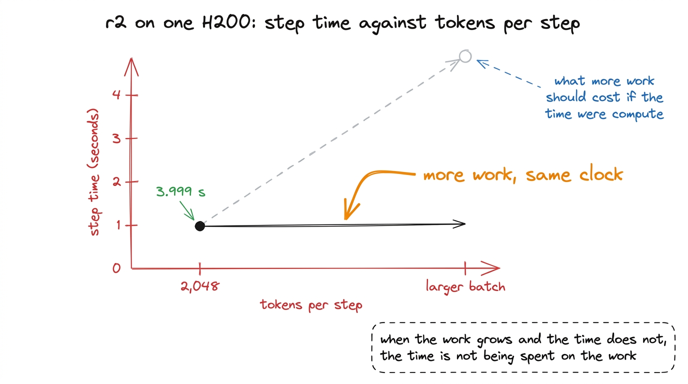
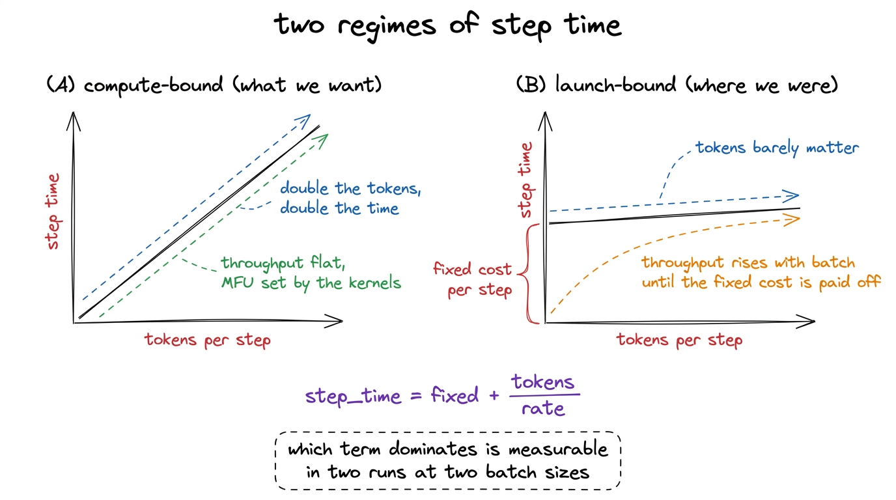
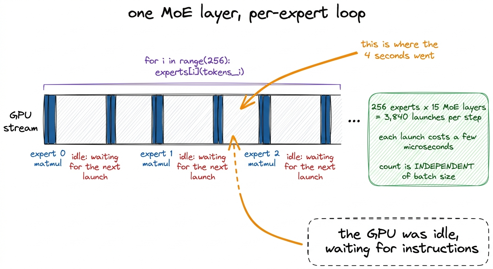
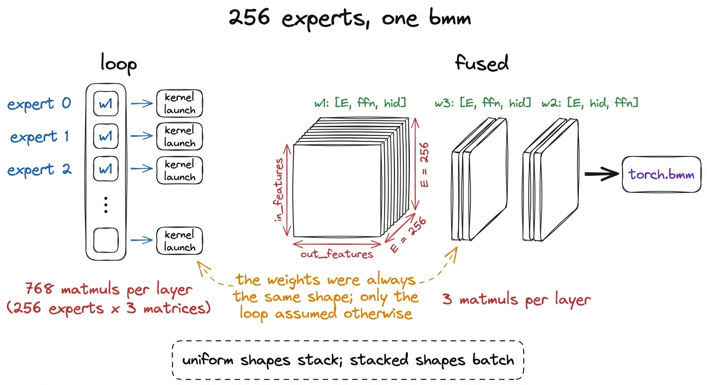
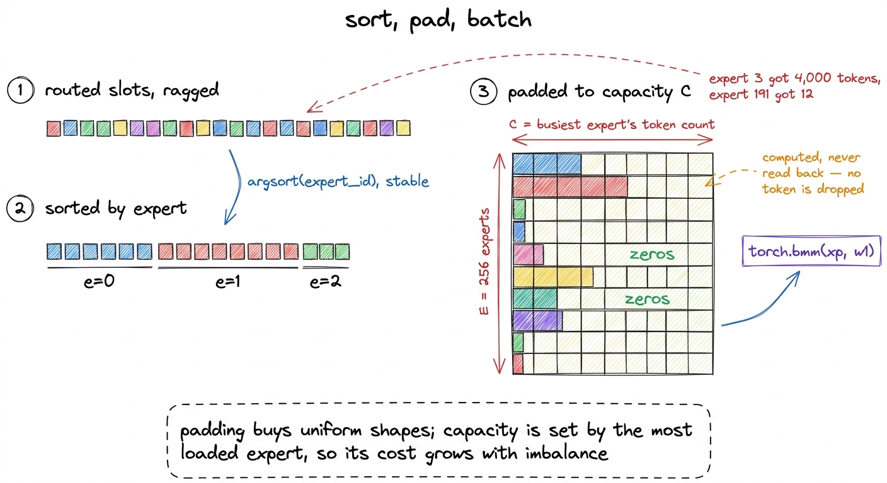
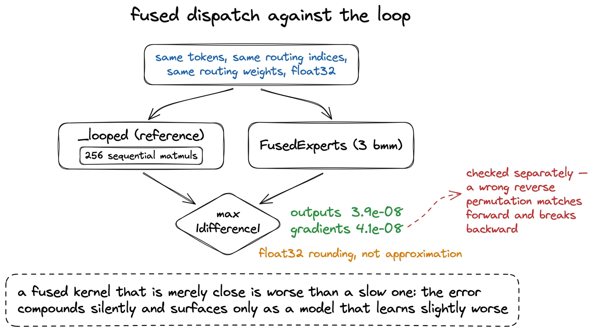
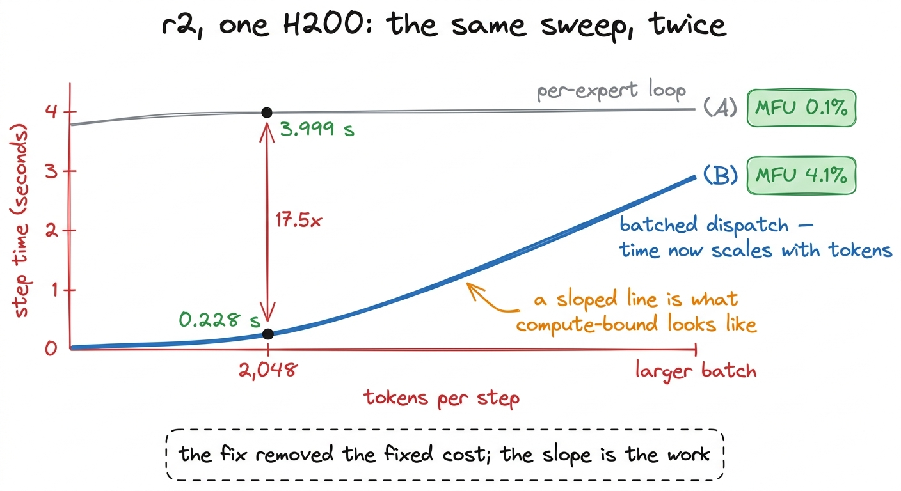

# 20\. 专家循环：工作量增加八倍，耗时却不变

[← 上一章](../19-what-mfu-is/README.md) · [返回目录](../../README.md) · [下一章 →](../21-six-ideas-that-did-not-work/README.md)

第 04 部分 · 让训练更快 · 9 分钟 · 7 幅图 · 17.5x

> 每步 token 数增加八倍，耗时却几乎不变，这是固定每步开销的特征。3,840 次内核启动、三次批量矩阵乘法，以及误差达到 $3.9\times10^{-8}$ 的等价性检查。

MFU调查的首次尝试始于一项本不应引人注目的测量。我们正在扫描每步的token数量，以找到在rung r2上能够容纳的最大微批次大小，该规模档位拥有307M个激活参数，并在一台H200上进行了基准测试。该扫描实验同时打印了步长时间和批次大小，但这些行的数据组合在一起并无意义。

在每步2,048个token时，一个步长花费了  **3.999 秒** 增大批次使每步的算术运算量多次增加，而时钟几乎毫无反应。

[](../../figures/the-expert-loop-1.png)

图 20-1　促成尝试 1 的批量扫描。虚线代表预期，平线代表实测。

这种形状是本章的主题，因为识别它所带来的价值，远超它所导致的具体修复。一个几乎不随步骤中工作量变化而响应的步长，说明步骤所花费的时间并非用于执行实际工作。某个每步固定的开销占主导地位，直到该固定开销被移除，所有其他优化措施都只是作用于运行时间中的少数部分。

## 从曲线形状判断问题

总步时间可以分为两项：一项是与步长无关的固定成本，每步仅支付一次；另一项是与处理的token数量成正比的可变成本。

$$
\mathrm{step\_time}=\mathrm{fixed}+\frac{\mathrm{tokens}}{\mathrm{rate}}
$$

如果变量项占主导，增加token数量大致会使步数时间翻倍，而每秒token吞吐量保持不变。这是一种计算受限的运行，这是我们希望达到的状态，因为在该状态下，MFU是内核的属性，而非其周围调度的属性。

如果固定项占主导，步长时间几乎恒定，吞吐量几乎与批处理大小呈线性增长。我们的扫描实验使我们明确处于第二阶段。在一步中乘以token，使时钟保持不变，这意味着在2,048个token时，GPU在四秒的一步中几乎将全部时间用于除算术之外的操作。

MFU 用一个数字表达了同样的观点。与 $\mathrm{MFU}=\frac{6\,\mathrm{active\_parameters}\,\mathrm{tokens\_per\_second}}{\mathrm{peak\_FLOPs}}$ 和一个 H200 在 bf16 中大约有 989 TFLOP/s，在每 2,048 个 token 每 3.999 秒步中得分 r2  **0.1%** 经过良好调优的稠密训练可达到 40 到 55%。一个远高于合理范围下限的数值通常不是调优问题；而是结构问题。

[](../../figures/the-expert-loop-2.png)

图 20-2　两种曲线形状。只需两次测量，就能判断训练属于哪一种，无需使用性能剖析器。

## 固定开销来自哪里

混合专家模型的分发是模型中负责接收每个token所选择的专家并实际运行它们的部分。我们在“四个瓶颈”一章中描述的其可微重写版本，在发布代码中保持了参考实现的结构：一个Python循环遍历专家。

```python
for i, count in enumerate(counts.tolist()):
    if count == 0:
        continue
    output.append(self.experts[i](tokens_for_expert_i))
```

每次迭代在GPU上为一个专家启动工作。r2 有 256 个专家和 15 个混合专家层，其第 0 层是稠密层，因此单次前向传播会遍历该循环  **3,840**  每次迭代本身包含多次矩阵乘法，因为一个 K3 专家应用了三个权重矩阵：一个门控投影、一个上投影和一个下投影。

一个 GPU 内核启动的固定成本为几微秒，由主机侧支付，无论该内核随后乘以一百行还是十万行。[^1] 将几个微秒乘以 3,840，算术结果就会达到秒级，这就是整个步骤。

使这一诊断确定而非仅仅合理的特性是那  **3,840 与批大小无关** 它在每一步中无论包含2,048个token还是16,384个token，都是256倍15。将通过模型的token数量增加八倍，会使每个专家的矩阵乘法（matmul）规模变为八倍，而启动次数的数目保持不变。在每一步的执行时间不随token数量增长的情况下，其成本也不随token数量增长，这就是成本。

[](../../figures/the-expert-loop-3.png)

图 20-3　尝试 1 之前，一个训练步的样子。方块代表实际工作，间隙则解释了为何批量大小不起作用。

## 修复方式，以及它为何能够实现

模型中的每一个路由专家都有相同的形状。它们仅在权重和接收到的token数量上有所不同，除此之外没有任何区别。每个专家有三个权重矩阵，所有256个专家的维度完全相同。

那种一致性使得循环变得没有必要。形状相同的权重会堆叠在一起，因此256个独立的门控投影合并为一个形状为 `[num_experts, out_features, in_features]`，同样适用于上和下的投影。然后一个批处理的矩阵乘法会在单个内核中运行所有 256 个专家。

```python
w1 = torch.stack([e.w1.weight.data for e in experts])   # [E, ffn, hid]
w2 = torch.stack([e.w2.weight.data for e in experts])   # [E, hid, ffn]
w3 = torch.stack([e.w3.weight.data for e in experts])   # [E, ffn, hid]
```

权重堆叠后，分发的主体部分为三 `bmm` 调用和激活：

```python
gate = torch.bmm(xp, self.w1.transpose(1, 2))
up   = torch.bmm(xp, self.w3.transpose(1, 2))
act  = self.act_fn(torch.cat([gate, up], dim=-1))
y    = torch.bmm(act.to(xp.dtype), self.w2.transpose(1, 2))
```

每层，循环指令调用 256 个专家三次矩阵乘法，即 768 次矩阵乘法。批量版本调用三次，该计数不再依赖专家数量。[^2]

[](../../figures/the-expert-loop-4.png)

图 20-4　堆叠专家权重。执行的算术相同，主机发出计算请求的次数却不同。

## 复杂之处：各专家收到的 token 数不同

一个批处理的矩阵乘法需要统一的形状。路由产生相反的情况：在路由器为每个token选择六个专家之后，一个专家可能持有数千个token，而其邻居仅有几十个。缓冲区的 `bmm` 读取必须是稠密的 `[experts, capacity, features]` 张量，只有一个容量可选。

因此，分发操作会根据专家对路由的标记槽进行排序，计算每个专家的计数，并将每个专家的组填充到最繁忙专家的大小：

```python
counts = torch.bincount(flat, minlength=E)
C = int(counts.max())                     # capacity = the busiest expert
order = torch.argsort(flat, stable=True)  # group slots by expert
xp = x.new_zeros((E, C, self.hidden_dim)) # dense padded buffer
xp[e_loc, r_loc] = x[tok_of]              # scatter tokens into their slots
```

填充槽中存放零。它们的输出与其他内容一起计算，然后不会被收集，因为反向排列只读取真实标记被分散到的槽。  **没有一个 token 被丢弃。**  这与混合专家实现中常见的容量因子方案不同，后者为每个专家设定固定的token数量并丢弃溢出部分；这些方案改变了模型的计算内容，而本设计没有。[^3]

该选择的成本是算术运算中乘以零所消耗的资源，且随着路由不平衡程度的增加，这一成本也会增大，因为容量由最繁忙的专家决定。在本次尝试时，我们测得的负载不平衡率为42.8，这意味着最繁忙的专家承担了近43倍于平均负载的工作量，这看起来是大量浪费的工作。尝试2正是针对这一浪费展开的，下一章将报告其价值：修复负载均衡器使不平衡率从42.8降至1.8，MFU从4.1%提升至  **4.6%** 垫零运算确实是真实的，它并不在时间所在之处。

填充缓冲区也携带一个大小上限， `MAX_PAD_ELEMS`，其值高于此阈值时，原始实现会回退到它所替代的循环。该上限从未在梯级档位上触发，但在旗舰模型上触发，导致性能下降了 3.2 倍，并持续隐藏了几天。它在本节稍后部分有独立一章。

[](../../figures/the-expert-loop-5.png)

图 20-5　将参差不齐的路由结果，转换成批量矩阵乘法能够接受的形状。

## 先验证正确性，再谈加速

在任何性能数据采集之前，已对批处理路径与相同输入下的循环进行了对比检查。这种排序是刻意为之的。一个融合内核即使仅接近正确，也比一个运行缓慢但完全正确的内核更差，因为错误不会立即显现。它会在数万步中悄然累积，最终表现为模型学习效果略逊于预期，而日志中却没有任何提示。

该检查在相同的token、相同的路由索引和相同的路由权重（以float32形式）上同时运行两个实现，并比较输出和梯度：

```python
y_loop, g_loop = run(lambda t: fused._looped(t, idx, w))
y, g = run(lambda t: fused(t, idx, w))
da = float((y - y_loop).abs().max())
dg = float((g - g_loop).abs().max())
```

输出误差为 $3.9\times10^{-8}$，梯度误差为 $4.1\times10^{-8}$，符合这种数值规模下 float32 运算的精度。这项结果支持采用新实现：批量分发并非对循环的近似，而是重新排列了运算顺序的同一计算。

梯度与输出分开检查，原因值得说明。批量分发的前向传播包含一次 scatter 操作、三次 `bmm` 调用和一次 gather 操作。反向传播是这些操作的转置，其中也包括 scatter；逆排列中的索引错误，可能让前向结果完全匹配，却把梯度分配给错误的 token。只检查前向传播，就会放过这样的缺陷。[^4]

[](../../figures/the-expert-loop-6.png)

图 20-6　在收集任何计时数据之前运行的等价性检查。

## 结果

在实现了批处理分发之后，基于 r2 在单个 H200 上以与之前相同的 2,048 个标记每步进行测量：

|  | 逐专家循环 | 批量分发 |
| --- | --- | --- |
| 每步耗时 | 3.999 s | **0.228 s** |
| 加速比 |  | **17.5x** |
| MFU | 0.1% | **4.1%** |

步长从  **3.999 秒到 0.228 秒** ，一个因子  **17.5** ，且MFU从0.1%上升到  **4.1%** .

结果的后半部分与前半部分同样重要。变更之后，步长时间与每步token数成比例，这正是计算受限运行的表现。产生原始异常的扫描实验现在呈现出一条斜线，这意味着接下来的问题可以合理地转向模型规模和内存，而这正是尝试 3 到 5 的方向。尝试 3 询问了MFU是否随模型规模上升，并发现 $\mathrm{active}^{0.39}$. 尝试 4 对专家缓冲区进行了分块，回收了 5% 的内存并降低了 MFU。尝试 5 中止了 `situ` 从持有 float32 复制，释放了 40 GB，并将 MFU 提高了 0.1 个百分点。

[](../../figures/the-expert-loop-7.png)

图 20-7　尝试 1 前后的同一项测量。两条曲线都来自单张 H200 上的 r2。

两个归因与那些数值相关。它们是在  **r2** ，本书已完成的运行所使用的档位之上的档位，在单个 H200 上拥有 307M 个激活参数。而 4.1% 并不是一个良好的 MFU。它大约只是经过良好调优的稠密训练所能达到值的十分之一，调查持续了十五次尝试，其中有两次成功。第 1 次尝试所获得的并非一次快速运行；而是一次其剩余成本值得进一步探究的运行，因为在步长时间对工作做出任何响应之前，任何关于工作量的测量都是毫无意义的。

该已完成的r1训练运行是使用此分发进行训练的。其11个混合专家层在构建时被融合，构建器会在补丁匹配的层数量与配置所暗示的数量不一致时抛出错误。[^5]

## 可推广的经验

每步耗时不随批量大小变化，是诊断信号，而非趣闻。只需在两个批量大小下测量，无需性能剖析器，就能区分两种状态：受启动开销限制时，优化内核启动；受计算限制时，优化内核计算。本调查的十六次尝试中，有几次把计算受限问题的办法用在了成本来自别处的训练上；后续的性能剖析解释了为何它们不会奏效。

 **遍历结构相同对象的循环通常是一个形状问题。**  参考的分发循环遍历专家，因为专家在概念上是独立的模块，这种方式编写模型是合理的。但执行起来是低效的，因为被遍历的对象具有相同的形状，而相同的形状正是批处理操作所要求的条件。这一观察同样适用于模型中的任何按头、按层或按组的循环。

 **在进行替换之前，请先验证。**  第 1 次尝试带来了 17.5 倍的加速，这个数值大到足以让人想要转向下一个任务。工作执行的顺序决定了这一倍数是否真实。在数值上等价于 $3.9\times10^{-8}$、在梯度上等价于 $4.1\times10^{-8}$，使得加速成为执行层面的事实，而非计算其他内容的事实。

>  **数据说明：几微秒乘 3,840 不能直接得到数秒** 　原文称每次内核启动为几微秒，乘以 3,840 就达到整步的秒级耗时。以每次 5 微秒为例：$5\times10^{-6}\times3{,}840=0.0192$ 秒，即 19.2 毫秒。因此该乘法本身不能解释约 4 秒；可能还有未列出的 Python、调度或同步开销。这里不否定原文测得的步时，只指出这段算术解释不成立。原图保留不变。

---

[← 上一章](../19-what-mfu-is/README.md) · [返回目录](../../README.md) · [下一章 →](../21-six-ideas-that-did-not-work/README.md)

[^1]: 这不是 GPU 算术本身的成本，而是 CPU 构造启动请求、将其提交到流，以及 GPU 在前一条命令完成后取下一条命令的开销。一次启动耗时微秒级，在几十个 token 上运行的小型专家矩阵乘法也只需微秒级；两者同量级，主机无法持续向队列补充足够多的工作来领先设备执行。

[^2]: 融合专家会改变状态字典中的参数名称，因为一个 `nn.ModuleList` 256 个专家变为三个堆叠的张量。当从零开始训练并手动编写检查点时，这种情况是可以接受的，这正是我们的情况。将已发布的 Kimi 检查点加载到融合模型中，则需要先解堆叠。

[^3]: 丢弃标记并不总是错误的，而且在非常大的规模下这是一项合理的权衡。但在这里这是错误的，有其特定原因：本项目旨在测量一个小型 K3 复本是否表现得像 K3，而一个静默丢弃路由标记的分发机制，会在我们的模型与参考模型之间引入一个基准测试不会正确归因的差异。

[^4]: 循环实现被替换后仍保留在代码库中，作为 `_looped`它不是死代码；它是等价性测试进行比较的参考基准，正是它使得测试具有意义，而非自我确认。

[^5]: 检查读取`n_moe_layers = cfg.num_hidden_layers - cfg.first_k_dense_replace`，并与补丁实际替换的层数比较，以防补丁静默地一个目标也没匹配到：训练仍继续，模型却比基准声称的更慢、显存占用更高，没有任何提示。训练、基准工具和分片 worker 都调用同一个构建器，因此不会有路径悄悄跳过优化。
