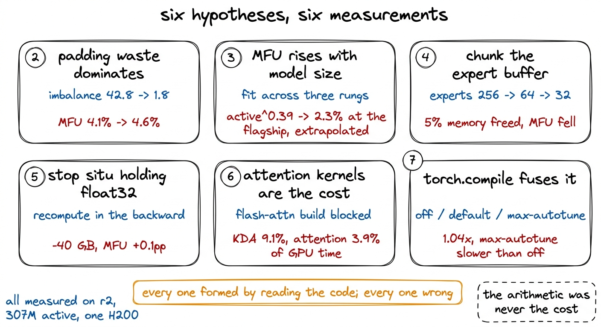
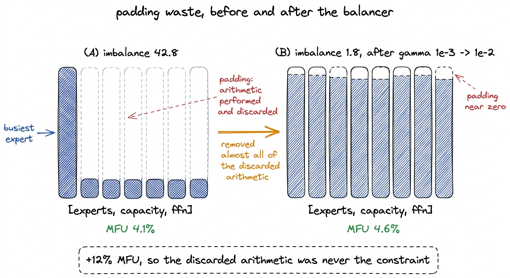
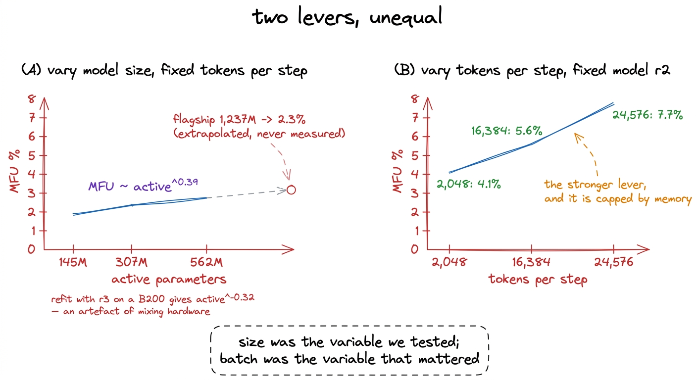
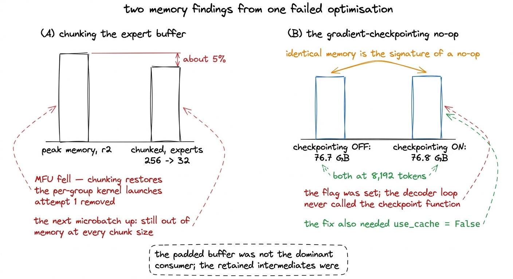
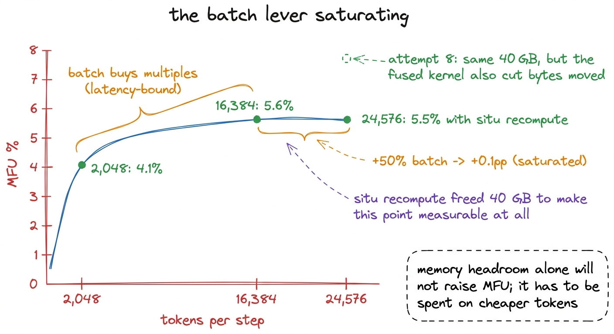
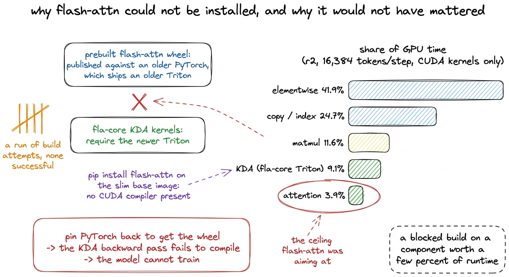
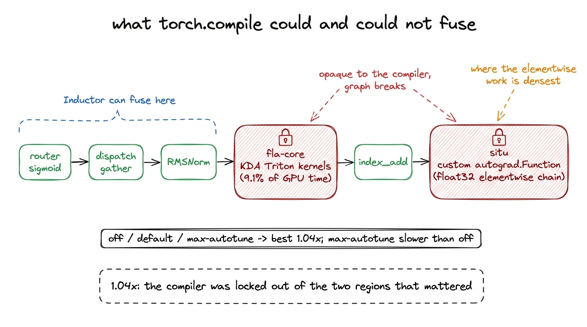

# 21\. 六个没有奏效的想法

[← 上一章](../20-the-expert-loop/README.md) · [返回目录](../../README.md) · [下一章 →](../22-the-profile/README.md)

第 04 部分 · 让训练更快 · 12 分钟 · 7 幅图

> 填充浪费、模型大小、缓冲区分块、float32 激活值、注意力内核和 torch.compile：逐项记录假设与测量，以及解释六次失败的那份性能剖析。

上一章收尾得很好。专家分发的批处理在 2,048 个token上从 3.999 秒降至 0.228。  **17.5x**  改进，并将 MFU 从  **0.1% 到 4.1%** 如此规模的修复设定了一个预期，即下一次修复也会很大，而找到它则需要仔细阅读代码。

仔细阅读代码后，又产生了六个想法。每个想法都十分具体，每个想法背后都有相应的机制，每个想法都是通过测量而非假设得出的。这些想法都没有成功。其中两个产生的结果对其他方面是有用的，而非它们所测试的原因，其中一个结果重新引导了后续的调查。

所有六个都是在  **r2**  — 307M 个激活参数，2.93B 个总参数 — 在单个 H200 上。r2 是本书已完成的运行档位之上的一个规模档位，且因其规模足够大，使得形状能够像旗舰模型一样表现，又足够小，可以在几分钟内完成扫描实验。[^1]

在任何操作之前，测量学科。我们舍弃每次扫描的前两个步骤，因为分配器仍在增长，自动调优器仍在选择内核。我们在 40 到 120 步之间进行预热，以便路由器稳定下来。我们单独保留 MFU，它计算 6N 个有用的 FLOPs，与计算 8N 且包含重计算的 HFU 分开，因为将两者混合在一起的报告所显示的提升，实际上只是定义的改变。

[](../../figures/six-ideas-that-did-not-work-1.png)

图 21-1　本章讨论的六次尝试，以及终结每次尝试的测量结果。

## 尝试 2：填充浪费占主导

批处理分发产生的17.5x种排序按专家进行分组，并将每个专家的分组填充至最繁忙分组的大小，因为批处理矩阵乘法需要统一的形状。填充槽中存放零值，其输出从未被读取，因此没有token丢失。然而，这些填充项上的算术运算会被执行并丢弃，且不会出现在MFU分子中，因为MFU仅计算有用的FLOPs。

我们当时测得的负载不平衡是  **42.8** ，意味着最繁忙的专家接收到的负载是平均负载的42.8倍。当每个组都填充到该专家时，GPU在混合专家层中执行的大部分操作都是对零进行矩阵乘法。

修复并非对分发的任何更改。它正是专家坍塌一章中描述的负载均衡器： `gamma` 从 DeepSeek-V3's $1\times10^{-3}$ 移动到测得的 $1\times10^{-2}$，不平衡度从 42.8 降至  **1.8** 填充浪费作为修复正确性问题的副作用几乎趋近于零。[^2]

 **MFU 从 4.1% 移动到 4.6%。** 

移除几乎所有的被丢弃的算术运算带来了 12% 的提升。推理是正确的，机制是真实的，而效果很小，这三点共同指向一个结论：填充的算术运算并非耗时的主要来源。当算术运算量不是瓶颈时，浪费的FLOPs所造成的开销其实并不大。这是本章所有发现最终汇聚的结论，但我们尚未将其明确表达出来。

[](../../figures/six-ideas-that-did-not-work-2.png)

图 21-2　修复负载均衡器几乎消除了全部填充浪费。吞吐量提高了 12%。

## 尝试 3：模型越大，MFU 越高

MFU 是有用算术除以 GPU 所做的所有工作，包括不依赖于每个 token 所携带工作量的固定成本。模型越大，其每个 token 对这些相同固定成本的算术量就越多，因此其 MFU 应该更高。如果 r2 位于 4.6%，那么拥有四倍激活参数的旗舰模型可能处于一个可接受的位置，而吞吐量问题在真正的训练运行开始时会自行解决。

这可以直接测试。我们以相同的token数量测量了三个梯级，因此模型大小是唯一的变量，并在激活参数数量为145M、307M和562M的情况下拟合了一个幂律。该拟合结果给出  **$\mathrm{active}^{0.39}$** 。将其外推到旗舰模型的  **1,237M**  激活参数给出  **2.3%** ，这不是一次救援。指数小于二分之一意味着将模型规模扩大四倍所带来的效率提升不足一倍，而我们大约需要一个数量级的提升。

关于那项拟合有两个方面值得明确指出而非隐藏。它是一种外推而非测量：从未在该配置下记录过任何旗舰模型的MFU。而且该拟合对硬件的依赖性很强。[^3]

相同的扫描实验产生了我们本应关注的结果。在将模型固定在 r2 的情况下，通过改变每步的 token 数来调整，使 MFU 的变化远大于改变模型本身带来的影响。尝试 1 已经展示了这种现象的极端情况，因为批量分发在每步 2,048 个 token 的情况下测得 MFU 为 4.1%，而相同代码在每步 16,384 个 token 的情况下，MFU 接近 5.6%。模型规模是一个弱杠杆，而每步 token 数才是强杠杆，限制每步 token 数的正是内存。

那个比较重新定义了问题。接下来的两次尝试都是为了获取内存，而这正是批处理杠杆值得深入理解的原因，以便知道它何时已经失效。

[](../../figures/six-ideas-that-did-not-work-3.png)

图 21-3　模型大小与每步 token 数。我们当时测试的是两者中影响较弱的那个因素。

## 尝试 4：对专家缓冲区分块

如果内存限制每步的token数量，而每步的token数量决定了MFU，那么释放内存会提升MFU。问题在于应当攻击哪种分配，以及填充专家缓冲区的形状 `[experts, capacity, features]` 最大的单个张量是读者在分发代码中会发现的。

以 32 或 64 个专家为一组，而不是一次性加载全部 256 个专家，应该能降低内存占用。每个组填充到其自身最繁忙的专家，而不是全局最繁忙的专家，且每次仅有一个组驻留，因此峰值内存应大致减少与组数相同的倍数。

首先在每个我们计划测试的分片大小下，检查了未分片路径在值和梯度上的等价性。[^4]

峰值显存降低约 5%，吞吐量也下降，因为分块重新引入了批量分发本来要消除的逐组内核启动。更重要的是，试过的每个分块大小都无法让下一档微批量放进显存；而只有做到这一点，才算成功。降低 5% 不足以改变可用的批量大小。

尝试失败了，但留下了下一次尝试的依据：如果分发中最大的具名张量被大幅缩小，峰值显存却只下降 5%，主要占用就一定在别处。最明显的候选，是前向传播为了反向求导而保留的那一组中间结果。

存在第二个原因让我们对我们的记忆图景产生怀疑，而且这个原因是在同一时期被发现的。 `gradient_checkpointing_enable()` 是在已发布的Kimi模型代码中一个静默的无操作：它声明 `supports_gradient_checkpointing = True`，设置标志，且解码循环永远不会调用检查点函数。线索在于我们自己的数据而非源代码。内存中 8,192 个token已读取  **76.7 GB**  梯度累积开启且检查点关闭时  **76.8 GB**  开启它。  **相同的内存是无操作的标志** ，因为真实的检查点机制以额外的计算开销换取较大的内存减少，且无法完全免费。使其正常工作需要 `use_cache = False` 同样，因为 KV 缓存是在前向传播过程中被修改的，而重新计算的前向传播否则会看到不同的状态。

[](../../figures/six-ideas-that-did-not-work-4.png)

图 21-4　失败的分块实验，以及审查同一份显存情况时发现的检查点缺陷。

## 尝试 5：让 `situ` 不再保留 float32 副本

K3的激活被称为 `situ`，以及已发布的实现读作：

```python
gate = x[..., :d].to(torch.float32)
up = x[..., d:].to(torch.float32)
situ_a = self.beta * torch.tanh(gate / self.beta) * torch.sigmoid(gate)
if self.linear_beta is not None:
    up = self.linear_beta * torch.tanh(up / self.linear_beta)
return (situ_a * up).to(x.dtype)
```

那里创建了若干 float32 张量，且 autograd 保留了所有张量，以便反向传播能够通过它们进行求导。在混合专家层内部，这些张量所携带的形状是 `[experts, capacity, ffn_dim]`，模型中最大的一部分，且从 bf16 上浮到 float32 会使每一项相对于层中其余部分的 bf16 运行值翻倍。与之前尝试所涉及的保留中间结果相对，这显然是嫌疑最大的部分。

该变更是一个自定义的自动求导函数，它仅保存输入，并在反向传播过程中重新计算相同的前向过程：

```python
class _SituRecompute(torch.autograd.Function):
    @staticmethod
    def forward(ctx, x, beta, linear_beta):
        ctx.beta, ctx.linear_beta = beta, linear_beta
        ctx.save_for_backward(x)
        with torch.no_grad():
            return _situ_forward(x, beta, linear_beta)

    @staticmethod
    def backward(ctx, grad_out):
        (x,) = ctx.saved_tensors
        with torch.enable_grad():
            xd = x.detach().requires_grad_(True)
            y = _situ_forward(xd, ctx.beta, ctx.linear_beta)
            (gx,) = torch.autograd.grad(y, xd, grad_out)
        return gx, None, None
```

`_situ_forward` 上述释放的表达式保持不变，仍为 float32。这是故意不进行 bf16 的降级。释放的代码选择了 float32 作为 `tanh` 和 `sigmoid`，推测是为了保证由 $\mathrm{beta}=4.0$ 和 $\mathrm{linear\_beta}=25.0$ 产生的数值量级下的计算精度。改变数据类型，会以显存收益换取一种难以察觉的数值风险：模型能够训练、能够收敛，却比应有水平略差，而不会报告任何问题。重计算会花费时间，但不会改变算术运算。

内存预测是正确的，并且差距很大。重计算释放了  **40 GB**  在 r2 上，之前无法容纳的微批次现在可以容纳了。

 **MFU 上移了 0.1 个百分点。** 

这是日志中最具信息量的失败情况，因为它发生在批处理杠杆明显饱和的时刻。此前，杠杆的移动表现为MFU以倍数增长：第1次尝试将其从0.1%提升至4.1%，这正是受限于每步固定开销的训练运行所呈现的现象，因为向一个主要处于等待状态的步骤添加工作几乎可以视为免费。而现在，一个大小为50%的更大微批次几乎未带来任何收益。开销已经被摊销殆尽，而GPU所花费的时间与token数量成正比，因此为容纳更多token而腾出空间，几乎未改变比例。

两章之后，相同的 40 GB 再次被使用，得到了不同的结果。尝试 8 将融合 `situ` 转化为单个手写 Triton 内核，释放相同的内存，并获得 MFU  **5.6% 到 7.7%**  固定为  **41,294 个token每秒**  每微批次24,576个token。在相等的批量下，该内核并不更快，5.5%对5.6%。尝试5与尝试8之间的差异并非内存，二者相同；而是融合内核也消除了对模型中最大张量的往返访问，因此较大批量的运行成本是每token更便宜。在不减少每token带宽的情况下释放内存，是一个没有任何对端的杠杆。

[](../../figures/six-ideas-that-did-not-work-5.png)

图 21-5　r2 上的批量大小曲线。重计算释放了 40 GB，却只是帮助我们证明：单纯增加显存余量已经不再带来收益。

到这里，我们停止仅靠阅读代码提出假设，转而运行性能剖析器。接下来的两次尝试，是最后两个按旧方式提出的想法；测量之前，剖析结果其实就已表明它们不会奏效。

## 尝试 6：开销来自 KDA 或注意力内核

r2 运行其大部分层在 Kimi Delta Attention 上，该功能由手写 Triton 内核实现的 `fla-core` 库，以及多头潜注意力中每第四层。这两者都没有被修改过。注意力是被最常描述为变换器中昂贵部分的组件，而我们的实现运行在一个兼容性补丁上，而不是一个快速内核上。[^5]

所以我们尝试在一系列构建尝试中安装 flash-attn，最终阻止这些尝试的是真正的版本冲突，而非缺少某个步骤。预先构建的 flash-attn 轮子是针对较旧的 PyTorch 版本发布的，这些版本搭载的 Triton 版本低于当前版本。 `fla-core`KDA 内核需要。将回退足够远以获取轮子会导致 KDA 反向传播阶段编译失败，这意味着模型无法训练。在我们的基础镜像上通过 PyPI 安装会更早失败，因为该镜像不包含 CUDA 编译器。其余路径是针对新版 PyTorch 在 CUDA 开发基础镜像上从源码构建，这是一个我们从未支付的一次性镜像成本。

我们从未支付过，因为配置文件先到达了。在 r2 上，每步 16,384 个 token，注意力占了  **5.1%**  运行时间在尝试读取-6和KDA方面  **4.6%** 下一章中修正的内核分组方式对它们进行了不同的划分，at  **9.1%**  对于 KDA 和  **3.9%**  对于注意力机制，取决于如何的 `fla-core` Triton 内核已分配。[^6] 无论如何，这些构建都是针对一个无法承担它们成本的组件。

[](../../figures/six-ideas-that-did-not-work-6.png)

图 21-6　阻碍 flash-attn 的版本冲突，以及说明这次构建其实没有必要的性能剖析结果。

## 尝试 7：用 `torch.compile` 融合逐元素运算

性能剖析是下一章的主题，因此这里只需从中提取三行内容即可。逐元素运算占  **41.9%**  GPU 时间、拷贝和索引操作对于  **24.7%** ，以及各种矩阵乘法对于  **11.6%** 个体内核排序从另一个角度表达了相同的内容： `aten::mul` 固定为  **10.2%** , `aten::copy_` 固定为  **8.6%** ，一个向量化逐元素内核在  **4.2%** ，和 `aten::mm` 固定为  **3.9%** .  **仅约 12% 的 GPU 时间用于矩阵乘法。** 

一个处于这种形态的模型是内存带宽受限的，而解决内存带宽受限模型的标准方法是内核融合。与其多个内核分别从内存中读取张量、执行少量算术运算后再写回内存，不如一个内核只读一次，将中间结果保留在寄存器中，最后只写一次。

`torch.compile`会自动进行这种融合，许多报告表明它对受逐元素运算限制的模型很有效。这是本章第一次以实测而非阅读源码作为假设依据，结果却仍不理想。对比关闭编译、默认模式与`max-autotune`，最佳提升只有 1.04x，而`max-autotune`甚至比不编译更慢。

原因在设置中是显而易见的，而不是在数值中。它能在所见的操作中跨操作插入保险丝。 `fla-core`‘s KDA 内核是手工编写的 Triton，并对它不透明。该定制 `situ` 来自 attempt 5 的 autograd 函数对它来说也是不可见的，这是由构造决定的：一个 `torch.autograd.Function` 呈现了一个编译器不会追踪通过的边界。这两个组件恰好位于元素级运算最密集的位置，因此编译器被留下的是在它们之间的狭窄区域进行融合。

最终有效的修复方法是手动编写融合内核，即尝试 8，并是后续一章的主题。它获得了  **1.38x** ，而并非因为融合通常预期会带来任何好处。

[](../../figures/six-ideas-that-did-not-work-7.png)

图 21-7　内核融合是正确的办法，却经由不合适的工具实施。两个不透明区域都位于逐元素运算之上。

## 共同模式

六次尝试，六种真实存在的机制，六次关闭它们的测量。作为一组读取，它们具有形状。

 **通过推理代码形成的每一个想法都是错误的。**  填充浪费、模型大小、缓冲区分块、保留的浮点32副本和注意力内核都通过阅读源文件并思考GPU会如何处理它们而被识别出来。每一个都描述了代码中的某个真实情况。它们都没有描述时间的去向，因为源代码展示了存在的操作，而不是硬件在等待的操作。

 **每一次从一个测量中得出的结论都必须被持有。**  平衡器扫描得到了一个真实的12%。规模档位扫描给出了将两次尝试导向的比较结果。分块失败指出了保留的中间结果，激活函数恰好如预测般释放了40 GB。性能剖析在一次训练运行中结束了调查，其结论——测得的MFU为  **5.6%**  在 r2 上，以模型内存带宽限制——句子是每一个这些尝试都在环绕。

 **有两个失败比成功更有价值。**  尝试 3 在其陈述的假设下失败，并确定批大小，而非模型大小，是值得拉动的杠杆。尝试 5 在其陈述的假设下失败，并产生了饱和现象，即发现表明，单独再增加内存杠杆已无效，下一步必须是性能剖析而非另一个想法。能闭合一个假设的测量，并非浪费的测量；它是唯一能缩减搜索空间的测量。

相比之下，学习它所花费的成本是六次尝试和一系列失败的flash-attn构建，而一次性能剖析作业就解释了所有这些问题。下一章就是该性能剖析。

---

[← 上一章](../20-the-expert-loop/README.md) · [返回目录](../../README.md) · [下一章 →](../22-the-profile/README.md)

[^1]: 本章中的MFU数值因此并不描述我们的r1训练运行。r1持续  **2.4 到 2.5% MFU**  在其范围内  **38,147**  每秒 27,600 到 28,900 个 token，得分  **5.9%**  在每微批次16,384个token的基准测试环境中。这两个图都出现在关于损失曲线的章节中；它们都不应被用于与这里的r2扫描实验进行比较。本章中没有任何内容是基于分片模型测量的——r1可以运行在一张卡上且从未分片，而需要FSDP2的旗舰工作是另一个独立的章节。

[^2]: 伽马扫描那一节值得完整阅读，因为负载均衡器对吞吐量的影响其实是它最初设计目的的副产品。在实际的每步批大小为 131,072 个token时，$1\times10^{-3}$ 以 52.0% 个不活跃专家和不平衡 42.8 结束，而 $1\times10^{-2}$ 以 0.0% 个不活跃专家和不平衡 3.1 结束，所有四种设置的最终损失均保持不变。在损失方面，平衡是免费的，这也是它仅根据负载进行选择的原因。

[^3]: 一次后来的尝试使用在B200上而非H200上测得的r3重新拟合了相同的关系，并获得了  **$\mathrm{active}^{-0.32}$** ，负指数意味着更大的模型效率更低。这一结果是由于在旨在隔离规模的实验中混合了不同硬件所导致的伪影。MFU是相对于每张卡自身峰值的比率，因此它仅能在同一芯片上的不同训练运行之间进行比较。对r3的归一化  **3.6%**  到 H200 的峰值大约是  **8.2%** ，位于 r2 之上并恢复正向缩放。

[^4]: 一种改变数值计算的记忆优化并不是真正意义上的记忆优化。这与批处理分发相对于原始Python循环所遵循的同一学科一致，其中最终达成的共识是  **$3.9\times10^{-8}$**  在数值和  **$4.1\times10^{-8}$**  在梯度——接近 bf16 四舍五入，两条路径的计算相同。

[^5]: 发布的建模代码在选择注意力实现时，强制使用`flash_attention_2`字符串；K3 非对称头维度的填充也只在这一分支执行，因此我们的 MLA 路径在该键下注册了 sdpa 实现。它的数值相同，速度更慢。因此，以此测得的注意力开销是实际 flash-attention 实现开销的上界，这反而加强了不继续该尝试的理由。

[^6]: 两种分组方式都有记录，都不改变决策。一个占运行时间 5% 的组件，最多只能节省总时间的 5%，而且必须将它的成本降为零才能做到。构建尝试瞄准的上限不过几个百分点，而逐元素运算仍占 40% 以上。
