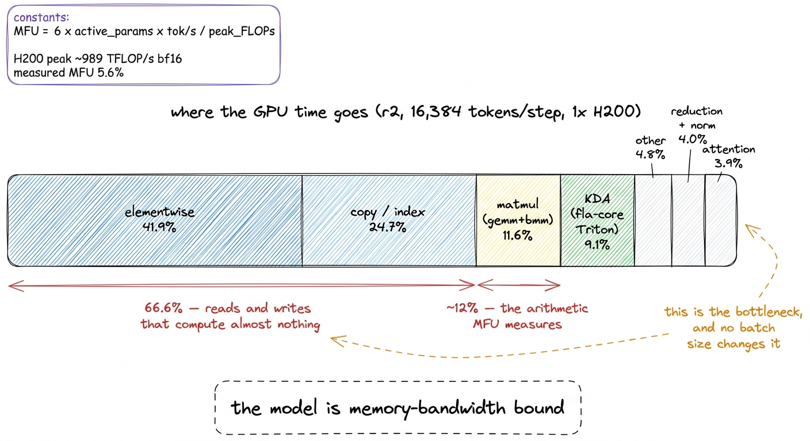
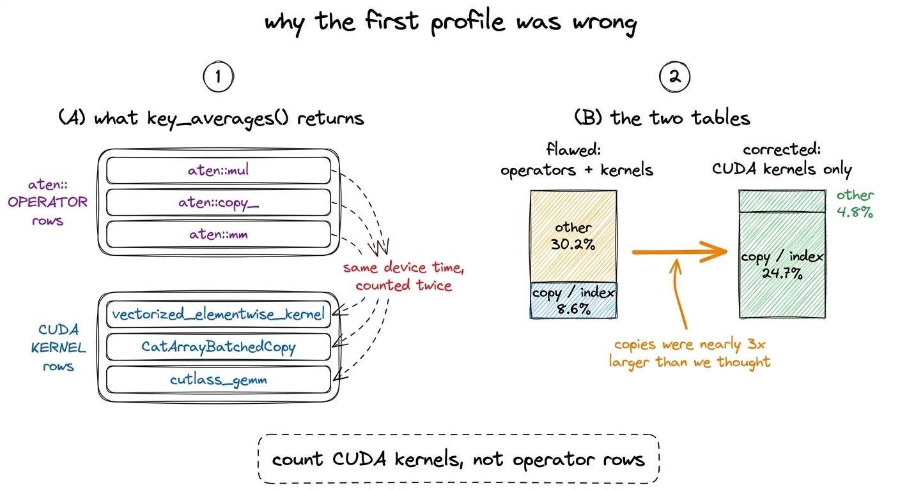
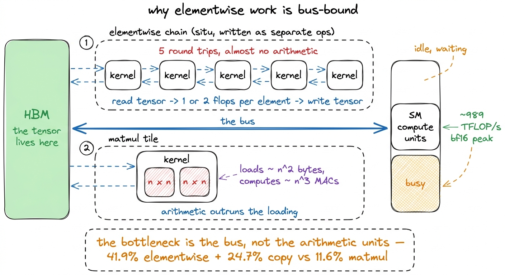
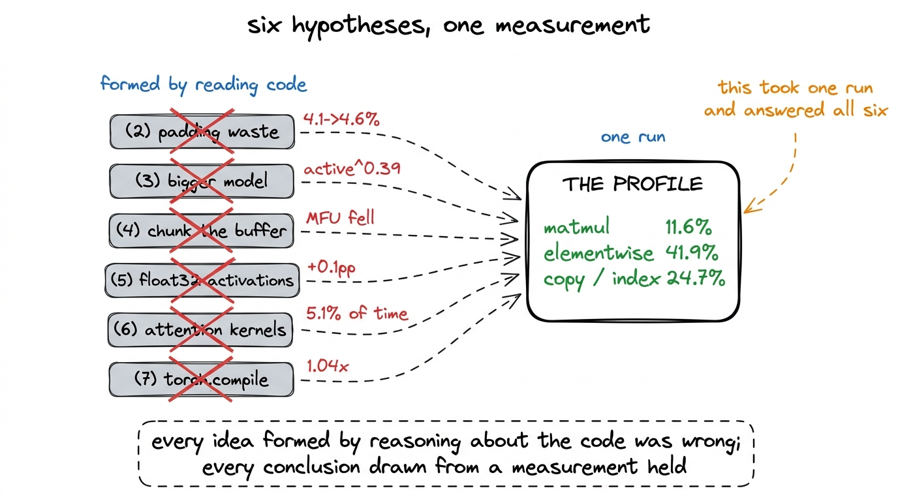
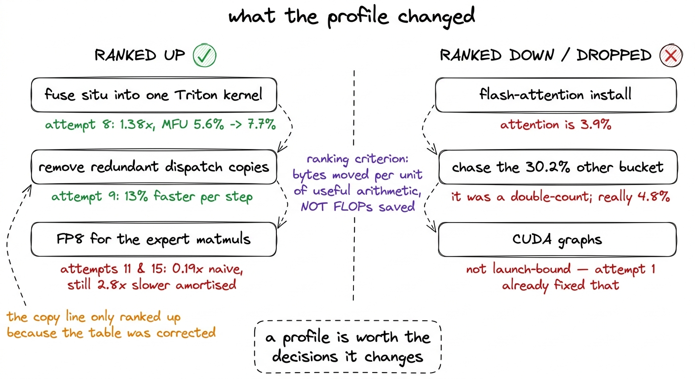

# 22\. 性能剖析：只有 12% 的时间用于算术运算

[← 上一章](../21-six-ideas-that-did-not-work/README.md) · [返回目录](../../README.md) · [下一章 →](../23-two-kernels-that-worked/README.md)

第 04 部分 · 让训练更快 · 10 分钟 · 5 幅图 · 45.6%

> 按所属模型组件归类全部 CUDA 内核，修正首版表格的重复计数，并理解内存带宽瓶颈对每种优化手段意味着什么。

当我们运行性能剖析工具时，我们已经对吞吐量问题进行了五次编号尝试，其中第五次是警告。重新计算 `situ`在反向传播过程中，而不是通过前向传播在 float32 中保存它们，被释放了  **40 GB**  的显存，与算术预测一致。这些显存让微批量增大了 50%，每步 token 数从 16,384 增至 24,576。更大的微批量使 MFU 提高了  **0.1 个百分点** .

调查初期，杠杆曾以整数倍推动MFU。尝试1，将顺序专家循环替换为批处理矩阵乘法，使MFU从  **0.1% 到 4.1%** 现在一个 50% 倍更大的微批次几乎没有任何收益。一个不再响应的杠杆已不再是约束，而代码中没有任何进一步的阅读能告诉我们新的约束是什么。

于是我们停止形成假设，开始测量GPU时间的使用情况。

## 性能统计表

我们在PyTorch性能剖析器上运行了  **r2，位于我们之上的规模档位，每步 16,384 个 token 在一台 H200 上运行** ，并将每个CUDA内核按其所属模型部分进行分组。[^1]

| 部分 | 占 GPU 时间的比例 |
| --- | --- |
| 逐元素运算 | 41.9% |
| 复制／索引 | 24.7% |
| 矩阵乘法（gemm 与 bmm） | 11.6% |
| KDA (fla-core Triton) | 9.1% |
| 其他 | 4.8% |
| 归约与归一化 | 4.0% |
| 注意力 | 3.9% |

各个内核从不同角度表达了相同的内容。 `aten::mul` 是  **10.2%**  的GPU时间。 `aten::copy_` 是  **8.6%** 向量化逐元素内核是  **4.2%** . `aten::mm`，一个实际的矩阵乘法，是  **3.9%** .

 **仅约 12% 的 GPU 时间用于矩阵乘法。** 

逐元素运算和拷贝一起是  **66.6%** 那些是读取张量、对其处理极少、再写回的两类操作。大约 88% 的时间，我们租用的那张显卡，每小时 4.54 美元，实际上并未执行 MFU 所衡量的算术运算。

图 22-1　按所属模型组件，对一个训练步中的全部 CUDA 内核进行分组。测量来自 r2，比本书实际完成训练的模型高一个档位。

## 这张表的第一个版本是错的

那张表是修正后的版本。我们最初产生的版本报告了一个无法解释的  **30.2% "其他"**  桶中并把副本放入  **8.6%** ，我们几乎立即采取了行动。它是性能剖析中的第二大条目，我们不知道其中具体内容，而当时写下的计划第一条项目实际上就是“找出‘other’是什么”。

错误出在行求和的方式上。PyTorch的 `key_averages()` 返回同一列表中的两种行。有 `aten::` 操作符条目，即你的模型代码调用的操作，以及CUDA内核条目，即这些操作在设备上启动的内核。一个 `aten::mul` 可能会分发一个向量化元素级内核，且该操作符和内核在携带相同设备时间的行中均出现。将该列表求和会使其时间被重复计算两次。

图 22-2　重复计数，以及它掩盖的内容。修正后的表格只统计 CUDA 内核。

修正后的表只统计 CUDA 内核，而这不是表面修饰。复制开销从 8.6% 升到 24.7%，成为第二大项；无法解释的“其他”类别从 30.2% 降至 4.8%，小到可以不再为它担忧。[^2]

那个单一修正引导了接下来一个月的工作。一个说明副本数量为 8.6% 的配置，会邀请你保持原状。一个说明副本数量为 24.7% 的配置，会使专家分发中的分类与收集成为清单上的第二项，而随后的分发清理工作是值得的。  **13% 每步** ，我们在关于两个有效内核的章节中进行了描述。

## 受内存带宽限制，在物理上意味着什么

“66.6%”这一短语被频繁使用，已略显抽象，因此值得明确说明在该66.6%期间GPU实际上在执行什么操作。

一块GPU有两个资源可能耗尽。它有算术单元，而在H200上，这些单元的性能大约为  **989T bf16 操作每秒** ，并且它具有通往高带宽内存的总线，用于在HBM和芯片之间传输字节。任何内核都会消耗一部分资源。算术运算与字节传输的比例决定了内核会等待哪种资源。

一个矩阵乘法具有有利的比率。加载两个大小为 $n\times n$ 成本在数量级上为 `n²` 字节，并产生数量级为 `n³` 矩阵乘法-累加操作，因此随着tile的增大，算术运算量超过数据加载量，算术单元成为限制因素。这就是MFU设计用来测量的运行模式，也正是为什么一个经过良好调优的稠密Transformer模型能够达到40到55%。

逐元素操作具有最差的可能比率。考虑 `situ`, K3 的激活，其计算 $\mathrm{beta}\,\tanh\!\left(\frac{\mathrm{gate}}{\mathrm{beta}}\right)\operatorname{sigmoid}(\mathrm{gate})$ 在门分支和一个缩放的第二分支上 `tanh` 在上升分支上，与  **beta 4.0 和 linear-beta 25.0** 用普通的 PyTorch 写出来，就变成了一串独立的内核：一个做除法，一个取 tanh，一个取 sigmoid，一个做乘法，依此类推。每个这样的内核都会将整个张量从 HBM 中读出，对每个元素执行一次或两次浮点运算，然后再将整个张量写回。算术单元几乎整个时间都是空闲的；总线在整个过程中始终处于饱和状态。

图 22-3　表格背后的物理过程。逐元素内核要搬运整个张量，却只对每个元素执行一次运算。

复制操作也是同样的情况，只是彻底没有算术运算。一次 gather 操作读取张量，再写出其重新排列的版本，完全不进行浮点计算。我们的专家分发先按专家对 token 排序，将它们聚集到经过填充的缓冲区中，运行专家，再将结果散射写回原来的位置。每一次数据移动都只是总线传输。r2 有 15 个混合专家层，每层 256 个专家，因此这类传输非常多。

这是表格中说模型是内存带宽受限时的含义。GPU 并不在于计算过程上遇到困难，而是在不断地将张量在总线之间来回传输，以便进行少量的计算。

## 为何这六个想法注定无法奏效

在成功尝试之前的六次尝试被单独记录在前一章中。与性能剖析相对照，它们汇聚为一次单一的失败，以这种方式记忆它们更为有效。

| # | 假设 | 推翻该假设的性能剖析数据 | 实测值 |
| --- | --- | --- | --- |
| 2 | 专家缓冲区中的填充浪费占主导地位 | 矩阵乘法是 11.6%；填充仅浪费矩阵乘法 | 不平衡 42.8 → 1.8，MFU 4.1% → 4.6% |
| 3 | MFU 随模型规模增大而上升 | 每 token 的带宽成本几乎不随宽度变化 | $\mathrm{active}^{0.39}$ |
| 4 | 对专家缓冲区进行分块可以节省内存 | 内存不是瓶颈 | 5% 内存，MFU 下降了 |
| 5 | `situ` 持有 float32 复制的开销 | 正确诊断，错误杠杆——它买了批量，而不是带宽 | 显存 −40 GB，MFU +0.1 个百分点 |
| 6 | KDA 或注意力内核是成本 | 注意力 3.9%，KDA 9.1% 在分组表中 | 4.6% 和 5.1% 的运行时间 |
| 7 | `torch.compile` 将融合逐元素运算 | 最密集的元素级区域对 Inductor 是不透明的 | 1.04x |

尝试 2、3、4 和 5 都是通过阅读代码并对其进行推理形成的，且这四者都基于一个信念的变体：即需要修复的是算术运算或内存占用。性能剖析显示算术运算占运行时间的 11.6%，因此降低其开销收效甚微，而关于内存占用的描述则完全缺失，因为当批处理大小达到饱和时，内存占用早已不再重要。

尝试 6 和 7 有细微差别，即问题的根源在于性能剖析结果，而非事后解释。我们在一次构建尝试运行中试图安装 flash-attn，直到后来才意识到注意力机制是  **5.1%**  在尝试-6 测量中的运行时间，和 3.9% 在修正的内核分组中。[^3] 一个占用5%运行时的内核最多只能返回5%运行时，且只有在它变得空闲时才能实现。

`torch.compile` 是那个应该被训练的。融合是解决带宽受限模型的标准方法，而融合正是 Inductor 所实现的。它返回了  **1.04x** ，原因在设置中而非在性能剖析中可见： `fla-core`的 Triton 内核和我们自己的 `situ` 自动梯度函数对编译器来说是不可见的，且它们恰好位于元素级运算最密集的位置。编译器被允许融合的范围非常有限。

图 22-4　六次失败的尝试，以及能够解释全部失败的测量结果。

## 性能剖析指向了什么

一个性能剖析只值得那些它所改变的决策，因此公平地提问，这个剖析改变了哪些决策。

它根据移动的字节数而非节省的FLOPs对剩余工作进行排序。根据该标准，最大的可用目标是元素级链在 `situ`，因为涉及 `[experts, capacity, ffn_dim]`，模型中最大的张量，每层多次出现。将其融合到一个Triton内核中，该内核仅读取一次输入，将每个中间结果保留在寄存器中，并一次性写入输出，是  **尝试 8** ，而且它有效了：  **1.38x** , MFU 从 5.6% 到  **7.7%** 值得指出的是，它之所以获胜，是因为性能剖析预测了机制，但机制预测略有错误。在相等的批大小下，融合内核的性能并不更快，5.5% 对 5.6%。全部收益来自于它释放的 40 GB，这使得在 24,576 个标记下可以使用更大的微批大小 50%。

第二个目标来自修正。在 24.7% 处的副本使排序和收集变得值得攻击，这便成为  **尝试 9** :  **13% 每步更快** ，峰值MFU保持不变。如果我们保留了有缺陷的表格，其中副本位于8.6%，且其上方有一个无法解释的30.2%桶，那么这项工作就会被排在追逐该桶之下。

性能剖析也排除了一些候选：没有尝试 CUDA Graph，因为此时训练已不受启动开销主导。那是尝试 1 解决的问题——把 15 个混合专家层、每层 256 个专家产生的 3,840 次顺序内核启动改成批量矩阵乘法，使每步 2,048 个 token 的耗时从 3.999 s 降至 0.228 s。剖析也为 FP8 提供了合理方向：带宽受限时应减少搬运字节，而 FP8 能让专家路径中权重和激活值的字节数减半，因此它是最有潜力的单项想法。两次测量中，简单版本（尝试 11）只有 0.19x 至 0.09x 的速度，数值误差约增至五倍；合理摊销量化成本后（尝试 15），虽比简单版本快 2.1x，却仍比 bf16 慢 2.8x。找到正确的资源瓶颈，不保证某种节省方法一定奏效。

图 22-5　修正后的性能剖析如何重新安排工作优先级。被提高优先级的三项工作中，两项奏效，一项没有。

## 这份性能剖析没有说明什么

三个极限应与表格相伴，而不是放在脚注中。

它是在  **r2 在一个 H200 上** ，不在 r1 上，也不在旗舰模型上。MFU 仅能在相同硬件上的训练运行之间进行比较，我们在尝试 13 中以昂贵的方式学到了这一点，其中在 H200 上同时拟合 r1 和 r2，并在 B200 上拟合 r3 产生了 $\mathrm{active}^{-0.32}$，负的缩放指数意味着更大的模型效率更低。将 r3 的 3.6% 归一化到 H200 的峰值，得到约 8.2%，该值高于 r2，并恢复了正斜率。这种曲线形状很可能在整个规模档位上保持一致，因为架构在各个档位上保持固定，然而这些份额并不是 r1 的测量值。

它通过在上运行的MLA进行测量  **sdpa 兼容层，其注册名称为 `flash_attention_2` 键** ，因为已发布的建模代码强制要求该字符串，并且不对称头维度填充仅在该分支上运行。该补丁在数值上完全相同但更慢，因此第3.9%行注意力操作低估了真实闪存注意力路径的开销，这使得反对尝试6的论点更强而非更弱。[^4]

并且它没有说明应该构建什么。它指出，模型有三分之二的时间用于移动张量，以便对它们应用少量的算术运算，而解决方法是减少对HBM的往返次数。正确地实现这一点意味着在各个地方编写手工融合的内核。 `situ` 以及混合专家路径，这是一个工程项目而非调优过程，正是因此调查在可测量处结束  **5.6% 在 r2 上**  而不是接近于经过良好调优的稠密训练所能达到的范围。

## 应当长期记住的教训

在阅读代码形成的假设上共进行了六次尝试。每一个假设在写下来时都是合理的，每一个都涉及算术或内存占用，而所有六个假设都是以相同的方式错误的。性能剖析只进行了一个训练运行。

顺序本应相反，原因并非我们粗心。阅读代码能告诉你存在的操作及其理论成本。它无法告诉你在特定显卡上特定形状下，每个操作实际占用的墙钟时间占比，而这个占比才是决定哪种优化值得编写的关键因素。两者密切相关到足以让关于代码的推理看似有效，而这正是导致连续六次失败的根源。

两个较小的规则来自同一事件，值得保留。  **统计 CUDA 内核数量，而不是操作符行数** ，因为性能剖析工具返回两者，并将它们相加会导致每个操作被重复计算。并且  **在进行任何优化之前，检查矩阵乘法所占的时间比例。** ，因为如果这个比例较低，无论批大小、内存余量还是更快的注意力机制如何，都无法起到作用，每花一小时在这些杠杆上，实际上都是在浪费本就并不稀缺的资源。

>  **数据说明：sdpa 兼容层开销的高估／低估方向前后矛盾** 　第 21 章注释说明较慢的 sdpa 兼容层使测得的注意力开销成为真实 flash-attention 路径的上界；第 22 章正文及注释却使用低估／缩小的方向。两处无法同时成立。在相同工作负载、其他开销不变时，较慢的注意力实现通常使观测开销高于更快实现，而非更低。此处保留这两种论述并标记其矛盾，3.9% 的实测数字保持不变。

---

[← 上一章](../21-six-ideas-that-did-not-work/README.md) · [返回目录](../../README.md) · [下一章 →](../23-two-kernels-that-worked/README.md)

[^1]: r2 是 2.93B 总数 / 307M 激活。几乎所有的 MFU 探究都是在那里测量的，而不是在 r1 上，因为 r2 是仍然能舒适地运行在单个 H200 上且还能扫描批大小的最大规模档位。r1，本书所讨论的模型，在每步训练中达到了 131,072 个 token；这里的 16,384 数值是基准工具设置，而不是该训练运行的实际值。

[^2]: 个体 `aten::copy_` 行仍位于修正后的顶级内核清单中的 8.6% 位置。该区域为 24.7%，因为复制和索引组包含许多内核，除了那个之外还包括——收集、散射、 `cat` 副本、数据类型转换——而那张有缺陷的表格只曾读取过其中最大的一个。

[^3]: 两个分组将 KDA 和注意力放在略微不同的位置 —— 在尝试-6 读法中为 4.6% 和 5.1%，在修正后的内核表中为 9.1% 和 3.9%。它们之间的划分取决于你如何分配的 `fla-core` Triton内核。顺序的改变不会影响后续内容：两者都远低于逐元素线，一个完美的注意力内核最多也只能恢复几个点。

[^4]: 这是整个调查中唯一一个测量误差可能会让我们因错误原因而得出正确结论的地方。如果垫片是扩大了注意力份额而不是缩小了它，那么尝试 6 可能值得重新审视。
