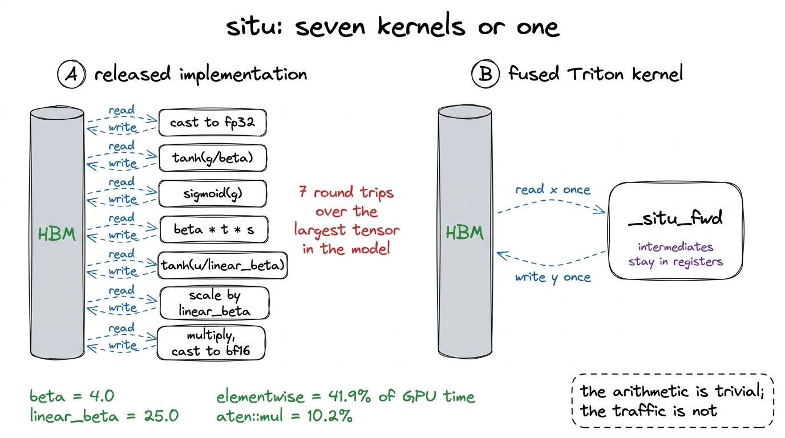
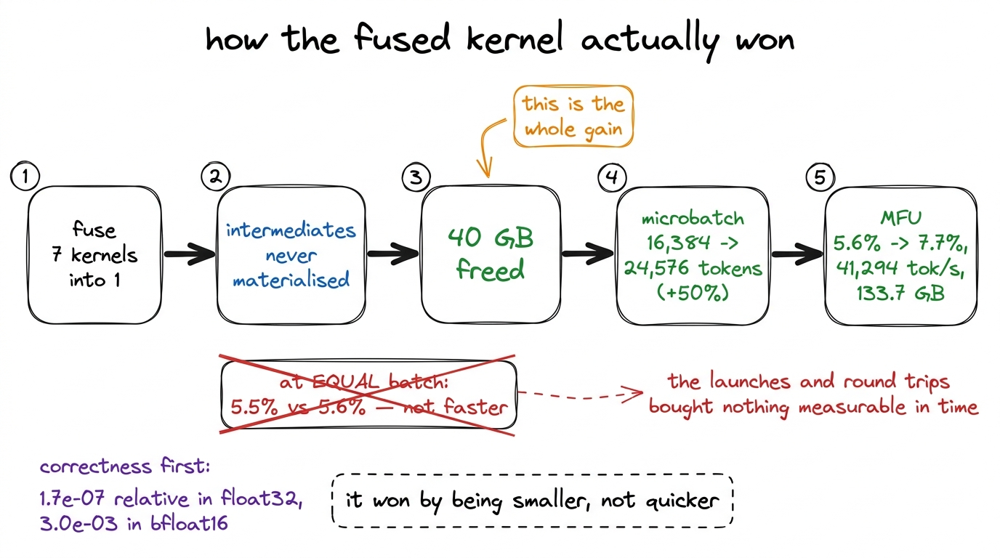
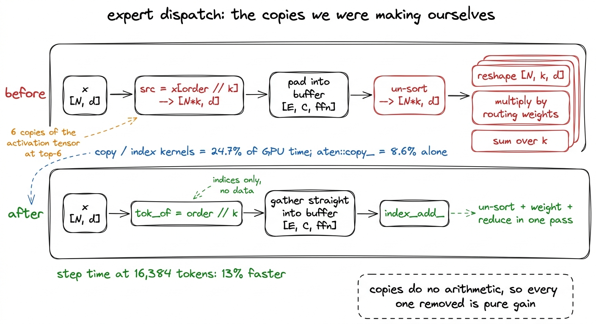
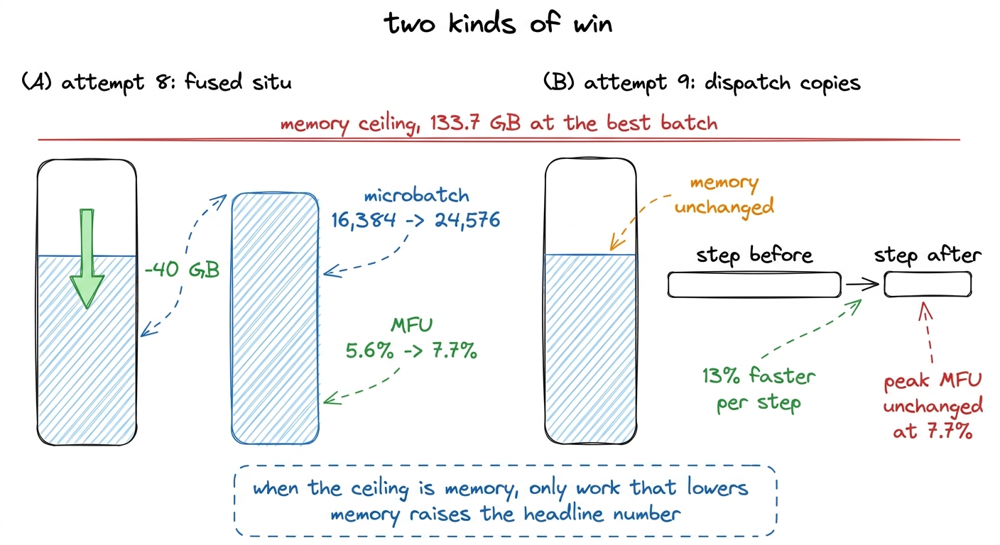
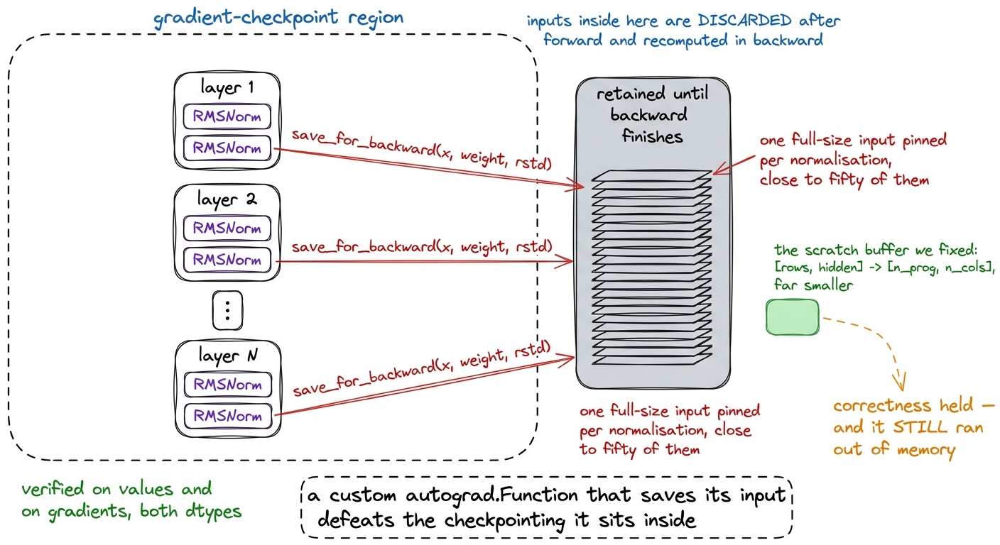
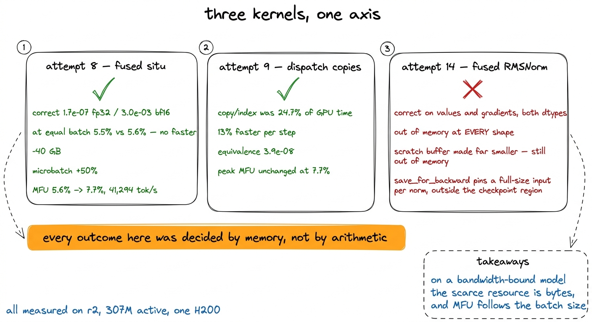

# 23\. 两个奏效的内核，以及一个失败的内核

[← 上一章](../22-the-profile/README.md) · [返回目录](../../README.md) · [下一章 →](../24-fp8-and-the-bigger-gpu/README.md)

第 04 部分 · 让训练更快 · 10 分钟 · 6 幅图 · 1.38x

> 融合 situ 激活函数靠减少显存而非直接加快计算获胜；分发清理让每步耗时下降 13%；一个数值正确的 RMSNorm 内核，却在原模块能处理的形状上显存不足。

上一章中的性能剖析指定了两个目标，并忽略了其余内容。逐元素运算耗时  **41.9%**  在 GPU 时间中，复制和索引内核耗时  **24.7%** ，以及矩阵乘法——实际测量的算术MFU——耗时约为12%。处于该状态的模型并非计算资源不足，而是内存带宽不足，值得进行的工作是那些移动字节数更少的操作。

三次尝试直接源于该配置。其中两次成功。第三次产生了一个能计算出正确答案但无法使用的内核。

这三个都是在  **r2** ，本书训练的规模档位之上的档位：307M 个激活参数，单个 H200。低于这个百分比的每一部分都属于 r2，而非本书其余部分所描述的规模档位。两个规模档位均位于同一张卡上，因此这里不涉及分片；r1 从未被分布过。[^1]

## 尝试 8：用一个内核替代七个内核

K3的激活函数是 `situ`，由参数化 $\mathrm{beta}=4.0$ 和 $\mathrm{linear\_beta}=25.0$它将输入分成两半，对门控部分应用一个非线性函数，对上部分应用另一个非线性函数，然后将两者相乘。使用 PyTorch 操作符表示，这大致涉及七个独立的 CUDA 内核：

```python
gate   = x[..., :d].to(float32)              # read + write
up     = x[..., d:].to(float32)              # read + write
t      = tanh(gate / beta)                   # read + write
s      = sigmoid(gate)                       # read + write
situ_a = beta * t * s                        # read + write
up     = linear_beta * tanh(up / linear_beta)  # read + write
out    = (situ_a * up).to(bf16)              # read + write
```

该列表中的每一行都从HBM读取一个张量，执行少量算术运算，并将结果写回。在混合专家层中，被读取的张量的形状为 `[experts, capacity, ffn_dim]`，这是模型中最大的张量。算术运算很简单，而数据传输却很复杂，这正是性能剖析所描述的形状： `aten::mul` 独自一人是  **10.2%**  全部GPU时间。

一个内核读取输入一次，将每个中间结果保留在寄存器中，并写入输出一次，可以减少大约六次往返。

[](../../figures/two-kernels-that-worked-1.png)

图 23-1　发布的激活函数与融合后的替代实现。运算相同，访问内存的次数却不同。

### 反向传播必须手工推导

前向传播很简单。反向传播是决定内核是否值得编写的关键部分，因为内存节省只有在我们拒绝存储自动微分会经过的中间结果时才能实现。这意味着需要将导数写出来：

$$
\begin{aligned}a(g)&=\mathrm{beta}\,\tanh\!\left(\frac{g}{\mathrm{beta}}\right)\operatorname{sigmoid}(g)\\b(u)&=\mathrm{linear\_beta}\,\tanh\!\left(\frac{u}{\mathrm{linear\_beta}}\right)\\y&=a(g)b(u)\\\frac{da}{dg}&=\left(1-\tanh^{2}\!\left(\frac{g}{\mathrm{beta}}\right)\right)\operatorname{sigmoid}(g)\\&\quad+\mathrm{beta}\,\tanh\!\left(\frac{g}{\mathrm{beta}}\right)\operatorname{sigmoid}(g)\\&\qquad\cdot\left(1-\operatorname{sigmoid}(g)\right)\\\frac{db}{du}&=1-\tanh^{2}\!\left(\frac{u}{\mathrm{linear\_beta}}\right)\end{aligned}
$$

反向内核重新计算 `a` 和 `b` 从已保存的输入而非从存储的张量中读取。正是这个决定将内存节省带入反向传播过程：从已经存在于寄存器中的张量中重新计算两个非线性函数仅消耗少量指令，而存储它们则会在整个反向传播过程中为每个激活位置消耗两个完整大小的张量。[^2]

### 正确性优先，以及具有误导性的容差

在任何时间测量之前，内核在值和梯度方面与已发布的模块进行了比较，跨两者 `linear_beta` 设置和两种数据类型。相对误差达到了  **$1.7\times10^{-7}$ 在 float32 中**  和  **$3.0\times10^{-3}$ 在 bfloat16 中** ，两者都包含在dtype中。

第一版检查报告失败，但问题不在内核，而在绝对容差。`situ`会乘以`beta`和`linear_beta`，所以输出量级显著大于 1。对接近 1 的数值合理的阈值，在数值大了两个数量级后，就会要求 bfloat16 提供其本来没有的有效位数。随着被检查张量的数值量级增大，固定绝对阈值会悄悄变得更严格，因此本项目的比较都相对于输出量级进行。

### 结果，以及收益来自哪个方向

| situ | 每个微批次的 token 数 | MFU | 结果 |
| --- | --- | --- | --- |
| 发布 | 16,384 | 5.6% | 符合 |
| 发布 | 24,576 | — | 显存不足 |
| 融合的 | 16,384 | 5.5% | 40 GB 更少内存 |
| 融合的 | 24,576 | **7.7%** | 41,294 个token/秒，133.7 GB |

在相同批量大小的情况下，融合内核是  **没有更快** ：5.5% 对 5.6%，这在测量噪声范围内，且略微落在其错误一侧。每一次七次内核启动都已移除，且每次前往HBM执行这些启动的往返行程，均未带来可测量的时间收益。

它所获得的是  **40 GB** 那些不再物化的中间结果不再被分配，且 40 GB 足够的头空间以支持一个更大的微批次 50%。在每微批次 24,576 个标记时，相同的内核运行于  **41,294 个token每秒和 7.7% MFU** ，与之前5.6%相对，这在尝试日志中表现为1.38x。

自然的假设恰恰相反。融合内核本应通过更快的速度取胜。这个内核是通过更小的规模取胜，而这种小型化是通过批量大小转化为MFU，而非通过时钟周期。

[](../../figures/two-kernels-that-worked-2.png)

图 23-2　从融合到 MFU 的因果链。收益来自显存，而非直接缩短运算时间；二者通过批量大小联系起来。

## 尝试 9：那些由我们自己制造的复制

修正后的性能剖析将复制和索引内核置于  **24.7%**  在GPU时间消耗中，仅次于元素级运算，与 `aten::copy_` 固定为  **8.6%**  单独存在。副本根本不执行任何算术运算，因此移除每一个副本都是纯粹的收益。问题是，哪些属于我们自己。

阅读我们自己的专家分发，有两个是可避免的。

第一个是完全的物质化。分发根据专家对标记进行排序，并直接构建排序后的张量：

```python
order = torch.argsort(flat, stable=True)
src   = x[order // k]            # [N*k, d] — a copy of every token, once per routed slot
```

在顶部-6，即在任何算术运算发生之前创建的激活张量的六份副本，然后立即再次复制到批处理矩阵乘法读取的填充缓冲区中。修复方法是保留索引而非张量，并一次性聚合到填充缓冲区中：

```python
tok_of = order // k                  # [N*k] indices, not [N*k, d] of data
...
idx = tok_of[sel]
xp[e_loc, r_loc] = x[idx]            # one gather, into the buffer we needed anyway
```

第二处是输出路径。token 排序后，先撤销排序得到`[N*k, d]`，重塑为`[N, k, d]`，乘路由权重，再沿`k`归约。每一步都分配并填充一个完整大小的张量，因而为本质上的加权散射累积又增加了三个张量。单次`index_add_`即可将撤销排序、加权和归约合并为一次数据遍历。

[](../../figures/two-kernels-that-worked-3.png)

图 23-3　分发路径的前后对比。四个完整大小的张量消失了，算术运算没有改变。

 **结果。**  在每个微批次包含 16,384 个 token 时，每步耗时降低了  **13%** . 最高 MFU 保持在  **7.7%** .

那两条句子看似矛盾，实则不然。MFU 的峰值在每微批次 24,576 个 token 时达到，此时内存占用为 133.7 GB，已无空间容纳更大的批次。该训练运行以内存为上限而非时间上限，因此使每步耗时 13% 更短，能够在不改变可容纳批次大小的前提下提升所有批次规模下的吞吐量，而 headline 数值由后者决定。尝试 8 通过降低内存提升了上限；尝试 9 则让我们在未移动上限的情况下实现了更快的进展。

[](../../figures/two-kernels-that-worked-4.png)

图 23-4　两次有效尝试作用于不同方面。一个降低显存占用上沿，另一个在上限之下跑得更快。

这里必须验证：`index_add_`累加贡献的顺序与沿`k`归约不同，而浮点加法不满足结合律，所以结果允许略有不同。新路径与循环参考实现相比，误差为 $3.9\times10^{-8}$，与原始融合分发对同一参考实现的误差相同；因此，在这组形状下顺序没有造成实质影响。其他形状未必如此，这也是每次都要运行比较、而非只检查一次的原因。[^3]

## 尝试 14：一个正确却无法使用的内核

使用 PyTorch 操作符实现的 RMSNorm 需要多次遍历其输入：平方、归约、归一化、缩放。一个 Triton 内核可以在一次遍历中完成。r2 有 16 层，每层携带两个归一化层以及潜变量混合专家归一化层，因此前向传播需要执行接近五十次的归一化操作，通信开销随之累积。

反向传播是手工推导的，包括了该项 `rstd`对自身依赖于 `x`，这是最容易被舍弃的术语：

$$
\begin{aligned}dx&=\left(w\,dy-\mathrm{xhat}\cdot\operatorname{mean}(\mathrm{xhat}\,w\,dy)\right)\\&\quad\cdot\mathrm{rstd}\end{aligned}
$$

 **正确性。**  已在多个隐藏尺寸和两种数据类型下，对值和梯度进行了验证，使用了相同的相对误差检查尝试 8。每个配置均通过。内核计算了正确的内容。

 **结果。**  每个配置在处理时都出现了内存不足的情况，包括那些已发布模块能够轻松处理的形状。并非更慢，也并非略微更差：在每微批次16,384个token时内存不足，而已发布路径的处理能力在此处仍有充足余量；在24,576时也内存不足。

第一个诊断很容易找到但错误。向后分配的 `dw_part = torch.empty_like(xc)`，一个完整 `[rows, hidden]` 每个归一化操作单独分配一个张量，纯粹是为了在求和之前计算权重梯度。在模型中每个归一化操作的24,576行上，所有中间结果都一直保留到反向传播结束，即对于最终形状为一个向量的量而言，这需要大量的临时存储空间。因此被替换为生产内核所采用的方案：a `[n_prog, n_cols]` 部分减少缓冲区，要小得多，每个程序在寄存器中累积一行条带，并在最后汇总部分结果。

正确性保持。它在两种形状上仍然出现了内存不足的情况。

第二次测量使这次尝试值得单列一节，因为它排除了我们最先想到的解释：原因并不在临时工作缓冲区。

[](../../figures/two-kernels-that-worked-5.png)

图 23-5　更可能的解释。内核几乎不分配内存，但包围它的 autograd Function 固定保留了本应由检查点机制丢弃的内容。

更可能的解释是编写代码时未预料到的一种交互：`_FusedRMSNorm`是自定义`torch.autograd.Function`，会调用`save_for_backward(x, weight, rstd)`。这样保存的张量会在梯度检查点区域之外继续保留。每次归一化因此都固定保留一份完整输入，而检查点机制原本会丢弃它、需要时再重算；自定义 Function 悄悄破坏了所在区域的检查点节省效果。

为启用梯度检查点的模型编写融合内核前，应先了解这一点。手写`autograd.Function`若保存输入，即使内核本身几乎不分配内存，也可能比被替换的算子占用更多显存。可行办法是根据已经保存的内容重算——融合的`situ`内核正是如此——或者让检查点边界负责保存。[^4]

 **我们学到的内容。**  一个内核可以是数值上完美的，但仍属于回归模型。这个模型消除了对数据的重复遍历，消耗的内存远超其节省的部分，而内存正是在本研究的每一步中转化为MFU的资源。  **“已验证正确”和“可直接使用”是不同的声明** ，它们之间的差距并不在数值上。

其中还有一个更小的教训，来自其诊断过程。首次运行堆叠基准测试报告所有配置均出现内存不足，这更像是一种容量限制，而非回归问题。在16,384个token的运行中，当释放路径能够舒适容纳时，仅通过一次测量就将问题定位到新的内核上。基准测试扫描实验中始终应包含一个已知能正常工作的形状，因为一个没有任何对照的失败清单，并不能告诉你究竟是哪个变更导致了这些失败。

## 三者的共同之处

[](../../figures/two-kernels-that-worked-6.png)

图 23-6　三次内核尝试。两次成功，一次失败，结果都由同一种资源决定。

三次尝试，三次结果，相同的资源决定了它们全部。

尝试 8 删除了模型中最大张量的六次往返调用，但在时间上没有获得可测量的提升，随后通过释放 40 GB 获得了 1.38 倍的性能提升。尝试 9 从分发路径中移除了四个全尺寸张量，使每一步都快了 13% 倍，但由于头条指标设定在能容纳的最大批处理大小上，因此头条 MFU 保持不变。尝试 14 删除了多次数据遍历，在我们检查的每个形状上都得到了正确的答案，但由于其自动求导包装器保留了某些内容，该尝试完全无法运行。

在内存带宽受限的模型中，字节是货币，MFU以批大小为单位表示。这是一个比“融合你的内核”更狭窄的结论，它以一般建议无法做到的方式预测了上述结果。它还预测了接下来的内容：FP8之所以有吸引力，是因为它将跨越总线的字节数减半，而更大的GPU之所以有吸引力，是因为它拥有更多的内存和更高的带宽。这两者都已被尝试过，但它们的行为方式与该论点所预测的不符。

---

[← 上一章](../22-the-profile/README.md) · [返回目录](../../README.md) · [下一章 →](../24-fp8-and-the-bigger-gpu/README.md)

[^1]: 这一点关系到如何解读数字，并不改变结论。在采用相同优化后，r1 的基准测试结果为每秒 66,877 个 token、MFU 为 5.9%；而它实际完成的 38,147 步训练，持续吞吐量为每秒 27,600 至 28,900 个 token，MFU 为 2.4% 至 2.5%。本章介绍的内核针对 r2 编写，随后加入两个档位共用的代码路径。

[^2]: 这个Triton构建没有 `tl.math.tanh`. 内核使用 $\tanh(x)=2\operatorname{sigmoid}(2x)-1$，这是一个精确的代数恒等式而非近似值，和 `tl.sigmoid` 在每个构建中均存在。在编写内核之前而非之后，检查你的 Triton 版本实际暴露的数学函数是值得做的。

[^3]: 循环参考实现，就是尝试 1 所替换的逐专家 Python 循环。它约慢 17.5 倍，却正因这个用途而被保留：一个唯一职责就是明确保证正确性的慢实现，值得付出运行时间，因为它能把“快速路径大概没问题”变成可检验的数字。

[^4]: 检查点本身是对此模型的一场斗争。 `gradient_checkpointing_enable()` 在已发布的Kimi代码中，这是一个静默的无操作（no-op）：它声明了支持，设置了标志，而解码循环从未调用检查点函数。线索体现在我们自己的内存数值中——关闭时为76.7 GB，开启时为76.8 GB，在8,192个token处。内存数值完全一致，正是无操作的特征。使其真正生效也要求 `use_cache = False`，因为KV缓存是在前向传播过程中被修改的，而重新计算的前向传播否则会看到不同的状态。
