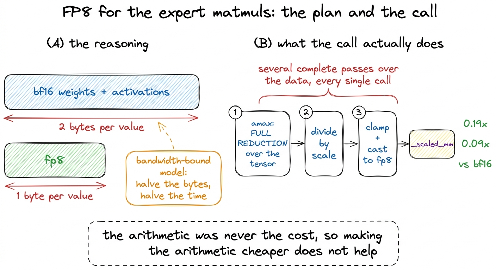
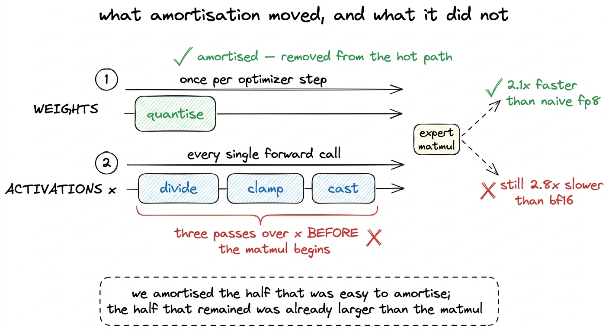
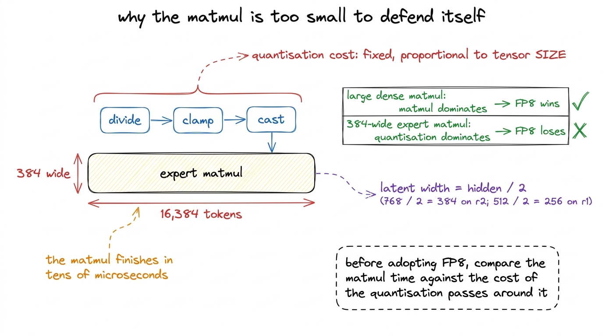
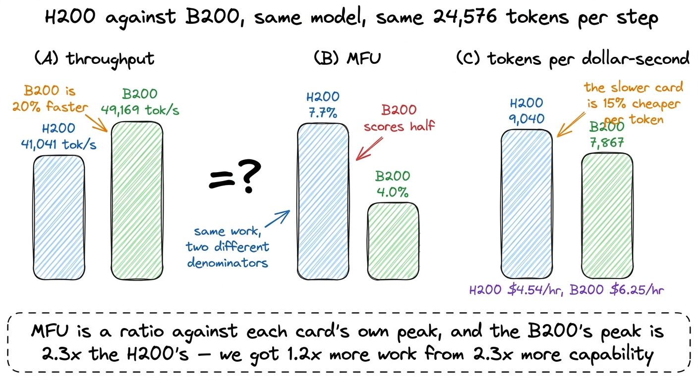
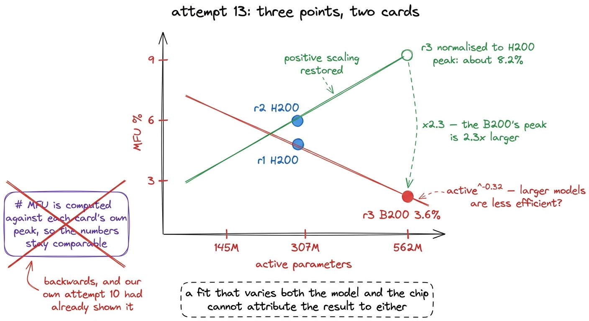

# 24\. FP8，以及 MFU 反而更低的大 GPU

[← 上一章](../23-two-kernels-that-worked/README.md) · [返回目录](../../README.md) · [下一章 →](../25-the-silent-fallback/README.md)

第 04 部分 · 让训练更快 · 10 分钟 · 5 幅图 · 0.19x

> 两次 FP8 尝试比替代前的格式慢四至十一倍；B200 的绝对吞吐量高出 20%，MFU 却约为一半。两种结果都是真实的，也都需要正确理解比率。

上一章的性能剖析将我们指向了某个特定资源。其中大约 12% 的 GPU 时间用于算术运算，41.9% 用于数据移动而实际计算较少，因此需要节省的是内存总线上传输的字节数，而非浮点运算。由此直接得出两个想法。使用更小的数值格式，这样每移动一个字节所携带的信息量只需原来的一半空间。或者租用一张带更高带宽和更大内存的显卡，使字节传输更快，且能容纳更多字节。

我们尝试了两种方法。两种方法都失败了，且两次失败的情况具有相同的形态。每个问题都涉及一个比例，而在每种情况下，我们所推理的量位于比例的上方，而决定结果的量则位于其下方。

本章介绍了尝试 11 和 15，FP8 以简单方式尝试，然后是生产系统中采用的方法，以及尝试 10，一个 Blackwell B200 作为 H200 的替代。它以尝试 13 结束，这是一个无效的测量，该测量在尝试 10 中已经可以被捕捉到，而我们直到拟合的指数符号改变时才捕捉到。

全部都是在上进行的测量  **r2** ，位于本书所讨论的档位之上的307M-活跃档位，在单个H200上除非指定了B200。这些结果均未来自r1自身的训练运行。

## 按表面承诺理解 FP8

FP8 是一种八位浮点格式，支持 Hopper 和 Blackwell 上的张量核心，与 bfloat16 相比，它每处理一个权重和一个激活值就减少一半的字节。专家权重承载了混合专家模型的大部分参数，每个标记会读取六个专家权重，因此专家矩阵乘法看起来是目前可获得的最大单次节省。PyTorch 直接暴露了该操作 `torch._scaled_mm`.

复杂之处在于数值范围。FP8 约携带两个十进制数字，因此张量必须在矩阵乘法之前被缩放至格式的可用范围，乘法完成后又需恢复原值。直接实现方式如下：

```python
sx = x.abs().amax() / 448.0          # 448 is the max of float8_e4m3fn
xq = (x / sx).to(torch.float8_e4m3fn)
y  = torch._scaled_mm(xq, wq.t(), scale_a=sx, scale_b=sw, out_dtype=x.dtype)
```

三行代码，其中一行是库调用，每一行都正确。[^1]

我们是在专家层实际使用的形状上进行基准测试的，而不是选择一个看起来美观的正方形形状，测试结果在所有形状上都是均匀的。FP8 的运行情况介于  **0.19x 和 0.09x**  关于 bfloat16 的速度，也就是说它比其所替代的格式慢数倍，而且大约  **准确度低五倍**  在相同的形状上。

[](../../figures/fp8-and-the-bigger-gpu-1.png)

图 24-1　采用 FP8 的推理依据，以及简单实现实际上执行的操作。测量使用单张 H200 和 r2 的专家张量形状。

## 为何它反而更慢

算术不是成本，这一点在性能剖析章节结束时的句子中提到，到这里以另一种形式呈现。

每次调用计算 `amax`，对整个张量进行完整归约，然后除以得到的标量，进行钳制和类型转换。也就是说，在矩阵乘法允许开始之前，需要对数据进行多次完整遍历。我们的专家矩阵乘法在 bfloat16 中足够小，可以在几十微秒内完成，而对如此大小张量进行几次额外遍历的成本，超过了矩阵乘法本身所花费的时间，因此总耗时会更大，尽管后续的矩阵乘法可能非常高效。

数值精度变差还有另一原因。逐张量缩放用一个标量控制整个张量，因此单个离群值就决定了缩放比例，其余值只能挤进剩余的动态范围。[^2]所以相对误差是 bfloat16 的五倍，而非仅按位数推测的两三倍。

因此，朴素的结果并不能证明 FP8 无效。它证明了将 FP8 作为类型转换在调用位置应用，实际上是一种以类型格式为外衣的规模子系统，且该子系统的开销大于格式带来的节省。

## 生产环境中使用 FP8 的方式

尝试 15 实现了生产 FP8 不同的三个方面，所有内容都是关于一次性完成工作而不是每次都要完成。

 **持久化的量化权重。**  权重在每次优化器步长时仅更新一次，而不是在每次前向传播时更新一次。在步长之后对权重进行量化并复用结果，会移除每次调用中的整个归约、除法和类型转换操作，且随着每个优化器步长包含的前向传播次数增加，节省的操作数量也随之增长。

延迟缩放。不要每次对激活张量做归约来找最大值，而应保存前几步的运行最大值，并在热点路径之外每步更新一次。缩放因子会略微滞后，这是设计接受的代价；关键路径上便不再需要该归约。

将缩放操作移出归约路径，让矩阵乘法直接接收已缩放的输入，避免两种操作相互强制串行等待。

所有三个版本都在与朴素版本相同的形状上实现了并进行了测量。 amortising 使 FP8  **2.1倍优于朴素版本** ，这正是它本该做到的，证实了这三个更改确实解决了实际成本。FP8 保持不变  **2.8倍比bfloat16慢** .

[](../../figures/fp8-and-the-bigger-gpu-2.png)

图 24-2　尝试 15。持久保存量化权重并采用延迟缩放，完全消除了权重侧成本；最终结果由激活侧成本决定。

剩余差距是结构性的，不是调参问题。权重量化已经被摊销，但每次调用仍要量化激活值：做除法、钳位和类型转换，在矩阵乘法开始前将`x`遍历三遍。这些遍历所服务的矩阵乘法，本身只需几十微秒；三遍输入处理比它还贵，总耗时自然无法低于 bfloat16。

## 决定结果的张量形状

矩阵乘法的规模较小有其特定的架构原因，这也是K3成为K3的一个特征。

混合专家模型的潜变量路由在到达专家之前，会经过一个隐藏尺寸一半的瓶颈。在 r1 中，潜变量宽度为 256，是隐藏尺寸 512 的一半。在 r2 上，这些测量值的取值是：隐藏尺寸为 768，潜变量宽度为 384，而 384 是我们基准测试的专家矩阵乘法的内维。该架构中专家的矩阵乘法宽度为 384，即使在 16,384 个标记的微批次上，其运算也仅需几十微秒即可完成。

[](../../figures/fp8-and-the-bigger-gpu-3.png)

图 24-3　让这种架构每个 token 的计算成本较低的潜在表示瓶颈，也正是让 FP8 在这里无利可图的原因。

FP8 在矩阵乘法主导其周围量化的情况下生效，这在大型模型内部的大型稠密矩阵乘法中成立，而在此场景中不成立。要使该方法在这些形状上获胜，意味着将激活量化的融合到生成激活的内核中，从而完全不存在对数据的单独遍历。在实践中，这意味着将整个专家前向计算写成一个 Triton 内核，而不是调用 `torch._scaled_mm`，正如两套有效内核的章节所示，一个融合的内核本身就已经是一项相当繁重的工作。

可迁移规则是编写任何一行量化代码之前任何人都可以进行的比较。测量矩阵乘法的耗时，然后估算量化所需的对数据的遍历次数。如果矩阵乘法的耗时在几十微秒量级，那么无论量化代码写得多仔细，量化部分都将是主导因素。

## 更大的 GPU

尝试 10 修改了硬件而非代码，这是一个干净的实验：它将我们的实现限制与机器的限制分开了。

其推理是，天花板两次都表现为内存而非速度。融合 `situ` 尝试 8 的内核获胜 1.38 倍，纯粹是通过释放 40 GB 实现的，这使得微批次大小增加 50%，而尝试 9 的分发清理使每一步 13% 更快，同时峰值 MFU 保持不变，因为没有更大的批次可以容纳。一个 B200 携带 180 GB 且峰值高于 H200，因此它是显而易见的尝试卡片。

我们在两张卡上以每步24,576个token的速率运行了r2：

| gpu | 每步 token 数 | tokens/s | MFU |
| --- | --- | --- | --- |
| H200 | 24,576 | 41,041 | **7.7%** |
| B200 | 24,576 | 49,169 | **4.0%** |

B200 是  **20% 在绝对吞吐量上更快，且MFU大约为一半** 这两个数字都是正确的，当你第一次一起读它们时，它们看起来并不像可以是同一个。

[](../../figures/fp8-and-the-bigger-gpu-4.png)

图 24-4　三个面板描述的是同一对训练。哪张显卡看起来更好，完全取决于用哪个量作分母。

它们可以，因为MFU是一个比值，而分母发生了变化。MFU将有效算术除以显卡自身的峰值，而B200的峰值是  **2.3 次**  H200的。我们从2.3倍的能力中提取了1.2倍的工作，因此机器中更大份额处于空闲状态，百分比下降而实际运行时间却得到了改善。

这里值得重新写出定义，因为困惑就在其中：$\mathrm{MFU}=\frac{6\,\mathrm{active\_parameters}\,\mathrm{tokens\_per\_second}}{\mathrm{peak\_FLOPs}}$，H200 的 bf16 峰值取约 989 TFLOP/s。分子由模型和实际运行决定，分母只由显卡决定。换成峰值更高的显卡，如果分子没有同比例增加，即使关心的实际指标改善，比率仍会下降。调优良好的稠密训练通常达到 40% 至 55%，混合专家训练则更低，因此个位数的 MFU 本身未必像表面看起来那样异常。

这一点适用于每一个使用度量，而不仅限于这一项。  **MFU 是一个比率，因此更快的 GPU 可以降低它。**  跨不同硬件平台比较MFU，衡量的是每块芯片的利用率，而非哪块芯片完成得更快。

在硬件决策中，有用的指标是每美元秒的token数，其分母是美元而非FLOPs。按每小时\$4.54计价，H200的性能为  **9,040**  每美元秒的token数，以及在每小时\$6.25的价格下，B200提供7,867。较慢的显卡是  **15% 更具成本效益** ，因此升级到更大的GPU会使MFU的头条表现看起来更差，同时每token的成本也会更高。[^3]

## 符号发生反转的拟合结果

尝试 13 是这两个结果交汇的地方，它是值得反复阅读的一个。

我们对旗舰模型MFU的估算，是基于在两个规模档位r1在145M和r2在307M上，均在H200平台上的激活参数与吞吐量之间的拟合关系得出的。该拟合关系给出 $\mathrm{active}^{0.35}$ 并外推至 12.5%。一个两点幂律对即将定价的训练运行的数值提供弱证据，因此第三个点是值得拥有的。规模档位 r3 在 H200 上以实用的批大小无法适配，因此我们在 B200 上运行并重新拟合了全部三个点。

拟合结果为$\mathrm{active}^{-0.32}$。负指数意味着模型越大，效率反而系统性地越低；这会让旗舰模型的成本外推朝错误方向变化，使整个规模阶梯看起来不值得投入。

没有崩溃。回归实现正确，算术运算无误，数值看起来像是仔细测量有时会得到的令人失望的结果。

[](../../figures/fp8-and-the-bigger-gpu-5.png)

图 24-5　无效拟合及其修正。B200 数据点带有与模型规模无关的系统性偏移。

这是一个伪影。尝试 10 已经证实，B200 的 MFU 大约是相同工作量下 H200 的一半，因此在旨在隔离模型规模的拟合中混合这两张卡，会在三个点之一引入一个两倍的系统性偏移。对 r3 进行归一化  **3.6%**  到 H200 的峰值大约是  **8.2%** ，位于 r2 之上，并恢复了两点拟合所发现的正向缩放。

两个关于如何发现这一点的细节比修正后的数值更重要。

第一个是，代码中包含一条注释，声称针对每张卡自身的峰值计算 MFU，使得各卡之间的数值具有可比性。这恰恰是反了，我们此前两次测量的结果已经明确证明了这一点。在实现测量过程时写下的注释记录了作者当时的信念，它可能与该项目已经产生的结果相矛盾。

第二个是，本次训练运行中没有任何指标标记了这一点。没有崩溃，没有警告，也没有不合理的数量级。唯一发现它的是注意到在相同分析的两次运行之间，拟合的指数符号发生了变化，并就此询问原因。一个测量可以正确实现，却仍然测量了错误的量，而错误量的失败模式会是一个合理的数值。[^4]

## 三次尝试的共同之处

最初讨论 FP8 时，我们关注每个数值占用的字节数，它确实减半了。但决定结果的是矩阵乘法耗时与生成这些字节所需遍历的固定成本之比；数值格式变小，并不会让这种固定成本同比下降。摊销把一半成本移出了热点路径，剩下的一半却已经超过矩阵乘法本身。

更大的GPU在带宽、内存和吞吐量方面都被考虑过，这些方面都得到了改善。但真正改变标题的是分母，即显卡自身的峰值性能，其增长速度超过了我们能够利用它的能力。

无效拟合是一个除数错误，两次都发生了，一次在测量中，一次在解释为何测量正确的评论中。

三者中都没有需要新的内核或一个微妙的错误导致问题。每一个只需要一个比率被读取时，而不去检查它除以的是什么。实际的防御措施是在每个百分比旁边保留一个绝对数值。每秒的令牌吞吐量和每美元秒的令牌成本都不是以一个变动的参考为基准进行衡量的，在三次尝试中，它们都讲出了正确的故事，而百分比却没有。

下一章中，一次测量终于指向了真实存在的现象。随着批处理大小的增长，吞吐量曲线上下波动，而峰值内存数值却始终不变，这两种形态是任何扩展性理论都无法产生的，它们共同揭示了一条分发路径正悄然退化回它原本被设计用来替代的循环中。

---

[← 上一章](../23-two-kernels-that-worked/README.md) · [返回目录](../../README.md) · [下一章 →](../25-the-silent-fallback/README.md)

[^1]: `float8_e4m3fn`使用四位指数和三位尾数，不表示无穷大，因此最大可表示值是 448，而非某个二的幂。另一种 FP8 类型`e5m2`牺牲尾数精度来扩大数值范围，通常用于梯度，而非激活值。我们只测了`e4m3fn`：如果连前向传播都无法准确表示，就没有必要再测反向传播。

[^2]: 按块或按行扩展解决了这个问题，它为张量的每一行或每个分块赋予独立的缩放因子，这正是生产环境中的 FP8 实现所采用的做法。我们没有实现该功能，因为当精度问题变得重要时，速度结果已经使得该方法在这些形状下被排除。此处记录精度数据，以防止有人将 0.19x 视为唯一反对理由。

[^3]: 内存是另一个不符合原始容量预测的行为量。在尝试 8 中，融合内核释放的 40 GB 使得微批次大小增加 50%，并实现了 1.38 倍的增益，因此一个内存节省通过一条与带宽无关的路径转化为了吞吐量增益。关于静默回退的章节展示了相反的情况，其中峰值内存对批次大小的响应完全停止了。

[^4]: 这与专家坍塌一章中提到的路由器熵错误属于同一类错误，其中正确实现的指标读取了0.99，而94.5%个专家处于不活跃状态。在两种情况下，代码本身是正确的，数值是错误的，而发现该错误的检查是与第二个测量结果进行比较，而非对代码本身进行更细致的审查。
