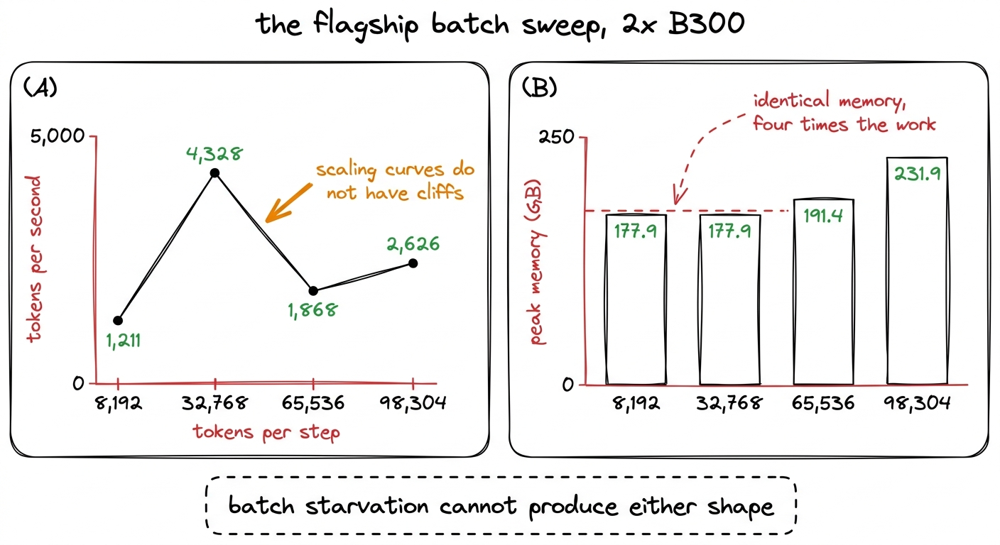
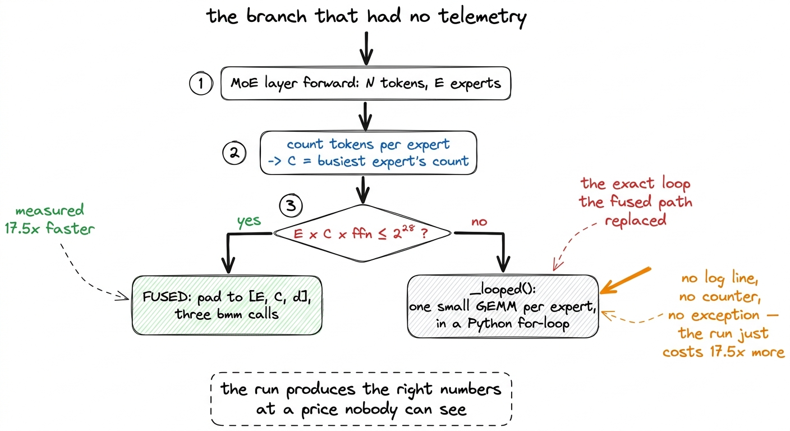
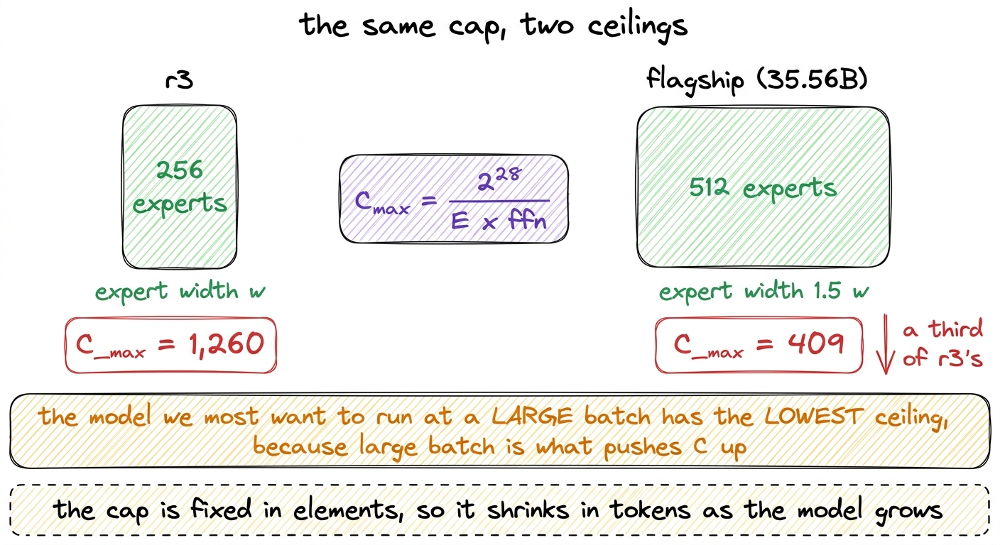
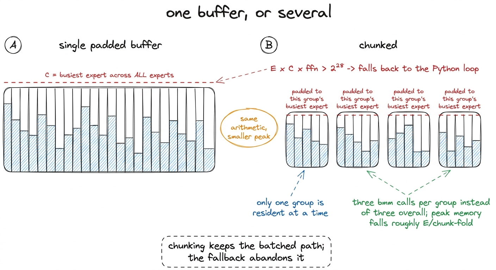
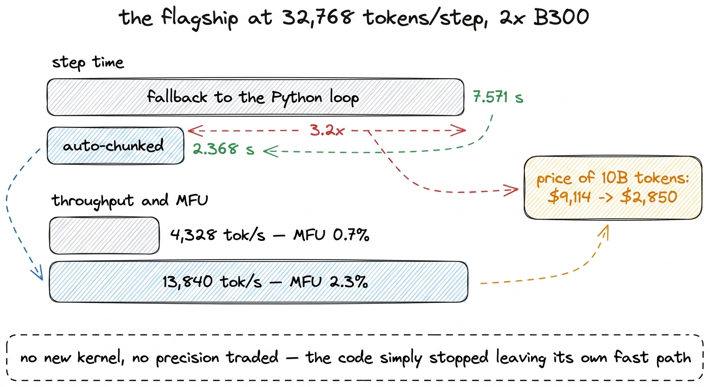
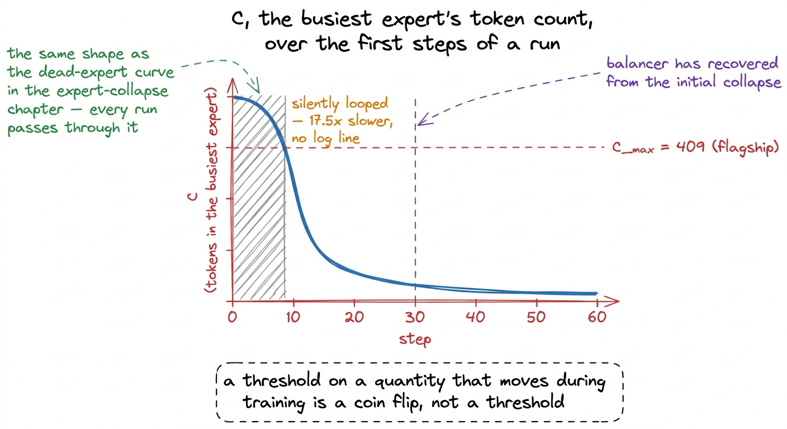

# 25\. 静默回退

[← 上一章](../24-fp8-and-the-bigger-gpu/README.md) · [返回目录](../../README.md) · [下一章 →](../26-sharding-the-model/README.md)

第 04 部分 · 让训练更快 · 10 分钟 · 6 幅图 · 3.2x

> 吞吐量曲线不单调，批量增大时显存却不变：这两种形状无法由正常缩放解释，根源是缓冲区上限让 23 层静默回退到旧循环。

本章中的所有内容都是在旗舰模型上测量的：35.56B参数的顶级规模档位，运行在  **2 张 B300** 它并不是 r1。r1 是在单个 H200 上训练的，并且从未进行分片，下面的数值根本不会出现在它上面，这正是它们值得被记录下来的原因之一。

使用 FSDP2 最终完成端到端的训练，我们首次能够测量其吞吐量。在每步 8,192 个 token 的情况下，其表现如下  **1,211 个token每秒** ，一个MFU为  **0.2%** ，反对的  **3.6%**  r3 在一个 B200 上记录。[^1]

即使按本项目的标准，这也是一个很差的数字：本项目唯一完成的训练是单张 H200 上的 r1，持续吞吐量为每秒 27,600 至 28,900 个 token，MFU 为 2.4% 至 2.5%。而这个糟糕数字出现时，还附带着一个现成的解释。

## 一个看似解释得通的说法

在每步跨两个进程处理 8,192 个 token 的情况下，每张卡看到 4,096 个 token，这仅是 r1 实际运行中每步 131,072 个 token 的一小部分。批处理饥饿是显而易的结论，这也与 MFU 调查到目前为止所学到的一切内容一致。

批量在连续三次尝试中都是最强杠杆，每次均在单个 H200 上的 307M-活跃规模档位（r2）上进行测量。尝试 8 的融合 `situ` 内核在相等的批处理大小下——5.5% 对 5.6%——并未更快，而是通过释放 40 GB 实现了完全胜利，这使得微批大小达到 50% 个 24,576 个标记，并将 MFU 提升至 7.7%，在每秒 41,294 个标记的速率下。尝试 5 的 float32 修复直接提升了 0.1 个百分点的 MFU，并间接提升了 40 GB 的内存使用。拒绝了尝试 4 对专家缓冲区的分块，因为它节省了约 5% 的内存，但 MFU 却下降了。

三次尝试，一个结论：在 r2 上，内存带来批处理，批处理带来吞吐量。为实现这一点，旗舰模型刚刚完成了两次内存修复。因此我们对批处理进行了扫描实验，并期望曲线会上升。

## 扫描实验

| 每步的token数 | 每步耗时 | tokens/s | MFU | 峰值显存 |
| --- | --- | --- | --- | --- |
| 8,192 | 6.76 s | 1,211 | 0.2% | 177.9 GB |
| 32,768 | 7.57 s | 4,328 | 0.7% | 177.9 GB |
| 65,536 | 35.09 s | 1,868 | 0.3% | 191.4 GB |
| 98,304 | 37.44 s | 2,626 | 0.4% | 231.9 GB |

吞吐量上升了3.6倍，然后下降超过一半，随后部分恢复。

[](../../figures/the-silent-fallback-1.png)

图 25-1　原本预期会持续上升的扫描曲线。两个面板都是旗舰模型在 2 张 B300 上的结果。

这两种形状对我们要讲述的故事来说都是不可能的。

 **扩展曲线没有悬崖。**  一个批处理量不足的模型，当批处理量翻倍时，其速度并不会慢于两倍，这正是4,328降至1,868个token每秒所表示的情况。平滑的资源曲线会弯曲、饱和并达到平台期；它们不会反转。反转意味着某项切换发生了。

 **如果内存是限制因素，内存就会被调整。**  每步在 8,192 和 32,768 个token时的峰值内存相同，精确到一位小数为 177.9 GB，对应四倍的工作量。[^2] 在工作量四倍增加时内存保持相同，这一特征同样暴露了 `gradient_checkpointing_enable()` 作为该项目早期的一个无操作（no-op），其中内存读取 76.7 GB 时是关闭的，76.8 GB 时是开启的。一个本应移动却未移动的量，是关于代码路径的证据，而不是关于资源的。

这些都不是通过更深入地思考批次得到的。它们是通过将四行放入一个表格中并观察列得到的。

## 实际原因

融合专家分发，这一变化产生了  **17.5x**  在 r2 上的第 1 次尝试中，将 MFU 从 0.1% 提升至 4.1%，将 token 填入稠密层 `[E, C, d]` 缓冲区在哪里 `E` 专家数量和 `C` 是最繁忙专家的token数量。填充是精确而非有损的：未使用的槽位保存零值，其输出永远不会被收集，因此没有token被丢弃。代价是缓冲区的大小是 $E\times C\times\mathrm{ffn}$，和 `C` 随着路由不平衡而增长。

该缓冲区携带一个上限：

```python
# Cap on the padded buffer, in elements. Beyond this the routing is imbalanced
# enough that padding wastes more than the loop costs.
MAX_PAD_ELEMS = 1 << 28
```

上限是一个合理的工程设计。如果没有它，一个在第六小时路由严重失衡的训练运行会分配一个足够大的缓冲区，导致内存卡耗尽而终止。它在超过上限时所做的就是回退到 `_looped`，融合分发的Python循环已编写以替代专用于17.5倍的专家循环。

而这次回退没有打印任何提示。

[](../../figures/the-silent-fallback-2.png)

图 25-2　分发有两种实现，性能差距很大，却没有任何地方报告某一层正在使用哪一种。

该训练运行在整个过程中都是正确的。两条路径计算相同的函数，其值和梯度均已相互验证。它只是成本大了一个数量级，且没有任何输出能够区分这两种情况。

## 上限，以及谁会触及它

调整帽状结构可直接得到最大的可容忍最繁忙专家数量：

$$
C_{\max}=\frac{2^{28}}{E\times\mathrm{ffn}}
$$

两个规模档位，两个答案。对于 r3，拥有 256 个专家， `C_max` 是  **1,260** . 对于旗舰模型，其专家数量是两倍，专家宽度是原尺寸的1.5倍， `C_max` 是  **409** .

[](../../figures/the-silent-fallback-3.png)

图 25-3　上限是固定的元素数量，因此专家最多、专家最宽的模型，能容忍负载不均衡的空间最小。

排序方向错误。较大的模型需要更大的批量才能高效运行，更大的批量会推 `C` 上，较大的模型具有较低的天花板对于 `C`旗舰的天花板是r3的三分之一，而其对批处理的需求更大，这就是为什么在旗舰模型上出现了断崖，而在梯级的其他任何档位上从未出现过这种现象。

在每步32,768个token时，旗舰模型的23个MoE层悄然切换到了Python循环。[^3]

那就是悬崖。它也解释了在 65,536 和 98,304 个标记处的部分恢复：循环中每个专家的开销是每步固定的，因此将该开销分散到更多的标记上可以提升每秒标记数，同时仍将训练运行牢牢地停留在慢速路径上。

## 修复并不是把上限调大

提升 `MAX_PAD_ELEMS` 消除了该症状并恢复了为防止故障而设置的保护帽。缓冲区会因不平衡而持续增长，直到一个已经训练数小时的训练运行因内存不足而崩溃。

另一种选择是保持融合结构，同时使缓冲区更小：将专家按足够小的组进行处理，以确保每组在容量限制之内，并为每组填充  *它自己的*  最繁忙的专家而不是全局最大值。三个批处理矩阵乘法保持不变；只是多了几个而已。

```python
auto = None
if chunk is None and E * C * self.ffn_dim > MAX_PAD_ELEMS:
    auto = max(1, MAX_PAD_ELEMS // max(1, C * self.ffn_dim))
    if auto >= E:
        auto = None
    else:
        # Never silent again. `fused_moe.dispatch_stats(model)` reports
        # this, and the training loop puts it in telemetry.
        self._auto_chunks = getattr(self, "_auto_chunks", 0) + 1
        self._last_chunk = auto
        self._last_C = C
chunk = chunk if chunk is not None else auto
```

分组大小根据容量上限的同一套计算推导出来，因此缓冲区按设计就会略低于上限，不依赖调参得到的常数。如果算出的组大小不小于`E`，便无需分块，代码直接使用普通融合路径。

[](../../figures/the-silent-fallback-4.png)

图 25-4　单个缓冲区将所有专家都填充到全局最繁忙专家的大小。分块则让每一组只填充到该组最繁忙专家的大小。

分块并非免费的，我们早已知道它的代价。尝试 4 在 r2 上测定了这一代价并予以拒绝：约节省了 5% 的内存，且 MFU 下降。相较于循环的 17.5 倍数，这并非一个接近的决定。[^4]

## 这项修复的价值

以每步32,768个token的旗舰模型为基准测量：

| 分发 | 每步耗时 | tokens/s | MFU |
| --- | --- | --- | --- |
| 回退到 Python 循环 | 7.571 s | 4,328 | 0.7% |
| **自动分块的** | **2.368 s** | **13,840** | **2.3%** |

 **一个因子 3.2，来自删除回退。**  没有编写内核，没有牺牲精度，没有调整超参数。这一改变是保持代码沿其已有的路径前进。

成本侧随之变化。每个两B300的成本为\$7.10每小时，因此以两个吞吐量处理10B个token的定价，会使费用从大约  **\$9,114 到 \$2,850** ，这决定了一个训练阶段是昂贵到无法负担，还是大致落在原计划的预算之内。

[](../../figures/the-silent-fallback-5.png)

图 25-5　移除回退后的实测效果。两行使用相同模型、相同批量与相同硬件。

## 为何在上限以下也能获益

上面的算术表明旗舰模型能承受最繁忙专家的数量为 409。在每步 32,768 个token、跨两个rank的情况下，平均专家数量应轻松低于该数值。修复确实有所帮助，原因在于“最繁忙”这个词。

上限不在平均负载上，而在于最大负载，最大负载是路由不平衡的函数，这种不平衡在训练过程中并非恒定。正如专家坍塌一章所确立的，每一轮训练的初始阶段，不平衡程度最为严重：路由器没有意见，top-k 选择集中于少数几个专家，而无辅助损失的负载均衡器大约需要 30 步才能将负载拉回。旗舰模型自身验证的 FSDP2 步骤中的负载不平衡读数为 3.3，在健康 r1 上，其负载从 2.36 增加到 4.0，跨越了 38,147 步骤。在训练初期，其值远高于上述任一数值。

所以 `C` 在模型预热期间，其值恰好位于 409 之上，而该训练运行在这一时期处于慢路径中却未作出说明。

[](../../figures/the-silent-fallback-6.png)

图 25-6　上限取决于最繁忙的专家，而该专家最繁忙的时刻恰好就是训练刚开始时。

这类问题可以概括为：用固定阈值与随训练状态变化的量比较，决定运行走快路径还是慢路径。路由统计每步都在变，路径也可能向任一方向切换，既无需改代码，也不产生提示。对动态量设阈值，并不等于得到一条固定不变的性能边界。

## 让行为可观测

本章中最重要的代码变更仅有四行，且不影响吞吐量：

```python
def dispatch_stats(model) -> dict:
    """Did any MoE layer leave the single-buffer fused path, and how far?"""
    layers = [m for m in model.modules() if isinstance(m, FusedExperts)]
    auto = [m for m in layers if getattr(m, "_auto_chunks", 0)]
    if not auto:
        return {"moe_layers": len(layers), "auto_chunked_layers": 0,
                "min_chunk": None, "max_C": None}
    return {"moe_layers": len(layers),
            "auto_chunked_layers": len(auto),
            "min_chunk": min(getattr(m, "_last_chunk", 0) for m in auto),
            "max_C": max(getattr(m, "_last_C", 0) for m in auto)}
```

它报告了有多少个MoE层离开了单缓冲路径，它们需要被分割得有多细，以及观察到的最大最繁忙专家数量。这些信息进入与损失、不活跃专家比例和负载不平衡相同的遥测流，并以相同的方式被读取。一个开始大量分块的训练运行现在可以从容器外部可见。[^5]

## 两条可迁移的经验

 **一条比主路径慢一个数量级的回退路径必须是可观测的。**  回退是普通且常常正确的：这个回退存在是为了防止在运行过程中缓冲区因填充而耗尽显存，这确实是一种真实失败，它真正避免了这一问题。其昂贵之处在于，触发这个回退并不会产生任何信号。每次训练运行所执行的检查——损失、梯度范数、不活跃专家、等价性测试——在整个过程中都通过了，因为所有这些检查结果都是正确的。一个静默的性能回退是一种正确性错误披上了另一副外衣：运行确实产生了正确的数值，但代价是没有人同意且没有人能够看到的。接下来的规则足够狭窄，可以机械地应用。如果两条代码路径计算同一个函数，且它们之间的成本差异很大，而除了程序员之外，其他因素在运行时决定了选择，那么这个选择应当被记录在遥测数据中。

 **当一个测量结果与一个故事不符时，分歧的性质通常会指出其原因。**  批处理饥饿的解释并非轻率之举。它与四项先前尝试一致，符合硬件配置，并因具有合理性而得以存活。它并未因论点而被推翻。它在四行表格中死于两种形态：一条曲线反转，以及一个内存列未发生移动。这两种情况均无需了解专家混合的相关知识。资源曲线的反转说明实现方式发生了切换。一个本应被消耗的资源未对其产生响应，说明消耗行为并未发生。两者均指向代码路径，而非资源本身，而这正是答案所在。

十六次MFU尝试中的大多数描述了杀死一个假设并就此停止的测量。这是其中一次测量不仅杀死了假设，而且在它的形态上指明了下一步该查看的位置。

---

[← 上一章](../24-fp8-and-the-bigger-gpu/README.md) · [返回目录](../../README.md) · [下一章 →](../26-sharding-the-model/README.md)

[^1]: MFU 这里是相对于 B300 自身的峰值计算的，因为这始终是如此。尝试 13 证实了 MFU 数值仅能在相同硬件上的训练运行之间进行比较，因为分母是显卡的属性而非模型的属性；将 r3 的 3.6% 归一化到 H200 的峰值，得到大约 8.2%。与 r3 的比较因此是示意性的而非精确的，而接下来内容的形状并不依赖于此。

[^2]: 两张显卡可用的 287.4 GB 中，使用了 177.9 GB，约占 62%；旗舰模型的四步 FSDP2 端到端验证也记录了同一数值。这并非巧合，因为配置相同，说明批量本应额外占用的激活显存实际上并未被使用。

[^3]: 是 23 层而非 24 层，因为第 0 层为稠密层，遵循 K3 的`first_k_dense_replace: 1`配置。所有层一起切换，才使计时变化如此明显：不是模型的一部分退化，而是整个专家层组合在同一步换了实现。

[^4]: 批处理分发在编写尝试 1 时已与循环参考进行了比对，结果一致  **$3.9\times10^{-8}$**  在数值和  **$4.1\times10^{-8}$**  在梯度中。一个在负载下自动执行的路径，正是最需要进行此类检查的路径，因为关于一次训练运行的任何信息都无法告诉你它何时被执行。

[^5]: 3.2x 的测量值已记录但未实际使用。旗舰模型于 6 年 8 月 2026 日发布，失败时存在 69.5% 个不活跃专家，负载不平衡比为 74 到 85，在 76,294 个步中的第 890 步停滞，已花费 \$48.33。分发修复方案是关于一个真实模型的实际结果；它并非关于一次完成的训练运行的结果，本书也不将其视为此类结果。
