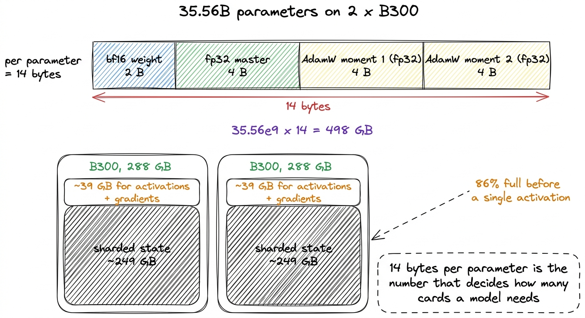
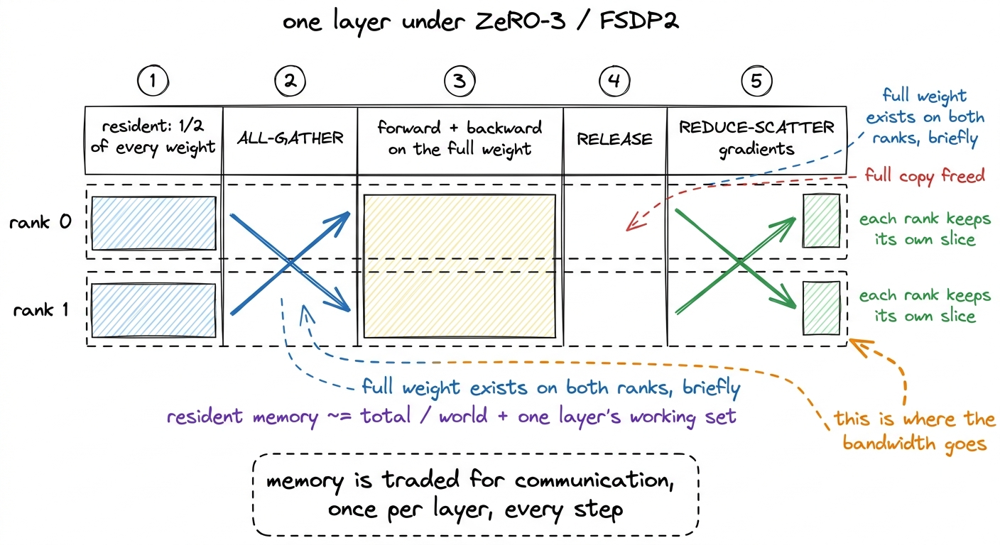
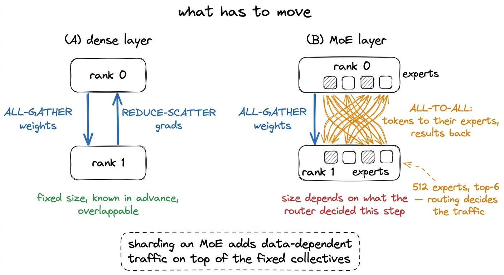
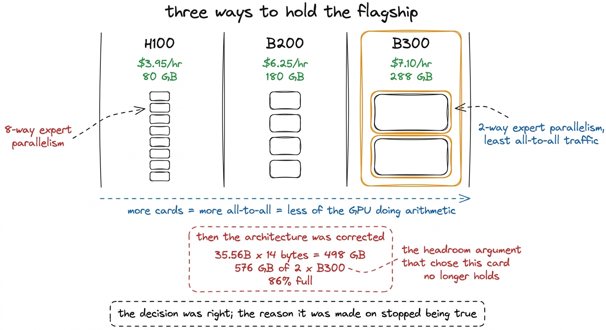
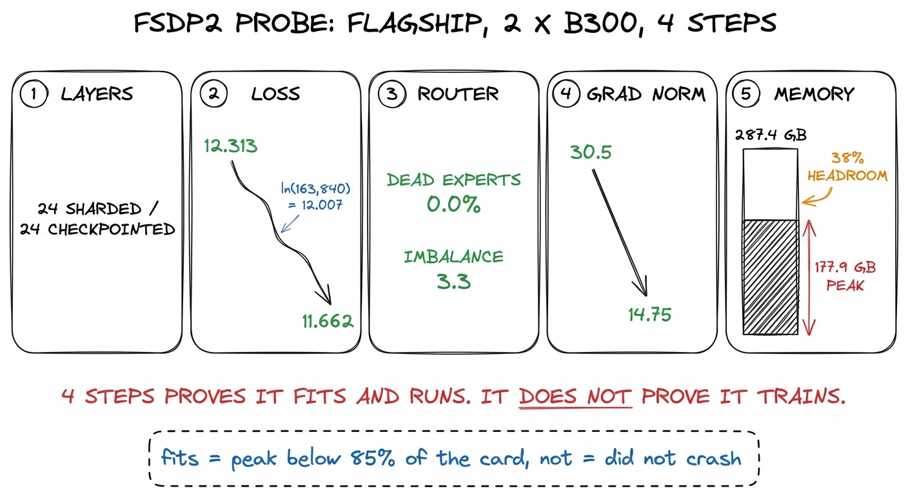
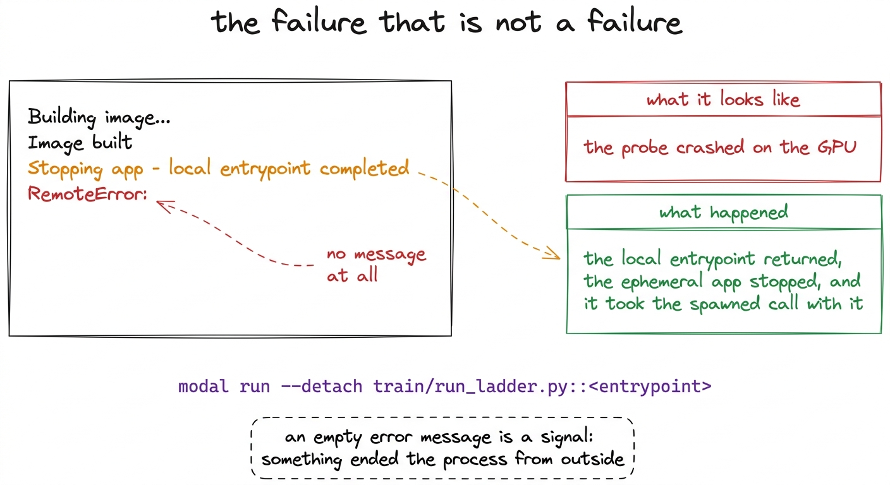

# 26\. 跨 GPU 分片模型

[← 上一章](../25-the-silent-fallback/README.md) · [返回目录](../../README.md) · [下一章 →](../27-three-bugs-that-do-not-crash/README.md)

第 05 部分 · 不止一张 GPU · 10 分钟 · 6 幅图 · FSDP2

> ZeRO-3 的实际行为：每个 rank 保存什么，35.56B 个参数为何对应 498 GB 优化器相关状态，以及如何计算模型需要多少张卡。

r1 可以放在一个 H200 上，并且从未被分片。它的 1.02B 个参数、其优化器状态和其激活值在所有 38,147 步中都存在于单张卡上，且本书其余部分描述的已完成运行中的每一个数值，都描述了一个完全没有集体通信的单进程作业。

本章介绍上述超过 r1 的模型，这些模型不适用。它被包含是因为决定模型何时停止适用的算术在每个规模上都相同，因为跟随本书学习到更大模型的读者将遇到所有内容，而且因为分片路径是项目中发现三个最具启发性的错误的地方。本节中的每一项测量均来自拥有 35.56B 个参数的旗舰模型，在两个 B300 上进行，且旗舰模型失败了。分布式系统运行正常；导致本次训练运行失败的是路由，在第 890 步的 76,294 中。

## 迫使我们作出选择的算术

一个参数并不是内存中的一个数字。在训练期间，它由多个数字组成，具体数量取决于优化器。

我们的旗舰模型有 35.56B 个参数。使用 bf16 进行训练，结合 AdamW 和 fp32 主权重，其成本为  **14 字节每参数** ，由四部分组成：bf16 复制的前向传递实际乘法使用的部分，占用 2 字节；一个 fp32 主复制的权重，占用 4 字节；以及 AdamW 的两个动量估计，每个占用 4 字节。存在主复制是因为一个 bf16 权重大约有三位有效数字的精度，而一个学习率 $3.46\times10^{-4}$ 应用于一个数量级为 1 的权重时，如果在 bf16 中进行累加，其更新将完全被舍入。

乘出来：$35.56\times10^{9}$ × 14 字节 =  **498 GB** .

两张 B300 各有 288 GB，总计 576 GB；498 GB 占其 86%。ZeRO-3 将持久状态均分到两个 rank，所以每张卡约承担 249 GB，剩下约 39 GB 用于其他内容。14 字节的计算不含梯度：梯度采用 bf16，并通过 reduce-scatter 归约后分片保存，而非完整驻留，因此要与激活值共同使用这 39 GB 余量。

[](../../figures/sharding-the-model-1.png)

图 26-1　旗舰模型优化器状态的计算。这里明确写出，是因为其他地方很少完整写明。

租用硬件前就值得做这项计算，却也最容易跳过：人人都会引用参数量，很少有人算存储字节乘数。一个仅存 bf16 权重时能宽裕放入显卡的模型，训练所需资源却可能大到该卡无法容纳，相差可达七倍。[^1]

## ZeRO-3 实际做了什么

数据并行在最简单形式下是在每个GPU上复制模型并平均梯度。这并不会减半任何内容：每个进程仍持有全部 498 GB。ZeRO-3，PyTorch以FSDP2实现，并通过 `fully_shard`，移除复制。

参数、梯度和优化器状态均在不同rank之间分割。使用两个rank时，每张显卡持有每个权重张量的一半、每个梯度的一半以及每个动量的一半。一个半权重无法与任何值相乘，因此在模块运行之前，其分片必须  **全部收集的**  如此，完整的权重会在每个 rank 上短暂存在；模块运行；完整的副本被释放。在返回途中，梯度是  **减少分片** ，它在各 rank 之间取平均，并将每个 rank 仅分配其负责的切片。

因此，每个 rank 的显存需求大约是$\frac{\mathrm{total}}{\mathrm{world\_size}}$，再加一个模块的工作集，而非完整的`total`。这就是整个权衡：增加通信，以换取显存节省。

[](../../figures/sharding-the-model-2.png)

图 26-2　FSDP2 施加于每个解码层的生命周期。我们按层而非按整个模型分片，从而在任何时刻都只让一层的完整权重驻留。

我们应用 `fully_shard` 每个 `KimiDecoderLayer` 首先，对根模型进行处理，然后依次处理其子模型，以确保根模型包裹已分片的子模型，而非原始参数。关于该调用的两个细节，实际上耗费了大量调试时间。

首先，模型的结构修改必须全部在分片前完成。构建训练模型时，我们替换为可训练的路由门，将逐专家权重堆叠成融合的`[E, out, in]`张量，融合`situ`激活函数，并初始化 KDA 的时间步偏置。如果先分片，目标会变成`DTensor`，随后复制替代权重时就会报`got mixed torch.Tensor and DTensor`错误。优化器则相反：必须在分片后构建，否则 AdamW 持有的是未分片张量，分片就无法带来预期收益。

第二个是路由器偏置。 `e_score_correction_bias` 是辅助损失-free 路由器的状态，由规则在每次优化器步长后更新，而非由梯度更新，并且我们已为此原因将其从 AdamW 中留出。它也从分片中留出：

```python
ignored = set(
  router_parameters(model)
)
if (
  "ignored_params"
  in inspect.signature(
    fully_shard
  ).parameters
):
  kw["ignored_params"] = (
    ignored
  )

for m in model.modules():
  if isinstance(
    m, KimiDecoderLayer
  ):
    fully_shard(
      m, **kw
    )  # inner modules first
fully_shard(
  model, **kw
)  # then the root
```

复制它会移除该 `aten::add_.Tensor got mixed torch.Tensor and DTensor` 崩溃导致了第一次探测的终止，并且通过构造方式使得每个进程的路由完全相同，而不是仅当分片运算恰好正确时才相同。它在每个MoE层上为每个专家消耗一个浮点数，对于512个专家而言，每层仅占用几KB，相较于71 GB个bf16权重所占用的空间。[^2]

另一项预防来自 FSDP2 的提示。被包装的模块若返回视图张量，对该视图进行原地修改，可能静默移除反向传播前的钩子，跳过 all-gather，产生错误梯度却不报错。`KimiDecoderLayer`会返回注意力残差路径中重塑后的张量；仅凭阅读代码证明跨 24 层不存在别名，无法作为可靠保证，因为出错可能表现为训练数日后模型悄悄变差。因此，我们克隆所有`_base`不为`None`的返回张量：需要时每层多一次复制，常见情况下没有额外成本。

## 分片的代价，以及混合专家模型为何付出更多

每一次全部收集和每一次减少散射都是通信开销。对于稠密模型而言，这种通信开销是可预测的：每层每步有两次集体操作，每次移动已知数量的字节，如果实现得当，这些集体操作可以与计算操作重叠。

混合专家还会增加第二种通信。专家跨设备分布时，token 若被路由到另一 rank 的专家，就必须发送过去，结果也要返回。这属于 all-to-all 交换；与 all-gather 不同，它依赖数据：路由器在运行时决定 token 去向，某一步某专家特别热门，就比均衡步骤搬运更多字节。通信量随专家被划分的份数增加，所以专家并行规模应尽量小，而非一味增大。

[](../../figures/sharding-the-model-3.png)

图 26-3　稠密层需要的通信，以及路由层在此基础上额外需要的通信。

那就是硬件决策实际上所依据的论点。

## 选择显卡

三个选项被定价，价格与我们支付的费率一致：

| GPU | 美元/小时 | 每张卡的显存占用 |
| --- | --- | --- |
| H100 | \$3.95 | 80 GB |
| B200 | \$6.25 | 180 GB |
| **B300** | **\$7.10** | **288 GB** |

B300 每小时成本最高，但仍是基于内存考虑而非吞吐量考虑而被选中。每张卡花费 288 GB，两卡即可容纳整个优化器状态，这将混合专家模型的专家并行性从八路缩减至两路，并削减在混合专家模型训练中占主导地位的全连接通信。H100 路线需要四到八张卡才能容纳相同状态，且每增加一张卡都会扩大路由器在每层每步强制执行的通信量。

[](../../figures/sharding-the-model-4.png)

图 26-4　按当时价格进行的硬件比较，以及削弱了原有论据的修正。

随后，选择这些硬件的论据变弱了，这值得明确记录。选择硬件时，纸面旗舰模型目标只有 567M 个激活参数；后来才发现，尚未计入任何路由专家，固定部分就已达到 834M，目标根本无法实现。修正架构后，总参数量达到 35.56B，按 14 字节乘数计算的优化器相关状态为 498 GB，占两卡容量的 86%。两张 B300 仍能装下，因此选择没有改变；但原本选择它们是为了充足余量，而余量已经消失。我们保留硬件，改以 all-to-all 通信作为理由，这是一个不同、也更弱的论据。

## 验证了什么，又测量了什么

旗舰模型直到分片路径完成端到端训练后才被允许启动。探测列车在旗舰模型自身的配置下运行四次真实步长，每次包含一个优化器步长和一个负载均衡器更新，并在第一次优化器步长之后报告内存，而非仅在最后一步报告，因为第一步是分配两个Adam时刻的地方，也是前一次尝试失败的地方。

在 2 x B300 上，24 层分片并 24 检查点：[^3]

|  |  |
| --- | --- |
| 损失在 4 步之后 | **12.313 → 11.662** |
| 不活跃专家 | **0.0%** |
| 负载不均衡度 | 3.3 |
| 梯度范数 | 30.5 → 14.75 |
| 峰值显存 | **177.9 GB 个 287.4**  (62%) |

四步不等于完整训练，这张表不能证明旗舰模型会训练得好。它只证明四件较窄的事：模型在一个完整优化器更新步中仍有显存余量；FSDP2 能与融合专家权重及自定义自动微分函数配合；损失有限并下降；两个 rank 的路由器都在工作。初始损失 12.313 接近词表均匀分布的交叉熵$\ln(163{,}840) \approx 12.007$，与 r1 在 12.100 处通过的是同一种初始化检查。

[](../../figures/sharding-the-model-5.png)

图 26-5　分片路径的端到端验证。需要达到的门槛是资源余量，而非模型质量。

表中有一个数值与本章开头的算术不一致，我们仅报告而不解释它。14字节的计算预测每张卡有约249 GB的持久状态，而实测峰值为177.9 GB。我们没有分解这一差距。该算术是训练运行前制定的预算，而峰值是在运行期间测得的，当两者不一致时，应以测量值作为规划依据。

## 代码请求的显卡与计划选择的显卡并不相同

该计划指定了两个 B300，而 288 GB 项是上述所有算术运算所假设的内容。启动探测器和旗舰模型的代码均包含 `gpu="B200:2"`，硬编码的，并且从一开始便包含它。

结果是一个内存失败，看起来像是模型问题。在模型能接受的最小批量和序列长度上运行 2 x B200，该任务将两个分片都加载进来，完成了一次前向传递，然后在分配 AdamW 的二阶矩时出现内存不足。分片本身是正常工作的。模型被正确地分割到两张卡上。不匹配的是四个每参数项中的最后一个，位于一张卡上。  **180 GB**  而不是 288，它每秩的开销比上述所有计算所假设的低 108 GB。[^4]

两个入口点现在都是 `B300:2`可迁移的部分并不是固定的。它在于约束条件存在于两个地方，一个规划文档和一个装饰器，而没有任何机制去验证它们是否一致，这种不一致最终以分配器错误的形式在最不具信息性的时刻显现出来。一个昂贵决策所依赖的配置值，应当在训练运行可以读取到的地方被明确声明。

## 一次看起来完全像崩溃的启动

一条操作规则应包含在本章中，因为它是在这里学到的，而且如果后来学到，将会耗费多天的训练运行。

`--detach`不可省略。未带该参数启动探测任务，会先正常构建容器镜像，再打印`Stopping app - local entrypoint completed`，随后`FunctionCall`抛出消息为空的`RemoteError`。其中三个信号看起来像探测任务自身崩溃，其实都不是：临时应用在本地入口返回时停止，连带终止派生调用，所以错误真正说明的是，任务被自己的启动器取消了。

[](../../figures/sharding-the-model-6.png)

图 26-6　没有使用 --detach 启动的探测任务。三条看似崩溃的日志，以及它们实际报告的内容。

整体结构值得保留。没有消息的错误通常并非它看起来那样的失败，因为一个独立失败的过程本身会对其失败有所说明。空消息意味着该过程是从外部被终止的，而终止它的因素正是需要去查看的内容。

## 由此引出的后续问题

分片路径匹配，训练运行在每个进程中为显存分配 38% 的余量，且在两个进程中均使用活跃路由器，损失呈下降趋势。本章所有内容都是关于让一个无法完全装入显存的模型完全运行，且所有内容均可通过程序崩溃或不崩溃来验证。

下一章中的错误并不像那样。将训练循环分片会将三个原本是局部的量——每个进程读取的token、负载均衡器响应的专家负载、以及跳过一步的决策——转变为必须在各rank之间达成一致的量。在我们首次实现的分片版本中，这三个量都存在错误，且这三个错误均不会引发错误、不会产生堆栈跟踪、也不会在损失曲线上留下痕迹。每一个错误都完成了训练运行，并返回了一个静默错误的模型。

---

[← 上一章](../25-the-silent-fallback/README.md) · [返回目录](../../README.md) · [下一章 →](../27-three-bugs-that-do-not-crash/README.md)

[^1]: 乘数会随优化器而变化。使用bf16中的标准SGD加动量方法成本要低得多；8位优化器状态将两个动量项从8字节减少到2。我们并未使用这些方法，因为该配方旨在与大规模公开训练运行的行为保持一致，而我们能够检查到每一个这样的运行都是在bf16中使用fp32主权重和fp32动量项进行训练的。

[^2]: 均衡器更新还需要一次 all-reduce，因为`noaux_tc`以全局专家负载定义，而每个 rank 只看到本地负载。这是下一章的三个缺陷之一，与此处问题不同：复制偏置使存储一致，对负载做全归约使更新一致。

[^3]: 必须启用激活检查点  *之后*  分片，因为实现封装了 `KimiDecoderLayer.forward`，以及换行前 `fully_shard` 将检查点包装器放在 FSDP 的模块钩子之外，因此重新计算的前向传播将无需执行其所需的全部收集操作。它还必须是真实的版本：正如章节中关于已发布代码的描述所示， `gradient_checkpointing_enable()` 设置了一个该建模代码从未读取的标志。

[^4]: 故障出现在二阶矩状态的分配，而非前向传播，这与项目中的另一个现象一致：该模型的峰值显存由优化器分配决定，而非激活值，所以几乎不随输入形状变化。静默回退章节也记录了同样特征：每步 8,192 与 32,768 个 token 时，峰值显存完全相同。这里将它作为观察结果报告，不作为已证实的结论。
