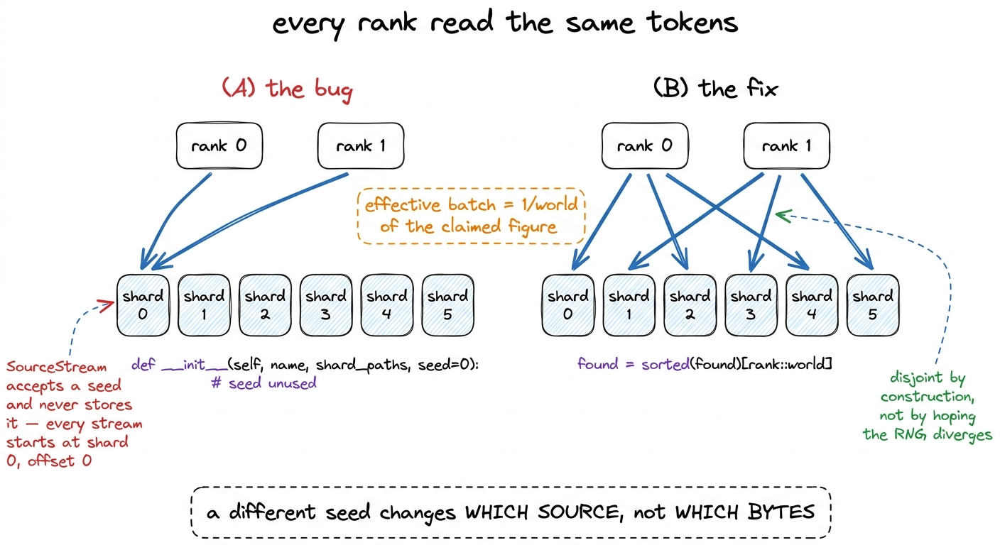
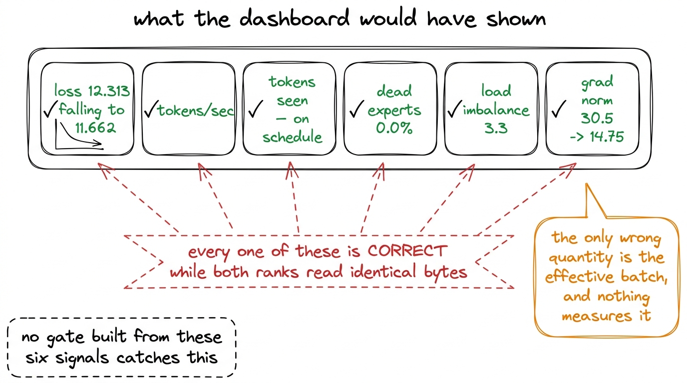
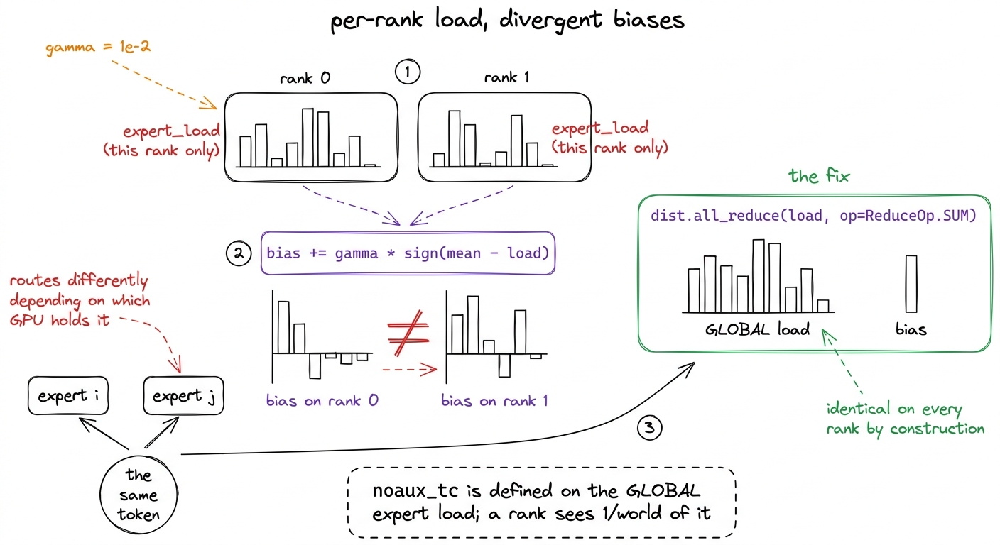
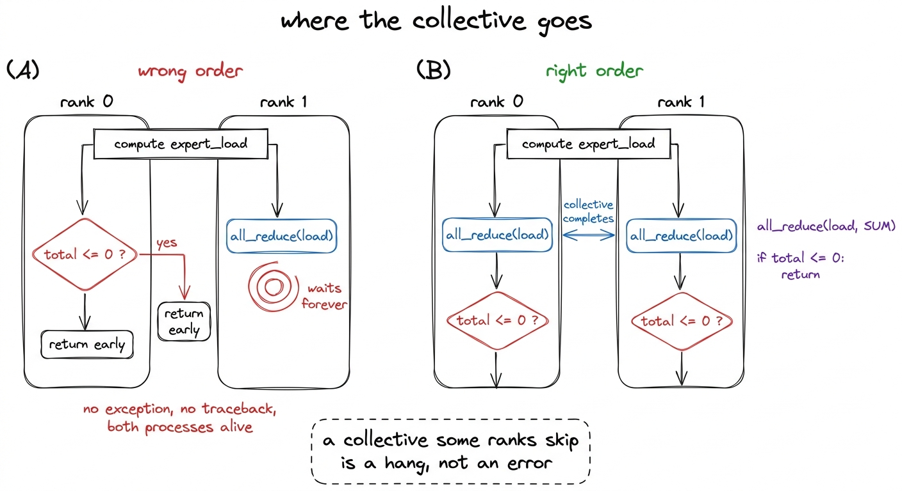
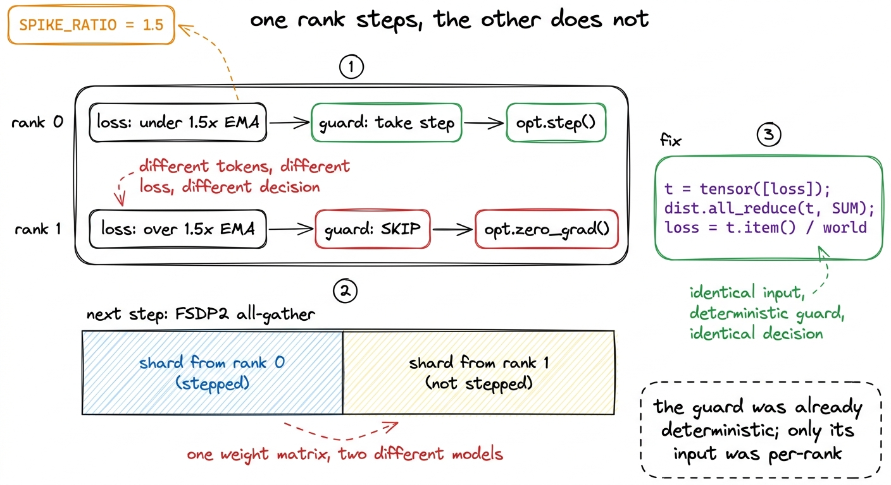
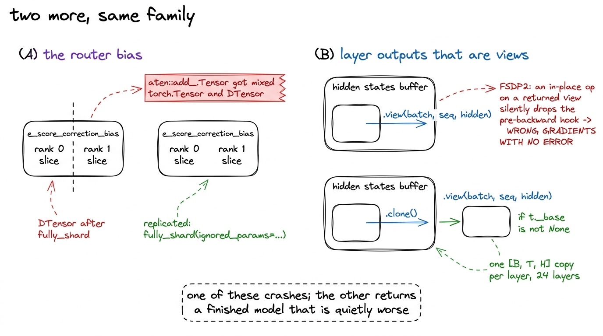
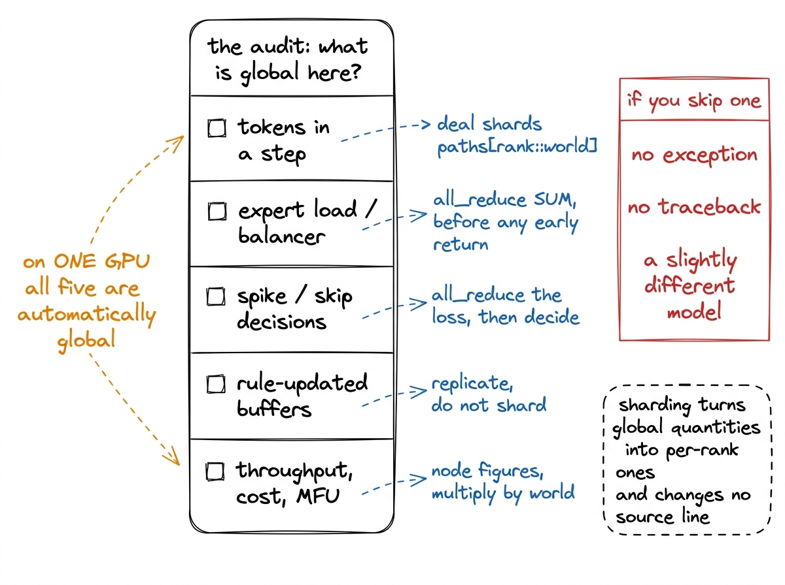

# 27\. 三个不会导致崩溃的分布式缺陷

[← 上一章](../26-sharding-the-model/README.md) · [返回目录](../../README.md) · [下一章 →](../28-the-loss-curve/README.md)

第 05 部分 · 不止一张 GPU · 10 分钟 · 7 幅图

> 所有 rank 读取相同 token、均衡器使用本地而非全局负载、各 rank 独立决定是否跳过尖峰：三种缺陷都可能让训练结束，却得到没有错误提示的错误模型。

r1 可以在一台 H200 上运行且从未分片。梯度上的所有更高层级模型均无法实现，旗舰模型 — 35.56B 个参数，498 GB 个优化器状态，86% 个两个 B300 卡的参数 — 需要在两个进程中使用 FSDP2。构建该训练器产生了三个错误，且它们均未引发异常。

那个最后的特性正是使其值得单独成章的原因。一个崩溃的训练运行会耗费一个下午。一个完成的训练运行，写入了检查点，报告了损失下降，却返回了一个默默错误的模型，其代价则是整个运行过程加上基于其结果所做出的每一个决策。下面列出的三个错误都属于第二种类型，且都是通过阅读代码并始终围绕一个问题进行思考而发现的，因为当时我们拥有的任何测量手段都无法检测到这些错误。

问题在于可迁移的部分，因此我们首先提出它：  **在这个训练步骤中，哪些量是定义在整个批次上的，哪些量现在是按秩计算的？**  单GPU代码无法区分，因为在单个GPU上它们是相同的东西。

## 缺陷 1：每个 rank 都读取了相同的 token

数据并行有效是因为每个进程消费批次中的不同切片。我们的 `MixtureLoader` 按混合权重从每个序列中采样一个源，并从该源的令牌中提取令牌 `SourceStream`，在其分片上移动光标。让两个进程不同的自然方式是使用不同的种子，而加载器确实会采用一个种子。

种子不起作用。

```python
class SourceStream:
    def __init__(self, name: str, shard_paths: list[Path], seed: int = 0):
        if not shard_paths:
            raise ValueError(f"source {name!r} has no shards")
        self.name = name
        self.paths = shard_paths
        self.shard_idx = 0
        self.offset = 0
```

该参数被接受且永不存储。每个流从分片 0、偏移 0 开始，和 `take(n)` 从那里开始确定性地向前走。一个不同的种子在的 `MixtureLoader` 只更改哪些  *来源*  每个序列都从中抽取，因此两个秩以相同顺序读取相同的 fineweb-edu 字节，与相同的代码字节和相同的数学字节交错不同。

[](../../figures/three-bugs-that-do-not-crash-1.png)

图 27-1　数据加载器的前后对比。为各 rank 设置不同随机种子，看似已经足够，实际却并非如此。

考虑该训练运行会产生什么结果。每个进程对其自身的微批次计算梯度，而 FSDP2 对这些梯度执行减少-散射操作，使得优化器看到它们的平均值。该平均值的 `world` 一个梯度的副本就是那个梯度，因此优化器在单个进程数据上执行的步长，与之完全相同 `world` 乘以成本。  **有效批次将会是 $\frac{1}{\mathrm{world}}$ 声称的数值** ，当规模为两个B300时，是其一半。

再看遥测。损失是逐序列平均，对各 rank 实际看到的批次而言没有算错；吞吐量也正确，因为它们确实处理了这些 token。`tokens_seen`却将微批量乘以进程总数，使重复 token 被当成不同 token，训练也会按时报告预算完成。不活跃专家比例、负载不均衡度、梯度范数和学习率同样可以全都正常。现有监控没有、也无法仅从这些信号构造一个能识别两个 rank 读取相同字节的检查。

[](../../figures/three-bugs-that-do-not-crash-2.png)

图 27-2　训练报告的六个指标，以及它们都没有涉及的那个数量。

修复的方法是停止让流发生分歧，改为让它们互不相交。在加载器构建时，分片是按轮询方式分配的：

```python
if world > 1:
    if len(found) < world:
        raise ValueError(
            f"source {name!r} has {len(found)} shards but world_size "
            f"is {world}; some rank would get no data from it and the "
            "realised mix would differ per rank")
    found = sorted(found)[rank::world]
```

分界线之上的守护层与分界线本身同样重要。如果数据源的分片数量少于进程数量，那么部分进程将无法获得其数据，加载器会丢弃该数据源并重新归一化剩余权重，因此进程 0 将在目标混合上训练，而进程 1 将在另一种混合上训练。这就是在混合清单首次构建时，从新方向出现的静默归一化失败，它将一个六源稳定阶段转变为 100% finemath。[^1]

## 缺陷 2：负载均衡器均衡错了对象

无辅助损失的平衡器 K3 在每次优化器步长后继承了每个专家的选择偏差：

$$
\mathrm{bias}_{i}\leftarrow\mathrm{bias}_{i}+\mathrm{gamma}\,\operatorname{sign}(\mathrm{mean\_load}-\mathrm{load}_{i})
$$

该规则是基于整个批次的负载定义的。我们的门控器进行累积 `expert_load` 作为前向传播期间的缓冲区，单个GPU上是整个批次，而在FSDP2中是单个进程的其一部分。

每个 rank 因此都会计算 $\operatorname{sign}(\mathrm{mean}-\mathrm{load})$ 从一个不同的向量出发，并对其自身的副本应用了不同的更新。偏置会在 76,294 步骤后发生漂移，而由于偏置决定了选择，  **同一个 token 会根据哪个 GPU 持有它而路由到不同的专家** 模型中的任何一致性检查都不会察觉，每个进程的本地视图都会显得正常：每个进程都会在其本地负载向量上报告较低的不活跃专家比例，而整个模型却没有任何单一的路由器。

[](../../figures/three-bugs-that-do-not-crash-3.png)

图 27-3　all-reduce 前后的负载均衡器。左图中的情况不会导致崩溃，但模型会在一个不一致的路由器下训练。

修复只需要一行代码，而这一行代码的位置才是有趣的部分。

```python
def balancer_step(self) -> dict:
    load = self.expert_load
    if torch.distributed.is_available() and torch.distributed.is_initialized():
        torch.distributed.all_reduce(load, op=torch.distributed.ReduceOp.SUM)

    total = load.sum()
    if total <= 0:
        return {"updated": False}
```

所有归约处于  **之前**  的 `total <= 0` 早返回，而不是在之后。反过来写，一个门在窗口中没有路由任何内容的秩会提前返回并跳过集体操作，而另一个秩则会阻塞在该点上，NCCL会等待。训练运行不会崩溃；它会停止，两个进程都存活，最后的日志行看起来是正常的。因此，一个静默错误bug的修复方案中，紧邻的一行包含一个静默挂起bug，而这两个问题都通过相同的纪律得以解决：集体操作是控制流的一部分，每个秩必须在每条路径上都到达它。

[](../../figures/three-bugs-that-do-not-crash-4.png)

图 27-4　相同的两条语句，两种执行顺序。其中一种会让持续多日的训练停止，却没有诊断信息。

使负载全局化还有一个原本未计划但被欢迎的第二效果。死专家比例和负载不平衡，即坍塌门的读取值，源自同一个向量，因此在执行全归约后，它们描述的是整个模型而非单个进程，该进程只看到部分标记，因此总是比模型实际状态显得更严重地坍塌。

## 缺陷 3：尖峰保护机制会让各优化器失去同步

我们的损失尖峰保护机制会跳过任何损失超过 1.5 倍运行中指数移动平均值的步骤，或者损失为 NaN 或无穷大的步骤。该保护机制在给定输入的情况下是确定性的，错误的根源在于输入本身。

每个 rank 对自己的梯度累积微批次计算平均损失，再交给自己的`SpikeGuard`。不同 token 会产生不同损失；相同阈值应用于两个不同数值，可能得到不同判断。于是一个 rank 调用`opt.step()`更新权重，另一个却调用`opt.zero_grad()`清空梯度并继续。

在那一刻，各个规模档位持有不同的权重。FSDP2 每个进程仅保留每个参数的一个分片，并在每一层前向传播之前进行全量张量的收集，因此下一次前向传播会将每个权重矩阵从属于两个不同模型的分片中组装而成。没有任何机制检查它们是否一致。训练继续进行，损失下降，而模型成为了一个从未由任何优化器步骤产生的混合体。

[](../../figures/three-bugs-that-do-not-crash-5.png)

图 27-5　尖峰保护机制如何让优化器失去同步，以及消除这种可能性的归约操作。

该修复在守护机制观测到之前降低了损失：

```python
if distributed:
    t = torch.tensor([loss], device="cuda", dtype=torch.float64)
    dist.all_reduce(t, op=dist.ReduceOp.SUM)
    loss = float(t.item()) / world

skip, reason = guard.check(step, loss)
```

守护层的输入现在在每个进程上都完全相同，且守护层是其输入的纯函数，因此决策在构造上是完全一致的。要使各进程达成一致，有两种方式：在每个进程中计算相同的内容，或计算一次后共享结果。前者是关于算术的一个断言，必须在每一次未来的修改中都保持成立；后者是代码的一个属性。

r1 跳过  **零**  在 38,147 步中出现尖峰，这提醒我们关于这类错误的一个重要事实：在完成的训练运行中，这条代码路径从未被执行。[^2]

## 同一类问题中的另外两个例子

同一审计发现了两个地方，分片改变了看似正确的代码的含义。

 **路由器偏置不得分片。**  `e_score_correction_bias` 由规则而非梯度从普通缓冲区更新，一旦 `fully_shard` 已运行的偏置是一个 DTensor，而更新不是，且原地加法失败与 `aten::add_.Tensor got mixed torch.Tensor and DTensor`那是第一个FSDP2旗舰模型探测器返回的错误，是这个群体中唯一一个会导致崩溃的成员。它可以通过将更新分布以匹配偏置来修复，而我们保留偏置作为回退方案，但更好的修复方法是将张量从分片中移出，以 `fully_shard(ignored_params=...)`一个通过全归约负载馈送的复制偏差，在每个 rank 上是相同的，因为规则和其输入各只有一个副本，而不是在分片算术正确的情况下才相同。[^3]

解码层返回的视图必须克隆。FSDP2 警告，`KimiDecoderLayer`返回视图张量，对它进行原地操作会静默移除反向传播前的钩子，跳过 all-gather，从而产生错误梯度却不报错。注意力残差路径通过`.view(batch_size, seq_len, hidden_size)`重塑张量，并将两个返回值传递过 24 层；理论上可以靠检查证明不存在残余别名，但这不足以作为投入多日训练的保证。我们包装每层前向传播，并克隆所有满足`_base is not None`的返回张量：

```python
def _deview(t):
    if isinstance(t, torch.Tensor) and t._base is not None:
        return t.clone()
    if isinstance(t, tuple):
        return tuple(_deview(x) for x in t)
    return t
```

常规情况成本为零，因为一个不是视图的张量会被原样返回。别名情况成本为一 `[batch, sequence, hidden]` 在旗舰模型的 24 层之间逐层复制，相对于 288 GB 张卡来说规模很小。

[](../../figures/three-bugs-that-do-not-crash-6.png)

图 27-6　剩下两项分片修复。只有第一项问题会主动报错。

## 普遍性的教训

单GPU代码中，每个量都有一个唯一的真实来源。存在一个批次、一个损失、一个专家负载向量、一个梯度范数，且在步骤中任何位置计算的统计量，自动成为整个训练运行的统计量。分片消除了这一保证，却并未移除依赖于此的代码：每一个读取张量的表达式现在读取的是一个切片，且其中没有任何一行源代码发生改变。

因此，审计是机械的。遍历训练步，对于每个量，询问它是在什么范围内定义的。如果答案是整个批次或整个模型，就需要显式的集体操作或复制保证。

| 数量 | 在……上定义 | 分片后变成什么 | 我们的做法 |
| --- | --- | --- | --- |
| 一个步骤中的token | 整个批次 | 一个进程的切片，可能是重复的 | 分片已处理 `paths[rank::world]` |
| 专家负载 | 整个批次 | 一个进程的路由 | 更新之前已完成全部归约 |
| 损失尖峰保护机制的输入 | 整个批次 | 一个进程的损失 | 在保护机制之前完成全部归约 |
| 负载均衡器偏置 | 模型 | 一个 DTensor 分片 | 留出的分片 |
| 已见的 token、成本、MFU | 节点 | 一个进程的份额 | 乘以源世界 |

最后一行是报告中的错误，而非训练中的错误。循环中的吞吐量是一个节点级别的指标，因为每步的标记数量已经乘以了世界规模，所以除以单张卡的峰值FLOPs会恰好将MFU高估世界规模倍数，而在两卡情况下就是翻倍。每小时的速率也因同样的原因乘以了世界规模：每个进程都会被计费，而单个进程的份额会低估运行成本，其程度等于规模档位设计的定价因子。

这张表中的失败需要准确命名：它不是异常，也不一定表现为损失发散，而是一个悄悄不同的模型——可能只按预期一半的有效批量训练，可能使用自相矛盾的路由器，也可能混合了两条优化器轨迹的权重。它们都能结束、生成可加载的检查点，并给出内部自洽却略差的评测数字。而正确的训练正是原本要产出的东西，因此并不存在可供比较的基线。

[](../../figures/three-bugs-that-do-not-crash-7.png)

图 27-7　以清单形式列出的审查项目。右侧一列说明了为何值得在训练之前而非之后进行审查。

## 验证了什么，以及哪些工作仍然失败

在所有五个修复措施到位后，FSDP2已在旗舰模型上完成了端到端验证：24层分片，24层激活检查点，损失下降  **12.313 到 11.662**  在四个步骤中，不活跃专家 0.0%、不平衡 3.3、梯度范数 30.5 到 14.75、峰值内存  **177.9 GB 个 287.4** ，或一张卡的62%。[^4]

那是分片工作在运行。它不是旗舰模型的工作。35.56B参数的训练运行于6年2026月启动，并因与本章无关的原因失败：其69.5%个专家变得不活跃，负载不平衡介于74和85之间，且在76,294步的890步处停滞，耗资\$48.33。恢复r1从早期专家坍塌的平衡常数未能恢复旗舰模型，因为旗舰模型是关于规模发现而非分布式正确性的。

那个账本的形状就是关键。在训练运行开始前，已移除了三个会导致最终模型看似合理却错误的缺陷，代价是四行代码和一个包装器。那个导致旗舰模型崩溃的缺陷，在训练的前一百步就显现出来，出现在我们早已学会监控的指标上。昂贵的失败往往是那些沉默的失败，而混合专家模型的分片正是这些失败最集中的地方。

---

[← 上一章](../26-sharding-the-model/README.md) · [返回目录](../../README.md) · [下一章 →](../28-the-loss-curve/README.md)

[^1]: 加载器状态因此是按 rank 分配的，分片检查点写入一个 `loader_rank{n}.json` 每进程。恢复到不同的世界规模会改变分片划分，使旧的游标变得无意义，所以 `dcp_load` 打印出数据位置未恢复，而不是静默重启语料。

[^2]: 这就是为什么监控套件中二十四个故障注入测试中有半数是人为构造条件。尖峰协议、五次连续跳过后中止规则和NaN分支都针对合成损失轨迹进行了测试，因为r1的实际轨迹从未离开健康区间。

[^3]: 张量在每个混合专家层中为每个专家存储一个浮点数，因此复制它需要数十千字节，而权重和优化器状态则高达数百吉字节。

[^4]: 探针必须以这种方式启动 `--detach`没有它，Modal 会打印构建日志，然后输出“Stopping app — local entrypoint completed”，并且 FunctionCall 会抛出异常 `RemoteError` 带有空消息。那完全就像一次崩溃，实际上并非如此，这导致我们在一个本应正常运行的训练运行上花费了调试时间。
