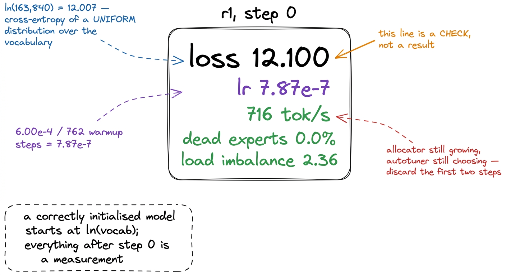
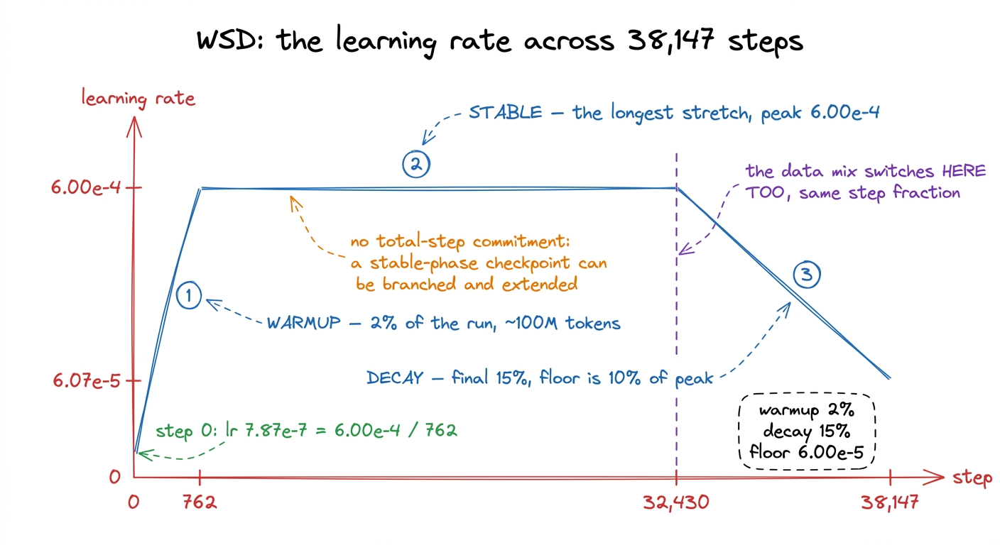
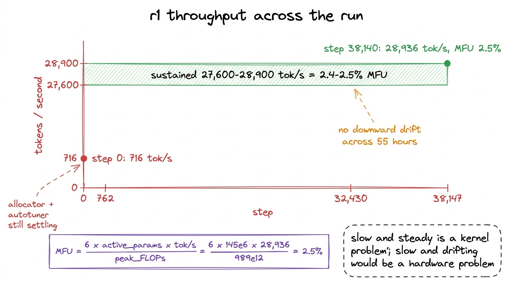
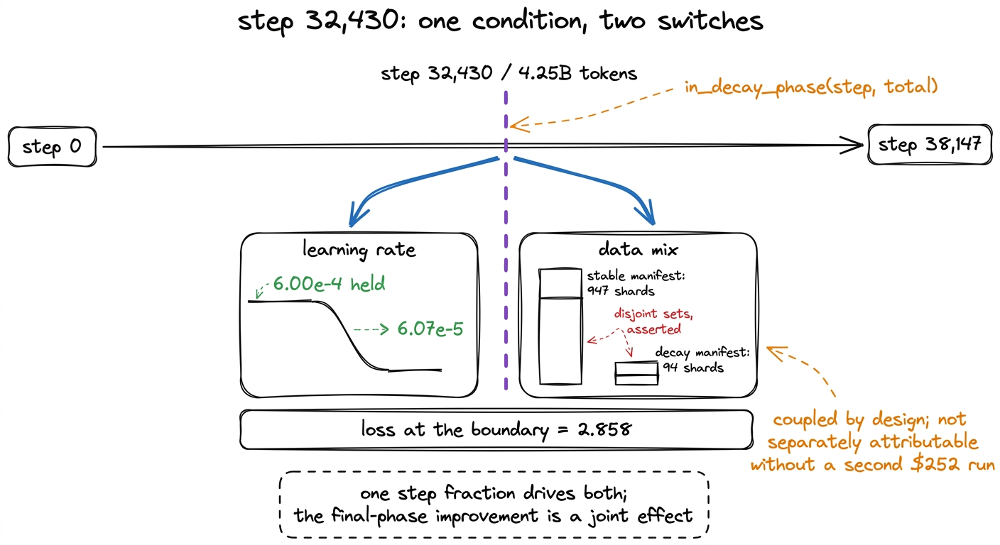
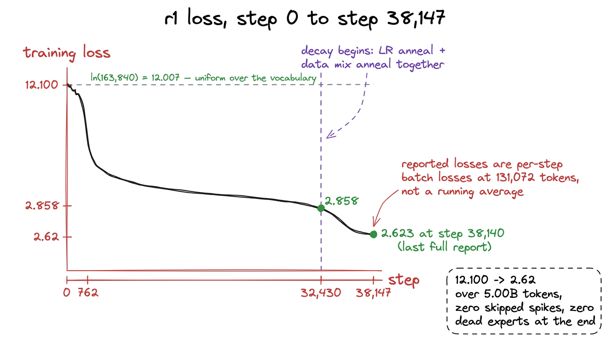
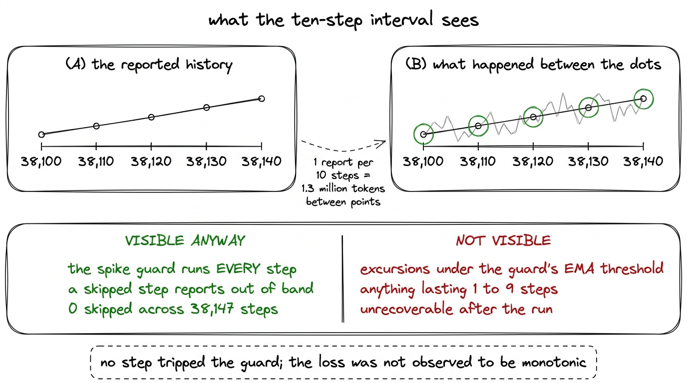
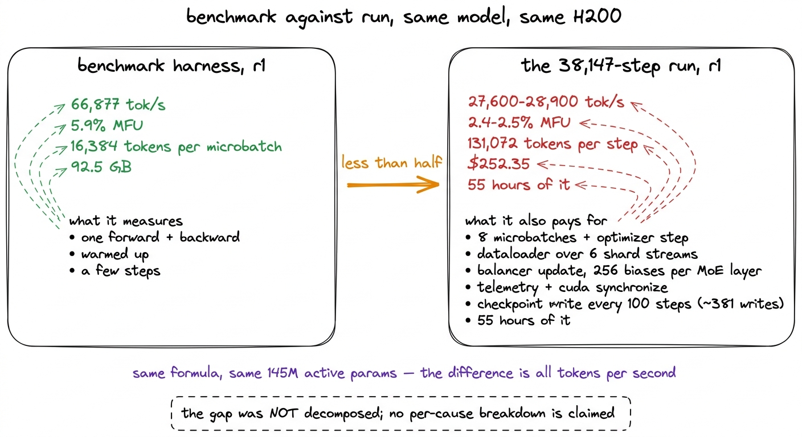

# 28\. 从头到尾审视损失曲线

[← 上一章](../27-three-bugs-that-do-not-crash/README.md) · [返回目录](../../README.md) · [下一章 →](../29-benchmarks-across-tokens/README.md)

第 06 部分 · 训练有效吗 · 11 分钟 · 7 幅图 · 12.10 → 2.62

> 从 ln(163,840) 出发，经历稳定阶段，在第 32,430 步切换到衰减混合，最终完成 38,147 步，没有跳过尖峰，也没有不活跃专家。

一个训练运行会向自身报告。我们的运行在大部分生命周期中，每十个步长就写一条遥测数据，内容包括损失、学习率、吞吐量、MFU、梯度范数、路由器的健康状况以及到目前为止的花费。本章将从这些数据行的到达顺序，完整地读取r1的运行全过程。调度背后的原理属于训练循环一章；在这里，我们读取的是实际返回的数据。

第一行是训练运行中最有用的一行，但它不是结果。

第 0 步：损失  **12.100** , 学习率 $7.87\times10^{-7}$, 716 个token每秒, 不活跃专家 0.0%, 负载不均衡 2.36.

## 第 0 步是一项检查

一个尚未学习的模型，会近似均匀地将概率质量分布到词表上。163,840 个 token 的均匀分布，其交叉熵是$\ln(163{,}840) \approx 12.007$；首次报告损失为 12.100。这种吻合说明嵌入初始化尺度合理，输出投影没有产生异常大的 logits，标签相对输入正确移位，损失平均的对象也符合预期。若第 0 步损失为 4，可能是标签泄漏进输入；若为 40，可能是初始化方差错误。这两种故障到了后期都不容易追溯。

[](../../figures/the-loss-curve-1.png)

图 28-1　本次训练的第一行遥测。其中每个数值都在检验配置，而非描述模型能力。

同一行中的每秒 716 个 token 是一个需要读取并丢弃的数值。在第 0 步时，CUDA 缓存分配器仍在增长其池，Triton 自适应调优器仍在为融合内核选择配置，且数据加载器尚未填充任何内容。在 MFU 调查期间建立的测量纪律是，为了 exactly 这个原因，要丢弃前两步，而 716 tok/s 大约是同一循环一小时后所维持值的 2.5%。[^1]

同一行中的路由器编号在专家坍塌一章中有详细说明：在步骤 0 中，死专家 0.0% 和不平衡 2.36 描述了一个尚未形成意见的路由器，而不是一个运行良好的路由器。[^2]

## 三个阶段，以及各自的起点

训练计划为预热—稳定—衰减。预热阶段将学习率从接近零提升到峰值，覆盖前 2% 步；稳定阶段在中间长阶段保持峰值；衰减阶段在最后 15% 步将学习率降至峰值的十分之一。整个计划共八行：

```python
def wsd_lr(step: int, total: int, peak: float, warmup_frac: float = 0.02,
           decay_frac: float = 0.15, min_frac: float = 0.1) -> float:
    """Warmup -> stable -> linear decay to `min_frac` x peak."""
    warm = max(1, int(total * warmup_frac))
    decay_start = int(total * (1.0 - decay_frac))
    if step < warm:
        return peak * (step + 1) / warm
    if step < decay_start:
        return peak
    frac = (step - decay_start) / max(1, total - decay_start)
    return peak * (1.0 - (1.0 - min_frac) * min(1.0, frac))
```

在 r1's 38,147 步中，给出 762 步的预热和初始学习率 $\frac{6.00\times10^{-4}}{762}\approx7.87\times10^{-7}$, 在第 0 步时运行报告的值。那些 762 步，每步 131,072 个 token，总计约 100M 个 token，占预算的 2%，用于将优化器加速到稳定状态。衰减阶段从  **第 32,430 步** ，与  **4.25B 个 token**  已经见过。

[](../../figures/the-loss-curve-2.png)

图 28-2　训练实际执行的学习率调度。三段曲线分别对应本章独立解读的三个阶段。

## 从吞吐量解读稳定阶段

稳定阶段覆盖了 83% 步，期间没有任何有趣的现象发生，这是期望的结果。学习率保持在 $6.00\times10^{-4}$。吞吐量稳定在一个区间内。  **27,600 到 28,900 个 token 每秒**  固定为  **2.4 到 2.5% MFU**  并一直留在那里，直到本次训练结束。

那两个数字是同一个数字。MFU 定义为

$$
\mathrm{MFU}=\frac{6\,\mathrm{active\_parameters}\,\mathrm{tokens\_per\_second}}{\mathrm{peak\_FLOPs}}
$$

以及 r1's 145M 个激活参数对比 H200's 大约 989 TFLOP/s 在 bf16 中， $\frac{6\times145\times10^{6}\times28{,}936}{989\times10^{12}}\approx2.5\%$公式一旦激活参数数量固定，就不再有自由选择，因此吞吐量和MFU会同步变化；同时报告两者仅是一种便利，而非两组独立的证据。[^3]

2.5% 是一个较低的数值，且此处未进行辩护。关于 MFU 的章节通过了十六次提升它的尝试，其中三次成功，它们最终停留在一个内核性能剖析中，其中仅约 12% 的 GPU 时间用于矩阵乘法。请注意，该性能剖析以及大部分尝试日志是在  **r2** ，位于我们之上的第307M个活跃规模档位，仅有一个H200；该处得出的结论是，该模型是内存带宽受限的，而r1共享使其如此的架构。

本章可以补充的是，该数值是稳定的。本次训练花费 \$252.35，每小时 \$4.54，相当于 55 小时的显卡时间，在这 55 小时内没有出现下降趋势，没有随着检查点的累积而退化，也没有出现吞吐量减半并持续保持减半的情况。一个缓慢而稳定运行的训练，与一个缓慢且持续退化的运行是两种不同的问题，只有前者可以通过优化内核来解决。

[](../../figures/the-loss-curve-3.png)

图 28-3　训练期间的吞吐量。区间保持平坦，表明 MFU 数值反映的是模型特征，而非机器状态的变化。

## 第 32,430 步的切换

在第 32,430 步，两件事同时发生，且它们是通过构造方式共同变化的。学习率开始其线性下降，而数据加载器从稳定混合切换到衰减混合。两者均由同一循环中的相同步长比例驱动：

```python
for step in range(start_step, total_steps):
    # the LR schedule and the data mix switch together
    want_decay = in_decay_phase(step, total_steps)
    if want_decay and phase != "decay" and "decay" in loaders:
        phase = "decay"
        loader = loaders["decay"]
        print(f"[step {step}] entering DECAY phase — switching to the anneal mix")

    lr = wsd_lr(step, total_steps, peak_lr)
```

将它们耦合在一起是有代价的，这个代价值得被命名。当学习率衰减和数据分布变化在同一个步骤发生时，训练运行之后无法将最终阶段的性能提升归因于其中一个因素。若要将它们分开，就需要两次每个花费 \$252 的训练运行，而预算并未以这种方式使用，因此该效果被报告为联合效应。

边界处的损失是  **2.858** .

[](../../figures/the-loss-curve-4.png)

图 28-4　退火的两个部分由同一个条件驱动，因此在同一步开始。这意味着事后无法将二者的影响分离。

## 衰减阶段与最终数字

从第 32,430 步开始，学习率线性下降至峰值的十分之一的地板值 $6.00\times10^{-5}$。在第 38,140 步的最后一次完整遥测报告中读到：

| 字段 | 取值 |
| --- | --- |
| 损失 | **2.623** |
| 学习率 | $6.07\times10^{-5}$ |
| MFU | 2.5% |
| 吞吐量 | 28,936 tok/s |
| 花费 | \$252.35 |
| 不活跃专家 | **0.0%** |
| 负载不均衡度 | 4.0 |
| 路由器熵，最小 | 0.973 |
| 梯度范数 | 0.299 |

学习率读作 $6.07\times10^{-5}$ 而非 $6.00\times10^{-5}$ 的下限，因为步长 38,140 距离结束还有七步，因此该调度曲线大约走到了其下降过程的 99.9% 处。[^4]

损失从相边界处的2.858降至末尾处的2.62。留出的困惑度在整个训练运行中下降了40%，其中下降最陡的部分就位于这一阶段；下一章将报告该系列在二十四个评估点上的结果。

[](../../figures/the-loss-curve-5.png)

图 28-5　已完成训练的损失曲线。第 32,430 步之后的弯折，是学习率衰减与数据退火共同作用的结果。

## 为何相邻报告中的数字不同

训练运行末尾报告的损失值并未从一个报告平稳地过渡到下一个；它们在一条平坦趋势周围震荡。这并非不稳定，也并非测量误差。每个报告的损失值是该单步中批次的损失，取该步内八个微批次的平均值，除此之外没有任何内容。它不是运行平均值，也没有经过任何平滑处理。

一个步长的批量是从六个语料库中抽取的131,072个token，这些语料库中每个token的难度差异很大：不同来源运行的最终留出困惑度从5.42的Python代码到37.74的一般网页文本不等，其中fineweb-edu位于22.35，finemath位于10.24之间。一个恰好抽取较多简单、高度可预测文本的批量，其得分低于未抽取此类文本的批量，而在131,072个token时，这种效应足够大，以至于在曲线趋于平缓后，它主导了步与步之间的变化。

有两个后果。不应将任一报告的损失值保留到三位小数，仿佛那是模型的实际损失。而且，训练运行结束时报告损失值的折线图看起来非常嘈杂，正是因为在训练过程中改进速度已经放缓：一旦每步的提升量小于批次间的方差，那么方差就是唯一可见的部分。

本书引用  **2.623 在第 38,140 步**  作为最终损失，因为那是本次训练产生的最后一个完整报告，并将其四舍五入  **2.62**  以散文形式表达。这指的是训练运行的终点，而非在噪声样本中最佳的点，引用最低报告与该训练运行所支持的主张是不同的。[^5]

## 遥测能够和不能够说明的健康状况

该训练运行的健康记录简短且良好。在 38,147 步中：  **跳过零损失尖峰** , 不活跃专家占比  **0.0%**  最后，负载不平衡从 2.36 缓慢上升到 4.0，路由器熵最小值为 0.973，在最后一次报告中梯度范数为 0.299，从未发散。

零尖峰图值得精确解读，因为它比十步报告间隔所暗示的要强。尖峰保护机制在运行  **每一个**  步，而非报告的步数：它将每一步的损失与其自身的指数移动平均值进行比较，如果损失超出该平均值的配置倍数，则跳过优化器更新，并立即报告该跳过行为，位于正常的日志记录间隔之外。[^6] 一个足够大的尖峰以至于可以被跳过的值，因此不可能隐藏在两个报告之间，且零跳过是每步的事实。

区间隐藏的是所有小于守卫阈值的内容。一次持续一步到九步的偏离，若始终低于守卫设定的指数移动平均值的倍数，则在历史记录中是不可见的，事后也无法恢复。我们并不声称损失在报告之间是单调的；我们声称，没有任何一步触发了针对损失运行平均值设定的阈值，且所报告的点并未显示出趋势断裂。

守卫的状态也是恢复会话时需要恢复的内容之一。每 100 步写入的一个检查点包含模型权重、优化器动量、数据加载器游标、四个随机数生成器的状态、已看到的标记、截至目前的花费以及损失尖峰保护机制的指数移动平均值，因此在恢复运行时不会从冷平均值重新开始守卫，也不会在升温过程中跳过健康步骤。r1 从未中断，因此本次运行中没有使用任何相关机制；这里描述它是因为它所保护的遥测数据正是本章所读取的内容。

[](../../figures/the-loss-curve-6.png)

图 28-6　报告间隔与尖峰保护机制具有不同的时间分辨率。更有力的结论来自每一步都运行的保护机制。

## 基准测试与实际训练相差两倍

本次训练运行数据中的一个缺口大到，若不加以解释，报告中将存在缺陷。我们自己的基准测试工具测得 r1 为  **66,877 个 token 每秒和 5.9% MFU** ，当时每个微批次包含 16,384 个 token，占用 92.5 GB 显存。实际发生的训练使用相同模型、单张 H200，完全没有分片，持续吞吐量却只有 27,600 至 28,900 tok/s，MFU 为 2.4% 至 2.5%，还不到基准结果的一半。两组数值使用相同公式，以及相同的 145M 个激活参数，所以全部差异都来自吞吐量。

一个基准测试和一个训练运行测量的是不同的对象。基准测试测量一个微批次的前向和反向传递，经过预热后重复执行，循环中不包含其他内容。一个真实训练运行的步长需要支付：

-  **八个微批次** ，不是一次，每次都有梯度范数裁剪和一个优化器步骤；
- 的  **数据加载器** ，从真实的文件系统中读取和聚合来自六个分片流的token，而不是回放一个驻留的张量；
- 的  **负载均衡器更新** ，读取每个专家的门控负载，并为每个 MoE 层写入 256 个偏置值；
-  **遥测** ，包括一个同步 `torch.cuda.synchronize()` 在每一步；
-  **检查点每 100 步写入一次** ，大致在每次训练运行中占 381，每个分片在写入权重、优化器动量、数据加载器游标和四个随机数生成器状态时阻塞循环，然后提交该分片体积；
- 和  **55 小时**  关于训练运行，对比一个基准报告在显卡刚启动时取的几个步骤的平均值。

我们没有将这一差距分解为各个部分的贡献。这需要进行消融实验，而预算并未提供这样的资源，任何在这里提出的分解都只是在测量记录中的估算。我们可以明确的是，哪个数值对应什么：66,877 tok/s 是该模型在理想条件下在这一卡上的成本，28,936 tok/s 是训练该模型的成本。后者是 \$252.35 被计入的数额。

[](../../figures/the-loss-curve-7.png)

图 28-7　本书报告的 r1 的两种吞吐量，以及实际训练需要承担、基准测试却不承担的成本。

## 损失曲线能证明什么

模型从正确初始化、一无所知时的 12.100 损失出发，在处理五十亿个 token、花费 252.35 美元后降至 2.62。期间没有跳过任何一步，没有任何专家失活，梯度范数下降到 0.299，而非不断上升。所有这些都在单张 H200、单个进程中完成，没有需要保持一致的分片状态。书中介绍的 FSDP2 工作与三个分布式缺陷属于旗舰模型；它自己的训练在计划的 76,294 步中的第 890 步失败，当时有 69.5% 的专家不活跃。这是一次状态健康的训练，而这一点是评测章节有意义的前提：如果训练曾出现尖峰、停滞或静默坍塌，评测分数反映的就是事故，而非训练方案。

曲线不能证明模型质量。不同分词器、数据混合或模型之间的训练损失不可直接比较；使用我们的语料和 K3 词表得到的 2.62，不能随意与其他公布数值并列比较。它只说明模型随时间更好地拟合了这些数据。最终模型是否具备能力，是另一个问题，由留出集困惑度与基准评测回答；下一章报告的是训练过程中的二十四个测量点，而非只有终点。

---

[← 上一章](../27-three-bugs-that-do-not-crash/README.md) · [返回目录](../../README.md) · [下一章 →](../29-benchmarks-across-tokens/README.md)

[^1]: 同样的学科原因在于，循环在执行步骤 0 之前检查自身的初始化，而不是从前几行遥测数据中推断其初始化状态。在发布的建模代码中的四个阻塞因素之一中，KDA 的时间步偏置被留作未初始化内存，这会导致非确定性失败：在某一点上 r2 正常训练，而 r1 在步骤 0 返回 NaN。在首次前向传递之前对每个参数进行有限性检查，将这种问题转化为立即的错误，而不是一个令人困惑的损失曲线。

[^2]: 同一章节记录了为何熵是错误的监控指标。在一次早期训练运行的第二十步时，94.5% 个专家接收零个token，而路由器熵读取为 0.99 除以 1.0，因为熵是基于平均路由分数计算的，而top-k选择则始终集中于少数专家。死专家比例是能够发现这一问题的指标。

[^3]: MFU 使用  *激活*  参数，而非总量。一个混合专家模型在r1上的得分，否则会仅仅因为持有其对给定token不使用的权重，就高出七倍，而这个数值将不再与稠密运行的数值具有可比性。

[^4]: 地板存在是因为一个从非零值线性衰减到零的过程，在其最后数千步中所进行的更新已经小到不再重要，而且因为可以在非零学习率下取一个检查点并继续扩展训练。这对 r1 并不重要，因为 r1 从未被扩展。

[^5]: 最干净的修复方式是在每步损失的同时报告一个窗口平均值，这样仪表盘既能显示原始信号，也能显示其趋势。我们的循环没有这样做；损失尖峰保护机制在其自身阈值中维护了一个损失的指数移动平均值（EMA），但该EMA从未包含在遥测数据包中。

[^6]: 报告跳过是修复而非原始行为。第一个版本会继续到下一步而不发出遥测数据，因此损失尖峰或NaN损失从未到达监控系统，每个基于损失的门控机制都完全忽略了尖峰协议旨在处理的事件。
