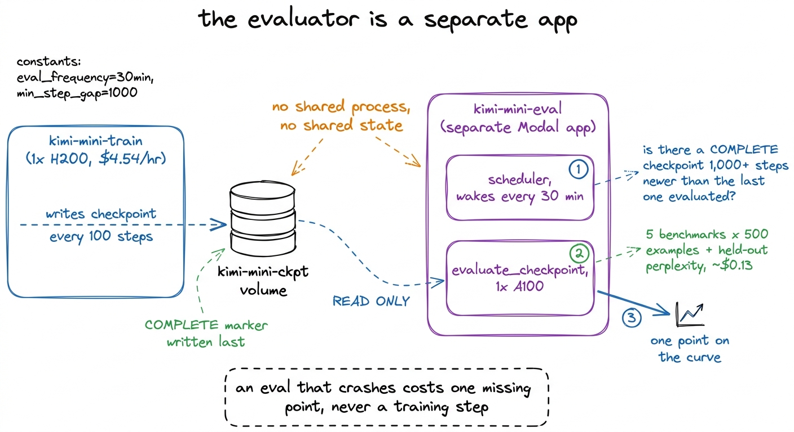
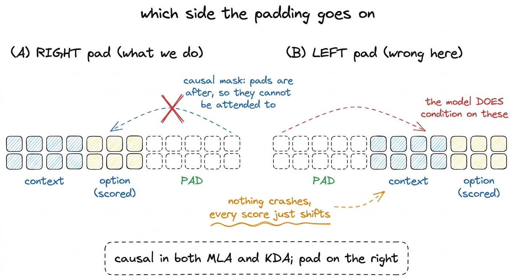
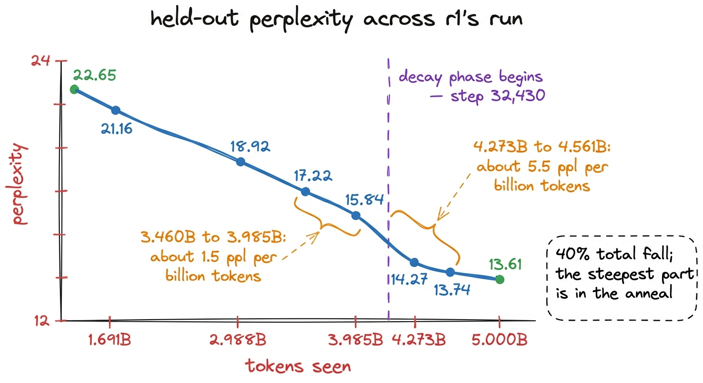
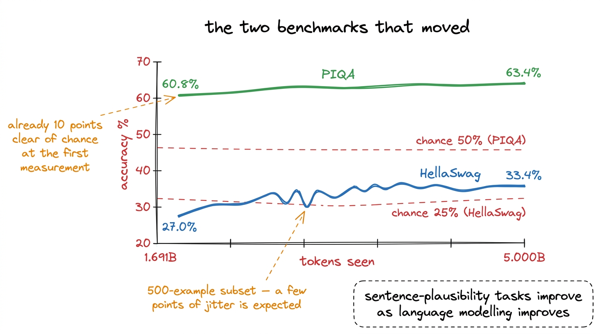
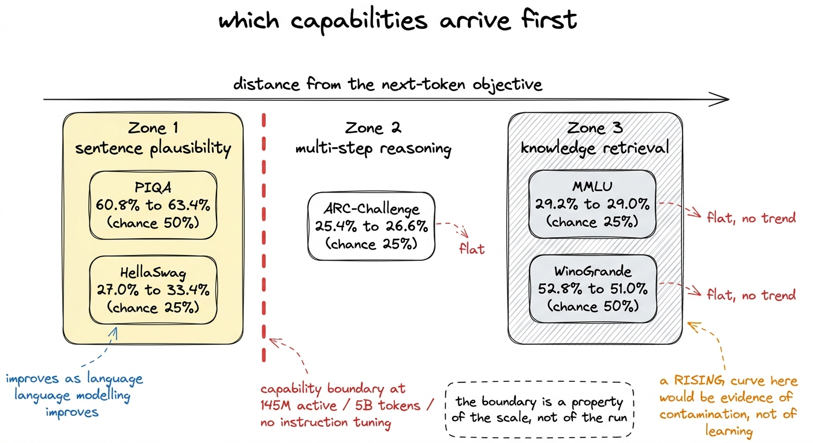
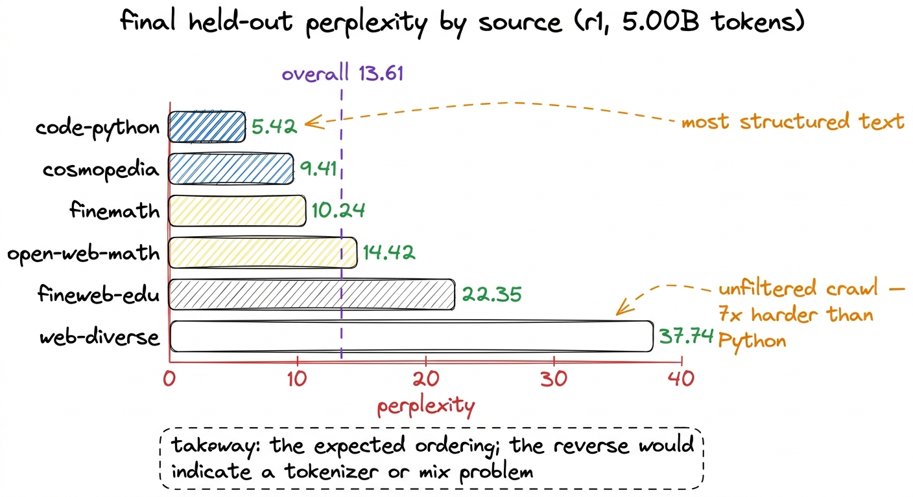

# 29\. 沿训练 token 进度评测，而非只看终点

[← 上一章](../28-the-loss-curve/README.md) · [返回目录](../../README.md) · [下一章 →](../30-what-252-dollars-buys/README.md)

第 06 部分 · 训练有效吗 · 11 分钟 · 6 幅图 · 24 个评测点

> HellaSwag 从 27.0% 升至 33.4%，留出集困惑度从 22.65 降至 13.61；MMLU、ARC-Challenge 和 WinoGrande 却始终没有超出随机猜测水平。这个规模最先出现哪些能力，为什么？

一条损失曲线表明，模型在预测其训练数据分布中下一个标记方面变得越来越好。它并不能说明模型是否能够完成其他任务。这两个陈述在整个训练运行中是兼容的：一个仅教授网络文本的混合数据集，以及一个记忆而非泛化的路由器，都会产生一条平滑地趋向终点的曲线。

能力是作为一条曲线而非结果来衡量的。每隔大约 1,000 步，r1 最新的检查点会在五个多项选择基准和留出文本上进行评分，将得分与已看到的token数量进行绘图。最终的数值是表格的最后一行，而该行上方列的形状才使其具有意义。因此，本章首先是方法，其次是数值。

## 评测器是独立应用

评测运行在独立的 Modal 应用`kimi-mini-eval`中，除只读持久卷外，不与训练进程共享其他内容。部署一方不会重启另一方，评测崩溃最坏也只是图上缺一个点。如果训练每一千步必须暂停并自评，就将两个故障原因不同的组件耦合起来，而训练这一方每小时要花 4.54 美元。

一个调度器每 30 分钟唤醒一次，并询问每个正在运行的训练运行，是否存在一个 `COMPLETE` 检查点必须比本次规模档位评估时的最后一个检查点新至少 1,000 步。[^1] 如果是这样，它会在一个  **A100** ，其租金低于 r1 从头到尾使用的单张 H200，而且显存足以轻松容纳 r1 的 bf16 推理。每次评测包含五项基准测试以及留出集困惑度切片，成本约为  **\$0.13** .

[](../../figures/benchmarks-across-tokens-1.png)

图 29-1　评测作为独立应用，从检查点持久卷读取模型。训练循环不会为评测自身而暂停。

对检查点进行评分而非对实时模型进行评分，还有一个后果：曲线上的任意一点都可以从同一个文件中重新计算。由一个无法重构的过程产生的基准数值只是一个声明，而不是一次测量。

## 评测什么，以及刻意不评测什么

循环内的五个基准测试是  **HellaSwag** ,  **PIQA** ,  **ARC-Challenge** ,  **WinoGrande**  和  **MMLU** 所有五个模型均来自去污染套件：它们在分词之前，已将13元组从语料库中移除，该过程扫描了107,291,411份文档并移除了138,064份文档。这一过程使得这些数值成为证据而非泄露，去污染一章报告了其覆盖范围的限制。

第六个指标是留出困惑度，基于从数据集中固定长度的token切片进行测量的  **尾部**  每个数据源的分片。加载器按分片顺序优先读取，因此一个包含 104.80B 个 token 的语料库中，5B 个 token 从未到达尾部，这些分片中的文本恰好来自模型训练所用的分布。偏移量固定在最后一个分片的中间位置，因此未完全写入的最终分片不会在评估之间改变所测量的内容。[^2]

 **GSM8K 和 HumanEval 本次训练未运行。**  两者都是生成式基准测试，包含思维链算术和执行代码，当激活参数低于几亿时，两者都变得无意义，且两者每例的成本远高于多选前向传递。它们是训练后的评估，而 r1 从未进行过训练后的处理。

每个基准测试都在一个  **固定，种子-0 子集的 500 个示例** ：每次都是相同的 500 行。因此，曲线上的两个连续点之间的差异，仅在于模型在它们之间所学到的内容，而不是所抽取的示例。每次重新采样都会引入与信号量级相当的抖动，而在这些准确率下，这种抖动在整个训练运行中可达几个百分点。

## 采用右侧填充和长度归一化的多项选择评测

评分采用标准的长度归一化方法：对于每个选项，对上下文加上选项进行一次前向传递，求取选项自身标记的对数概率之和，除以选项标记的数量，然后取最大值。不进行采样，不进行生成循环，完全确定性。容易出错的细节是填充标记位于哪一侧。

```python
# RIGHT-pad. This model is causal (MLA and KDA both), so tokens after a
# sequence's end cannot influence the positions we score. Left-padding
# would put pad garbage BEFORE the context, where a causal model does
# condition on it — quietly shifting every score.
ids = torch.zeros(len(batch), L, dtype=torch.long)
for k, s in enumerate(batch):
    ids[k, :len(s)] = torch.tensor(s)
```

批处理推理通常使用左填充，因为对于生成任务，你希望每个序列的真实最后一个标记都位于相同的位置。此处模型在两种注意力机制中都是因果的，因此右侧的填充对每个评分位置都是不可见的。左侧的填充会将未建模的标记置于上下文之前，而因果模型会对其产生关注，且每个评分都会因该行接收到的填充量而发生偏移。不会出现崩溃。准确率只是以与批处理组成相关的方式变得错误。

[](../../figures/benchmarks-across-tokens-2.png)

图 29-2　右侧填充对因果模型的待评分位置不可见；左侧填充却会让这些位置以没有意义的 token 为条件。

还有一个引脚需要记录：的 `datasets` 库被固定在  **2.21.0** PIQA、WinoGrande 和 HellaSwag 是基于脚本的仓库，和 `datasets` 3.x 直接移除了脚本支持，因此未固定版本的镜像能够顺利构建，但在加载五个基准测试中的三个时失败。[^3]

## 时间序列

评估在 r1 已经训练了一段时间之后才开始运行，因此该系列从 1.691B 个 token 开始，而不是从步骤 0 开始。共进行了二十四次评估，其中十次结果如下。在五个基准测试上的准确率，以及留出的困惑度：

| token 数 | HellaSwag | PIQA | ARC-C | WinoGrande | MMLU | 留出集困惑度 |
| --- | --- | --- | --- | --- | --- | --- |
| 1.691B | 0.270 | 0.608 | 0.254 | 0.528 | 0.292 | 22.65 |
| 2.123B | 0.266 | 0.614 | 0.254 | 0.522 | 0.296 | 21.16 |
| 2.556B | 0.302 | 0.618 | 0.268 | 0.522 | 0.284 | 20.23 |
| 2.988B | 0.294 | 0.624 | 0.278 | 0.528 | 0.286 | 18.92 |
| 3.460B | 0.288 | 0.608 | 0.286 | 0.538 | 0.300 | 18.02 |
| 3.985B | 0.308 | 0.624 | 0.272 | 0.512 | 0.300 | 17.22 |
| 4.273B | 0.332 | 0.616 | 0.254 | 0.496 | 0.286 | 15.84 |
| 4.561B | 0.320 | 0.628 | 0.266 | 0.538 | 0.296 | 14.27 |
| 4.850B | 0.324 | 0.628 | 0.264 | 0.512 | 0.286 | 13.74 |
| **5.000B (最终)** | **0.334** | **0.634** | **0.266** | **0.510** | **0.290** | **13.61** |

机会在 HellaSwag、ARC-Challenge 和 MMLU 上为 25%，在 PIQA 和 WinoGrande 上为 50%。表格清晰地分为两组，这种划分正是结果。

## 哪些指标有了进步

 **HellaSwag 从 27.0% 增长到 33.4%**  相对于一个25%的基准水平。轨迹并非点对点的单调变化：30.2%在2.556B处下降至29.4%，然后降至28.8%，之后再次上升，这正是当底层数量在整个训练运行中仅变动几个百分点时，一个500-示例子集所呈现的形态。趋势明确，最终值比基准水平高出超过八个点。

PIQA 从 60.8% 升至 63.4%，随机猜测水平为 50%。在我们最早的测量点、已处理 1.691B 个 token 时，它就已领先随机水平约十个百分点。

 **留出的困惑度从 22.65 降至 13.61** ，一个下跌  **40%** 这是六条曲线中最平滑的一条，而且在末尾处有一个值得注意的现象。在稳定阶段，从 3.460B 到 3.985B 个 token，困惑度从 18.02 降至 17.22，相当于 0.80 个点跨越 0.525B 个 token，即每十亿个 token 约 1.5 个点。当在第 32,430 步和 4.25B 个 token 时进入衰减阶段，从 4.273B 降至 4.561B，困惑度下降 15.84 至 14.27，相当于 1.57 个点跨越 0.288B 个 token，即每十亿个 token 约 5.5 个点。在稳定阶段，改进速率已经趋于平缓，而在学习率开始下降且混合切换到衰减分片时，这一速率上升了超过三倍。

那就是退火过程在执行它被设计来完成的任务。一个预热—稳定—衰减的调度方案在大部分预算上维持一个较高的恒定学习率，并在最后 15% 阶段获得了其最终质量的大部分，而在这里，这种提升在调度所优化的损失指标之外的一个指标上是可见的。

[](../../figures/benchmarks-across-tokens-3.png)

图 29-3　未见过的尾部分片文本上的留出集困惑度。衰减阶段开始后，曲线下降得更快。

[](../../figures/benchmarks-across-tokens-4.png)

图 29-4　两条表现出有效变化的准确率曲线，以及各自的随机猜测水平。

## 哪些指标没有进步

ARC-Challenge 从 25.4% 变为 26.6%，随机水平为 25%；MMLU 从 29.2% 变为 29.0%，随机水平为 25%；WinoGrande 从 52.8% 变为 51.0%，随机水平为 50%。原文认为三者仍处于随机水平附近，在二十四次评测中均没有明显趋势；点间波动符合仅使用 500 个样本、能力没有实质变化时的表现。

这正是预期的排序，而非令人失望的结果，其原因在于每个基准测试所要求的内容。

HellaSwag 和 PIQA 是句子合理性任务。两者都提供一个短上下文和一组少量的延续选项，且两者都被那些为普通语言情境赋予更高概率的模型正确回答。语言模型在语言建模能力提升的时刻就已开始在这些任务上表现更好，因为它们本质上是相同的训练目标穿上了不同的外衣。正是这个原因，HellaSwag 成为了经典的早期信号曲线。

MMLU 要求跨学科知识检索：模型既要储存具体事实，也要在未专门训练过的问答格式下取出正确事实。ARC-Challenge 涉及小学科学，其 challenge 子集无法仅靠检索解决。WinoGrande 是刻意排除词语关联捷径的代词消歧任务。对于只有 145M 个激活参数、见过 5B 个 token、从未进行指令微调的模型，这三类能力仍难以达到：存事实的容量不足，反复接触事实的数据不足，也没有问答格式训练。

[](../../figures/benchmarks-across-tokens-5.png)

图 29-5　按与下一 token 预测的距离排列的五项评测基准，以及实测终点数值。

在这一规模上，MMLU曲线保持平坦，表明该模型的能力边界，而非训练运行的失败。相反的论点同样需要精确表述：给定一个语料库，在分词之前已从八个基准测试集的语料中剔除了2,398,082个唯一的13-gram，  **这里的MMLU曲线上升将是污染的证据，而非学习的证据** 没有机制能够让一个在5B个通用网页和代码token上进行预训练的145M-活跃模型学习到广泛课程中可检验的事实数量，因此如果该数值上升了，首先应检查的是去污染报告，而不是模型本身。

MMLU 正是为此出现在仪表盘上：这样在该规模下“平庸于偶然”会显得正常，而不是在凌晨三点需要调查的问题。WinoGrande 被包含在内，以便其后续在规模档位和token数量上我们未达到的进展，能够与基准进行对比。

## 困惑度究竟处于什么水平

13.61 的整体数值是六个源测量值的平均值，这些测量值之间的波动幅度大于整个训练运行中的总下降量。

| 来源 | 最终留出集困惑度 |
| --- | --- |
| code-python | **5.42** |
| cosmopedia | 9.41 |
| finemath | 10.24 |
| open-web-math | 14.42 |
| fineweb-edu | 22.35 |
| web-diverse | **37.74** |
| **整体的** | **13.61** |

顺序是预期的，阅读它既是对数据管道的检查，也是对模型的检查。Python 是语料库中结构最严格的文本：语法严格，任一时刻的有效词汇量较小，且存在很长的段落，其中下一个标记几乎完全由前一个标记决定。Cosmopedia 是合成的教科书式文本，形式清晰且重复。两个数学语料库位于中间。FineWeb-Edu 是过滤了教育内容的网页文本，而 web-diverse 是未经过滤的爬取文本，是语料库中最难预测的部分，其困惑度几乎是 Python 的七倍。如果一个模型在未经过滤的网页文本上表现良好，但在 Python 上表现糟糕，则说明分词器或混合配置存在问题；这种顺序表明模型确实学到了本应学习的结构。

[](../../figures/benchmarks-across-tokens-6.png)

图 29-6　平均值的来源。不同来源之间的差异，大于整个训练过程中平均值的下降幅度。

## 规模阶梯中唯一保留下来的证据

r1 是一个三档级阶梯中的第一档，而规模阶梯的用途在于观察测量值随尺度的变化。在基准测试系列中有一个可使用的比较案例，该案例出现在训练早期，当时三个档级已消耗了相同数量的 token：

 **HellaSwag：r3 28.4% &gt; r2 27.6% &gt; r1 \[等27.0%。** 

更大的模型在相同token数量下表现更好，且顺序正确，这正是一个梯度图应有的结果。这是从评估中得出的全部缩放结果，它应当被理解为：在六个指标中最嘈杂的那个指标上，每个模型仅在最少见过的token数量下取的三个数据点。  **没有进行缩放拟合，因为规模阶梯从未完成。**  r2 和 r3 在 Modal 工作区被禁用时，分别在它们的 token 预算的 75% 和 50% 处停止，因此没有成对完成的训练运行可以用于拟合。它们的损失值 2.99 和 2.95 是中途的值，并以中途值的形式报告。r1 是三个规模档位中唯一完成的训练运行。[^4]

## 本章不包含什么

 **没有同类对比。**  SmolLM2-1.7B、Qwen3-1.7B 和 Llama-3.2-1B 是预期的参考点，计划在相同的冻结套件上运行 r1 对它们进行对比，但这一计划从未执行，因此这些数值在本书中均未出现。在不同运行环境、不同子集大小和不同填充约定下获得的已发表分数之间的对比并非真正的对比。

也没有指令遵循、推理或代码生成结果，因为 r1 从未进行过监督微调、指令微调和推理蒸馏。它只是一个仅执行下一个标记预测的基础模型。

本章提供的是一组曲线，而非只报最终分数；评分器的填充约定、子集大小、随机种子和库版本都明确记录。最终 HellaSwag 为 33.4%，比随机猜测高出八个多百分点；它来自一个激活参数 145M、训练成本 252.35 美元的基础模型。这句话的两半都是结果，省略任意一半都不会让结论更好。

---

[← 上一章](../28-the-loss-curve/README.md) · [返回目录](../../README.md) · [下一章 →](../30-what-252-dollars-buys/README.md)

[^1]: `COMPLETE`标记在检查点目录中的所有其他文件写完后才写入，`latest_checkpoint()`会跳过没有这一标记的目录。检查点章节解释了原因；在这里，它还防止评测器加载训练器尚未写完的检查点。

[^2]: 困惑度是六个指标中最平滑的，因为它在固定文本上是连续的，而准确率是关于500个离散决策的计数，并以0.2个百分点为步长变化。

[^3]: 版本在镜像构建时确定，因此故障出现在一个上周正常运行且未做任何更改的容器中，只是由于一个传递性依赖项的版本锁定发生了移动。与之同类的问题是 `transformers` 正在被保留在 4.57.6，因为 `>=4.56` 解析为 5.x，这移除了 Kimi 模型代码在模块作用域中所做的导入。

[^4]: MFU调查在r1和r2上均在一个H200上测得的数据显示出两点幂律关系。 $\mathrm{active}^{0.35}$，且在任何出现的地方都被标记为外推。对于能力而言，没有等价物：在WSD调度下，一个token预算在50%的能力与在100%的能力不可比较，因为衰减阶段是大部分改进出现的地方。
