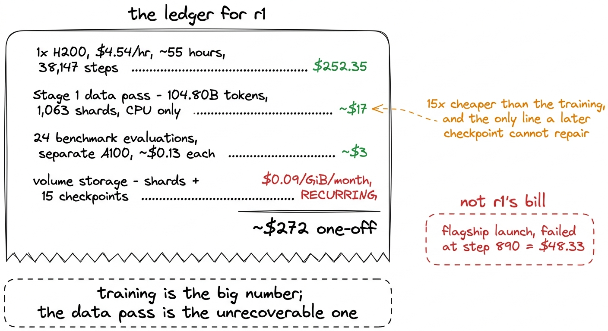
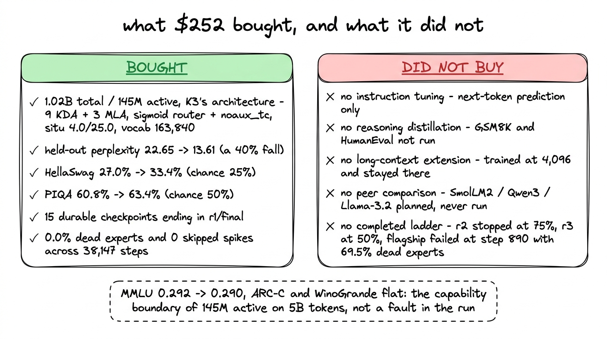
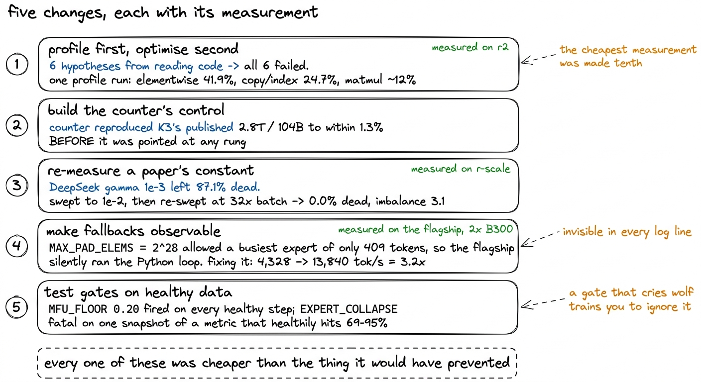
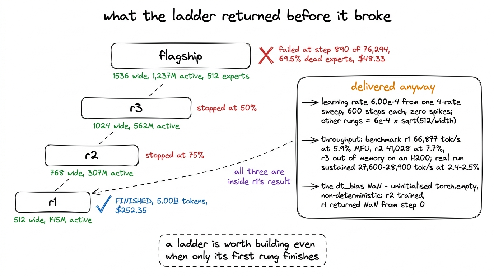
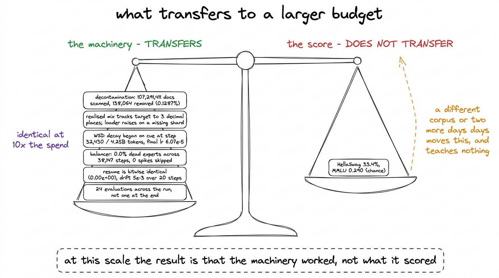
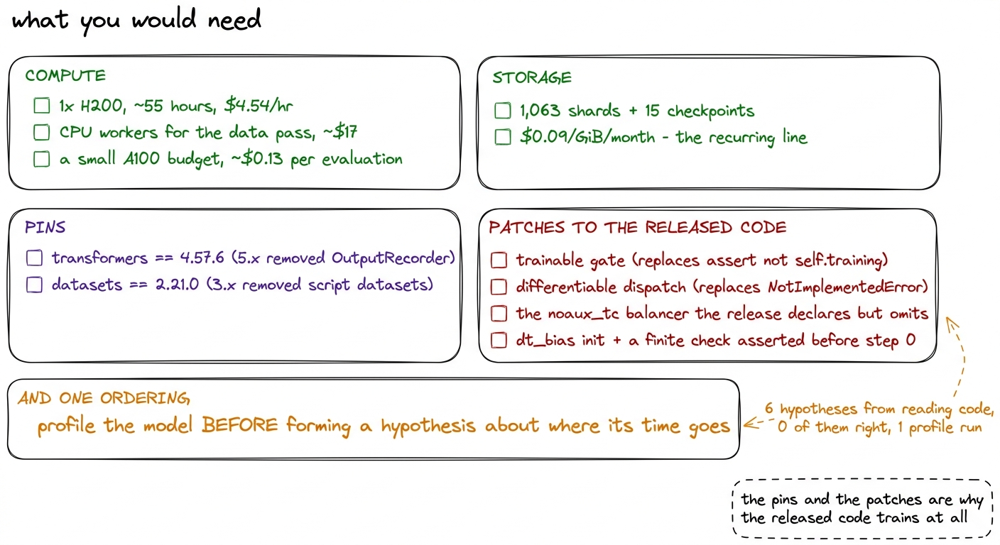

# 30\. 252 美元能买到什么

[← 上一章](../29-benchmarks-across-tokens/README.md) · [返回目录](../../README.md)

第 06 部分 · 训练有效吗 · 12 分钟 · 6 幅图

> 完整账本、重新做一次时会改变的做法、r1 之上各档位的用途，以及真正有效的小模型与仅仅完成训练的小模型之间的区别。

r1 的账单短到足以完整打印，因此我们将从这里开始，并讨论它的含义。

该训练运行本身花费  **\$252.35** 那是每小时 \$4.54 的一个 H200，持续不到 55 小时，涵盖所有 38,147 步骤和所有 5,000,003,584 个 token。[^1] 在任何训练开始之前，必须构建语料库：来自六个来源的104.80B个token，分布在1,063个分片中，已下载、与八个基准测试集进行去重，并完成分词。该处理步骤在CPU工作节点上运行，耗时大约  **\$17**  总计。在训练运行进行期间，每大约一千步，会在一个独立的 A100 上持续运行基准评估，大约  **每评估0.13美元**  跨  **24 次评估** 。此外，还要为保存分片、检查点以及固定评测子集的持久卷付费，计费标准为  **每吉字节每月\$0.09** ，这是这张账单上唯一一条在工作停止后仍然不断出现的条目。[^2]

| 行 | 覆盖的内容 | 金额 |
| --- | --- | --- |
| r1 GPU 时间 | 1x H200 每小时 \$4.54，约 55 小时，38,147 步 | **\$252.35** |
| 阶段 1 数据传递 | 104.80B 个 token，1,063 个分片，六个数据源，仅 CPU | ~\$17 |
| 持续评测 | 24 次评估在单独的 A100 上，每次约 \$0.13 | ~\$3 |
| 持久卷存储 | 分片，15 检查点，冻结的评估子集 | \$0.09/GiB/月，重复计费 |

这张表最值得记住的不是总额，而是训练的计算费用约为数据准备的十五倍，同时数据处理又是出错后无法靠后续训练补救的部分。混合分片出错，之后的检查点无法把它修好。

图 30-1　r1 的完整成本。旗舰模型失败的启动单独列出，因为它没有带来有效成果。

## 252 美元买到了什么

一个拥有 1.02B 个参数、每 token 激活 145M 个参数的模型，基于 K3 自身的架构构建，而非其相似结构：九个 KDA 层和三个 MLA 层，每第四层均启用全注意力，如 K3 所设定，相同的 128/64/128 潜在注意力划分，配备一个sigmoid路由器，以及 `noaux_tc` 负载均衡器，the `situ` 在 K3 自身的 4.0 和 25.0 常量以及 K3 的 163,840-token 分词器上激活，且未作修改。在需要时，明确指出两个偏差：权重共享的嵌入，以及 256 专家与旗舰模型的 512 专家。

它将留出的困惑度减半。第一次评估，在 1.691B 个token时读取  **22.65** ；最后，在 5.000B 处读取  **13.61** ，下降了 40%，其中最陡的部分位于始于第 32,430 步的衰减阶段内。在 HellaSwag 上，其值从  **27.0%**  至  **33.4%**  相对于 25% 的概率水平，以及在 PIQA 从 60.8% 到  **63.4%**  与 50% 相反。在 MMLU 上，其首次评估得分为 0.292，最后一次为 0.290，两端均为偶然，中间各处也均为偶然。ARC-Challenge 和 WinoGrande 也是如此。评估章节认为，这些平坦的曲线描述了在 5B 个 token 上进行预训练的 145M-活跃模型的能力边界，而非训练运行中的任何缺陷，此处我们不再重复论证。

它还生成了 15 个持久的检查点 `kimi-mini-ckpt` 在“最后三个加每5,000个”的保留规则下的体积，结束于 `r1/final`每一个都是整个训练运行而非权重：模型、优化器动量、数据加载器游标、四个随机数生成器流、损失尖峰保护机制的指数移动平均、到目前为止已看到和消耗的token数量。任何一个都可以从中恢复，恢复后的第一步就能重现原始的逐位数据。

## 252 美元没有买到什么

五件事，直言不讳。

没有进行指令微调。r1 始终只做下一 token 预测，没有 SFT、偏好优化或聊天模板。像使用助手那样给它提示，得到的是文本续写，而非按指令执行。

没有推理蒸馏。我们未从 K3 或其他模型进行任何蒸馏。用于检验相关行为的 GSM8K 和 HumanEval 属于后训练评测，因此刻意没有运行。

 **没有长上下文扩展。**  r1 在 4,096 个 token 的上下文长度下进行训练并保持不变。K3 声明了 1,048,576 个 token 的最大位置；我们继承了架构，而非上下文长度，并未执行扩展阶段。

 **没有同行对比。**  与 SmolLM2-1.7B、Qwen3-1.7B 和 Llama-3.2-1B 的对比原本在计划中，但从未执行。因此，我们没有证据说明 r1 相对同等规模模型处于什么水平。33.4% 的 HellaSwag 分数应与 25% 的随机猜测水平，以及 r1 自己早期的检查点比较；这才是我们实际进行过的比较。

规模阶梯没有全部完成。计算工作区被停用时，r2 和 r3 分别达到 token 预算的 75% 和 50%。旗舰模型有 35.56B 个参数，规模阶梯正是为估算它的成本而建；它却失败了：69.5% 的专家不活跃，负载不均衡度在 74 至 85 之间，随后停滞在计划 76,294 步中的第 890 步，已花费 48.33 美元。这 48.33 美元在上图单列，因为它换来了问题诊断，而非完成的模型。

图 30-2　结果的两个方面并列列出，使读者不能只看到其中一面。

## 我们会改变的五件事

这些是具体的而非反映性的。每一个都有一个测量值和一个我们可以命名的成本。

 **在优化之前进行性能剖析。**  十六个MFU尝试中有六个是通过阅读模型代码并推理算术运算的去向而形成的假设：填充浪费、模型大小、分块专家缓冲区、float32激活内部 `situ`，注意力和KDA内核，和 `torch.compile`所有六个模型都在我们之上的一档，即r2上进行了测量，且全部失败。解释为何每一个模型都必须失败的性能剖析在一次训练运行中就生成了，它显示了  **41.9%**  在元素级运算中的GPU时间占比，  **24.7%**  在副本和索引中，仅约  **12%**  在矩阵乘法中，一个模型有八分之一的时间用于算术运算，无法通过降低算术运算的成本来改善。性能剖析应在首次测量时进行，而不是在已经尝试并舍弃了六个假设之后才进行。[^3]

 **在信任任何架构表之前，必须先构建计数器的控制。**  我们的参数计数器是在K3自己发布的配置之前运行的，尚未指向梯级的任一档位。它测得  **2,779.5B 个总数和 105.4B 个激活数** ，位于 Moonshot 发布的 1.3% 和 2.8T 以及 104B 之间。没有这项协议，本书中每一个参数数值都只是对脚本的断言。有了这项协议，它们才是测量值。同样的严谨性也发现了最关键的设计错误。以总激活参数来划分规模档位，隐藏了一个嵌入开销：在隐藏层 512，K3 的 163,840 个 token 嵌入是  **83.9M 个参数** ，这是  **58% 个 r1 的激活参数** ，因此一个规模档位要求“40M 个激活”时，在任何层运行之前，其嵌入维度是该激活数量的两倍。规模档位因此是基于非嵌入激活参数来定义的，这也是为什么Kaplan等人以及Chinchilla会排除嵌入维度的原因。该计数在梯级顶端也提出了相同观点：在单个路由专家之前，所有在每个token上运行的内容都被计入。  **834M**  ——KDA 为 340.3M，权重共享的嵌入为 251.7M，共享专家为 135.7M，潜在表示投影为 54.3M，稠密 MLP 为 33.0M，路由器为 13.6M，MLA 为 5.3M。原定的 567M 激活参数目标根本无法实现；如果统计脚本从未用已知模型校验，它却会报告目标已达成。

 **将论文中的一个常数对照自己的条件进行测量。**  DeepSeek-V3的负载均衡步骤的 $\mathrm{gamma}=10^{-3}$ 适用于 DeepSeek-V3。在我们的批次中它留下了  **87.1%**  专家在 120 步之后死亡。有效值 $1\times10^{-2}$ 是通过扫描四个值找到的，然后当批次从 4,096 变为 131,072 个token每步时，增加了 32 倍，重新测量了它，其中产生了  **0.0%**  最终的不活跃专家以及一个3.1的不平衡。第二次扫描花费非常少，并消除了对第一次结果的最后怀疑。

 **让每个回退路径都可观察。**  融合专家分发将其填充缓冲区限制在 $\mathrm{MAX\_PAD\_ELEMS}=2^{28}$ 元素和退化为上述每个专家的Python循环，该循环在上限处停止，静默地。在旗舰模型上，基于2x B300的测量，该上限仅允许最繁忙专家的标记数量为  **409** ，所以旗舰模型的混合专家层正在静默运行那个内核原本要替代的循环。相同的上限允许 1,260 在 r3 上，这就是为什么该条件没有出现在层级的更低位置。修复它值得  **3.2x** ：7.571 秒和 4,328 个令牌每秒在回退模式下，对比 2.368 秒和 13,840 个令牌每秒的自动分块，每步 32,768 个令牌。该条件在运行产生的每一条日志中都是不可见的。它源自两种形状：非单调的吞吐量曲线和在批量大小增长四倍时未发生变化的峰值内存。

 **用与检测损坏数据同样严格的标准来监控测试数据的健康状况。**  看门狗中的两个阈值在自动停止开始工作时立即变得具有实际危险性。 `MFU_FLOOR = 0.20` 在该项目的每一次健康训练运行的每一步都触发了，因为这里的测得的MFU是5到8%。 `EXPERT_COLLAPSE` 在单个指标快照中出现了FATAL错误，该指标的健康轨迹在前30步中经过69到95%个死专家。目前一半的24故障注入测试均表明，在健康训练和类似场景中，门保持静默：衰减过程中的平台期、第500步的损失持平，以及随后的坍塌并恢复。坍塌门需要连续五个报告，MFU下限位于3%。

图 30-3　五项改动，以及支持每项改动的测量和测量所在的档位。

## r1 之上的档位是用来做什么的

只有 r1 完成，这引发了疑问：构建四模型阶梯是否值得。阶梯断裂前，有三件事回归，而这三件事都出现在 r1 的结果中。

规模阶梯确定了学习率。在 r1 的宽度下扫描四个学习率，各训练 600 步，均没有损失尖峰，最终选定 $6.00\times10^{-4}$。更高档位采用$6\times10^{-4}\sqrt{\frac{512}{\mathrm{width}}}$，属于标准参数化迁移，而非 muP，也是方案中最薄弱的假设；每次引用该数值时，我们都说明这一点。没有这次扫描，r1 就会用一个猜测的峰值学习率走完 38,147 步。

 **它测量了吞吐量，因此预算是从数据中定价的。**  基准测试套件测得 r1 为 66,877 个token每秒，5.9% MFU，使用 16,384 个token的微批次；r2 为 41,028 个token每秒，7.7%；r3 在 H200 上完全超出内存，这在预算层面是一个事实，而非工程层面的问题。真正的运行随后持续  **27,600 到 28,900 个 token 每秒，达到 2.4 到 2.5% MFU** ，远低于其自身基准，同时报告这两个数值才是使第二个数值可信的原因。[^4]

 **它在小规模档位上捕获了一个价格的 NaN。**  `KimiDeltaAttention.dt_bias` 配备有 `torch.empty` 和已发布的 `_init_weights` 仅涵盖 `nn.Linear` 和 `nn.Embedding`，因此 KDA 的时间步偏置仍是未初始化的内存。这个问题会以非确定性的方式出错：r2 可以正常训练，r1 却从第 0 步就返回 NaN。如果跳过规模阶梯而直接启动旗舰模型，发现这个缺陷时就已经在使用 2 张 B300，每张每小时收费 7.10 美元；更糟的是，如果某个档位碰巧读到了无害的内存内容，这个缺陷可能根本不会被发现。

规模阶梯返回了第四样东西，我们只能部分使用。在训练初期相等的token数量下，按容量排序的HellaSwag：r3  **28.4%** , r2  **27.6%** , r1  **27.0%** 那就是规模阶梯应有的形状，也是我们唯一有的横档比较能力，因为 r2 和 r3 从未用完它们的预算。

图 30-4　规模阶梯、每个档位的实际结果，以及未完成档位向最终完成档位提供的三项成果。

## 值得报告的结果

在 1.02B 个参数、5B 个训练 token 的规模下，评测分数并不是最值得关注的产出。  **33.4%**  的 HellaSwag 得分是真实的，也高于随机猜测水平，但它提供的信息，并没有比读者根据参数量就能猜到的多出多少。这项分数无法直接迁移：换一套语料、换一个分词器，或者再多用两天计算资源，都可能改变它；分数本身不会留下可复用的东西。

能够迁移的是整套工作机制，而这套机制确实奏效了：

- 语料在分词之前完成了去污染，而非在分词之后：  **扫描 107,291,411 份文档，删除 138,064 份，删除率为 0.1287%** ，使用的 13-gram 索引覆盖八个评测集，包含 2,398,082 个互不重复的 n-gram。数学语料的删除比例约为网页语料的十倍：finemath 为 0.7239%，open-web-math 为 0.6747%，fineweb-edu 为 0.0856%。这种分布使过滤器的结果可信；如果各来源的触发率完全相同，反而应该担忧。方法的局限与结果一并报告：少于十三个单词的评测条目无法生成 13-gram，因此无法用于过滤，导致 TriviaQA 仅有  **49% 的内容得到覆盖** ，其 17,944 个条目中有 9,163 个过短。PIQA 的覆盖率为 92%，是次低的一项；八个评测集中的五个达到 99% 至 100%。HumanEval 中每个已索引 n-gram 匹配 88.78 次，也不代表发现了数据污染：规范化会去除标点，这适合自然语言，却会破坏代码结构，因此去掉标点的 Python 的 13 个词窗口往往只是常见写法，而非评测泄漏。[^5]
- 实际训练的数据混合比例与目标一致，精确到小数点后三位：fineweb-edu 59.5%，web-diverse 25.5%，code-python 10.0%，finemath 3.0%，open-web-math 2.0%，各自均对应相同的目标值。能够检查这一点，本身就得益于之前发现的缺陷：被破坏的分片名使六个来源中的四个指向不存在的文件，加载器又静默地对剩下两个来源重新归一化，最终会让稳定阶段使用 100% 的 finemath。现在，任何分片缺失都会让加载器报错，而不会再对剩余内容重新归一化。
- 调度按照预定时机执行了退火。衰减阶段开始于  **第 32,430 步**  ，此时已处理 4.25B 个 token，与 WSD 配置完全一致，学习率最终降至 $6.07\times10^{-5}$。
- 负载均衡器保持有效。  **不活跃专家比例为 0.0%**  ，第 0 步与第 38,140 步均如此；负载不均衡度从 2.36 逐渐变为 4.0，表明路由器在形成专业化分工，而非发生坍塌。  **整个训练过程中，没有跳过任何损失尖峰。** 
- 检查点能够正确恢复，这一点经过了验证，而非仅凭假定。 `resume_equivalence` 会两次训练越过检查点，并逐步比较损失。该测试找到了一个真实的差一错误；修复后，恢复后的第一步达到  **逐位一致**  ，误差为 $0.00\times10^{0}$；随后 20 步内出现的 $5\times10^{-3}$ 偏移来自 bf16 的非确定性。
- 整个训练期间共进行了  **24 次评测**  ，而非只在结束时评测一次。因此，困惑度从 22.65 降到 13.61 呈现为一条曲线，且能看到衰减切换处的明显转折，而不是只有一个终点数字。

这些性质在更大的预算下仍然成立，而且没有哪一项会因为留到以后再添加而变得更容易。即使支出增加到十倍，项目中仍会保持相同的部分包括：去污染报告、检查点语义、故障注入测试、均衡器常数，以及严格记录测量来源、避免把基准测试数字当成实际训练数字引用的做法。33.4% 会变成另一个分数，但获得它的方法相同。

图 30-5　将本次训练的两种产出放在一起衡量。只有其中一种可以重复利用。

## 如果你想亲自尝试

所需条件并不多，可以完整列出。

计算资源：一张 H200，运行约 55 小时；另需少量 CPU 小时用于数据处理，以及少量 A100 预算用于评测。还要存储 1,063 个分片和 15 个检查点，并按月付费；相比一次性的 GPU 使用费，这项持续的存储开销更需要事先规划。

版本锁定： `transformers` 固定为  **4.57.6** ，因为 `>=4.56` 会解析到 5.x，而 5.x 已移除 `OutputRecorder`，Kimi 的建模代码却会在模块作用域导入它。 `datasets` 固定为  **2.21.0** ，因为 3.x 移除了脚本式数据集，而评测集仍然需要它们。

补丁：发布的建模代码无法直接用于训练。需要用可训练的门控逻辑替代 `assert not self.training`，用可微分的分发逻辑替代 `NotImplementedError` 及其 `@torch.no_grad()` 推理路径，实现 `noaux_tc` 负载均衡器——发布版本只声明了它，却没有实现；还要为 `dt_bias` 采用 Mamba 风格的初始化，并在第 0 步之前通过断言检查数值是否有限。应确认 sdpa 兼容层注册在 `flash_attention_2` 键名下，并注意 `gradient_checkpointing_enable()` 在以下修复落实之前不会真正生效： `use_cache = False`.

执行规范：在分词前建立 13-gram 去污染索引，并明确报告覆盖局限。检查点应包含数据加载器游标和各随机数生成器的状态流，每次保存都提交。用心跳时间戳与实际时钟比较，不依赖日志流判断存活。建立故障注入测试套件，其中一半测试应验证系统在健康状态下保持安静。

图 30-6　按实际需要的先后顺序列出的完整要求清单。

还有一个顺序问题。如果重新做一次，这是我们首先会改变的事：在提出任何“时间花在哪里”的假设之前，先对模型进行性能剖析。那六个靠阅读代码形成的假设，其验证成本比最终回答这个问题的整次训练还要高。

>  **数据说明：检查点总存储量无法复算为 128 PB** 　原文正文及图 17-6 均写约 213 GB／检查点、每 250 步保存一次，并声称全部保留为 128 PB。按同书旗舰模型计划的 76,294 步计算，常规定期保存约 305 次，$305\times213\,\mathrm{GB}=64{,}965\,\mathrm{GB}$，约 65 TB；即使额外计入起点或终点，也仍是这一量级。因此，128 PB 无法从文中这些条件推出。此处保留原有数值，这一差异需要作者确认。

>  **数据说明：15 个检查点与给出的保留规则之间缺少说明** 　原文及图 17-6 报告 r1 保留 15 个检查点，规则为最后 3 个加每 5,000 步一个。若仅按 38,147 步及这条规则计算，5,000 至 35,000 步有 7 个周期检查点，再加最后 3 个为 10 个；若还保留第 0 步，则为 11 个。15 个可能包含额外保留项或遗留文件，但原文未说明，不能仅凭这条规则复算出来。

---

[← 上一章](../29-benchmarks-across-tokens/README.md) · [返回目录](../../README.md)

[^1]: 252.35 美元除以每小时 4.54 美元，得到 55.6 小时的计费时间。这包含检查点写入、23 小时时限下的任务交接，以及由此产生的容器重启，因此它是实际经过时间对应的租用费用，而非纯粹的训练步耗时。

[^2]: 存储开销也决定了保留规则。r1 采用“最后三份，加上每 5,000 步一份”的规则，保留 15 个检查点。旗舰模型每份检查点约为 213 GB，保存间隔为 250 步；如果每份检查点都保留，存储量会达到 128 PB。这与其说是一张存储账单，不如说是一个被标上价格的设计错误。

[^3]: 性能剖析表的第一个版本本身就是错的，而且错误方式值得了解：它把 PyTorch 算子行与这些算子启动的 CUDA 内核一起求和，造成了重复计数。当时报告了无法解释的 30.2%“其他”开销，以及 8.6% 的复制开销。只统计 CUDA 内核后，复制开销几乎扩大到原来的三倍。

[^4]: 把条件明确写出来，基准测试与实际训练之间的差距就不难理解：基准工具测量固定形状，并使用已预热的分配器；实际训练还包含调度、从持久卷读取数据的加载器、每 100 步提交一次检查点，以及 55 小时真实运行中的温度影响。两者仍然相差两倍，因此我们用实际训练的数值计算成本，只在比较配置时引用基准工具的数值。

[^5]: 这种过度匹配损失了代码语料的 0.225%，还不足以成为重新摄取数据的理由。另一个叠加原因是把 HumanEval 的 `test` 列纳入了索引；在全部 164 道题中，这一列都是几乎相同的框架代码。
